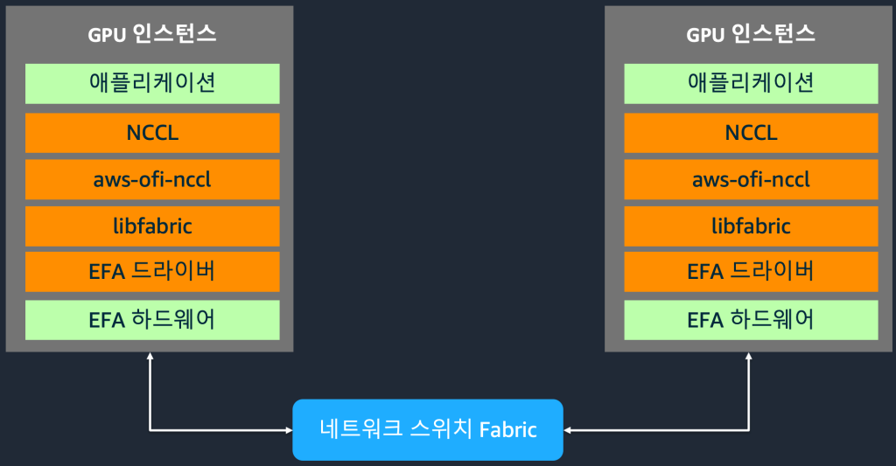
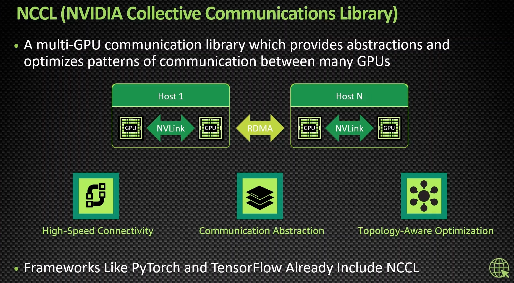

# AWS GPU 아키텍처 TA 검토 표준 — 상세 근거와 설명

이 문서는 [Simple 7장](./GPU_검토표준_Simple.html)과 [Detail 15장](./GPU_검토표준_Detail.html)의 아키텍처와 검토 항목을 설명합니다. Simple은 핵심 방향과 대표 구성, Detail은 구성별 검토와 운영 내용을 담고 있습니다. AWS Well-Architected Framework의 AI/ML 관련 Lens를 참고하고, AWS가 공개한 아키텍처를 POC에 적용해 확인한 범위부터 사내 표준으로 확대하는 안입니다.

여기서 **AWS 표준 아키텍처**는 AWS 공식 문서와 기술 블로그의 참조 구성들을 뜻합니다. 모든 업무에 그대로 적용하는 단일 설계는 아닙니다. 이 가운데 업무에 맞는 구성을 선택하고, 사내 접근 권한·데이터 연결·운영 조건을 확인한 결과가 **사내 TA 검토 표준**이 됩니다.

처음부터 큰 GPU 클러스터를 구축할 필요는 없습니다. 기존 AWS 환경과 업체 자료를 바탕으로 POC 구성을 정하고, 기존 TA 양식에 필요한 질문을 추가하는 것부터 시작할 수 있습니다. 분산 실행·고급 튜닝·자동화는 필요성이 확인된 단계에서 검토합니다.

## 1. 설명자료의 구성과 읽는 순서

Simple은 표준 수립 방향 → TA 검토 범위 → EKS → SageMaker → GPU 통신 → 표준 검토표 → POC 확대의 7장 구성입니다. 간결한 발표 문장과 예상 질문은 [발표 스크립트](./GPU_검토표준_발표스크립트.md)에 따로 정리했습니다. HTML은 하단 번호 또는 키보드 좌우 화살표로 넘길 수 있습니다. 아래 표와 본문의 장 번호는 Detail을 기준으로 합니다.

| Detail | 주제 | 설명할 핵심 |
| --- | --- | --- |
| 1장 | AWS GPU 아키텍처 TA 검토 표준 | AWS 기준을 참고해 POC부터 표준까지 점진적으로 확대 |
| 2장 | Well-Architected Framework와 AI/ML Lens | 공통 원칙, AI/ML 질문, 사내 기준의 관계 |
| 3장 | TA 검토 범위 확대: 인프라 → 운영 | GPU 자원뿐 아니라 모델·데이터·관측·복구까지 검토 |
| 4장 | 아키텍처 예시 #1 · EKS 모델 배포 | Kubernetes에서 모델을 배포하고 GPU 자원과 연결 |
| 5장 | 아키텍처 예시 #2 · SageMaker AI | 관리형 호스팅과 사내 앱의 호출·데이터 경로 |
| 6장 | 아키텍처 예시 #3 · HyperPod + EKS | EKS 작업 관리와 HyperPod 컴퓨트·복구 기능의 결합 |
| 7장 | 아키텍처 예시 #4 · ParallelCluster | Slurm 작업 배치, 공유 저장소, 운영 알림 |
| 8장 | 아키텍처 예시 #5 · 울트라클러스터 | 많은 GPU의 통신과 데이터 공급을 함께 보는 확대 구성 |
| 9장 | 아키텍처 예시 #6 · 울트라서버 | 여러 노드의 GPU를 NVLink 도메인으로 연결하는 제품 구성 |
| 10장 | GPU 노드 간 통신의 이해 | 내부 연결과 노드 간 EFA·NCCL 경로의 구분 |
| 11장 | GPU 실행 환경과 버전 정합성 | 호스트 드라이버와 컨테이너 라이브러리의 관리 경계 |
| 12장 | 아키텍처 예시 #7 · 운영·Observability | GPU 사용량, 서비스 지연, 가용 용량과 운영 대응 |
| 13장 | GenAI / ML Lens 기반 표준 검토표 | 검토 질문·확인 자료·판단 근거의 작성 예시 |
| 14장 | 업무 조건에 따른 구성 선택 | 현재 필요한 아키텍처와 확대 단계의 구성 구분 |
| 15장 | POC부터 표준까지, 점진적 확대 | POC 대상 선정 → 검토표 작성 → 적용 범위 확대 |

짧게 설명할 때는 다음 정도면 충분합니다.

> AWS Well-Architected Framework의 AI/ML 기준과 공개 아키텍처를 참고해 GPU TA 검토 표준을 만들자는 제안입니다. POC에 맞는 AWS 구성을 고르고, 기존 설계자료로 접근 권한·성능·운영 조건을 확인합니다. 그 결과를 구성도와 검토표로 남겨, 확인한 범위부터 다음 구축과 운영 검토에 재사용하겠습니다.

## 2. Framework·Lens·아키텍처의 관계

**Framework는 공통적으로 살펴볼 관점입니다.** AWS Well-Architected Framework는 운영 우수성, 보안, 안정성, 성능 효율성, 비용 최적화, 지속 가능성을 다룹니다. GPU를 사용하더라도 접근 통제나 장애 복구, 비용 관리 같은 기본 질문은 그대로 필요합니다. [AWS Well-Architected Framework](https://docs.aws.amazon.com/wellarchitected/latest/framework/welcome.html)

**Lens는 AI/ML 특성에 맞춘 질문입니다.** ML Lens는 데이터를 준비하고 모델을 개발·배포·운영하는 흐름을 다룹니다. Generative AI Lens는 모델 선택과 커스터마이징, 서비스 통합, 배포 후 개선을 살펴보는 데 도움이 됩니다. HTML의 ‘Framework (AI/ML)’은 이들 관련 Lens까지 함께 참고한다는 표현입니다. 별도의 단일 인증이나 하나의 제품 이름을 뜻하지 않습니다. [Machine Learning Lens](https://docs.aws.amazon.com/wellarchitected/latest/machine-learning-lens/machine-learning-lens.html), [Generative AI Lens](https://docs.aws.amazon.com/wellarchitected/latest/generative-ai-lens/generative-ai-lens.html)

그림은 모델을 배포한 뒤에도 사용 결과를 확인하고 개선하는 흐름입니다. TA 검토도 같은 이유로 인프라 구성에서 끝나지 않습니다. 배포한 모델을 누가 사용하는지, 성능을 어떻게 확인하는지, 문제가 생기면 누가 대응하는지까지 연결해야 합니다. [그림 원문과 단계별 설명](https://docs.aws.amazon.com/wellarchitected/latest/generative-ai-lens/generative-ai-lifecycle.html)

**아키텍처는 그 질문을 적용할 실제 구성 예시입니다.** EKS에서는 Pod·GPU 노드·Service를 보고, SageMaker에서는 모델 Endpoint·호출 권한·용량 설정을 봅니다. 질문이 같더라도 확인할 설정과 자료는 달라집니다. 그래서 ‘공통 검토 질문’과 ‘구성별 확인 자료’를 함께 관리하는 방식이 적합합니다.

추가로 볼 자료: [ML 수명주기](https://docs.aws.amazon.com/wellarchitected/latest/machine-learning-lens/machine-learning-lifecycle.html), [상세 ML 수명주기와 구성 요소](https://docs.aws.amazon.com/wellarchitected/latest/machine-learning-lens/architecture-diagram.html), [ML 단계별 모범사례 목록](https://docs.aws.amazon.com/wellarchitected/latest/machine-learning-lens/best-practices-by-ml-lifecycle-phase.html). 단계별 설명과 세부 도식은 위 공식 문서에서 확인할 수 있습니다.

## 3. TA 검토 범위: 인프라에서 운영까지

TA 검토 범위를 **인프라, 배포·접근, 운영**의 세 영역으로 나누면 설명하기 쉽습니다. 인프라에서는 모델을 실행할 자원과 연결을 보고, 배포·접근에서는 모델을 올리고 호출할 수 있는지 확인합니다. 운영에서는 성능과 장애를 확인하고 대응할 수 있는지를 봅니다.

예를 들어 GPU 용량이 충분하더라도 호출 권한이 없으면 업무에서 사용할 수 없습니다. 모델이 응답하더라도 응답 지연과 장애를 확인할 방법이 없으면 운영 준비가 끝났다고 보기 어렵습니다. 이런 연결 조건을 기존 인프라 검토에 더하자는 제안입니다.

HTML에서는 세 영역과 대표 자료만 보여줍니다. 실제 검토할 때는 아래처럼 나누어 확인하면 됩니다. 서비스별 구성은 다음 절의 EKS·SageMaker·HyperPod 공식 아키텍처 사례에서 설명합니다.

| 범위 | 쉽게 풀어 쓴 질문 | 먼저 받을 자료 |
| --- | --- | --- |
| 컴퓨트 | 선택한 GPU와 메모리로 모델을 실행할 수 있는가 | 모델·GPU·인스턴스·버전 목록, 기존 기동 결과 |
| 네트워크 | 사용자와 데이터가 필요한 위치에 접근할 수 있는가 | VPC·접근 경로·보안 그룹·권한 구성도 |
| 저장소 | 모델을 준비하고 데이터와 결과를 저장할 수 있는가 | S3·ECR·공유 저장소의 용도와 접근 권한 |
| 실행·배포 | 같은 설정으로 배포하고 문제가 생기면 되돌릴 수 있는가 | 배포 설정·이미지 버전·복구 절차 |
| 성능 | 필요한 요청량에서 응답 목표를 충족하는가 | 모델·입출력·부하 조건과 시험 결과 |
| 운영 | 사용량과 장애를 확인하고 담당자가 대응할 수 있는가 | 대시보드·지표·알림·담당자·운영 절차 |

처음에는 업체의 기존 구성도와 시험 결과를 링크로 받아도 됩니다. 별도 문서를 모두 새로 작성하도록 요구할 필요는 없습니다. 자료로 확인되지 않는 부분만 보완 대상으로 남기고 담당 조직과 확인 방법을 정합니다.

전체 구성을 더 넓게 보려면 [AWS의 학습·추론 구성 요소 설명](https://huggingface.co/blog/amazon/foundation-model-building-blocks)을 참고할 수 있습니다. 컴퓨트·네트워크·저장소, 자원 관리, 모델 실행, 관측의 관계를 설명하는 AWS 소속 저자의 공개 글입니다.

## 4. 표준 아키텍처 사례와 설명

### 사례 #1. Amazon EKS 모델 배포 — Detail 4장

**모델을 컨테이너로 배포하고, 실행에 필요한 GPU와 저장소를 연결하는 구성입니다.**

그림은 왼쪽 위의 배포 설정에서 시작하면 됩니다. 엔지니어가 Helm 설정을 EKS에 적용하면 모델 Pod와 Service가 만들어집니다. Karpenter는 필요한 컴퓨트 자원을 확보하고, 모델 실행에 사용할 이미지와 가중치는 ECR·S3 등의 저장 위치에서 가져옵니다. 준비가 끝나면 Service를 통해 요청과 응답이 오갑니다. [AWS 공식 단계별 설명](https://docs.aws.amazon.com/solutions/automated-deployment-of-inference-ready-amazon-eks-clusters/)

TA는 ‘모델이 어디에서 실행되는가’, ‘어떤 버전의 이미지와 모델을 사용하는가’, ‘사내 사용자가 어떤 경로와 권한으로 접근하는가’를 먼저 확인하면 됩니다. GPU 자원을 확보하는 설정과 실제 실행 가능한 용량도 구분해 봅니다.

원본의 `port-forward`는 예제에서 모델을 호출하는 방법입니다. 사내 서비스 접근 방식으로 그대로 채택한다는 뜻은 아닙니다. 기존 인증·권한·네트워크 기준에 맞는 경로를 별도로 정합니다. 그림의 특정 GPU 기종이나 단일 AZ 표현도 모든 업무의 기본값으로 고정하지 않습니다.

HTML에는 AWS 공식 구성도 PDF의 3쪽 이미지를 사용했습니다. Markdown에서는 같은 모델 배포 구성의 AWS 원본 이미지 링크를 사용합니다. [원본 PDF](https://d1.awsstatic.com/onedam/marketing-channels/website/aws/en_US/solutions/approved/documents/architecture-diagrams/automated-deployment-of-inference-ready-amazon-eks-clusters.pdf)

더 구체적인 LLM 추론 구성은 [EKS에서 vLLM Deep Learning Containers 배포](https://aws.amazon.com/blogs/machine-learning/deploy-llms-on-amazon-eks-using-vllm-deep-learning-containers/)를 참고합니다. ALB에서 vLLM Pod로 요청을 보내고 FSx에서 모델 가중치를 읽는 예시이며, 해당 원문에 전체 요청 경로와 실행 스택 그림이 있습니다. 이 사례의 EFA·다중 노드·FSx 구성을 모든 POC의 필수 조건으로 삼지는 않습니다.

### 사례 #2. Amazon SageMaker AI — Detail 5장 / Simple 4장

**사내 앱에서 PrivateLink로 모델을 호출하고, SageMaker가 다중 AZ에서 모델을 호스팅하는 구성입니다.**

이 그림은 [AWS SageMaker 추론 Guidance](https://docs.aws.amazon.com/solutions/low-latency-high-throughput-model-inference-using-amazon-sagemaker/)에 게시된 공식 원본입니다. Simple과 Detail에도 같은 이미지를 넣었습니다. 왼쪽 고객 계정과 오른쪽 SageMaker 서비스 계정을 먼저 구분하면 흐름을 읽기 쉽습니다.

**그림 1~2는 호출 경로입니다.** 고객 VPC의 업무 앱이 VPC 엔드포인트를 통해 SageMaker 실시간 추론을 호출합니다. 앱은 EC2·EKS·ECS 등에서 실행할 수 있으며, PrivateLink를 통해 연결됩니다. TA는 호출 주체의 IAM 권한과 사내 네트워크·DNS·엔드포인트 정책을 확인합니다.

**그림 3은 모델 호스팅입니다.** SageMaker 서비스 계정 안에서 NLB가 여러 AZ의 추론 인스턴스로 요청을 전달하는 모습을 보여줍니다. 이 호스팅 영역을 사내에서 그대로 구축한다는 의미가 아닙니다. 사내에서는 모델·인스턴스·용량과 확장 정책을 정하고, 요구한 응답 성능과 복구 조건이 충족되는지 확인합니다. [실시간 엔드포인트 설명](https://docs.aws.amazon.com/sagemaker/latest/dg/realtime-endpoints.html)

**그림 4~5는 데이터와 모델의 저장 경로입니다.** S3 Data bucket은 업무·학습 데이터, Model bucket은 배포할 모델을 저장하는 용도로 구분돼 있습니다. TA는 저장 목적과 접근 주체, 권한·암호화·버전 관리 조건을 확인하면 됩니다.

VPC 엔드포인트는 서비스를 호출하는 연결 지점이고, SageMaker Endpoint는 모델을 실행해 응답하는 서비스입니다. 호출용 PrivateLink를 구성했다고 모든 데이터 접근과 관리 트래픽까지 해결되는 것은 아닙니다. 호출 경로와 모델의 데이터 접근을 따로 확인합니다. [PrivateLink 연결과 적용 조건](https://docs.aws.amazon.com/sagemaker/latest/dg/interface-vpc-endpoint.html), [저지연 호출 조건](https://docs.aws.amazon.com/sagemaker/latest/dg/realtime-endpoints-privatelink.html)

원본은 ML 추론 사례이므로, 해당 사례의 처리량·비용 효과나 특정 인스턴스를 사내 LLM의 성능 근거로 옮겨 쓰지 않습니다. 실제 사용할 모델과 요청 조건에 맞춰 확인합니다. [공식 원본 PDF](https://d1.awsstatic.com/solutions/guidance/architecture-diagrams/low-latency-high-throughput-model-inference-using-amazon-sagemaker.pdf)

바로 응답할 필요가 없는 처리에는 비동기 추론도 참고할 수 있습니다. [SageMaker JumpStart 배포 Guidance](https://docs.aws.amazon.com/solutions/generative-ai-deployments-using-amazon-sagemaker-jumpstart/)는 S3 입력, 비동기 Endpoint, 결과 저장, SNS 완료·오류 알림과 Lambda 후처리를 보여줍니다. [비동기 배포·처리 흐름 원본 그림](https://docs.aws.amazon.com/images/solutions/generative-ai-deployments-using-amazon-sagemaker-jumpstart/images/generative-ai-deployments-using-amazon-sagemaker-jumpstart-1.png)

### 사례 #3. SageMaker HyperPod + EKS — Detail 6장

**Kubernetes의 작업 관리와 HyperPod의 컴퓨트·복원력 기능을 함께 사용하는 구성입니다.**

EKS는 컨테이너 작업을 제출하고 관리하는 창구로, HyperPod 노드는 실제 계산을 수행하는 자원으로 보면 됩니다. 그림의 ECR은 실행 이미지, S3·FSx는 모델과 데이터, CloudWatch는 관측과 연결됩니다. 원본에는 EKS VPC·HyperPod VPC·사용자 VPC가 구분돼 있으므로, 모든 자원이 한 VPC에 놓였다고 단순화하지 않습니다.

공식 문서는 EKS 클러스터와 HyperPod 클러스터의 1:1 연결 관계, 노드 상태 점검, 장애 노드 복구와 지원되는 작업의 재시작 기능을 설명합니다. 적용하려는 작업이 어떤 기능을 사용하는지 확인해야 합니다. [HyperPod EKS 공식 설명](https://docs.aws.amazon.com/sagemaker/latest/dg/sagemaker-hyperpod-eks.html)

TA가 먼저 볼 것은 Kubernetes API 접근 권한, 노드의 외부 통신과 저장소 접근, 체크포인트 저장 위치와 작업 재시작 조건입니다. 체크포인트는 중간 계산 결과를 저장해 실패했을 때 이어서 실행하기 위한 자료입니다. 노드 복구 기능이 있다는 사실과 실제 모델 작업이 정상 복구되는지는 나누어 확인합니다.

추가 자료: [HyperPod 전체 개요](https://docs.aws.amazon.com/sagemaker/latest/dg/sagemaker-hyperpod.html), [사용자 VPC 구성](https://docs.aws.amazon.com/sagemaker/latest/dg/sagemaker-hyperpod-prerequisites.html), [HyperPod 자원 관리 정책](https://docs.aws.amazon.com/sagemaker/latest/dg/sagemaker-hyperpod-eks-operate-console-ui-governance-policies.html). 여러 팀의 할당량·우선순위·유휴 자원 대여는 공유 운영이 필요해지는 단계에서 검토합니다.

### 사례 #4. AWS ParallelCluster — Detail 7장

**Slurm으로 학습 작업을 배치하고, GPU 노드·공유 저장소·운영 알림을 연결한 사례입니다.**

그림 가운데 HeadNode는 작업 제출과 배치의 중심입니다. Slurm이 작업에 사용할 컴퓨트 노드를 정하면 해당 GPU 노드에서 학습이 실행됩니다. 여러 노드가 함께 읽는 데이터는 FSx for Lustre 같은 공유 저장소에 두고 S3와 연결합니다. 왼쪽의 CloudWatch·SNS·Lambda 경로는 운영자가 이상을 알 수 있도록 알림을 전달하는 예시입니다. [AWS ParallelCluster 운영 사례](https://aws.amazon.com/blogs/hpc/part-1-managing-large-scale-llm-training-with-aws-parallelcluster/)

TA는 누가 작업을 제출할 수 있는지, 한 작업이나 팀이 얼마만큼 자원을 사용할 수 있는지, 학습 데이터와 체크포인트가 어디에 저장되는지, 장애 알림이 누구에게 가는지를 확인하면 됩니다.

이 그림은 실제 AWS 공개 사례지만 사내 구축 결과는 아닙니다. 원문의 노드 수, FSx 용량, 고정 할당, IP 대역, IAM 설정을 그대로 사내 기본값으로 쓰지 않습니다. 필요한 규모와 권한을 따로 정합니다. 특히 예제의 넓은 IAM 정책은 최소 권한 검토를 거쳐야 합니다.

더 읽기: [AWS ParallelCluster 문서](https://docs.aws.amazon.com/parallelcluster/latest/ug/what-is-aws-parallelcluster.html), [클러스터 구축과 컨테이너 실행 설명](https://aws.amazon.com/ko/blogs/tech/cluster-construction-and-operation/). Slurm의 역할이 아직 낯설다면 ‘여러 학습 작업에 GPU 자리를 배정하는 관리자’로 설명하면 이해하기 쉽습니다.

### 사례 #5. EC2 울트라클러스터 — Detail 8장

**많은 GPU가 함께 계산할 때 통신과 데이터 공급을 함께 보는 확대 구성입니다.**

오른쪽 아래는 GPU 인스턴스이며, 위쪽은 노드들을 연결하는 고성능 네트워크입니다. 왼쪽은 여러 노드가 읽을 학습 데이터를 공급하는 저장소입니다. 이 그림에서는 ‘GPU끼리 빠르게 통신하는 것’과 ‘계산할 데이터를 제때 공급하는 것’이 모두 필요하다는 관계를 설명하면 충분합니다.

TA의 시작점은 물리 스위치 설계가 아닙니다. 선택한 인스턴스와 네트워크 지원 조건, 확보할 용량, 데이터 읽기 경로, 학습 실패 시 복구 방법을 확인합니다. 실제 대규모 실행이 필요한 단계에서 검토 범위를 구체화합니다. [AWS 대규모 스케일링 가이드](https://aws.amazon.com/ko/blogs/tech/aws-compute-distributed-training-guide-massive-scaling/)

그림의 대역폭과 스토리지 수치는 해당 설명의 조건입니다. POC의 성능 목표나 모든 EC2 구성의 보장값으로 옮기지 않습니다. 용량 예약 방식만으로 특정 물리 배치가 보장된다고 가정하지 않고, 선택한 제품과 예약 조건을 확인합니다. [EC2 UltraClusters](https://aws.amazon.com/ec2/ultraclusters/), [EFA 기능과 제한](https://docs.aws.amazon.com/AWSEC2/latest/UserGuide/efa.html), [FSx for Lustre와 S3 연동](https://docs.aws.amazon.com/fsx/latest/LustreGuide/fsx-data-repositories.html)

### 사례 #6. EC2 울트라서버 — Detail 9장

**지원되는 제품 구성에서 여러 컴퓨트 노드의 GPU를 NVLink 도메인으로 연결하는 예시입니다.**

왼쪽은 컴퓨트 노드 내부이고, 오른쪽은 여러 노드를 연결한 모습입니다. 이 그림에서 NVLink Switch는 GPU 사이의 고속 통신을 연결하는 역할입니다. 울트라클러스터와 이름은 비슷하지만, 이 장의 핵심은 **여러 노드에 걸친 GPU 연결 범위**입니다. [울트라서버 원문 설명과 구성도](https://aws.amazon.com/ko/blogs/tech/aws-compute-distributed-training-guide-massive-scaling/)

일반 EC2 GPU 노드도 모두 같은 방식으로 연결된다는 뜻은 아닙니다. 그림은 `u-p6e-gb200x36` 사례이며, 실제 연결과 지원 범위는 선택한 제품에 따라 확인합니다. [EC2 UltraServers](https://aws.amazon.com/ec2/ultraservers/), [EC2 P6 제품 설명](https://aws.amazon.com/ec2/instance-types/p6/)

TA는 모델을 여러 GPU에 나눌 필요가 있는지, 필요한 GPU가 어떤 범위에서 연결되는지, 그 범위를 넘어서는 통신은 어떻게 구성되는지를 확인합니다. POC 설명에서는 확대 가능한 구성의 예로 소개하고, 세부 배치와 통신 성능은 실제 요구가 생길 때 검토하면 됩니다.

### 사례 #7. GPU 운영·Observability — Detail 12장

**GPU 상태를 수집해 화면에 보여주고, 서비스 운영 판단에 연결하는 구성입니다.**

그림은 EKS 안의 GPU 지표에서 출발합니다. DCGM Exporter가 GPU 상태를 외부에서 읽을 수 있게 제공하고, 수집기를 통해 Prometheus에 저장합니다. Grafana는 그 지표를 화면으로 보여줍니다. 로그는 별도 경로로 CloudWatch에 모이는 구성입니다. [AWS GPU 관측 아키텍처 원문](https://aws.amazon.com/blogs/mt/monitoring-gpu-workloads-on-amazon-eks-using-aws-managed-open-source-services/)

처음부터 그림의 모든 도구를 설치할 필요는 없습니다. 기존 관측 환경이 있다면 필요한 GPU·서비스 지표를 추가하는 방식으로 시작합니다. CloudWatch Container Insights나 SageMaker Endpoint 지표를 활용하는 방법도 있습니다. 선택한 운영 방식에 맞춰 수집·조회·알림 경로를 정하면 됩니다. [현재 EKS 관측 가이드](https://docs.aws.amazon.com/eks/latest/best-practices/aiml-observability.html), [Container Insights의 GPU 지표](https://docs.aws.amazon.com/AmazonCloudWatch/latest/monitoring/Container-Insights-metrics-enhanced-EKS.html), [SageMaker 지표 설명](https://docs.aws.amazon.com/sagemaker/latest/dg/inference-pipeline-logs-metrics.html)

TA는 수집기가 설치됐는지에 더해 필요한 지표가 실제로 들어오는지, 서비스와 모델을 구분해 볼 수 있는지, 알림을 받은 사람이 무엇을 확인할지까지 살펴봅니다. 위 그림은 AWS 공개 구성 예시이며 사내 GPU 측정 화면은 아닙니다. 구체적인 지표의 해석은 6절에서 설명합니다.

## 5. GPU 노드 간 통신과 실행 환경

### 5.1 노드 내부 연결과 노드 간 통신

Simple 5장과 Detail 10장은 같은 AWS 공식 도식으로 설명합니다.

그림의 양쪽 상자는 각각 하나의 GPU 인스턴스입니다. 위에서 아래로 내려가면 모델 실행에 사용하는 애플리케이션, 통신 라이브러리, EFA 하드웨어가 이어지고, 맨 아래 네트워크가 두 노드를 연결합니다. **노드 안의 GPU 연결과 노드 사이의 네트워크는 확인할 대상이 다릅니다.** 이 그림은 그중 노드 사이의 소프트웨어·네트워크 경로를 보여줍니다. [AWS 원문과 그림 설명](https://aws.amazon.com/ko/blogs/tech/nccl/)

GPU 하나로 작업이 가능하면 노드 간 통신이 처음부터 필요하지 않을 수 있습니다. 하나의 작업을 여러 GPU나 노드에 나눠 실행할 때 연결 구조가 중요해집니다.

노드 안에서는 선택한 기종에 따라 PCIe·NVLink·NVSwitch 등의 연결을 확인합니다. 노드 사이에서는 EFA 지원과 실제 통신 경로를 봅니다. NCCL은 GPU 간 집합통신을 수행하는 라이브러리이며, AWS에서는 `aws-ofi-nccl`과 `libfabric`을 통해 EFA를 사용하는 경로를 확인할 수 있습니다. [AWS NCCL 설명](https://aws.amazon.com/ko/blogs/tech/nccl/), [aws-ofi-nccl 프로젝트](https://github.com/aws/aws-ofi-nccl)

TA가 처음 받을 자료는 GPU·라이브러리 버전, 노드 배치, 장치 인식 결과, 기존 통신 시험 결과 정도입니다. 설정 이름만 확인하는 데서 끝내지 않고 실제 선택한 경로가 동작하는지 살펴봅니다. EFA의 AZ·VPC 경계와 배치 조건은 [EFA 공식 문서](https://docs.aws.amazon.com/AWSEC2/latest/UserGuide/efa.html)와 [EKS AI/ML 네트워킹 가이드](https://docs.aws.amazon.com/eks/latest/best-practices/aiml-networking.html)를 따릅니다.

병렬화 용어가 필요하면 다음 정도로 설명할 수 있습니다. Tensor Parallel은 한 계층의 계산을 여러 GPU에 나누는 방식이고, Pipeline Parallel은 모델의 서로 다른 구간을 GPU에 나눠 맡기는 방식입니다. 실제 통신과 배치는 구현·모델·연결 성능에 따라 달라집니다. [모델 병렬 소개와 TP·PP 그림](https://docs.aws.amazon.com/sagemaker/latest/dg/model-parallel-intro.html), [분산 학습 전략](https://docs.aws.amazon.com/sagemaker/latest/dg/distributed-training-strategies.html), [모델 병렬 모범사례](https://docs.aws.amazon.com/sagemaker/latest/dg/model-parallel-best-practices-v2.html)

세부 환경변수를 일괄 표준으로 고정하지 않습니다. 지원되는 기본 구성에서 시작하고 문제가 확인된 항목을 담당 조직과 조정하면 됩니다. [aws-ofi-nccl의 EFA 설정 안내](https://github.com/aws/aws-ofi-nccl/blob/master/doc/efa-env-var.md)

### 5.2 호스트 드라이버와 컨테이너의 구분

호스트는 GPU가 장착된 서버 환경이고, 컨테이너는 모델 실행에 필요한 소프트웨어 환경입니다. 그림에서는 NVIDIA GPU 드라이버의 커널 모듈이 호스트에 있고, CUDA·NCCL·PyTorch 등의 실행 라이브러리는 컨테이너 안에 있습니다. TA는 두 영역의 버전이 서로 지원되는 조합인지 확인하면 됩니다. [AWS 클러스터 구축·운영 설명](https://aws.amazon.com/ko/blogs/tech/cluster-construction-and-operation/)

이 그림의 Enroot와 `.sqsh`는 Slurm 기반 학습 사례에서 사용한 방식입니다. 이를 EKS나 SageMaker의 필수 구성으로 정하지 않습니다. EKS에서는 선택한 노드 이미지와 관리 방식, SageMaker에서는 지원되는 컨테이너와 인스턴스 조건을 확인합니다. EKS Auto Mode처럼 드라이버·장치 플러그인 관리를 포함하는 방식도 있으므로, 모두 수작업으로 설치해야 한다고 설명하지 않습니다. [EKS Auto Mode 가속 워크로드](https://docs.aws.amazon.com/eks/latest/userguide/auto-accelerated.html)

첫 검토표에는 모델, GPU·인스턴스, 노드 이미지, 드라이버, 컨테이너 이미지, 주요 라이브러리, 기존 실행 결과의 링크를 남기면 됩니다. 어느 항목이 바뀌었을 때 다시 확인할지도 함께 정리합니다.

## 6. GPU 사용량과 운영·Observability 검토

Observability는 지표·로그 등을 통해 현재 상태와 문제의 원인을 파악할 수 있게 하는 것입니다. GPU가 바쁜지만 보는 대신, 사용자 요청이 잘 처리되는지와 함께 봐야 운영 판단에 도움이 됩니다.

| 확인할 상태 | 지표 예시 | 운영에서 연결할 판단 |
| --- | --- | --- |
| GPU 활동 | GPU 사용률, 지원되는 SM·Tensor 활동 지표 | 계산이 실행되는지, 추가 분석이 필요한지 |
| GPU 메모리 | 사용량·용량·여유, 메모리 부족 오류 | 모델·배치가 메모리에 맞는지 |
| 서비스 품질 | 요청 수, TTFT·응답 지연, 오류, 대기 요청 | 사용자의 응답 목표를 충족하는지 |
| 가용 용량 | 실행 가능한 모델 복제본, Pending·준비 상태 | 추가 용량이 실제 요청을 처리할 준비가 됐는지 |
| 운영 책임 | 서비스·팀별 사용 이력, 알림·대응 기록 | 누가 확인하고 자원을 정리하거나 조정할지 |

`GPU-Util`은 GPU가 활동한 시간 비율에 가까운 지표입니다. 이 값이 높다고 모든 계산 자원이 효율적으로 사용됐다고 단정할 수는 없습니다. 메모리 사용량도 계산 활동과 같은 뜻이 아닙니다. 두 지표를 서비스 지연·처리량과 함께 해석합니다. 자세한 설명과 추가 GPU 지표는 [EKS 관측 모범사례](https://docs.aws.amazon.com/eks/latest/best-practices/aiml-observability.html)를 참고합니다.

예를 들어 GPU 사용률과 요청 대기가 함께 높아지면 용량이나 모델 실행 조건을 확인할 수 있습니다. GPU 사용률이 낮은데 요청은 느리다면 데이터 읽기·CPU·통신·배치 대기 같은 다른 구간을 살펴봅니다. 이는 **조사 방향의 예시**이며 그래프 모양 하나로 원인을 확정하는 규칙이 아닙니다.

지표 이름과 집계 단위도 확인해야 합니다. Container Insights는 노드·Pod·컨테이너별 GPU 지표를 제공하며 설치·지원 조건이 있습니다. SageMaker의 `GPUUtilization`·`GPUMemoryUtilization`은 해당 지표의 정의에 따라 여러 GPU의 값이 합산될 수 있으므로, 무조건 0~100% 범위라고 읽지 않습니다. [Container Insights GPU 지표와 전제 조건](https://docs.aws.amazon.com/AmazonCloudWatch/latest/monitoring/Container-Insights-metrics-enhanced-EKS.html), [SageMaker 지표의 단위와 집계](https://docs.aws.amazon.com/sagemaker/latest/dg/inference-pipeline-logs-metrics.html)

TTFT·대기 요청 등 모델 서버 지표는 해당 서버나 앱의 수집 구성을 따릅니다. 인프라 관측 도구를 설치하면 모든 서비스 지표가 자동으로 생긴다고 가정하지 않습니다. 초기 POC에서는 기본 대시보드, 지표가 들어오는 기록, 알림 조건과 담당자를 확인하면 됩니다. 자동 확장·자원 회수는 업무 요구와 운영 절차에 맞춰 추가합니다.

## 7. AWS Generative AI / ML Lens 기반 표준 검토표

검토표는 질문마다 ‘무엇을 보고 판단했는지’가 남도록 작성합니다. Lens 전체를 번역하기보다 POC에 필요한 항목을 고르고 기존 TA 양식에 붙이는 방식으로 시작합니다.

| 구분 | 사내 검토 질문 예시 | 확인 자료 | 직접 참고할 항목 |
| --- | --- | --- | --- |
| 접근 통제 | 허용된 조직·업무만 모델과 데이터에 접근하는가 | IAM·권한표·접근 경로, 허용·거부 확인 결과 | [GENSEC01 Endpoint security](https://docs.aws.amazon.com/wellarchitected/latest/generative-ai-lens/gensec01.html) |
| 성능 | 필요한 요청량에서 응답 목표를 충족하는가 | 모델·입출력·부하 조건, 목표와 시험 결과 | [GENPERF02-BP01 Load test model endpoints](https://docs.aws.amazon.com/wellarchitected/latest/generative-ai-lens/genperf02-bp01.html) |
| 복구 | 배포·변경 실패 시 정상 버전으로 돌아갈 수 있는가 | 버전·복구 절차, 복구 후 서비스 확인 결과 | [MLREL05-BP02 Recoverable endpoint](https://docs.aws.amazon.com/wellarchitected/latest/machine-learning-lens/mlrel05-bp02.html) |
| 운영 관측 | 문제가 생긴 모델을 찾고 담당자가 대응할 수 있는가 | 모델·서비스 식별, 지표·로그·알림·담당자 | [GENOPS02-BP01 Monitor all application layers](https://docs.aws.amazon.com/wellarchitected/latest/generative-ai-lens/genops02-bp01.html) |

위 질문은 원문을 참고한 **사내 적용 예시**입니다. AWS 공식 질문의 직역이나 승인된 사내 규정은 아닙니다. 데이터 적합성과 모델 품질은 서비스·보안 등 담당 조직의 기존 기준에 연결합니다. 성능 목표와 복구 시간도 업무 요구에 맞춰 정합니다.

한 행을 작성하면 다음과 같은 모습입니다.

| 항목 | 기록 예시 |
| --- | --- |
| 적용 대상 | POC 추론 서비스, 모델·환경·버전 |
| 질문 | 합의한 요청량에서 응답시간 목표를 충족하는가 |
| 요구사항 | 서비스 담당자와 정한 요청량·입출력 조건·응답 목표 |
| 확인 자료 | 기존 시험 보고서와 필요한 원시 결과의 링크 |
| 검토 결과 | 확인 완료 / 보완 필요 / 적용 제외와 사유 |
| 후속 조치 | 부족한 자료·확인할 내용·담당자·기한 |
| 근거 | Lens 원문, 사내 기준, 확인한 자료의 버전 |

Detail 13장의 권한표 누락은 작성 방법을 설명하기 위한 가상 예시입니다. 실제 업체 설계에서 발견한 문제를 뜻하지 않습니다. 자료가 없으면 보완 필요로 남기고, 호출 주체와 권한을 확인한 뒤 다시 판단한다는 흐름입니다.

자원 공유나 비용 항목이 필요하면 담당 조직, 사용 이력, 할당·회수 정책과 연결합니다. Lens의 요청 쿼터를 GPU 장비의 팀별 할당 규칙과 동일하게 취급하지 않습니다. [GenAI 처리량 쿼터](https://docs.aws.amazon.com/wellarchitected/latest/generative-ai-lens/genrel01.html), [HyperPod 자원 관리 정책](https://docs.aws.amazon.com/sagemaker/latest/dg/sagemaker-hyperpod-eks-operate-console-ui-governance-policies.html), [ML 모범사례 목록](https://docs.aws.amazon.com/wellarchitected/latest/machine-learning-lens/best-practices-by-ml-lifecycle-phase.html)

커스텀 렌즈는 질문과 개선 계획을 Well-Architected Tool에서 관리하는 후속 선택지입니다. 초기에는 기존 TA 양식으로 시작하고, 항목이 정착되면 도구 적용 여부를 검토합니다. 기존 검토표와 도구에 같은 내용을 따로 관리하지 않도록 기준 문서의 위치도 정해야 합니다. [커스텀 렌즈 개요](https://docs.aws.amazon.com/wellarchitected/latest/userguide/lenses-custom.html), [렌즈 작성 형식](https://docs.aws.amazon.com/wellarchitected/latest/userguide/lens-format-specification.html)

## 8. POC부터 표준까지, 점진적 확대

첫 POC는 실제 사용 목적과 담당자가 있고, 기존 구성과 자료를 확인할 수 있는 대상을 선택합니다. EKS나 SageMaker 가운데 무엇이 더 좋다고 먼저 정하기보다 모델·업무·운영 조건에 맞는 구성을 고르면 됩니다.

| 단계 | 수행 내용 | 남길 결과 |
| --- | --- | --- |
| POC | 대상·모델·운영 방식 확인, AWS 구성 선택, 기존 자료 확보 | POC 범위와 구성도 |
| 검토 기준 | 필요한 Lens 질문을 TA 양식에 반영, 자료 대조와 보완 | 표준 검토표 초안과 POC 결과 |
| 표준화 | 확인된 구성·조건 정리, 동일 유형의 후속 구축에 적용 | 표준 구성, 적용 조건, 보완 이력 |

TA는 구조와 기준을 정리하고 설계가 그 기준에 맞는지 확인합니다. 업체·구축·운영 담당자는 지원 조건과 기존 자료를 제공하고 필요한 구현·시험을 맡습니다. 서비스 담당자는 모델·업무 목표·품질 조건을 제시하고 POC 결과를 확인합니다.

첫 완료 기준은 구성도와 검토표를 POC에 사용하고, 확인 결과와 남은 항목의 담당자를 기록하는 것입니다. 검증되지 않은 내용은 적용 조건으로 남깁니다. 이후 모델이나 구성·규모가 바뀌면 영향을 받는 항목만 다시 확인하고, 반복되는 패턴을 표준 사례로 추가합니다.

초기에는 고정 기간이나 성능 개선율을 약속할 필요가 없습니다. 자료 상태를 확인한 뒤 POC 일정과 필요한 시험을 정하면 됩니다. 기대 효과는 검토 누락을 줄이고 판단 근거를 재사용하는 것입니다. 검토 시간이나 비용 절감은 기록이 쌓이면 실제 결과로 설명합니다.

## 9. 설명 중 자주 나올 질문

### SageMaker 같은 관리형 서비스의 포함 여부

포함합니다. Detail 5장은 SageMaker AI를 별도 아키텍처 사례로 다루며, 상세 근거에는 실시간·비동기 추론 링크를 함께 제공합니다. 관리형 기능을 활용할 수 있는지 확인하는 것이 초기 부담을 줄이는 방법입니다. 다만 모델 지원, 계약, 사용량, 사내 운영 역량에 따라 선택합니다.

### 큰 GPU 클러스터가 필요한지

현재 필요한 구성부터 선택하면 됩니다. 울트라클러스터와 울트라서버는 확대 가능한 인프라를 설명하기 위한 사례입니다. 대규모 연결·예약·고급 튜닝을 POC의 시작 조건으로 두지 않습니다.

### 모든 아키텍처를 한꺼번에 표준화하는지

그럴 필요는 없습니다. POC에서 선택한 구성과 운영 조건을 먼저 확인합니다. 이후 같은 유형에 재사용하고, 다른 요구가 생기면 아키텍처 사례와 검토 항목을 추가합니다.

### 기존 업체 설계와 TA 표준의 관계

업체 설계는 해당 환경의 구성과 지원 조건을 설명합니다. TA는 그 자료가 사내 접근·데이터·운영 기준과 업무 요구에 맞는지 확인합니다. 확인 결과를 구성도·검토표·적용 조건으로 남기는 것이 표준화입니다.

### 인프라 담당자가 AI 전체를 알아야 하는지

처음부터 모델 개발과 튜닝을 모두 수행한다는 뜻은 아닙니다. TA는 모델 실행에 필요한 자원·연결·지원 조합·운영 조건을 확인하고, 모델 품질이나 세부 최적화는 해당 담당자와 연결하면 됩니다.

### GPU 사용률만으로 증설을 판단하는지

사용률과 함께 요청 지연·대기·가용 용량을 봅니다. 낮은 사용률도 데이터나 통신을 기다리는 상황일 수 있습니다. 수집한 지표와 업무 조건을 대조한 뒤 확장이나 튜닝을 결정합니다.

### 첫 협의 사항

POC 대상과 설계자료를 받을 담당 창구를 정하고, 기존 TA 절차에서 구성도·검토표를 적용할 범위를 합의하는 것입니다. 세부 장비 배치와 자동화 도구는 필요한 단계에서 정합니다.

## 10. 참고자료의 활용 범위와 추가 링크

### 10.1 그림과 설명의 출처

아키텍처 도식은 AWS 공식 문서와 기술 블로그의 원본을 사용했습니다. GPU 노드 간 통신도 AWS 기술 블로그의 원본 그림으로 설명합니다. TA 검토 범위는 인프라·배포와 접근·운영의 세 영역으로 정리했습니다. 실제 적용 시에는 선택한 서비스·버전·운영 조건을 확인합니다.

HTML의 그림은 파일 안에 포함돼 있어 별도 이미지 폴더 없이 볼 수 있습니다. 이 Markdown은 AWS 원본 그림 링크와 `gpu/`의 로컬 이미지를 함께 사용합니다. 원격 그림에는 인터넷 연결이 필요하고, 로컬 그림은 문서와 `gpu/`를 함께 보관하면 표시됩니다.

| 그림 | 출처와 상세 설명 |
| --- | --- |
| 생성형 AI 수명주기 | [Generative AI lifecycle](https://docs.aws.amazon.com/wellarchitected/latest/generative-ai-lens/generative-ai-lifecycle.html) |
| EKS 모델 배포 | [Inference-ready EKS Guidance](https://docs.aws.amazon.com/solutions/automated-deployment-of-inference-ready-amazon-eks-clusters/) |
| SageMaker 호출 경로 | [SageMaker 추론 Guidance](https://docs.aws.amazon.com/solutions/low-latency-high-throughput-model-inference-using-amazon-sagemaker/) · [PrivateLink](https://docs.aws.amazon.com/sagemaker/latest/dg/interface-vpc-endpoint.html) |
| HyperPod와 EKS | [HyperPod EKS 아키텍처](https://docs.aws.amazon.com/sagemaker/latest/dg/sagemaker-hyperpod-eks.html) |
| ParallelCluster 운영 | [AWS HPC Blog 사례](https://aws.amazon.com/blogs/hpc/part-1-managing-large-scale-llm-training-with-aws-parallelcluster/) |
| 울트라클러스터·울트라서버 | [AWS 대규모 스케일링 가이드](https://aws.amazon.com/ko/blogs/tech/aws-compute-distributed-training-guide-massive-scaling/) |
| 호스트·컨테이너 경계 | [AWS 클러스터 구축·운영 가이드](https://aws.amazon.com/ko/blogs/tech/cluster-construction-and-operation/) |
| GPU 노드 간 통신 | [AWS NCCL 설명과 원본 도식](https://aws.amazon.com/ko/blogs/tech/nccl/) |
| GPU 관측 구성 | [AWS GPU Observability 아키텍처](https://aws.amazon.com/blogs/mt/monitoring-gpu-workloads-on-amazon-eks-using-aws-managed-open-source-services/) |

### 10.2 추가 아키텍처를 찾는 경로

| 설명이 더 필요한 주제 | 먼저 볼 Reference |
| --- | --- |
| EKS 클러스터 준비와 모델 배포의 차이 | [EKS Guidance의 두 구성](https://docs.aws.amazon.com/solutions/automated-deployment-of-inference-ready-amazon-eks-clusters/) · [PDF](https://d1.awsstatic.com/onedam/marketing-channels/website/aws/en_US/solutions/approved/documents/architecture-diagrams/automated-deployment-of-inference-ready-amazon-eks-clusters.pdf) |
| SageMaker의 고객·서비스 계정 경계 | [실시간 추론 Guidance](https://docs.aws.amazon.com/solutions/low-latency-high-throughput-model-inference-using-amazon-sagemaker/) · [저지연 PrivateLink 호출 조건](https://docs.aws.amazon.com/sagemaker/latest/dg/realtime-endpoints-privatelink.html) |
| 비동기 추론과 결과 알림 | [JumpStart 배포 Guidance](https://docs.aws.amazon.com/solutions/generative-ai-deployments-using-amazon-sagemaker-jumpstart/) |
| vLLM의 요청·모델 저장소 경로 | [EKS vLLM DLC 구성](https://aws.amazon.com/blogs/machine-learning/deploy-llms-on-amazon-eks-using-vllm-deep-learning-containers/) |
| GPU 이외의 컴퓨트 선택 | [효율 컴퓨트 기반 EKS 추론 Guidance](https://docs.aws.amazon.com/solutions/low-latency-high-throughput-inference-using-efficient-compute-on-amazon-eks/) — GPU 전용 구성이 아닌 비교 자료 |
| 모델·데이터 버전과 계보 | [ML 상세 수명주기와 lineage tracker](https://docs.aws.amazon.com/wellarchitected/latest/machine-learning-lens/architecture-diagram.html) |
| HyperPod의 팀별 할당·우선순위 | [정책 개요](https://docs.aws.amazon.com/sagemaker/latest/dg/sagemaker-hyperpod-eks-operate-console-ui-governance-policies.html) · [컴퓨트 할당](https://docs.aws.amazon.com/sagemaker/latest/dg/sagemaker-hyperpod-eks-operate-console-ui-governance-policies-compute-allocation.html) |
| EFA 장치 관리와 지원 방식 | [EKS EFA 장치 관리](https://docs.aws.amazon.com/eks/latest/userguide/device-management-efa.html) |
| 검토 항목의 도구 적용 | [Well-Architected Tool 커스텀 렌즈](https://docs.aws.amazon.com/wellarchitected/latest/userguide/lenses-custom.html) |

### 10.3 아키텍처 적용 시 확인할 조건

특정 구성의 권고를 모든 환경의 의무 조건으로 고정하지 않습니다. 다음 항목은 실제 적용 조건에 맞춰 확인합니다.

| 표현·주제 | 이 제안의 해석 | 확인할 근거 |
| --- | --- | --- |
| TP는 반드시 노드 안으로 제한 | 통신 비용을 줄이기 위한 배치 권고와 구현상의 필수 조건을 구분. 실제 연결·모델·라이브러리 조건에서 판단 | [모델 병렬 전략](https://docs.aws.amazon.com/sagemaker/latest/dg/model-parallel-intro.html) |
| GPU 사용률 하락 패턴만으로 데이터·통신 병목 확정 | 그래프는 조사할 후보를 찾는 단서. I/O·통신·실행 기록과 대조 | [EKS 관측 가이드](https://docs.aws.amazon.com/eks/latest/best-practices/aiml-observability.html) |
| 용량 예약만으로 모든 배치 조건 해결 | 제품·예약·노드 배치 조건을 확인. 다른 용량과 혼합할 때의 배치도 검토 | [EKS 네트워킹](https://docs.aws.amazon.com/eks/latest/best-practices/aiml-networking.html), [Capacity Reservation](https://docs.aws.amazon.com/AWSEC2/latest/UserGuide/cr-concepts.html) |
| PrivateLink 설정 하나로 모든 트래픽의 폐쇄망·동일 AZ 처리 보장 | 호출 경로와 모델의 데이터 접근을 분리하고, 해당 기능의 지원 조건과 제한을 확인 | [PrivateLink 연결](https://docs.aws.amazon.com/sagemaker/latest/dg/interface-vpc-endpoint.html), [저지연 호출 조건](https://docs.aws.amazon.com/sagemaker/latest/dg/realtime-endpoints-privatelink.html) |
| EFA는 다른 서브넷에서 무조건 불가 | 현재 AZ·VPC 경계와 비라우팅 특성을 공식 조건으로 확인 | [EFA 제한](https://docs.aws.amazon.com/AWSEC2/latest/UserGuide/efa.html#efa-limits) |
| `FI_EFA_USE_HUGE_PAGE=0` 일괄 적용 | 오류·버전 조건을 확인한 뒤 적용. 모든 POC의 기본값으로 고정하지 않음 | [EFA 설정 안내](https://github.com/aws/aws-ofi-nccl/blob/master/doc/efa-env-var.md) |
| L40S의 MIG 지원, 분할 수를 7로 고정 | 공식 지원 GPU·프로파일별 확인. GPU별 지원 범위가 다름 | [MIG 지원 GPU](https://docs.nvidia.com/datacenter/tesla/mig-user-guide/supported-gpus.html) |
| GPU Operator 설치로 사용률 기반 작업 재배치까지 완료 | 드라이버·플러그인·관측 구성 관리와 작업 스케줄링을 구분 | [GPU Operator 역할](https://docs.nvidia.com/datacenter/cloud-native/gpu-operator/latest/overview.html) |
| NCCL Unique ID를 보안 격리 수단으로 사용 | 통신 그룹 초기화와 인증·접근 통제를 구분 | [NCCL communicator 생성](https://docs.nvidia.com/deeplearning/nccl/user-guide/docs/usage/communicators.html) |

결과물은 **AWS 구성 사례, 사내 표준 검토표, POC에서 확인한 적용 조건**입니다. 이를 함께 관리하면 처음부터 모든 기술을 표준화하지 않아도, 확인된 범위부터 후속 구축과 운영 검토로 확대할 수 있습니다.

### 10.4 GPU 참고 문서와 보충 그림

`gpu/`에 보관한 문서 4개와 기존 그림 66개는 원래 내용 그대로 복구했습니다. AWS 구성은 공식 문서와 대조하고, NVIDIA 학습 자료는 용어와 연결 관계를 이해하는 보충 자료로 사용합니다.

| 참고 문서 | 연결해서 볼 내용 |
| --- | --- |
| [AWS 고성능 컴퓨팅 네트워크 & 분산 트레이닝 관점에서의 AWS 인터커넥트 기술 소개](./gpu/%5BAWS%5D%20%EA%B3%A0%EC%84%B1%EB%8A%A5%20%EC%BB%B4%ED%93%A8%ED%8C%85%20%EB%84%A4%ED%8A%B8%EC%9B%8C%ED%81%AC%20%26%20%EB%B6%84%EC%82%B0%20%ED%8A%B8%EB%A0%88%EC%9D%B4%EB%8B%9D%20%EA%B4%80%EC%A0%90%EC%97%90%EC%84%9C%EC%9D%98%20AWS%20%EC%9D%B8%ED%84%B0%EC%BB%A4%EB%84%A5%ED%8A%B8%20%EA%B8%B0%EC%88%A0%20%EC%86%8C%EA%B0%9C.md) | EFA·SRD·NCCL의 역할과 AWS 노드 간 통신 |
| [기초부터 이해하는 GPU Network 1. GPU Interconnect Bandwidth](./gpu/%5B%EA%B8%B0%EC%B4%88%EB%B6%80%ED%84%B0%20%EC%9D%B4%ED%95%B4%ED%95%98%EB%8A%94%20GPU%20Network%5D%201.%20GPU%20Interconnect%20Bandwidth.md) | GPU 메모리 대역폭, 노드 내부 연결과 노드 간 연결의 구분 |
| [NCCL: GPU Cluster Communication Model](./gpu/NCCL%3A%20GPU%20Cluster%20Communication%20Model.md) | AllReduce·ReduceScatter·AllGather의 동작 이해 |
| [NCA-AIIO NVIDIA AI Infrastructure](./gpu/%5BNCA-AIIO%5D%20NVIDIA%20AI%20Infrastructure.md) | GPU 연결, 드라이버, NCCL, 모니터링 도구의 관계 |

이 보충 그림은 Host 1과 Host N 내부의 GPU 연결, 그리고 두 호스트 사이의 연결을 나누어 보여줍니다. NCCL은 이 연결 위에서 여러 GPU가 데이터를 주고받도록 돕는 라이브러리로 이해하면 됩니다. 이 이미지는 보관된 학습 자료이며 AWS 구성도는 아닙니다. AWS 환경의 경로를 설명할 때는 5.1절의 공식 EFA 도식을 사용합니다. [NVIDIA NCCL 공식 소개](https://developer.nvidia.com/nccl), [AWS의 NCCL·EFA 설명](https://aws.amazon.com/ko/blogs/tech/nccl/)
