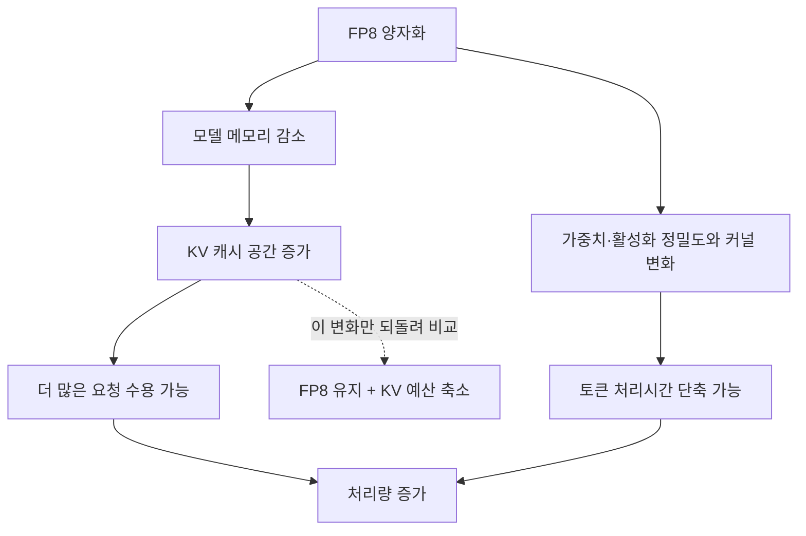

# FP8 양자화로 처리량이 늘어난 이유

**FP8을 켜자 처리량이 33.7% 늘었습니다. 늘어난 KV 캐시 공간을 다시 줄여도 이득은 남았습니다.** 같은 수의 요청을 처리하면서 토큰 간 간격도 짧아졌습니다. 이 글은 그 차이를 대조 실험과 프로파일링으로 좁혀 간 기록입니다.

CloudNet@ LLMSO 스터디 5주차 과제로, CH9의 실전 최적화와 CH10의 성능 프로파일링을 연결했습니다. 실험 환경은 **RTX 4080 Laptop 12GB·Qwen2.5-1.5B·vLLM v0.23.0**입니다. 두 장의 전체 내용을 요약하기보다, 양자화로 얻은 성능 향상의 원인 하나를 깊이 살펴봤습니다.

## 1. 양자화가 빨라지는 두 경로

양자화를 켜면 모델이 차지하는 메모리가 줄어듭니다. 남는 공간에 더 많은 요청을 담을 수 있고, 가중치를 읽고 계산하는 경로도 바뀔 수 있습니다. 처리량이 올랐다는 사실만으로는 어느 변화가 효과를 냈는지 알기 어렵습니다.

여기서 **KV 예산**은 이전 토큰의 계산 결과를 보관할 수 있는 캐시 용량입니다. **ITL**은 사용자가 받는 토큰 사이의 시간 간격이고, **GEMM**은 모델의 선형 계층에서 수행하는 행렬 곱셈입니다. BF16과 FP8은 각각 16비트와 8비트 부동소수점 형식입니다.

*두 경로는 함께 작동할 수 있습니다. 이번에는 KV 예산 증가가 반드시 필요했는지부터 확인했습니다.*

CH9의 Qwen3-14B AWQ 사례에서는 모델 메모리를 줄여 KV 캐시를 확보한 뒤 처리량이 2.7배 늘었습니다. 같은 스터디 자료의 RTX 4070 계열·Qwen3-4B 참고 실습에는 별도의 Nsight 분석이 있습니다. 모델과 측정 조건이 다른 두 사례를 하나의 결과로 합치지는 않았습니다.

제 실험은 GPU·모델·양자화 방식이 모두 다릅니다. 교재 사례를 그대로 재현하거나 반박하는 대신, **내 환경에서도 늘어난 KV 예산이 이득의 원인인지** 확인했습니다.

## 2. KV 예산을 되돌려도 이득은 남았다

비교의 중심은 세 구성입니다. BF16 기준 구성, FP8 기본 구성, 그리고 FP8을 유지한 채 KV 예산을 BF16에 가깝게 줄인 구성입니다. 세 구성 모두 짧은 입력에서 최대 512토큰을 생성하는 `decode` 워크로드를 동시성 16으로 실행했습니다.

*막대는 구성별 3회 측정 평균, 오차 막대는 ±1σ입니다. KV 예산을 줄인 뒤에도 FP8 두 구성의 처리량은 비슷했습니다.*

| 구성 | KV 수용량 지표 | 처리량 (tok/s) | ITL p50 (ms) |
| --- | --- | --- | --- |
| BF16 기본 | 59.50x | 1,689.3 | 9.7 |
| FP8 기본 | 70.20x | 2,258.8 | 7.3 |
| FP8 · KV 예산 축소 | 60.95x | 2,261.0 | 7.3 |

KV 수용량 지표는 기동 로그의 `Maximum concurrency`입니다. 최대 길이 4,096토큰인 요청을 기준으로 환산한 용량이며, 실제 실행 중인 요청 수와는 다릅니다. 예산 축소 구성은 기준보다 **2.4% 큰 수준**까지 맞췄습니다. 완전히 같은 예산은 아닙니다.

FP8 기본의 처리량 이득은 **+33.7%**, 예산을 줄인 구성은 **+33.8%**였습니다. 둘의 평균 차이는 약 0.1%로 각 구성의 반복 측정 변동보다 작았습니다. 이 조건에서는 늘어난 KV 예산을 줄여도 처리량 이득이 사라지지 않았습니다. 다만 3회 측정과 예산 오차만으로 기여도를 정확히 0%라고 단정할 수는 없습니다.

이를 뒷받침하는 별도 실험도 있습니다. BF16에서 KV 예산만 64,048→243,696토큰으로 **3.80배** 늘렸지만, 같은 `decode` 부하의 처리량 변동은 약 **0.5%**였습니다. 예산이 늘수록 빨라지는 추세는 없었습니다. 짧은 입력과 동시 요청 16개에 필요한 KV 공간은 가장 작은 구성에도 충분했습니다.

## 3. 같은 요청 수에서 토큰 간격이 짧아졌다

ITL p50은 9.7ms에서 7.3ms로 **24.7%** 줄었습니다. 처리량만 오른 것이 아니라 사용자에게 토큰이 도착하는 간격도 짧아졌습니다. ITL에는 서버 밖의 지연도 포함되므로 이 값만으로 GPU의 어느 연산이 빨라졌다고 판단하지는 않았습니다.

Prometheus에서도 BF16과 FP8에 같은 `decode` 부하를 3분씩 가했습니다. 두 구간 모두 실행 요청 16개, 대기 요청 0개, 선점 0회였습니다. 생성 처리량은 **1,703.6→2,269.3 tok/s(+33.2%)**로 늘었습니다. 이 관측은 더 많은 요청을 동시에 실행해서만 얻은 이득이라는 설명과 맞지 않습니다.

그다음 PyTorch Profiler로 커널 시간을 살펴봤습니다. CH10의 프로파일링은 서비스 지표, 실행 타임라인, 개별 커널을 대조하며 병목을 좁히는 접근입니다. 이번 환경에는 Nsight 바이너리가 없어 PyTorch Profiler와 Prometheus까지만 사용했습니다.

기록된 GPU 커널 시간의 총합은 BF16이 503.1ms, FP8이 622.8ms였습니다. FP8이 더 길어 보이지만 수집한 스텝 수가 달랐습니다. 기존 기록의 58스텝과 98스텝을 분모로 적용하면 다음과 같습니다.

| 비교 기준 | BF16 | FP8 |
| --- | --- | --- |
| GPU 커널 시간 합계 | 503.1ms | 622.8ms |
| 기록된 스텝 수 | 58 | 98 |
| 합계 ÷ 스텝 수 | **8.67ms** | **6.36ms** |

**기록된 스텝 수로 환산한 커널 시간 합계는 약 26.7% 줄었습니다.** ITL의 감소 방향과도 같습니다. 다만 커널 시간의 합계는 중첩 실행이나 CPU 대기까지 반영한 실제 스텝의 경과시간과 같지 않습니다.

기존 역할별 집계에서는 GEMM 감소가 두드러졌습니다. 그러나 표의 ‘스텝당’ 값이 위 계산보다 약 28배 작아, 레이어 수까지 나눈 집계로 추정됩니다. 원트레이스와 집계 코드가 현재 검토본에 없어 역할별 수치는 부록에 보존하고 잠정 근거로만 취급했습니다.

여기까지의 근거로는 **KV 예산 증가만으로 설명되지 않는 처리시간 단축**이 있었다고 해석할 수 있습니다. 가중치 읽기 비용과 FP8 계산 경로가 후보입니다. W8A8은 가중치뿐 아니라 활성화도 8비트로 처리하므로, 이득 전부를 메모리 대역폭에 돌리려면 추가 계측이 필요합니다. [vLLM의 FP8 W8A8 설명](https://docs.vllm.ai/en/v0.23.0/features/quantization/llm_compressor/fp8/#online-dynamic-quantization)

## 4. KV 예산이 부족하면 결과가 달라진다

앞의 결과가 KV 캐시 용량은 중요하지 않다는 뜻은 아닙니다. 긴 입력을 처리하는 `prefill` 부하에서 예산을 더 낮추자 처리량이 떨어졌습니다.

| BF16 구성 | KV 예산 | 프롬프트 처리량 (tok/s) | TTFT p50 | 선점 |
| --- | --- | --- | --- | --- |
| util 0.85 | 243,696토큰 | 12,686 | 4.448초 | 0회 |
| util 0.33 | 10,144토큰 | 8,306 | 7.679초 | 4회 |

이 비교는 `prefill` 동시성 64에서 입력 토큰 처리량을 잰 별도 실험입니다. 앞의 `decode` 생성 처리량과 직접 비교하지 않습니다. 예산이 부족한 구성에서는 프롬프트 처리량이 **34.5% 감소**했고 첫 토큰까지 기다리는 시간은 약 **1.7배**가 됐습니다.

KV 사용률만으로는 이런 상태를 구분하기 어려웠습니다. 중간 구성인 `util=0.45`는 사용률이 0.995까지 올라도 처리량이 유지됐습니다. 사용률과 함께 선점 증가, 대기 요청, TTFT를 봐야 합니다. 선점이 없다는 이유만으로 모든 병목이 사라졌다고 판단할 수도 없습니다.

프리필·디코드와 동시성 1·4·16·64를 조합한 별도 비교에서는 FP8의 평균 처리량이 여덟 조건 모두 높았습니다. 개선 폭은 **+11.1%~+35.4%**였으며 높은 동시성에서 작아졌습니다. 다만 구성별 2회 측정이고 동시성 64는 변동이 커, 이 결과로 FP8이 항상 유리하다고 일반화하지 않았습니다.

이 글은 12GB GPU 한 장과 1.5B 모델에서 얻은 성능 기록입니다. **응답 품질은 평가하지 않았고, Nsight Compute로 메모리 대역폭과 연산 병목을 분리하지도 않았습니다.** 더 큰 모델, AWQ·GPTQ·FP4, 다중 GPU에는 별도 측정이 필요합니다.

## 5. 운영에 적용할 때 확인할 것

양자화 전후의 처리량만 비교하면 함께 바뀐 조건을 놓치기 쉽습니다. 이번 실험에서 남긴 확인 순서는 세 가지입니다.

1. **같은 부하에서 비교합니다.** 입력·출력 길이, 동시성, 모델과 서버 설정을 고정하고 반복 측정의 변동을 함께 기록합니다.
2. **원인으로 의심한 조건을 되돌립니다.** KV 예산이 후보라면 FP8을 유지한 채 예산을 줄여 봅니다. 예산이 실제로 부족해졌는지도 선점·대기·TTFT로 확인합니다.
3. **지표와 프로파일러의 설명이 맞는지 대조합니다.** 처리량·ITL로 차이를 확인한 뒤 커널 집계의 단위와 수집 구간을 확인합니다. 운영 도입 전에는 응답 품질도 별도로 평가합니다.

**이번 환경에서는 KV 예산을 BF16 수준에 가깝게 줄여도 FP8의 처리량 이득이 남았고, 토큰 간격도 짧아졌습니다.** 남는 메모리가 곧 처리량 증가의 원인은 아니었습니다. 다음 검증은 같은 작업량의 트레이스를 다시 집계해, 가중치를 읽는 비용과 계산 경로의 변화를 구분하는 것입니다.

---

## 상세 데이터와 재현 안내

본문은 기존 측정 기록을 재정리한 것입니다. 아래 표와 화면은 근거를 확인하기 위한 자료입니다. 현재 검토한 체크아웃에는 5주차 원시 결과·트레이스·자동 실행 스크립트가 없어, 이번 개정에서는 기록 간 산술과 출처를 검증했습니다. GPU 실험을 새로 실행한 결과는 아닙니다.
