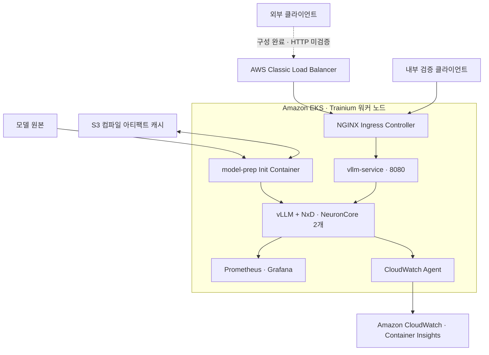
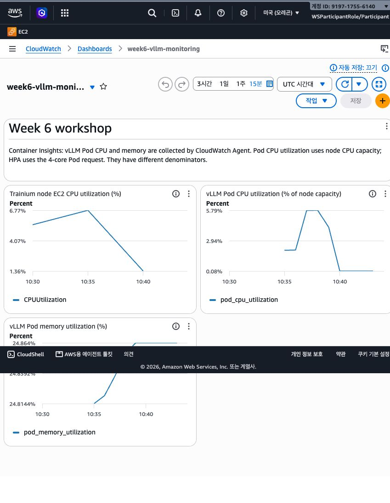
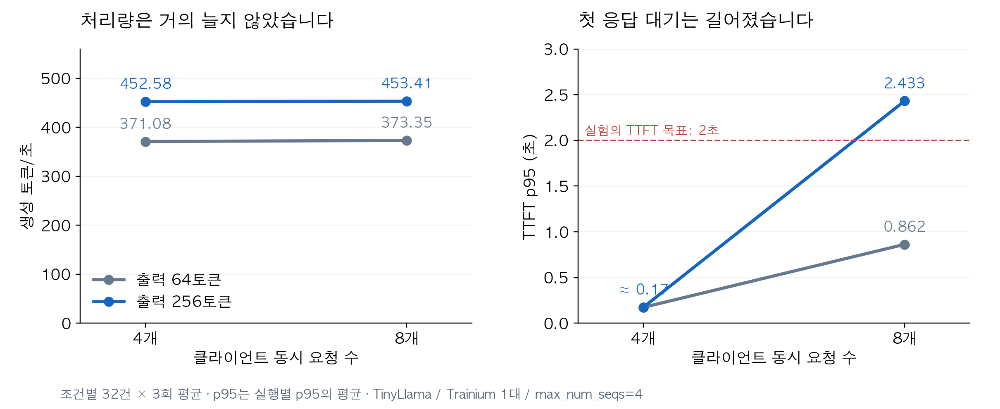
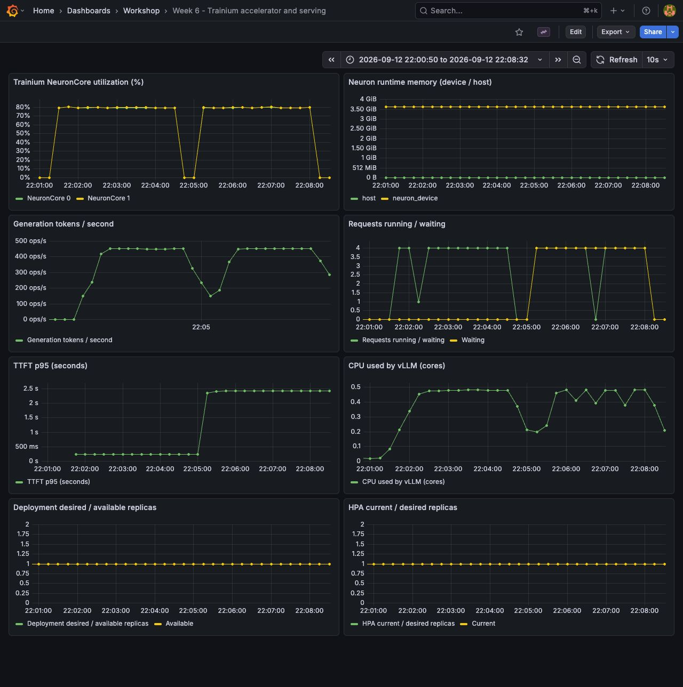
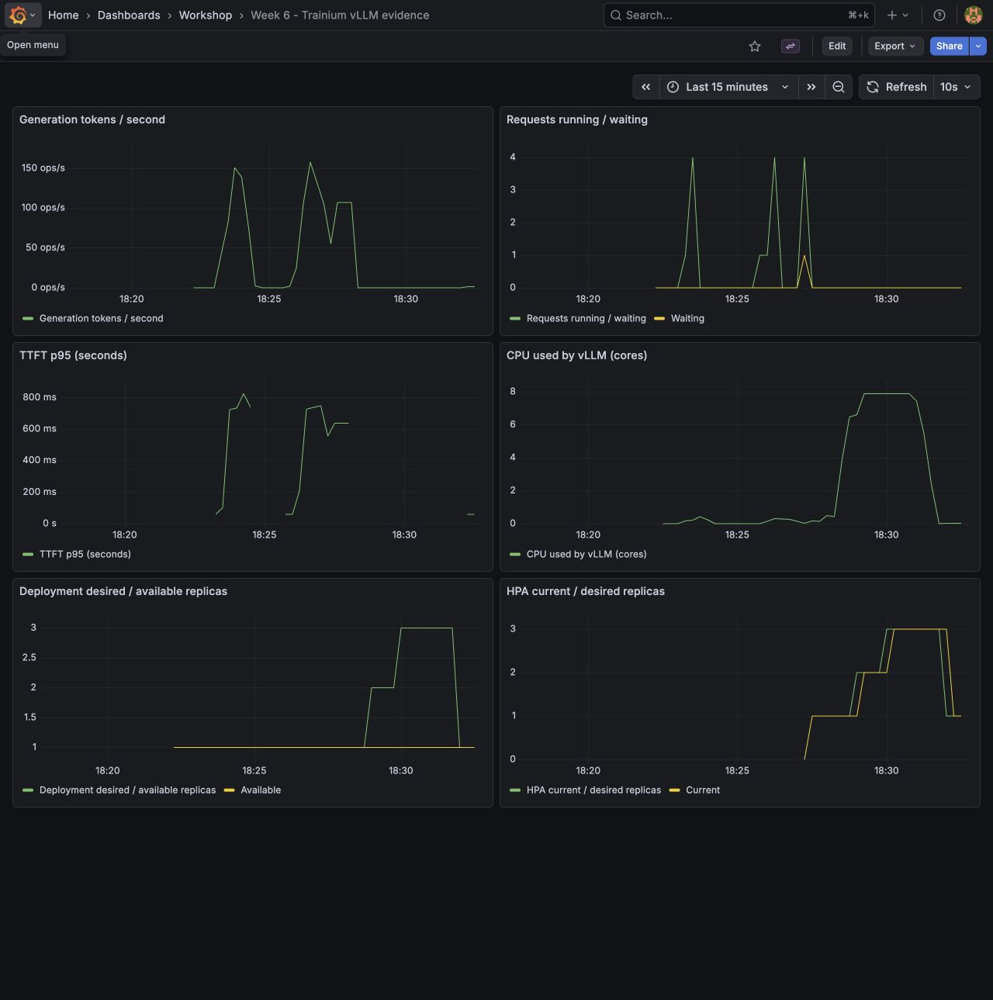

# AWS Trainium·EKS로 LLM을 서비스로 연결하기

**모델 준비와 배포에서 Ingress, 모니터링, 부하 테스트, 오토스케일링까지 이어 본 AWS 워크샵**

> **핵심 내용**
>
> Trainium의 vLLM을 EKS의 요청 경로·모니터링·HPA에 연결하면서, **LLM 서비스의 확장에는 요청 대기를 감지할 지표와 새 모델을 실행할 자원이 함께 필요하다**는 점을 확인했습니다.
>
> - 추론 중 CPU는 평균 약 0.45코어였지만 두 NeuronCore는 평균 약 79%로 동작했습니다. 동시 요청 8개에서 대기 4건이 생겨도 CPU 기반 HPA는 반응하지 않았습니다.
> - CPU 부하로 HPA 목표를 3개까지 높여도 자원 부족으로 가용 Pod는 1개였습니다. 같은 제약이 RollingUpdate도 막았습니다.
> - 운영에서는 요청 대기 감지 → 자원 확보 → 모델 준비 → 실제 응답 용량 증가까지 이어지는지 확인해야 합니다.

## 1. 모델이 실행된 다음에는 무엇이 필요한가

LLM을 처음 띄울 때는 모델이 정상적으로 응답하는지에 집중합니다. 하지만 다른 클라이언트가 호출하고, 상태를 관측하고, 요청이 늘었을 때 대응하려면 모델 밖의 구성도 필요합니다.

Trainium에서 실행하는 vLLM에 요청 경로와 모니터링을 연결하고, 부하가 늘 때 배포와 확장이 어떻게 동작하는지 확인했습니다.

### 전체 구성에서 각 요소가 맡은 역할

**Trainium은 모델 연산을 실행하고, Neuron 소프트웨어와 NxD는 이 가속기에서 모델을 실행하는 데 필요한 환경을 제공합니다.** vLLM은 그 위에서 OpenAI 호환 API를 제공합니다. EKS는 이 컨테이너를 어느 노드에 배치하고 몇 개 유지할지 관리합니다.

### NVIDIA GPU 구성과 무엇이 다른가

**현재 구성은 GPU 대신 Trainium이 모델 연산을 담당합니다.** CPU와 호스트 메모리는 두 구성 모두에 있으며, 가속기의 사용률·메모리와 구분해서 봐야 합니다.

| 구분 | NVIDIA GPU 기반 vLLM 구성 | 현재 Trainium 구성 |
| --- | --- | --- |
| 모델 연산 장치 | NVIDIA GPU | Trainium 1개 · NeuronCore 2개 |
| 실행 소프트웨어 | NVIDIA 드라이버·CUDA 기반 vLLM | AWS Neuron SDK·NxD 기반 vLLM |
| 가속기 메모리 | GPU 메모리(VRAM, 제품에 따라 HBM 등) | Trainium의 전용 HBM |
| 가속기 관측 | `nvidia-smi`, DCGM Exporter로 GPU 사용률·메모리 조회 | `neuron-monitor`로 NeuronCore 사용률·디바이스 메모리 조회 |
| 공통 서비스 관측 | CPU·호스트 메모리와 별도로 TTFT·처리량·대기 요청 확인 | 동일하게 TTFT·처리량·대기 요청을 가속기 지표와 함께 확인 |

CloudWatch의 Pod 메모리는 호스트 메모리 지표이며 Trainium HBM 사용량이 아닙니다. CPU가 낮다는 사실만으로 가속기에도 여유가 있다고 판단할 수는 없습니다. 위 표는 구성의 차이이며 두 가속기의 성능 비교 결과는 아닙니다. [NVIDIA DCGM 지표](https://github.com/NVIDIA/dcgm-exporter/blob/main/etc/default-counters.csv), [AWS Neuron 모니터링](https://awsdocs-neuron.readthedocs-hosted.com/en/latest/tools/neuron-sys-tools/neuron-monitor-user-guide.html)

모델을 준비하는 경로와 사용자 요청을 처리하는 경로는 다릅니다. 워크샵의 Init Container는 모델을 준비하고 컴파일 아티팩트를 캐시하며, 메인 컨테이너는 준비된 모델로 추론 요청을 처리합니다. S3는 컴파일 아티팩트를 보존하는 데 사용합니다.



*모델 준비 부분은 워크샵의 설계입니다. 요청 경로는 내부 검증 클라이언트 → NGINX → vLLM 구간에서 실제 HTTP 응답을 확인했습니다. 외부 CLB 호출은 검증하지 못했습니다.*

<details>
<summary>이번 환경의 주요 설정</summary>

| 항목 | 설정 |
| --- | --- |
| 리전·워커 노드 | `us-west-2`, `trn1.2xlarge` 1대 |
| Kubernetes | `v1.33.13-eks-cb19647` |
| 모델 | `tinyLlama/TinyLlama-1.1B-Chat-v1.0` |
| 실행 이미지 | vLLM `0.9.1` · Neuron SDK `2.25.0` 계열 |
| 모델 설정 | TP=2, `max_num_seqs=4`, `max_model_len=1024`, Bucketing OFF |
| 노드 가속기 자원 | Neuron 1개, NeuronCore 2개 |
| vLLM CPU | request 4코어, limit 8코어 |

측정 시점은 2026-09-12입니다. 사용한 이미지는 `public.ecr.aws/neuron/pytorch-inference-vllm-neuronx:0.9.1-neuronx-py310-sdk2.25.0-ubuntu22.04`입니다.

</details>

## 2. 모델 준비와 요청 처리를 나눠 배포한다

### EKS에서 Trainium 자원을 인식시키는 구성

일반적인 CPU 컨테이너와 달리, 가속기를 사용하는 Pod는 노드가 제공하는 가속기 자원을 할당받아야 합니다. 워크샵은 Neuron device plugin과 스케줄러 구성을 사용하며, 확인한 노드에는 Neuron 1개와 NeuronCore 2개가 할당 가능한 자원으로 표시됐습니다.

vLLM은 Neuron 1개를 요청하고 TP=2로 실행했습니다. 여기서 2는 GPU 두 장이 아니라 이 환경의 NeuronCore 두 개를 사용하는 설정입니다. 이 자원 구성을 알아야 뒤에서 새 Pod가 왜 Pending에 머물렀는지도 설명할 수 있습니다.

### Init Container가 모델을 준비하고 vLLM이 API를 제공한다

워크샵의 `model-prep` Init Container는 먼저 S3에 컴파일 아티팩트가 있는지 확인합니다. 캐시가 없으면 모델을 내려받아 Neuron용으로 컴파일하고 결과를 저장합니다. 메인 `vllm-server` 컨테이너는 준비된 아티팩트를 사용해 API를 시작합니다. 워크샵에서는 S3 CSI Driver와 PV/PVC를 사용해 캐시를 연결합니다.

이 구조에서는 **모델 준비 실패와 추론 서버 실행 실패를 나눠 확인할 수 있습니다.** 이번 Pod의 초기화 컨테이너에는 재시작 이력이 있었지만 마지막 실행은 `Completed`, 종료 코드는 0이었습니다. 메인 컨테이너는 재시작 없이 응답했고, 설정에는 컴파일 아티팩트 경로가 `/shared/model/cache`로 지정돼 있었습니다.

다만 이번에 첫 컴파일과 캐시 재사용 기동 시간을 따로 비교하지는 않았습니다. 캐시를 사용하는 설계와 실제 기동 시간 단축의 측정 결과는 구분했습니다. [Neuron SDK 2.25 vLLM·NxD 가이드](https://awsdocs-neuron.readthedocs-hosted.com/en/v2.25.0/libraries/nxd-inference/developer_guides/vllm-user-guide.html)

<details>
<summary>배포 상태를 확인한 명령</summary>

워크샵 접속용 EC2에서는 `sudo -i`로 진입한 root 셸에 EKS kubeconfig가 준비돼 있었습니다. `ubuntu` 계정에서의 연결 실패를 클러스터 장애로 판단하지 않고 실행 계정과 context부터 확인했습니다.

```bash
sudo -i
kubectl config current-context
kubectl get deployment vllm-deployment -o wide
kubectl get pods -l app.kubernetes.io/name=vllm-server -o wide
kubectl logs -l app.kubernetes.io/name=vllm-server -c model-prep --tail=50
kubectl logs -l app.kubernetes.io/name=vllm-server -c vllm-server --tail=50
```

</details>

<details>
<summary>Neuron에서 확인한 컴파일 모델</summary>

`neuron-monitor`의 모델 목록에는 `context_encoding_model`과 `token_generation_model`의 `.neff` 파일이 각각 NeuronCore 0·1에 올라와 있었습니다. 모델을 준비한 아티팩트가 가속기 런타임에 로드돼 있는지 확인한 근거입니다.

| 런타임에서 확인한 경로 | 모델 실행 단계 | 표시된 NeuronCore |
| --- | --- | --- |
| `context_encoding_model/...neff` | 입력 문맥 처리 | 0, 1 |
| `token_generation_model/...neff` | 다음 토큰 생성 | 0, 1 |

이 자료는 짧은 상태 수집 결과입니다. 추론 부하와 시간을 맞춰 수집한 가속기 사용률 자료가 아니므로 포화도나 최대 성능의 근거로 사용하지 않았습니다.

</details>

## 3. Ingress를 붙이고 요청이 지나가는 경로를 확인한다

NGINX Ingress Controller를 설치하고 `/` 경로를 `vllm-service:8080`에 연결했습니다. Service가 vLLM Pod를 가리키고, Ingress Controller가 HTTP 요청을 해당 Service로 전달하는 구성입니다.

Controller를 `LoadBalancer` 타입 Service로 노출하자 AWS Classic Load Balancer가 생성됐습니다. Ingress 상태에도 CLB의 DNS 이름이 들어왔고, AWS 콘솔에서는 Internet-facing 구성과 **서비스 중인 대상 1/1**을 확인했습니다.


*실제 워크샵 콘솔 화면입니다. CLB 생성과 대상 상태를 확인한 근거이며, 외부 API 호출 성공을 의미하지는 않습니다.*

다음으로 내부 클라이언트에서 NGINX 주소로 API를 호출했습니다. Pod에 직접 요청하는 검사에 그치지 않고 Controller가 실제 backend로 전달하는지도 접근 로그와 대조했습니다.

| 확인 항목 | 실제 결과 |
| --- | --- |
| `/health` | HTTP 200 |
| `/v1/models` | HTTP 200, TinyLlama 모델 ID 확인 |
| 일반 Chat Completion | HTTP 200, 입력 24토큰·생성 32토큰 |
| 스트리밍 Chat Completion | HTTP 200, JSON chunk 33개와 `[DONE]` 수신 |
| NGINX 접근 로그 | backend `default-vllm-service-8080`, upstream 200 |

일반 응답은 설정한 32토큰 상한에서 끝났습니다. 이 단계에서 확인한 것은 요청 경로와 API 동작이며, 모델 답변의 품질은 아닙니다. 외부 CLB 경유 HTTP 검사는 사용한 도구의 접근 제한으로 완료하지 못했습니다. 내부 호출 성공과 외부 공개 경로의 검증을 따로 기록했습니다.

<details>
<summary>Ingress 규칙과 CLB 리스너</summary>

Ingress는 `nginx` 클래스로 `/` Prefix를 `vllm-service:8080`에 전달했습니다. API 경로를 그대로 유지하므로 경로 재작성 annotation은 넣지 않았습니다. Controller는 Helm chart `4.15.1`, 애플리케이션 버전 `1.15.1`로 설치했습니다.

적용한 Ingress 규칙은 다음과 같습니다. 이 설정은 이미 존재하는 vLLM Service와 NGINX Controller를 연결합니다.

```yaml
apiVersion: networking.k8s.io/v1
kind: Ingress
metadata:
  name: vllm-ingress-simple
  namespace: default
spec:
  ingressClassName: nginx
  rules:
    - http:
        paths:
          - path: /
            pathType: Prefix
            backend:
              service:
                name: vllm-service
                port:
                  number: 8080
```


기능 확인에 보낸 요청 본문도 함께 보겠습니다. 일반 호출은 아래 JSON을 `/v1/chat/completions`로 전송했고, 스트리밍 호출에는 `"stream": true`를 추가했습니다. 두 호출 모두 클러스터 내부 NGINX 주소를 사용했습니다.

```json
{
  "model": "tinyLlama/TinyLlama-1.1B-Chat-v1.0",
  "messages": [{"role": "user", "content": "Say hello in one short sentence."}],
  "max_tokens": 32,
  "temperature": 0
}
```

일반 응답의 `finish_reason`은 `length`, usage는 입력 24·출력 32·합계 56토큰이었습니다. 스트리밍에서는 내용이 있는 응답과 마지막 `[DONE]`까지 확인했습니다.

TCP 80은 NodePort 30429로, TCP 443은 32305로 연결됐습니다. 인증서와 HTTPS 동작은 검증하지 않았습니다. Ingress NGINX는 유지보수가 종료된 프로젝트이므로 이 구성은 제공된 워크샵의 재현 범위입니다. 새 운영 환경의 기술 선택에는 그 상태를 반영해야 합니다. [Kubernetes 공식 안내](https://kubernetes.io/blog/2025/11/11/ingress-nginx-retirement/)

</details>

### 기존 요청이 성공해도 새 배포는 멈출 수 있었다

배포 상태를 확인하던 중 기존 vLLM Pod 한 개는 Running인데 새 ReplicaSet의 Pod는 Pending인 상황도 발견했습니다. 기존 Pod를 유지하면서 새 Pod를 추가하는 RollingUpdate 방식이었지만, 노드의 가속기를 기존 Pod가 이미 사용하고 있었습니다. 이벤트에는 가속기·CPU·임시 저장 공간 부족이 함께 기록됐습니다.

두 ReplicaSet의 차이는 재시작 시각 annotation뿐이었습니다. 그 차이를 제거해 기존 ReplicaSet으로 복귀했고, 실행 중인 모델을 유지한 채 Pending을 정리했습니다. 이후 rollout 완료도 확인했습니다.

이 경험은 단일 가속기 노드에서 배포 전략을 선택할 때의 제약을 보여 줍니다. 새 Pod가 잠시 더 실행될 여유 자원이 없다면, 기존 Pod를 유지하는 업데이트 방식이 자동으로 완료되리라 기대하기 어렵습니다. 현재 서비스의 응답 상태와 새 배포의 진행 상태를 함께 확인해야 합니다.

## 4. Prometheus·Grafana와 CloudWatch로 상태를 관측한다

### 요청 지표와 자원 지표를 같은 시간축에 놓는다

`monitoring` namespace에 Prometheus와 Grafana를 설치했습니다. vLLM의 `/metrics`를 10초마다 수집하고, kube-state-metrics와 cAdvisor 지표를 함께 조회했습니다.

대시보드에는 생성 토큰 처리량, 실행·대기 요청, TTFT, CPU 사용량, Deployment와 HPA의 복제본 수를 배치했습니다. 이 구성이 있어야 요청이 늦어졌을 때 서버 안의 대기, CPU 부하, 확장 상태를 같은 시간대에서 대조할 수 있습니다.

Prometheus 수집 대상은 11개 모두 `up`이었고 vLLM 지표도 실제 값이 조회됐습니다. Grafana와 Prometheus는 ClusterIP로 유지하고 SSH 터널과 localhost 포트포워딩으로 접속했습니다.


*모니터링 구성 후 실제 화면입니다. 당시 HPA를 만들기 전이라 HPA 패널에는 데이터가 없습니다. 이 화면에는 준비 중 부하가 섞여 있으므로 성능 비교 수치는 별도로 완료한 벤치마크 JSON을 사용했습니다.*

### CloudWatch는 대시보드 저장 뒤에도 수집 경로를 확인해야 했다

CloudWatch에서는 처음에 EC2 CPU만 보이고 Pod 패널은 비어 있었습니다. 클러스터에 수집기가 없었기 때문입니다. CloudWatch Agent를 설치한 뒤에도 바로 해결되지는 않았습니다. Agent는 Ready였지만 로그 전송 단계에서 `logs:PutLogEvents`의 `AccessDenied`가 발생했습니다.

노드 역할에 해당 클러스터의 performance 로그 그룹만 허용하는 정책을 추가하자 로그 스트림이 생성됐습니다. 이후 `ContainerInsights` namespace에서 **Pod CPU·메모리의 실제 1분 datapoint**를 조회했고, 대시보드에도 값이 표시됐습니다.



**대시보드, 수집기, 전송 권한은 각각 확인할 대상이었습니다.** 화면을 만들었거나 Agent가 Running이라는 사실만으로 지표가 들어온다고 판단할 수 없었습니다. 이번에는 CloudWatch API 조회와 콘솔 그래프를 함께 확인했습니다.

CPU 비율의 기준도 맞춰야 합니다. CloudWatch의 Pod CPU 비율은 노드 CPU 한도를, 이번 HPA는 Pod CPU request를 분모로 사용합니다. 두 화면의 백분율이 다르다고 곧바로 수집 오류로 판단하지 않았습니다. [CloudWatch 지표 정의](https://docs.aws.amazon.com/AmazonCloudWatch/latest/monitoring/Container-Insights-metrics-EKS.html)

<details>
<summary>관측 구성과 지표 확인 방법</summary>

Prometheus chart는 `29.28.1`, Grafana chart는 `10.5.15`, CloudWatch Agent 이미지는 `1.300071.0b1720`입니다. vLLM 전용 수집 설정은 다음과 같습니다.

```yaml
extraScrapeConfigs: |
  - job_name: vllm-metrics
    scrape_interval: 10s
    metrics_path: /metrics
    static_configs:
      - targets: ['vllm-service.default.svc.cluster.local:8080']
```

Grafana 데이터 소스는 `http://prometheus-server.monitoring.svc.cluster.local`로 연결했습니다. 생성 처리량은 `sum(rate(vllm:generation_tokens_total{job="vllm-metrics"}[1m]))`로 조회하고, 실행·대기 요청 및 CPU·복제본 패널과 같은 시간축에 배치했습니다.

워크샵에서는 Prometheus·Grafana의 영속 볼륨을 사용하지 않았으므로 장기 데이터 보존을 갖춘 운영 구성은 아닙니다.

CloudWatch 로그 정책은 `/aws/containerinsights/<클러스터 이름>/performance` 로그 그룹과 그 아래 스트림에 `CreateLogGroup`, `CreateLogStream`, `PutLogEvents`, `DescribeLogStreams`만 허용했습니다. `ContainerInsights`에서 `ClusterName`·`Namespace`·`PodName` 차원으로 `pod_cpu_utilization`과 `pod_memory_utilization`을 조회했습니다. 60초 주기의 datapoint가 두 지표 모두 반환되는 것을 확인했으며, 가속기 지표 전체까지 확인한 것은 아닙니다.

Prometheus에서는 아래 쿼리로 실행·대기 요청과 CPU 사용 코어 수를 함께 확인했습니다. CPU 쿼리의 값은 1분 구간의 평균 사용 코어 수입니다. 이를 CPU request인 4코어로 나누고 100을 곱해 request 대비 사용률을 해석했습니다. HPA 자체 수집 시점과 평균 구간까지 같다는 뜻은 아닙니다.

```promql
vllm:num_requests_running{job="vllm-metrics"}
vllm:num_requests_waiting{job="vllm-metrics"}
sum(rate(container_cpu_usage_seconds_total{namespace="default",container="vllm-server"}[1m]))
```


CloudWatch Agent는 Kubernetes 지표를 60초마다 수집하고 5초 간격으로 전송하도록 설정했습니다. Agent의 설정 JSON에서 해당 부분은 다음과 같습니다. `<클러스터 이름>`은 적용할 EKS 이름으로 바꿉니다.

```json
{
  "logs": {
    "metrics_collected": {
      "kubernetes": {
        "cluster_name": "<클러스터 이름>",
        "metrics_collection_interval": 60
      }
    },
    "force_flush_interval": 5
  }
}
```

권한 복구에 사용한 정책의 범위는 아래와 같습니다. 계정과 클러스터 이름만 자리표시자로 바꿨습니다. 이번에는 이 정책을 Agent가 사용한 노드 IAM 역할에 적용했습니다.

```json
{
  "Version": "2012-10-17",
  "Statement": [{
    "Effect": "Allow",
    "Action": [
      "logs:CreateLogGroup", "logs:CreateLogStream",
      "logs:PutLogEvents", "logs:DescribeLogStreams"
    ],
    "Resource": [
      "arn:aws:logs:us-west-2:<계정 ID>:log-group:/aws/containerinsights/<클러스터 이름>/performance",
      "arn:aws:logs:us-west-2:<계정 ID>:log-group:/aws/containerinsights/<클러스터 이름>/performance:*"
    ]
  }]
}
```

수집 확인에서는 `pod_cpu_usage_total`이 빈 결과를 반환하기도 했습니다. 이 이름은 해당 구성의 performance 로그 필드이며 게시된 CloudWatch metric이 아니었습니다. 빈 그래프를 사용량 0으로 해석하지 않고, 실제 게시된 CPU·메모리 utilization 지표를 조회했습니다.

</details>

## 5. 부하 테스트로 서비스가 요청을 처리하는 모습을 확인한다

같은 클러스터의 테스트 Pod에서 NGINX 경유 스트리밍 API를 호출했습니다. 짧은 한국어 입력과 최대 출력 64토큰을 유지하고 동시 요청을 1·2·4·8개로 늘렸습니다. 단계별 30건, 총 120건 모두 성공했습니다.

TTFT는 요청을 보낸 뒤 첫 내용이 도착할 때까지, E2E는 응답이 끝날 때까지 걸린 시간입니다. p95는 요청의 95%가 그 시간 이내에 도달했다는 뜻입니다.

| 동시 요청 | 생성 토큰/초 | TTFT p95 | E2E p95 |
| --- | --- | --- | --- |
| 1 | 114.64 | 0.046초 | 0.562초 |
| 2 | 210.25 | 0.089초 | 0.615초 |
| 4 | 353.76 | 0.173초 | 0.696초 |
| 8 | 356.50 | 0.856초 | 1.373초 |

동시 요청 4→8에서 처리량은 약 0.8% 늘었지만 첫 내용이 도착하기까지의 시간인 TTFT p95는 약 4.9배로 길어졌습니다. 서버의 동시 실행 슬롯은 `max_num_seqs=4`로 유지한 상태였습니다. 추가 요청이 대기한다는 해석과 맞는 결과입니다.

llmperf로 입력·출력 길이를 분산시킨 시험도 실행했습니다. 동시 요청 5개로 50건을 완료했고 오류는 없었습니다. TTFT p95는 0.603초, E2E p95는 1.554초, 도구가 집계한 처리량은 339.67토큰/초였습니다. 입력 조건과 토큰 집계 방식이 다르므로 앞 표의 성능과 직접 비교하지 않았습니다.

### 출력 길이를 늘려 운영상 의미를 더 확인했다

짧은 출력에서는 TTFT 2초·E2E 30초라는 실험용 지연 목표를 모두 통과했습니다. 출력이 길어져도 같은 동시 요청을 감당하는지 확인하려고 출력 상한 64·256토큰과 동시 요청 4·8을 각각 3회 반복했습니다. 총 384건 모두 응답했지만, 256토큰·동시 요청 8개에서는 지연 목표 충족률이 12.5%로 낮아졌습니다.



*각 조건은 32건씩 3회 반복했습니다. p95는 각 실행에서 계산한 p95의 평균입니다. 앞의 120건 시험과 별도 실행이며 값을 섞지 않았습니다.*

이 추가 실험은 운영할 동시 요청 범위를 검토하는 근거입니다. 클라이언트의 동시 발행 수를 바꾼 비교이므로, 실제 서비스의 요청 유입 제한이나 별도 대기열 정책을 검증한 결과로 확대하지 않았습니다.

<details>
<summary>부하 테스트 조건과 추가 결과</summary>

기본 벤치마크는 시작 전 warmup 3건을 제외했습니다. 처리량은 성공한 요청의 서버 `usage.completion_tokens` 합을 해당 그룹 전체 경과 시간으로 나눴습니다. 모든 측정 요청에서 정확한 usage를 받았습니다.

llmperf는 동시 요청 5개, 입력 목표 평균 256·표준편차 50토큰, 출력 목표 평균 100·표준편차 20토큰, temperature 0.7 조건입니다. 최종 집계에서 별도 토크나이저로 생성문을 재토큰화하므로 서버 usage 기반 결과와 정의가 다릅니다.

| 출력 상한 | 동시 요청 | 생성 토큰/초, 평균 ± SD | TTFT p95 평균 | 지연 목표 충족률 |
| --- | --- | --- | --- | --- |
| 64토큰 | 4 | 371.08 ± 0.26 | 0.172초 | 100% |
| 64토큰 | 8 | 373.35 ± 0.30 | 0.862초 | 100% |
| 256토큰 | 4 | 452.58 ± 0.94 | 0.173초 | 100% |
| 256토큰 | 8 | 453.41 ± 0.99 | 2.433초 | 12.5% |

위 표는 3회 평균과 표본 표준편차입니다. 출력 상한별 warmup 2건은 제외했고 두 번째 반복은 조건 순서를 뒤집었습니다. 320건 지속 시험은 동시 요청별 1회씩 실행했습니다. 8개 시험에서 목표를 만족한 요청은 처음 네 건이었고, 짧은 시험의 4/32와 지속 시험의 4/320 차이가 충족률에 반영됐습니다.

같은 256토큰 출력을 320건씩 지속해서 보내는 시험도 비교했습니다. 동시 요청 8개에서는 452.81토큰/초·TTFT p95 2.447초·지연 목표 충족률 1.25%였습니다. 후속으로 4개를 유지했을 때는 451.52토큰/초·0.174초·100%였습니다. 이 조건에서는 요청을 더 많이 동시에 보내도 처리량 이득은 거의 없고 대기가 길어졌습니다.


llmperf는 `f1d6bed47e4501b0e371082b41601b59ab55269f` 커밋을 Python 3.10 환경에 `pip install -e .`로 설치한 뒤 다음 조건으로 실행했습니다. 아래 명령은 해당 llmperf 소스 디렉터리에서, 클러스터 내부 NGINX에 접근할 수 있는 클라이언트를 전제로 합니다.

```bash
export OPENAI_API_KEY=EMPTY
export OPENAI_API_BASE=http://ingress-nginx-controller.ingress-nginx.svc.cluster.local/v1
python token_benchmark_ray.py \
  --model tinyLlama/TinyLlama-1.1B-Chat-v1.0 \
  --mean-input-tokens 256 --stddev-input-tokens 50 \
  --mean-output-tokens 100 --stddev-output-tokens 20 \
  --max-num-completed-requests 50 --timeout 600 \
  --num-concurrent-requests 5 --results-dir /tmp/llmperf-results \
  --llm-api openai --additional-sampling-params '{"temperature":0.7}'
```

이 커밋은 최종 출력 토큰을 `hf-internal-testing/llama-tokenizer`로 재계산합니다. 실행 중 Ray object store가 작은 `/dev/shm` 대신 `/tmp`를 사용한다는 경고도 있었으므로 이 결과를 서버의 절대 최대 성능으로 보지는 않았습니다.

</details>

### CPU와 Trainium의 부하를 함께 확인했다

CPU 지표만으로는 모델 연산을 담당하는 Trainium의 상태를 알 수 없습니다. `neuron-monitor`와 AWS 공식 Prometheus exporter를 연결해 NeuronCore 사용률과 런타임의 디바이스 메모리를 수집하고, 출력 256토큰·동시 요청 4개와 8개를 각각 320건씩 실행했습니다. 두 조건 모두 320건을 완료했습니다.



*왼쪽 부하 구간은 동시 요청 4개, 오른쪽은 8개입니다. 위쪽 NeuronCore 사용률과 디바이스 메모리는 두 구간에서 비슷하지만, 두 번째 줄 오른쪽의 대기 요청은 8개 조건에서 4건으로 증가합니다. CPU와 가속기는 서로 다른 단위의 지표입니다.*

| 동시 요청 | NeuronCore 0·1 평균 | 대기 요청 | 생성 토큰/초 | TTFT p95 |
| --- | --- | --- | --- | --- |
| 4 | 79.29% · 79.42% | 0건 | 451.54 | 0.173초 |
| 8 | 79.55% · 79.67% | 4건 | 452.82 | 2.439초 |

두 조건의 CPU 사용량은 관측 구간에서 평균 약 0.45코어, 1분 rate 최댓값은 약 0.483코어였습니다. 런타임이 보고한 디바이스 메모리는 모두 약 3.63GiB로 거의 같았고, HPA 목표와 가용 Pod는 1개로 유지됐습니다. 지연 목표 충족률은 동시 요청 4개에서 100%, 8개에서 1.25%였습니다.

**CPU가 낮아도 가속기는 연산 중이었고, 요청을 더 동시에 보내도 가속기 사용률과 처리량은 거의 늘지 않았습니다.** 동시 실행 슬롯을 4개로 고정한 상태에서 추가 요청이 대기한다는 해석과 맞습니다. 다만 NeuronCore 약 79%를 가속기의 완전한 포화로 해석할 수는 없습니다. 이 결과는 현재 설정에서의 동작이며, 슬롯 수를 바꿨을 때의 처리량이나 HBM 대역폭 한계까지 확인한 것은 아닙니다.

<details>
<summary>가속기 관측 조건과 지표의 의미</summary>

2026-09-12 KST 기준 동시 요청 4개는 22:01:20~22:04:26, 8개는 22:04:56~22:08:02에 실행했습니다. 출력 상한 256토큰, warmup 2건, 측정 320건으로 조건별 1회씩 수행했고 사이에 30초를 쉬었습니다. 기존 Pod·이미지·모델 설정을 유지했습니다. 앞의 반복 시험 및 지속 부하 수치와 합쳐 집계하지 않았습니다.

Neuron 수집과 Prometheus scrape는 5초 주기입니다. 각 실행 시작 30초 뒤부터 종료 15초 전까지를 관측 구간으로 정해 Neuron 원본 29개·28개를 집계했습니다. CPU는 cAdvisor 누적 사용 시간의 1분 rate, vLLM 지표는 기존 10초 수집값을 조회했습니다. 서버 histogram의 TTFT와 클라이언트에서 계산한 표의 TTFT p95는 서로 다른 지표입니다.

```promql
100 * neuroncore_utilization_ratio{job="week6-neuron-live"}
neuron_runtime_memory_used_bytes{job="week6-neuron-live",memory_location="neuron_device"}
```

`neuroncore_utilization_ratio`는 수집 구간의 NeuronCore 사용률입니다. 100을 곱해 백분율로 표시했습니다. 디바이스 메모리는 Neuron 런타임의 할당량이며, 그래프의 `host`도 해당 런타임이 보고한 호스트 할당량입니다. Pod 전체 메모리와 혼동하지 않습니다. 디바이스 메모리 할당량만으로 HBM 대역폭 사용률을 알 수는 없습니다. [AWS Neuron 지표 정의](https://awsdocs-neuron.readthedocs-hosted.com/en/latest/tools/neuron-sys-tools/neuron-monitor-user-guide.html)

관측 구간에서 exporter 수집 상태는 정상이고, Neuron 실행 오류 카운트는 0이었습니다. 수집기 자체의 부하는 별도 계측하지 않았습니다.

</details>

## 6. HPA의 목표 조정과 실제 용량 증가를 구분한다

Metrics Server를 설치해 Kubernetes가 CPU 사용량을 읽도록 하고, HPA를 CPU request 대비 70%, 최소 1·최대 3개로 설정했습니다. 확장·축소 안정화 구간은 30초였습니다.

HPA의 제어 동작을 확인할 때는 종료 시간이 정해진 CPU 부하를 사용했습니다. vLLM Pod는 CPU 4코어를 요청했고 부하 중 사용률은 request 대비 약 197%까지 올라갔습니다. HPA 목표 복제본은 **1→2→3개로 늘었다가 부하 종료 후 1개로 돌아왔습니다.**



*오른쪽 가운데 CPU 패널의 상승 뒤, 왼쪽 아래 Deployment 목표는 3개까지 증가합니다. 같은 패널의 가용 복제본은 계속 1개입니다. 오른쪽 아래 HPA의 current 값은 준비된 서버 수를 뜻하지 않으므로 가용 용량은 Deployment 패널과 함께 확인했습니다.*

새 Pod는 모두 Pending에 머물렀고, 앞서 배포 중 확인했던 것과 같은 가속기·CPU·임시 저장 공간 부족이 기록됐습니다. HPA는 Deployment의 목표를 바꿨지만 노드 자원을 추가하지 않았습니다. 따라서 이번에는 **HPA 제어와 자동 축소는 확인했고, 실제 서빙 복제본 증설은 달성하지 못했습니다.** [Kubernetes HPA 문서](https://kubernetes.io/docs/concepts/workloads/autoscaling/horizontal-pod-autoscale/)

부하 테스트에서 관측한 실제 LLM 요청은 다른 양상을 보였습니다. 동시 요청 8개·256토큰 지속 부하에서는 실행·대기가 각각 4건이었지만 CPU는 1분 rate 최댓값 기준 약 0.465코어였습니다. request 대비 약 11.6%로 HPA 기준보다 낮았고, 목표 복제본은 1개로 유지됐습니다.

이 워크샵에서는 확장할 **시점을 판단하는 지표**와 확장 요청을 **실행할 자원**을 따로 확인할 수 있었습니다. CPU 기반 HPA가 추론 대기를 감지하지 못하는 문제와, 추가 Pod를 실행할 자원이 없는 문제는 각각 해결해야 합니다.


*19:36:15~19:39:00 KST 구간에서 오른쪽 위의 실행·대기는 각각 4건이고, 오른쪽 가운데 CPU는 약 0.465코어 이하입니다. 아래쪽 HPA 목표와 가용 복제본은 모두 1개로 유지됐습니다. 서버 TTFT 패널은 histogram의 추정 분위수이며, 표의 클라이언트 p95와 계산 방식이 다릅니다.*

<details>
<summary>HPA 적용 설정과 Pending의 실제 원인</summary>

Metrics Server `v0.8.1`로 CPU 지표를 읽을 수 있게 한 뒤 아래 HPA를 적용했습니다. 70%의 분모는 CPU limit 8코어가 아닌 request 4코어입니다.

```yaml
apiVersion: autoscaling/v2
kind: HorizontalPodAutoscaler
metadata:
  name: vllm-hpa
  namespace: default
spec:
  scaleTargetRef:
    apiVersion: apps/v1
    kind: Deployment
    name: vllm-deployment
  minReplicas: 1
  maxReplicas: 3
  metrics:
    - type: Resource
      resource:
        name: cpu
        target:
          type: Utilization
          averageUtilization: 70
  behavior:
    scaleUp:
      stabilizationWindowSeconds: 30
      policies:
        - type: Percent
          value: 100
          periodSeconds: 60
    scaleDown:
      stabilizationWindowSeconds: 30
      policies:
        - type: Percent
          value: 50
          periodSeconds: 60
```

CPU 부하는 8개 작업 프로세스를 180초간 실행하도록 제한했습니다. `kubectl get hpa vllm-hpa`, `kubectl get deployment vllm-deployment`, `kubectl get pods -l app.kubernetes.io/name=vllm-server`로 목표와 가용 상태를 대조했습니다. 새 Pod의 이벤트에는 다음 내용이 기록됐습니다.

```text
0/1 nodes are available: 1 Insufficient aws.amazon.com/neuron,
1 Insufficient cpu, 1 Insufficient ephemeral-storage.
```

줄바꿈만 조정한 실제 이벤트 발췌입니다. 부하가 끝난 뒤 목표는 1개로 돌아왔고, 일반·스트리밍 API를 다시 호출해 HTTP 200을 확인했습니다. 목표를 높이는 설정과 새 Pod를 배치할 노드 자원을 함께 검토해야 한다는 결론의 근거입니다.

</details>

## 7. 확장은 요청 대기에서 실제 응답 용량까지 이어져야 한다

**이 구성에서는 확장이 필요한 상황을 감지하는 일과, 새 모델을 실행할 자원을 확보하는 일이 각각 막혔습니다.** 실제 추론에서 대기 요청이 쌓여도 CPU 기반 HPA는 반응하지 않았습니다. CPU 부하로 확장 조건을 충족시킨 뒤에는 새 Pod를 배치할 자원이 없었습니다.

| 실제로 확인한 상황 | 운영 설계에 반영할 판단 |
| --- | --- |
| 추론 중 대기 4건, CPU 평균 약 0.45코어·NeuronCore 평균 약 79%, HPA 목표 1개 유지 | CPU와 함께 요청 대기·TTFT를 관측하고, 서비스의 지연 목표에 맞는 확장 지표를 검토해야 합니다. |
| CPU 부하에서 HPA 목표 1→3, 가용 Pod는 1개 유지 | 목표 조정 뒤에 가속기·CPU·임시 저장 공간을 확보할 수 있는지 확인해야 합니다. |
| 기존 Pod는 응답하지만 RollingUpdate의 새 Pod는 Pending | 같은 자원 계획이 확장과 배포 모두에 필요합니다. 교체 중 두 모델을 동시에 올릴 여유가 없으면 업데이트 전략을 조정해야 합니다. |

가속기를 직접 관측하자 CPU에 나타나지 않던 연산 부하를 확인할 수 있었습니다. 동시 요청을 늘려도 NeuronCore 사용률·메모리 할당량·처리량이 거의 같았다는 점은 현재 서빙 설정과 대기를 함께 검토해야 할 근거입니다.

이 판단은 관측 경로가 완성돼야 가능합니다. CloudWatch Agent가 Ready였어도 로그 전송 권한을 갖추기 전에는 Pod 지표가 들어오지 않았습니다. Prometheus·Grafana에서 요청과 자원을 함께 본 뒤에야 낮은 CPU와 긴 대기가 동시에 발생하는 상황을 설명할 수 있었습니다.

따라서 확장의 완료 기준은 **요청 대기 감지 → 자원 확보 → 모델 준비 → 실제 응답 용량 증가**까지 연결돼야 합니다. 마지막 단계에서는 새 Pod가 실제 요청을 받고, 같은 부하에서 지연 목표 충족률이나 처리량이 개선되는지 확인해야 합니다. 모델 준비에는 아티팩트 로딩과 필요한 경우 컴파일이 포함되므로 시작 시간도 확장 계획의 일부입니다.

이번 결과로 확인한 것은 이 경로가 막힌 지점입니다. 요청 대기 기반 HPA나 추가 Trainium 노드로 문제를 해결했다는 결과는 아직 없습니다. 다음 검증은 확장 지표와 가속기 용량을 함께 준비하고, 새 모델의 준비 시간과 확장 전후 응답을 측정하는 것입니다.

**Trainium에서 모델을 실행한 다음에는, 사용자의 대기를 감지하고 실제로 줄일 수 있는 운영 경로를 만들어야 합니다.** EKS의 목표 Pod 수가 바뀌는 순간부터 새 모델이 요청을 처리하는 순간까지를 하나의 확장 과정으로 다루는 것이 이 구성에서 얻은 가장 중요한 운영 기준입니다.

<details>
<summary>부록 · 측정 조건과 결과를 해석하는 범위</summary>

측정은 단일 `trn1.2xlarge` 노드에서 같은 노드의 내부 클라이언트가 NGINX를 거쳐 vLLM을 호출하는 조건입니다. 따라서 네트워크 지연이 다른 인터넷 사용자나 여러 노드로 확장한 서비스에 수치를 그대로 적용할 수는 없습니다.

모델은 TinyLlama 1.1B, TP=2, 동시 실행 슬롯 4개, 최대 시퀀스 길이 1,024로 고정했습니다. 출력 상한 64·256토큰 비교는 짧은 입력 조건에서 수행했으며, 긴 입력이나 답변 품질은 평가하지 않았습니다. 3회 반복 결과와 조건별 1회인 지속 부하 결과는 본문에서 구분했습니다.

기존 Deployment에는 readiness probe가 없어 `/health`와 일반·스트리밍 API 응답을 별도로 확인했습니다. HPA 역시 목표 복제본 조정과 실제 가용 복제본 증가를 구분했습니다. 외부 요청 경로, 캐시 재사용 시 기동 시간, 여러 복제본의 처리량은 후속 검증이 필요한 항목입니다.

</details>
