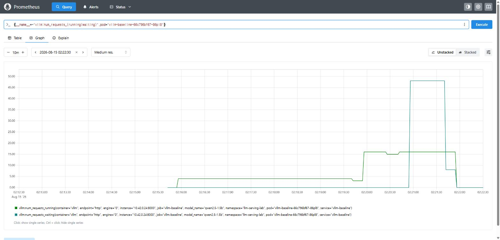
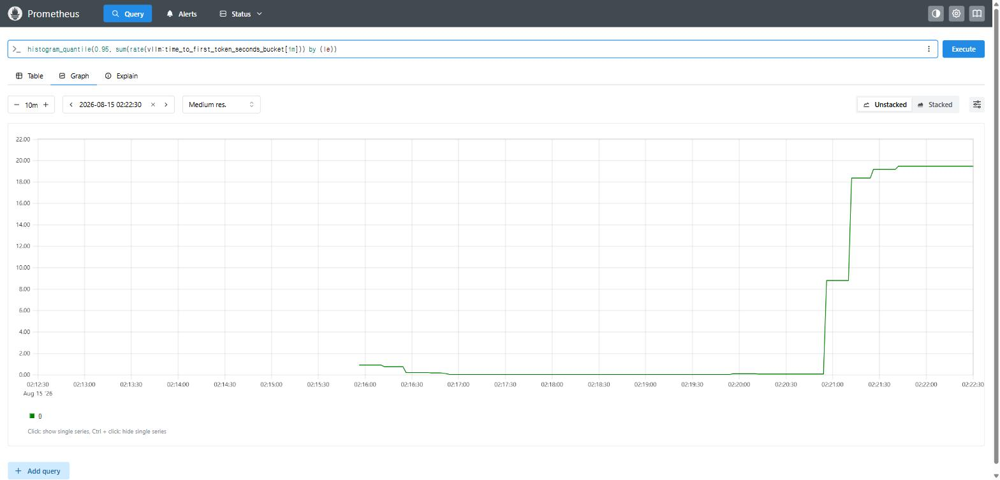
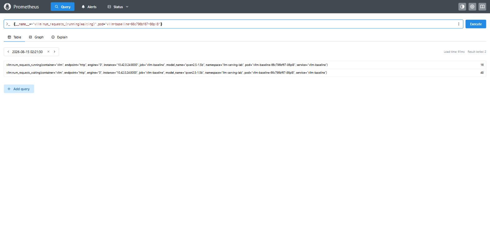

# Continuous Batching이 처리량을 높이는 방식

<aside>
🎯

**한 줄 요약**: GPU 한 장에서 실행한 vLLM의 배치 슬롯(`--max-num-seqs`)을 1 → 16 → 64로 바꾸자, 같은 하드웨어의 처리량이 **113 → 2,627 tok/s로 23배** 증가했다. 한 번의 forward pass에서 함께 처리하는 요청 수만 바꾼 결과다.

</aside>

## 목차

- [1. 문제 정의](#1-문제-정의)
- [2. 요청 처리 방식과 배칭](#2-요청-처리-방식과-배칭)
- [3. 실습 환경](#3-실습-환경)
- [4. 실험 방법](#4-실험-방법)
- [5. 결과](#5-결과)
  - [5-1. 슬롯 수에 따른 처리량 변화](#5-1-슬롯-수에-따른-처리량-변화)
  - [5-2. 처리 한도를 넘었을 때의 TTFT](#5-2-처리-한도를-넘었을-때의-ttft)
  - [5-3. 처리량과 goodput의 차이](#5-3-처리량과-goodput의-차이)
  - [5-4. 배칭이 ITL에 미치는 영향](#5-4-배칭이-itl에-미치는-영향)
  - [5-5. 처리량과 지연 시간의 파레토 경계](#5-5-처리량과-지연-시간의-파레토-경계)
  - [5-6. 지연 공식과 실측값 비교](#5-6-지연-공식과-실측값-비교)
  - [5-7. 출력 길이에 따른 차이](#5-7-출력-길이에-따른-차이)
  - [5-8. 서버 측 큐 관측](#5-8-서버-측-큐-관측)
  - [5-9. 측정 증거](#5-9-측정-증거)
- [6. 결과 해석](#6-결과-해석)
- [7. 운영 관점](#7-운영-관점)
- [8. 다음 실험](#8-다음-실험)
- [실험의 한계](#실험의-한계)
- [부록. 재현 절차](#부록-재현-절차)
- [참고 자료](#참고-자료)

---

## 1. 문제 정의

1주차에 Cloud Run의 GPU 한 장 위에 Gemma를 올리고 부하를 걸었을 때, 동시 요청이 늘어나자 **goodput이 절반 아래로 떨어지는 지점**이 나왔다. 그때는 "GPU가 포화했나 보다"로 넘겼다.

하지만 GPU 사용률은 그 전에 이미 100%에 가까웠는데도 처리량이 한동안 계속 증가했다. 이 결과에서 GPU 사용률 100%는 GPU가 작동 중이라는 의미이며, 처리량이 한도에 도달했다는 의미는 아니었다.

이번 주에는 다음 질문을 확인했다.

> **서빙 시스템은 요청 증가를 어떻게 처리해야 하는가?**
> 처리량은 어디서 멈추고, 그 순간 서버 안에서는 무슨 일이 일어나는가?

가설은 세 가지였다.

1. 처리량은 동시성이 `max-num-seqs`에 도달할 때까지 거의 선형으로 증가하고, 그 이후에는 더 늘지 않는다.
2. 슬롯을 넘어선 동시성은 전부 **대기 시간으로만 전환**된다 → TTFT 급증.
3. `max-num-seqs=1`은 사실상 배칭을 끈 상태다 → 처리량이 동시성과 무관하게 낮게 유지된다.

실험에서는 세 가설이 모두 관측됐다.

---

## 2. 요청 처리 방식과 배칭

LLM 추론은 토큰을 하나씩 만든다. 토큰 하나를 만들려면 모델 가중치 전체를 GPU 메모리에서 읽어와야 한다. 1.5B 모델이면 매 토큰마다 3GB 남짓을 읽는 셈이다. 이 읽기 비용은 **요청이 1개든 64개든 똑같다**. 가중치를 한 번 읽어온 김에 64개 요청의 다음 토큰을 한꺼번에 계산하면, 요청 하나당 비용은 1/64로 떨어진다.

배칭이 처리량을 높이는 원리는 여기에 있다. GPU를 더 빠르게 만드는 게 아니라, 이미 치른 메모리 읽기 비용을 여러 요청이 나눠 내게 하는 것이다. LLM 추론의 병목이 연산(compute-bound)에 있지 않고 메모리 대역폭(memory-bound)에 있기 때문에 성립한다.

이제 한 번에 처리할 요청 수를 정해야 한다. 배치를 구성하는 방식은 네 가지로 나뉜다.

| 방식 | 배치를 확정하는 시점 | 적합한 작업 |
|---|---|---|
| **배칭 없음** | 요청 하나씩 | 디버깅·초저지연 단일 요청 |
| **static** | 배치가 **찰 때까지** 기다림 | 오프라인 배치 작업 |
| **dynamic** | **시간 상한까지**만 기다림 | 요청당 연산량이 **균일한** 모델 (CV·임베딩) |
| **continuous** | 기다리지 않음. **슬롯 단위로 교체** | 출력 길이가 **제각각인** LLM |

앞의 세 방식은 배치에 포함된 요청을 한꺼번에 처리한다는 공통점이 있다. 이 경우 배치 종료 시점은 출력이 가장 긴 요청에 맞춰진다. 10토큰을 생성하는 요청이 500토큰을 생성하는 요청과 같은 배치에 들어가면, 먼저 끝난 요청의 슬롯도 나머지 490토큰을 처리하는 동안 교체되지 않는다.

continuous batching은 요청이 끝나는 즉시 해당 슬롯을 다음 요청에 할당한다. `--max-num-seqs`는 동시에 처리할 수 있는 요청 수를 정한다.

이 글에서는 이 슬롯 수만 바꿔 결과를 비교한다.

---

## 3. 실습 환경

`results/environment.md`에 측정 직전 그대로 기록한 값이다.

| 항목 | 값 |
|---|---|
| GPU | NVIDIA GeForce RTX 4080 **Laptop** GPU, 12,282 MiB |
| Driver | 581.57 |
| 전력 상한 (TGP) | `[N/A]` — **랩탑이라 드라이버가 보고하지 않는다** (아래 한계 참조) |
| OS / 커널 | WSL2, `6.18.33.1-microsoft-standard-WSL2` |
| Python | 3.14.4 |
| 서빙 엔진 | `vllm/vllm-openai:v0.23.0` (컨테이너 이미지 고정) |
| 모델 | `Qwen/Qwen2.5-1.5B-Instruct`, dtype auto |
| `max-model-len` | 4096 |
| `gpu-memory-utilization` | 0.85 |
| tensor parallel | 1 (GPU 1장) |
| 오케스트레이션 | k3s on WSL2, `strategy: Recreate` |
| 측정일 | 2026-08-15 |

**비교 변수는 `--max-num-seqs` 하나뿐**이며 나머지는 모두 고정했다. 슬롯 값을 바꿀 때마다 파드를 새로 띄우므로, 실제로 반영됐는지를 매번 파드 로그에서 확인했다.

```
non-default args: {..., 'max_model_len': 4096, 'gpu_memory_utilization': 0.85, 'max_num_seqs': 64}
```

---

## 4. 실험 방법

| 축 | 값 |
|---|---|
| **비교 변수** | `--max-num-seqs` = **1 / 16 / 64** |
| **부하 축** | 동시성 1, 2, 4, 8, 16, 32, 64 |
| 시나리오 | `short` (짧은 입력·출력 ~50토큰), `decode` (긴 출력) |
| 레벨당 요청 수 | `short` 100건, `decode` 30건, **큐 관측(5-8) 200건** |
| 서버 측 관측 | Prometheus — `vllm:num_requests_running` / `_waiting` / TTFT 히스토그램 |
| SLO | TTFT p95 ≤ **0.5s**, E2E ≤ 10s (`decode`는 30s) |

측정 도구는 직접 만든 `benchmark.py`다. 수치가 실제보다 좋아지는 일을 막을 장치를 넣었다.

- **`--unique-prefix`** — 모든 요청이 같은 프롬프트면 두 번째 요청부터 prefill이 prefix cache로 해결되어 TTFT가 실제보다 좋게 나온다. 배칭을 재는 실험에서는 이 효과를 제거해야 슬롯 효과만 남는다.
- **프롬프트 에코 보정** — 출력 토큰 수를 셀 때 입력이 섞여 들어가지 않게 한다.
- **goodput** — 단순 성공률 대신 **SLO를 지킨 요청의 비율**을 센다. 이 구분이 5-3의 핵심이다.

표는 수작업으로 옮기지 않았다. 결과 JSON에서 `summarize_results.py`가 직접 마크다운 표를 뽑는다.

> **측정 반복 횟수**: 스터디 공통 규칙은 최소 3회 반복 후 대표값이다. 이번 측정은 **각 지점 1회**다. 대신 레벨당 요청 수를 100건으로 키워 백분위를 안정시켰다. 3회 반복은 다음 편으로 미룬다.

---

## 5. 결과

### 5-1. 슬롯 수에 따른 처리량 변화

**처리량 (tok/s), `short` 시나리오**

| 동시성 | slots=1 | slots=16 | slots=64 |
|---|---|---|---|
| 1 | 111.0 | 108.8 | 112.1 |
| 2 | 113.5 | 213.9 | 215.3 |
| 4 | 113.4 | 413.7 | 420.9 |
| 8 | 112.8 | 780.2 | 769.0 |
| 16 | 113.1 | **1333.1** | 1354.3 |
| 32 | 113.0 | 1391.0 | 2053.0 |
| 64 | 112.6 | 1340.0 | **2626.7** |


> 그림에서 `slots=16`(주황)과 `slots=64`(초록)은 동시성 16까지 비슷한 처리량을 보인다. 동시성 16을 넘으면 `slots=16`의 처리량은 더 이상 증가하지 않는다.

- **`slots=1`에서는 처리량이 거의 일정하다.** 동시성을 1에서 64로 64배 높여도 처리량은 111 → 113 tok/s로 거의 달라지지 않았다. 배칭을 사용하지 않으면 동시 요청 수가 늘어도 한 번에 하나씩 처리한다. 가설 3과 일치한다.
- **`slots=16`에서는 동시성 16까지 처리량이 증가한다.** 1 → 16 구간은 거의 선형이다(108.8 → 1333.1, 12.3배). 동시성 16을 넘으면 처리량이 1391 → 1340 tok/s로 더 늘지 않는다. 가설 1과 일치한다.
- **`slots=64`에서는 동시성 64까지 처리량이 계속 증가한다.** 처리량 증가가 멈추는 동시성은 슬롯 수에 따라 달라진다.

GPU와 모델, 부하는 모두 동일하고 `--max-num-seqs` 값만 달랐다. 그 결과 처리량은 **113 tok/s에서 2,627 tok/s로 23배** 차이가 났다.

### 5-2. 처리 한도를 넘었을 때의 TTFT

**TTFT p95 (s)**

| 동시성 | slots=1 | slots=16 | slots=64 |
|---|---|---|---|
| 1 | 0.027 | 0.036 | 0.022 |
| 2 | 0.581 | 0.040 | 0.035 |
| 4 | 1.694 | 0.041 | 0.037 |
| 8 | 3.623 | 0.061 | 0.060 |
| 16 | 7.411 | 0.105 | 0.101 |
| 32 | 14.985 | **0.745** | 0.198 |
| 64 | 28.374 | **1.826** | 0.306 |


y축은 로그 눈금이고 x축도 1·2·4·8…의 배수 간격이므로 사실상 로그-로그 그림이다. 그 위에서 `slots=1`은 기울기 1의 직선으로 증가한다. 즉 **TTFT가 동시성에 비례**하며, 가설 2와 일치한다. 점선은 TTFT SLO 0.5초이고, `slots=16`은 동시성 32에서 이 기준을 넘는다.

`slots=1` 열에서 동시성을 2배씩 올릴 때마다 TTFT도 정확히 2배씩 오른다(0.58 → 1.69 → 3.62 → 7.41 → 14.99 → 28.37). 처리량은 증가하지 않고 대기 시간만 늘었다. 동시 요청이 64개이면 마지막 요청은 첫 토큰까지 28초를 기다린다. 늘어난 동시성이 **전부 대기 시간으로 전환**된 것으로, 가설 2와 일치한다.

`slots=16`에서도 동시성 16을 넘으면 같은 현상이 나타난다. c=16에서 0.105초였던 TTFT는 c=32에서 0.745초로 **7배** 증가한다. 5-1에서 처리량 증가가 멈춘 지점과 같다.

처리량 증가가 멈추고 TTFT가 급증하는 원인은 같다. 처리 중인 요청 수가 슬롯 수에 도달했기 때문이다.

### 5-3. 처리량과 goodput의 차이

**goodput (%)** — SLO(TTFT p95 ≤ 0.5s)를 지킨 요청의 비율

| 동시성 | slots=1 | slots=16 | slots=64 |
|---|---|---|---|
| 1 | 100.0 | 100.0 | 100.0 |
| 2 | **41.0** | 100.0 | 100.0 |
| 4 | 5.0 | 100.0 | 100.0 |
| 8 | 2.0 | 100.0 | 100.0 |
| 16 | 2.0 | 100.0 | 100.0 |
| 32 | 2.0 | **48.0** | 100.0 |
| 64 | 2.0 | **23.0** | 100.0 |

이 표에서 1주차에 남긴 의문이 풀린다.

전 구간에서 성공률은 100/100으로, 실패한 요청은 하나도 없다. 그러나 요청이 모두 200 OK로 돌아왔어도 **SLO 안에 완료된 비율은 23%뿐**이다.

1주차에 c=16에서 goodput이 50%로 떨어진 원인은 서버 오류가 아니었다. 처리할 수 있는 슬롯이 모두 사용 중이어서 나머지 요청이 큐에서 기다렸다. 성공률만 모니터링했다면 이 구간을 정상으로 판단했을 것이다.

`slots=16`의 c=32는 **처리량이 가장 높은 지점(1391 tok/s)**이지만 goodput은 48%다. 처리량만 기준으로 설정하면 사용자 절반이 SLO를 충족하지 못한다.

### 5-4. 배칭이 ITL에 미치는 영향

**ITL p50 (s)** — 첫 토큰 이후 토큰 하나당 평균 간격 (교재의 TPOT)

| 동시성 | slots=1 | slots=16 | slots=64 |
|---|---|---|---|
| 1 | 0.0088 | 0.0090 | 0.0088 |
| 2 | 0.0087 | 0.0090 | 0.0090 |
| 4 | 0.0087 | 0.0092 | 0.0091 |
| 8 | 0.0088 | 0.0094 | 0.0093 |
| 16 | 0.0088 | 0.0102 | 0.0102 |
| 32 | 0.0088 | 0.0103 | 0.0120 |
| 64 | 0.0088 | 0.0105 | **0.0156** |

같은 구간에서 TTFT는 14배 증가했지만(`slots=16`, c=16→64: 0.105 → 1.826), ITL은 0.0102 → 0.0105로 **3%** 증가하는 데 그쳤다. 처리량이 23배가 되는 `slots=64`의 c=64 지점에서도 ITL은 0.0088 → 0.0156으로 **1.8배** 증가했다.

이유는 2절에서 설명한 구조에 있다. 처리 슬롯을 할당받은 요청은 매 스텝마다 토큰을 받는다. 배치가 커져도 스텝 시간 자체는 크게 늘지 않는다(메모리 읽기가 병목이고 그 비용은 공유되므로). 반면 슬롯을 할당받지 못한 요청은 첫 토큰이 생성될 때까지 기다린다.

> 스트리밍 UI에서는 부하가 증가해도 토큰 생성 간격보다 첫 토큰을 받기까지의 대기 시간이 크게 늘어난다. ITL 0.0156s는 사용자당 초당 64토큰으로, 사람이 읽는 속도보다 여전히 빠르다. 따라서 부하 증가를 감지하려면 ITL보다 TTFT를 확인해야 한다.

### 5-5. 처리량과 지연 시간의 파레토 경계

앞의 네 표는 같은 데이터를 서로 다른 관점에서 보여준다. 처리량(x)과 TTFT p95(y)로 다시 접으면 교재 CH3의 *cost-optimized vs latency-optimized* 가 한 장에 나온다. (★ = 파레토 최적 경계)

| 구성 | 동시성 | 처리량 (tok/s) | TTFT p95 (s) | goodput (%) | SLO | 파레토 |
|---|---|---|---|---|---|---|
| slots=64 | 64 | **2626.7** | 0.306 | 100.0 | ✅ | ★ |
| slots=64 | 32 | 2053.0 | 0.198 | 100.0 | ✅ | ★ |
| slots=16 | 32 | 1391.0 | 0.745 | 48.0 | ❌ | |
| slots=64 | 16 | 1354.3 | 0.101 | 100.0 | ✅ | ★ |
| slots=16 | 64 | 1340.0 | 1.826 | 23.0 | ❌ | |
| slots=16 | 16 | 1333.1 | 0.105 | 100.0 | ✅ | |
| slots=16 | 8 | 780.2 | 0.061 | 100.0 | ✅ | ★ |
| slots=64 | 8 | 769.0 | 0.060 | 100.0 | ✅ | ★ |
| slots=64 | 4 | 420.9 | 0.037 | 100.0 | ✅ | ★ |
| slots=64 | 2 | 215.3 | 0.035 | 100.0 | ✅ | ★ |
| slots=64 | 1 | 112.1 | 0.022 | 100.0 | ✅ | ★ |
| slots=1 | 64 | 112.6 | 28.374 | 2.0 | ❌ | |

(전체 21행은 `results/`의 원본 참조. 여기서는 경계와 대비되는 행만 실었다.)

> **SLO를 지키면서 낼 수 있는 최대 처리량: 2,626.7 tok/s** (slots=64, 동시성 64, TTFT p95 0.306s)

- **파레토 경계는 모두 `slots=64`다.** 같은 동시성에서 `slots=16`은 처리량이 비슷하면서 TTFT가 더 크거나(c=32, 64) 동일하다. 이 워크로드에서는 `slots=16`을 선택할 이유가 없다.
- **최저 TTFT와 최고 처리량은 모두 `slots=64`에서 나왔다.** 동시성에 따라 최저 TTFT는 0.022s, 최고 처리량은 2626.7 tok/s였다. 이 결과에서는 슬롯 수보다 동시 요청 수를 늘릴 때 처리량과 지연 시간의 트레이드오프가 발생했다.

### 5-6. 지연 공식과 실측값 비교

교재 CH4에는 다음과 같은 지연 공식이 나온다.

```
E2E latency = TTFT + ITL × (N − 1)
```

그런데 교재는 실제 E2E에 **"요청 대기, 네트워크 지연, 라우팅 시간, 확장 오버헤드"** 가 더해진다고도 말한다. 즉 위 공식은 **모델 실행 시간만** 설명한다. 그러면 남는 차이가 곧 모델 밖에서 쓰인 시간이다.

```
잔차 = 측정된 E2E − (TTFT + ITL × (N−1))
```

**추가 측정 없이** 5-1의 측정 데이터만으로 계산된다.

| 구성 | 동시성 | N(토큰) | TTFT (s) | ITL (s) | 공식 예측 | 실측 E2E | 잔차 | 비율 |
|---|---|---|---|---|---|---|---|---|
| slots=1 | 1 | 50.1 | 0.024 | 0.0088 | 0.455 | 0.553 | +0.098 | 17.7% |
| slots=1 | 4 | 46.9 | 1.268 | 0.0087 | 1.669 | 1.653 | −0.016 | −1.0% |
| slots=1 | 64 | 48.7 | 21.989 | 0.0088 | 22.408 | 22.460 | +0.052 | 0.2% |
| slots=16 | 1 | 51.0 | 0.025 | 0.0090 | 0.473 | 0.565 | +0.092 | 16.2% |
| slots=16 | 16 | 45.5 | 0.046 | 0.0102 | 0.501 | 0.601 | +0.100 | 16.6% |
| slots=16 | 64 | 49.9 | 1.421 | 0.0105 | 1.934 | 1.861 | −0.073 | −3.9% |
| slots=64 | 16 | 48.2 | 0.047 | 0.0102 | 0.530 | 0.538 | +0.008 | 1.6% |
| slots=64 | 64 | 45.4 | 0.164 | 0.0156 | 0.859 | 0.907 | +0.047 | 5.2% |

결과는 예상과 달랐고, 그 차이에서 원인을 확인할 수 있었다.

실험 전 기대는 *"동시성이 오를수록 잔차가 커지고, 그게 큐 대기의 클라이언트 측 증거"* 였다. 그런데 잔차는 동시성과 무관하게 **+0.05~0.10초 근처**에 머문다. `slots=1`의 c=64는 28초를 기다렸는데도 잔차는 +0.052초다.

큐 대기 시간이 이미 TTFT에 포함되어 있기 때문이다. 클라이언트가 측정하는 TTFT는 요청을 보낸 시점부터 첫 토큰을 받을 때까지의 시간이며, 큐에서 대기한 시간도 여기에 들어간다. 따라서 잔차에는 큐 대기가 남지 않는다.

이 잔차는 **고정 오버헤드**로 보인다. HTTP 왕복, `kubectl port-forward` 경유, 토큰화가 여기에 해당한다. 동시성과 무관하게 절대값이 일정한 점이 근거다.

**부호가 음수로 뒤집히는 구간**(`slots=1` c≥2, `slots=16` c=32·64)은 공식의 한계를 보여준다. 이 구간은 요청들이 큐에서 오래 기다렸다가 한꺼번에 배치에 올라타므로 토큰 간격 분포가 한쪽으로 치우친다. p50 ITL을 곱한 값이 실제 총합보다 커진다. 이 공식을 적용할 때는 p50이 아니라 평균 ITL을 사용해야 한다.

> 교재 CH4의 모범 사례 3번 *"E2E를 TTFT/ITL로 분해하라"* 를 적용하자, 공식과 실측값이 일치하는 구간과 그렇지 않은 구간이 나뉘었다. 차이가 발생한 구간에는 대기 중인 요청이 있었다.

### 5-7. 출력 길이에 따른 차이

여기까지는 모두 `short` 시나리오(입력·출력 ~50토큰)다. 출력이 긴 `decode` 시나리오로 같은 스윕을 돌리면 대비가 훨씬 커진다.

**처리량 (tok/s) · TTFT p95 (s) · goodput (%), `decode` 시나리오**

| 동시성 | slots=1 | slots=16 | slots=64 |
|---|---|---|---|
| **처리량** | | | |
| 1 | 114.7 | 115.3 | 115.8 |
| 8 | 115.2 | 822.3 | 820.9 |
| 32 | 115.1 | 1643.9 | **2851.9** |
| **TTFT p95** | | | |
| 1 | 0.034 | 0.031 | 0.023 |
| 8 | **31.159** | 0.072 | 0.075 |
| 32 | **130.660** | 5.044 | **0.191** |
| **goodput** | | | |
| 8 | 3.3 | 100.0 | 100.0 |
| 32 | 3.1 | 50.0 | **100.0** |

`slots=1`, 동시성 32의 TTFT p95는 130.7초다. 32명이 동시에 요청하면 마지막 사람은 첫 글자를 보는 데 2분 이상 기다린다. 같은 지점에서 `slots=64`는 0.191초다. TTFT는 **684배**, 처리량은 115 → 2,852 tok/s로 **24.8배** 차이가 난다.

`short`에서 28초였던 값이 `decode`에서 131초가 된 이유는 출력이 길수록 한 요청이 슬롯을 오래 사용하기 때문이다. 슬롯이 1개뿐이면 나머지 31개 요청은 앞선 요청의 500토큰 생성이 끝날 때까지 기다린다. 이 결과는 출력이 긴 요청과 짧은 요청을 한 배치로 처리할 때 생기는 지연을 보여주며, continuous batching이 완료된 요청의 슬롯을 즉시 교체하는 이유도 설명한다.

ITL의 변화 폭은 여기서도 작다. `slots=64` c=32에서 0.0111s로, `slots=1`의 0.0088s 대비 26% 증가했다.

### 5-8. 서버 측 큐 관측

앞의 값은 모두 클라이언트 측 측정치다. 서버 안에서 실제로 무슨 일이 일어났는지는 vLLM이 노출하는 메트릭으로 확인한다.

슬롯을 16으로 고정하고 동시성 4 → 16 → 64에서 각각 200개 요청을 6분간 보낸 뒤(`02:15:47 ~ 02:21:49 UTC`), 같은 구간의 Prometheus 지표를 조회했다.

**클라이언트 측 (`benchmark.py`)**

| 동시성 | 처리량 (tok/s) | TTFT p95 (s) | goodput (%) |
|---|---|---|---|
| 4 | 447.6 | 0.041 | 100.0 |
| 16 | 1598.3 | 0.107 | 100.0 |
| 64 | **1602.8** | **14.840** | **8.0** |

동시성을 16 → 64로 4배 높였지만 처리량은 1598.3 → 1602.8 tok/s로 0.3% 증가하는 데 그쳤다. 반면 TTFT는 **139배**로 늘고 goodput은 100% → 8%로 감소했다. 5-1과 5-2에서 따로 확인한 현상이 한 실험에서도 함께 나타났다.

**서버 측 (Prometheus, 10초 간격 궤적)**


```
vllm:num_requests_running   0 4 4 4 ... 4 3 16 16 16 15 15 16 16 16 16 16 16 16
vllm:num_requests_waiting   0 0 0 0 ... 0 0  0  0  0  0  0  0 48 48 48 48 48  8
                              └ c=4 ┘      └──── c=16 ────┘ └───── c=64 ─────┘
```

- **`running`은 최대 16까지 증가한다.** `max-num-seqs=16`이 배치에서 동시에 처리할 수 있는 요청 수임을 지표로 확인했다. 요청을 더 보내도 `running`은 17이 되지 않는다.
- **c=16 구간에서 `waiting`은 계속 0이다.** 16개 슬롯이 모두 사용 중이지만 대기 중인 요청은 없다. 이 지점이 이 구성의 포화점이다.
- **c=64가 되면 `waiting`이 0 → 48로 증가한다.** 64 − 16 = 48이다. 초과한 48개 요청이 모두 큐에서 대기했다. 서버 측 지표도 가설 2와 일치한다.

같은 시점의 서버 측 TTFT p95는 **18.809초**로, 클라이언트가 측정한 14.840초와 비슷한 수준이다. 서버 측 값이 더 큰 이유는 2분 집계 구간에 지연 시간이 긴 요청이 더 많이 포함됐기 때문이다. 두 측정 모두 큐가 생긴 시점에 TTFT가 증가했음을 보여준다.

> 5-6의 결과와 함께 읽어야 한다. 5-6에서 잔차에 큐 대기가 나타나지 않은 이유가 여기서 확인된다. 48개 요청이 큐에서 대기한 시간은 이미 TTFT 14.8초에 포함되어 있었다. 큐 대기는 잔차가 아니라 TTFT로 측정된다.

### 5-9. 측정 증거

앞의 그래프는 **측정 데이터로 직접 그린 것**이므로 데이터의 내용은 보여주지만 실제 실행 여부는 증명하지 못한다. 실행 여부는 서빙 시스템이 남긴 화면으로 확인해야 한다. 아래는 Prometheus 콘솔을 그대로 캡처한 것이다.

**① `running`은 최대 16이며, 초과 요청은 `waiting`으로 집계된다**



동시성 4 구간에서는 `running`=4, 동시성 16 구간에서는 `running`=16이며 그 이상 증가하지 않는다. 동시성 64가 되는 02:21 직전에 `waiting`은 0에서 48로 증가한다. 5-8의 시계열 데이터와 일치한다.

**② 대기 요청이 생기면 서버 측 TTFT도 증가한다**



```promql
histogram_quantile(0.95, sum(rate(vllm:time_to_first_token_seconds_bucket[1m])) by (le))
```

동시성 4·16 구간에서는 0에 가깝게 유지되다가, ①에서 `waiting`이 증가한 시점에 서버 측 TTFT p95도 약 19초까지 증가한다. 클라이언트가 측정한 14.8초와 같은 구간이다.

**③ 그 순간의 정확한 값**



`02:21:30` 시점의 값은 `running = 16`, `waiting = 48`이다. 합은 64로, 당시 보낸 동시 요청 수와 일치한다. 라벨에는 `model_name="qwen2.5-1.5b"`, `namespace="llm-serving-lab"`도 함께 기록되어 있다.

이 글의 모든 수치는 아래 원본에서 나왔고, 표와 그래프는 **손으로 옮기지 않고 스크립트가 생성**했다.

| 파일 | 무엇 |
|---|---|
| `results/b1-slots-{1,16,64}-short.json` | 5-1~5-6의 원본. 각 파일에 동시성 7개 레벨 × 100요청의 요청 단위 기록 |
| `results/b1-slots-{1,16,64}-decode.json` | 5-7의 원본 |
| `results/b2-queue.json` | 5-8 클라이언트 측 (동시성 3개 레벨 × 200요청) |
| `results/b2-prometheus.json` · `.txt` | **5-8 서버 측 원본** — `running`/`waiting` 37포인트, Prometheus `query_range` 응답 그대로 |
| `screenshots/proof-0{1,2,3}-*.jpg` | 위 ①~③ Prometheus 콘솔 캡처 |
| `results/b1-timeline.txt` | 각 구간의 시작·종료 시각(UTC). 서버 측 지표를 사후에 조회할 때 사용 |
| `results/environment.md` | 0-6 환경 기록 (GPU·드라이버·커널·이미지 태그·서빙 파라미터) |
| `results/metrics-v0.23.0.txt` | 이 vLLM 버전이 노출하는 메트릭 **96개 전체 목록** |

표는 `summarize_results.py`가, 그래프는 `tools/make_figures.py`가 위 JSON에서 직접 만든다. 둘 다 외부 의존성이 없다.

> 캡처와 원본 데이터는 서로 다른 일을 한다. 위 캡처 ①~③은 *서빙 시스템이 실제로 그렇게 동작했다*를 보이고, 결과 JSON은 *그 수치를 다시 계산·재현할 수 있다*를 보인다. 둘 중 하나만으로는 부족하다. 캡처만으로는 수치를 검증할 수 없고, JSON만으로는 그 값이 실제 실행에서 나온 것인지 확인할 수 없다.
>
> 캡처는 **부하가 끝난 여섯 시간 뒤에** 만들었다. `b1-timeline.txt`에 구간 시각을 기록해 둔 덕분에 측정이 끝난 뒤에도 같은 구간의 지표를 조회할 수 있었다.

---

## 6. 결과 해석

**① `--max-num-seqs`는 서버가 동시에 처리할 요청 수를 정한다.**
슬롯 수는 처리량이 더 이상 증가하지 않는 동시성을 직접 결정한다(5-1). 처리 중인 요청 수가 슬롯 수에 도달하면 초과 요청은 모두 대기한다(5-2). 5-8의 `running` 지표는 최대 16을 유지하고, 나머지 48개 요청은 `waiting`으로 집계됐다. 따라서 이 값은 서버가 동시에 처리할 요청 수를 기준으로 설정해야 한다.

**② 처리량만으로 설정하면 SLO를 충족하지 못할 수 있다.**
`slots=16`의 최고 처리량 지점(c=32, 1391 tok/s)에서 goodput은 48%다(5-3). 5-8에서는 차이가 더 크다. 부하를 4배 높였을 때 처리량은 **+0.3%** 증가에 그쳤고 goodput은 100% → 8%로 감소했다. 성공률은 전 구간에서 100%이므로 성공률 기반 알람은 동작하지 않는다. 처리량·성공률·goodput을 함께 확인해야 이 구간을 식별할 수 있다.

**③ 부하 증가는 ITL보다 TTFT에 더 큰 영향을 준다.**
같은 구간에서 TTFT는 14배 증가했지만 ITL은 3% 늘었다(5-4). continuous batching은 완료된 요청의 슬롯을 다음 요청에 할당한다. 이미 처리 중인 16개 요청은 계속 토큰을 생성하지만, `waiting` 상태인 48개 요청은 슬롯을 할당받을 때까지 첫 토큰을 받지 못한다.

**④ 출력이 길수록 슬롯이 중요해진다.**
`short`에서 `slots=1`의 가장 긴 TTFT는 28초였지만 `decode`에서는 131초였다(5-7). 한 요청이 슬롯을 사용하는 시간이 길어질수록 뒤의 요청도 오래 기다리기 때문이다. 출력 길이가 서로 다른 LLM 요청에는 완료된 요청을 즉시 교체하는 방식이 필요하다.

세 번째 결과는 다음 실험의 주제로 이어진다. 앞의 세 배칭 방식(없음/static/dynamic)은 배치 전체의 처리가 끝날 때까지 요청을 교체하지 않는다. 따라서 짧은 요청도 긴 요청이 끝날 때까지 기다려야 하며 ITL도 함께 증가한다. dynamic batching이 전제하는 *"요청들이 같은 시간 걸린다"*는 mobilenet 같은 CV 모델에서는 성립하지만 **LLM에서는 성립하지 않는다**. continuous batching은 완료된 요청을 개별적으로 교체해 이 문제를 줄인다.

이번 편은 그 넷 중 양 끝(`slots=1` = 사실상 배칭 없음, `slots=64` = continuous)만 실측했다. 가운데 둘은 다음 편이다.

---

## 7. 운영 관점

| 관점 | 이 측정에서 나온 것 |
|---|---|
| **비용** | RTX 4080 Laptop 1장의 실질 수용량은 **SLO(TTFT p95 ≤ 0.5s) 하에서 2,627 tok/s**다. 사용자 한 명이 초당 20토큰을 읽는다고 보면 **동시 사용자 약 130명 / GPU 1장**. 슬롯을 1로 두면 같은 GPU가 **5명**을 받는다. 같은 처리량을 얻는 데 하드웨어를 늘리는 대신 슬롯 값을 조정하는 방법이 있다. |
| **안정성** | 5-3·5-8 구간에서 HTTP 오류율·성공률·재시도 수는 모두 정상이고(200/200 성공) 지연 시간만 증가했다. **성공률만 확인하는 알람으로는 이 상태를 감지할 수 없다.** goodput 또는 TTFT p95를 함께 확인해야 한다. 서버 측에서는 **`vllm:num_requests_waiting > 0`이 가장 빠른 신호**다. 5-8에서 이 값이 0에서 48로 증가한 시점부터 TTFT도 크게 늘었다. |
| **확장성** | 슬롯 수에는 상한이 있다. vLLM이 기동할 때 출력하는 `Maximum concurrency for 4,096 tokens per request`는 **KV cache가 허용하는 실제 동시 요청 수**다. `slots=64`로 실행했을 때 이 값은 **59.50x**로, 설정한 64보다 작았다. 이 구성에서는 슬롯 값을 더 높여도 KV cache 용량 때문에 동시 처리 요청 수가 59.50x로 제한된다. GPU를 늘리기 전에 이 값을 확인해야 한다. |
| **복잡도** | 설정 비용은 환경 변수 하나로 크지 않다. 다만 동작을 예측하기 어려운 부분이 남는다. 같은 `slots=64`인데 KV cache 최대 동시성이 롤아웃에 따라 59.50x와 28.77x로 다르게 나왔다(아래 한계 3). **기본값으로 동작한다고 해서 동작 원리를 파악한 것은 아니다.** |

**health check · timeout · retry** 도 이 실습에서 실제로 부딪혔다.

- `startupProbe`를 **최대 20분**까지 허용해야 했다. 모델 로딩(가중치 다운로드 + CUDA 그래프 캡처)이 그만큼 걸린다. 기본값으로 두면 파드가 준비되기 전에 종료되어 재시작이 반복된다.
- 재배포 스크립트가 `/v1/models`를 폴링해 실제 응답을 확인하도록 만들었다. `rollout status`가 성공을 반환한 뒤에도 엔드포인트가 아직 응답하지 않는 구간이 있기 때문이다. 고정된 `sleep 5`만 사용하면 서버가 준비되기 전에 측정을 시작해 잘못된 데이터가 생성될 수 있다.
- 롤아웃 실패는 non-zero 종료 코드로 처리해야 했다. 응답하지 않는 엔드포인트에 벤치마크를 실행하면 오류 대신 **의미 없는 측정값**이 기록된다.

---

## 8. 다음 실험

- **B3 — 슬롯 수의 상한을 결정하는 요소.** 7절에서 관측한 `59.50x`를 확인한다. `max-model-len`과 `gpu-memory-utilization`을 바꿔 KV cache가 실제 상한인지 검증한다.
- **B4 — 큐 대기 시간의 분포.** 5-8에서 큐의 *길이*(`num_requests_waiting` = 48)는 확인했지만 *대기 시간의 분포*는 측정하지 않았다. `vllm:request_queue_time_seconds_bucket`으로 백분위를 계산하면 대기한 48개 요청 각각의 대기 시간을 확인할 수 있다. 측정 구간 시각은 `results/b1-timeline.txt`에 기록해 두었다.
- **B5 — prefix cache.** 이번 측정은 `--unique-prefix`로 prefix cache 효과를 **제거한** 상태였다. 다음에는 이를 적용한 경우와 비교한다.
- **네 가지 배칭 방식 비교** — 교재 CH3의 자작 서버로 static/continuous를 직접 구현해 비교하고(C1), Triton `dynamic_batching`으로 dynamic을 측정한 뒤(C2), Ray Serve 계층을 추가했을 때의 오버헤드를 측정한다(C3). 6절의 결론을 프레임워크 밖에서도 확인하는 것이 목적이다.

> **다음 편 예고 — 교재 코드에서 발견한 것.** 교재 CH3의 자작 서버(`ch03/single_model_llm_serving`)는 `main.py`의 `async def` 핸들러 안에서 동기 호출을 한다. uvicorn 이벤트 루프가 그 사이 막히므로 **동시 요청이 사실상 순차 처리**된다. 이 서버로 "동시성을 올려도 처리량이 안 오른다"를 관측하면, 원인은 배칭이 아니라 이벤트 루프다. 이번 편의 `slots=1` 열과 증상은 같지만 원인이 다르다. 다음 편에서 `async def`를 `def`로 바꾼 전후를 비교해 둘을 분리한다.

---

## 실험의 한계

1. **각 지점 1회 측정이다.** 스터디 규칙은 3회 반복 후 대표값이다. 레벨당 100요청으로 백분위를 안정시킨 것으로 대신했고, 반복은 다음 편으로 미룬다. 따라서 표의 작은 차이(예: `slots=16` 1333.1 vs `slots=64` 1354.3)는 노이즈일 수 있다. 이 글의 결론은 배 단위로 차이가 나는 항목에만 근거한다.
2. **전력 상한(TGP)을 못 잡았다.** 랩탑 GPU라 `nvidia-smi`가 `power.limit`을 `[N/A]`로 보고한다. 랩탑은 TGP가 성능을 먼저 제한하는 경우가 많으므로, 절대값은 이 기기 고유값으로 봐야 한다. 비교는 열 간 상대값으로만 유효하다.
3. **KV cache 크기가 롤아웃마다 달라졌다.** vLLM이 기동할 때 출력하는 `Maximum concurrency` 값을 이번 실습의 10번 롤아웃에서 모으면 다음과 같다.

   | 슬롯 | 관측값 |
   |---|---|
   | slots=1 | 61.00x, 61.00x |
   | slots=16 | **32.61x**, 60.37x, 60.37x, 60.37x |
   | slots=64 | 59.50x, 59.50x, **28.77x** |

   **슬롯 수와는 무관하다**(같은 슬롯인데 값이 2배 차이 난다). 굵게 표시한 두 이상치에는 공통점이 있다. 둘 다 직전에 다른 파드가 GPU를 쓰고 있던 롤아웃이다(32.61x는 7B 모델 파드 직후, 28.77x는 중단된 실행의 파드 직후). `strategy: Recreate`가 이전 파드를 먼저 내리지만 VRAM 반환이 그보다 늦어 새 파드가 남은 메모리로 KV cache를 잡은 것으로 보인다. 다만 그 시점의 VRAM을 `nvidia-smi`로 측정하지는 **않았다**. 인과 관계는 정황에 근거한 추정이다.

   KV cache 용량은 배포할 때마다 달라질 수 있으므로 롤아웃 직후 이 로그를 확인해야 한다. 이 값이 절반으로 줄면 동시에 처리할 수 있는 요청 수도 줄어든다. B3에서는 `nvidia-smi`를 함께 측정해 원인을 확인한다.
4. **트래픽 지터가 없다.** 모든 요청이 동시에 출발하는 wave 패턴이라 실제 트래픽과 다르다. 교재 모범 사례 4번을 부분적으로만 충족한다.
5. **단일 GPU·단일 레플리카다.** 라우팅·오토스케일·멀티 노드는 전부 범위 밖이다.
6. **모델이 1.5B다.** 메모리 대역폭 병목의 크기가 모델 크기에 따라 달라지므로, 7B 이상에서 슬롯 효과의 크기는 다를 수 있다.

---

## 부록. 재현 절차

```bash
# 0. 배포 (슬롯은 env로 빠져 있다)
kubectl apply -f labs/wsl2-vllm-baseline/k8s/vllm-baseline.yaml

# 1. 슬롯을 바꿔가며 스윕
cd labs/wsl2-vllm-baseline
source redeploy.sh

for SLOTS in 1 16 64; do
  redeploy MAX_NUM_SEQS=$SLOTS || continue   # 기동 실패는 건너뛴다
  confirm_slots                              # 실제 반영 확인
  python3 benchmark.py --scenarios short \
    --concurrency 1,2,4,8,16,32,64 --requests-per-level 100 \
    --unique-prefix --ttft-slo 0.5 --e2e-slo 10 \
    --output results/b1-slots-$SLOTS-short.json

  # 긴 출력(5-7)은 포인트를 줄여 따로 한 번 더
  python3 benchmark.py --scenarios decode \
    --concurrency 1,8,32 --requests-per-level 30 \
    --unique-prefix --ttft-slo 0.5 --e2e-slo 30 \
    --output results/b1-slots-$SLOTS-decode.json
done

# 2. 표는 손으로 만들지 않는다
python3 summarize_results.py results/b1-slots-*-short.json \
  --label-regex 'slots-(\d+)' --label-format 'slots={}' --all
python3 summarize_results.py results/b1-slots-*-short.json \
  --label-regex 'slots-(\d+)' --label-format 'slots={}' --pareto --ttft-slo 0.5
python3 summarize_results.py results/b1-slots-*-short.json \
  --label-regex 'slots-(\d+)' --label-format 'slots={}' --formula

# 3. 5-8 — 큐가 보이는 구간. 슬롯을 16으로 두고 길게 건다
redeploy MAX_NUM_SEQS=16
python3 benchmark.py --scenarios decode \
  --concurrency 4,16,64 --requests-per-level 200 \
  --unique-prefix --ttft-slo 0.5 --e2e-slo 30 \
  --output results/b2-queue.json
```

같은 구간을 서버 측 지표로 다시 확인한다. `results/b1-timeline.txt`에 시각이 남아 있으므로 부하가 끝난 뒤에 조회해도 된다.

```bash
kubectl -n monitoring port-forward svc/kube-prometheus-stack-prometheus 30001:9090 &

# 시각은 b1-timeline.txt의 "B2 시작/종료" 줄에서 가져온다
curl -sG http://localhost:30001/api/v1/query_range \
  --data-urlencode 'query=vllm:num_requests_waiting' \
  --data-urlencode 'start=2026-08-15T02:15:47Z' \
  --data-urlencode 'end=2026-08-15T02:21:49Z' \
  --data-urlencode 'step=10s'
```

Grafana(`localhost:30002`)에 아래 셋을 한 패널에 겹쳐도 같은 그림이 나온다.

```promql
vllm:num_requests_running                                                  # 슬롯 수에서 더 증가하지 않음
vllm:num_requests_waiting                                                  # 처리 한도를 넘으면 증가
histogram_quantile(0.95, sum(rate(vllm:time_to_first_token_seconds_bucket[1m])) by (le))
```

```bash
# 4. 그래프 — 위 JSON에서 SVG를 직접 만든다 (외부 의존성 없음)
python3 tools/make_figures.py        # → articles/figures/*.svg
```

**재현 과정에서 마주치기 쉬운 함정**(실제로 모두 겪었다):

| 증상 | 원인 | 대응 |
|---|---|---|
| 모든 슬롯 열의 숫자가 똑같다 | 클러스터의 배포가 구버전이라 args가 env를 참조하지 않음 | 측정 전에 `kubectl apply`를 먼저. `confirm_slots`로 파드 로그에서 실제 값 확인 |
| `source redeploy.sh` 후 `redeploy: command not found` | Windows 체크아웃이라 `.sh`가 CRLF. bash가 `redeploy() {\r`를 파싱하지 못하지만 **`source`는 오류를 반환하지 않는다** | `.gitattributes`에 `*.sh text eol=lf`. `type redeploy`로 확인 |
| 메트릭 목록에 `vllm:e` 같은 토막 이름 | 추출 정규식 `^vllm:[a-z_]+`가 **숫자에서 잘림** (`vllm:e2e_...` → `vllm:e`) | `^vllm:[a-z0-9_]+` |

측정 원본은 `labs/wsl2-vllm-baseline/results/`에 있다: `b1-slots-{1,16,64}-short.json`, `b1-timeline.txt`(구간 시각), `environment.md`, `metrics-v0.23.0.txt`(v0.23.0 메트릭 96개 전체 목록).

---

## 참고 자료

- 교재 CH3(서빙 아키텍처와 배칭), CH4(성능 측정과 지연 공식) — 공식 코드 `orca3/llm-model-inference`
- [vLLM — Continuous batching / paged attention](https://docs.vllm.ai/)
- [Qwen2.5-1.5B-Instruct 모델 카드](https://huggingface.co/Qwen/Qwen2.5-1.5B-Instruct)
- 1주차 실습: `Run inference of Gemma 4 model on Cloud Run.md` — 이 글의 문제 정의가 나온 곳
- 환경 구축: `WSL2를 로컬 GPU Kubernetes 개발 환경으로 사용하기.md`
