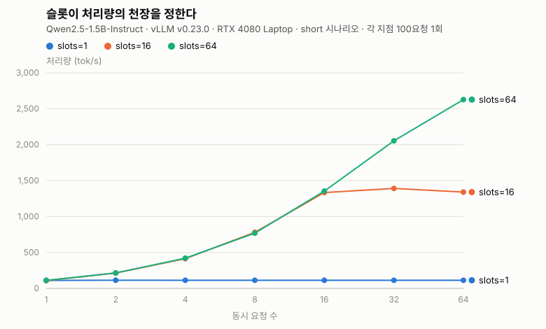
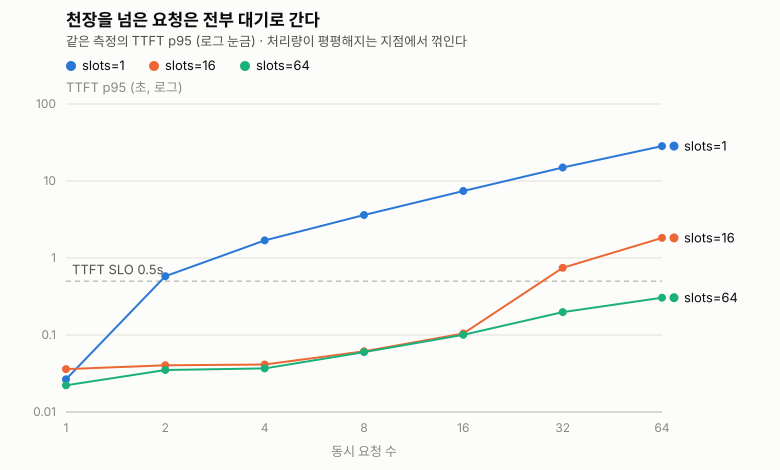
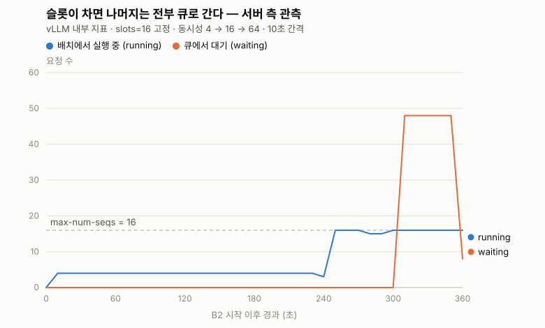

# Continuous Batching이 처리량을 높이는 방식

<aside>
🎯

**한 줄 요약**: GPU 한 장 위의 vLLM에서 배치 슬롯(`--max-num-seqs`)만 1 → 16 → 64로 바꿔가며 재보니, 같은 하드웨어에서 처리량이 **113 → 2,627 tok/s로 23배** 벌어졌다. 늘어난 것은 GPU가 아니라 **한 번의 forward pass에 몇 개의 요청을 태우는가**뿐이다.

</aside>

## 목차

- [1. 문제 정의 — 1주차에 남긴 숙제](#1-문제-정의--1주차에-남긴-숙제)
- [2. 핵심 개념 — 요청이 서버 안에서 겪는 일](#2-핵심-개념--요청이-서버-안에서-겪는-일)
- [3. 실습 환경](#3-실습-환경)
- [4. 실험 방법](#4-실험-방법)
- [5. 결과](#5-결과)
  - [5-1. 처리량 — 슬롯이 천장을 정한다](#5-1-처리량--슬롯이-천장을-정한다)
  - [5-2. TTFT — 천장을 넘은 요청은 전부 대기로 간다](#5-2-ttft--천장을-넘은-요청은-전부-대기로-간다)
  - [5-3. goodput — 처리량이 평평해도 사용자 경험은 무너진다](#5-3-goodput--처리량이-평평해도-사용자-경험은-무너진다)
  - [5-4. ITL — 배칭이 건드리지 않는 것](#5-4-itl--배칭이-건드리지-않는-것)
  - [5-5. 파레토 — 지연으로 처리량을 사는 가격표](#5-5-파레토--지연으로-처리량을-사는-가격표)
  - [5-6. 지연 공식 검증 — 남는 시간은 어디에 있었나](#5-6-지연-공식-검증--남는-시간은-어디에-있었나)
  - [5-7. 긴 출력에서는 훨씬 극단적이다](#5-7-긴-출력에서는-훨씬-극단적이다)
  - [5-8. 서버 안에서 본 큐 ★](#5-8-서버-안에서-본-큐-)
  - [5-9. 측정 증거](#5-9-측정-증거)
- [6. 해석](#6-해석)
- [7. 운영 관점](#7-운영-관점)
- [8. 다음 실험](#8-다음-실험)
- [한계 — 이 글이 증명하지 않은 것](#한계--이-글이-증명하지-않은-것)
- [부록. 재현 절차](#부록-재현-절차)
- [참고 자료](#참고-자료)

---

## 1. 문제 정의 — 1주차에 남긴 숙제

1주차에 Cloud Run의 GPU 한 장 위에 Gemma를 올리고 부하를 걸었을 때, 동시 요청이 늘어나자 **goodput이 절반 아래로 떨어지는 지점**이 나왔다. 그때는 "GPU가 포화했나 보다"로 넘겼다.

그런데 그 설명은 이상하다. GPU 사용률은 그 전에 이미 100%에 가까웠는데, 처리량은 한동안 계속 올라갔기 때문이다. **사용률이 100%인데도 처리량이 더 오른다면, 100%라는 숫자가 재고 있는 것이 "일하고 있음"이지 "꽉 찼음"이 아니라는 뜻**이다.

그래서 이번 주의 질문은 이것이다.

> **서빙 시스템은 요청 증가를 어떻게 처리해야 하는가?**
> 처리량은 어디서 멈추고, 그 순간 서버 안에서는 무슨 일이 일어나는가?

가설은 세 가지였다.

1. 처리량은 동시성이 `max-num-seqs`에 도달할 때까지 거의 선형으로 오르고, **그 이후로는 평평해진다.**
2. 슬롯을 넘어선 동시성은 전부 **대기 시간으로만 전환**된다 → TTFT 급증.
3. `max-num-seqs=1`은 사실상 배칭을 끈 상태다 → 처리량이 동시성과 무관하게 낮게 유지된다.

**결론부터 쓰면 세 가설 모두 그대로 관측됐다.** 아래는 그 숫자다.

---

## 2. 핵심 개념 — 요청이 서버 안에서 겪는 일

용어를 나열하는 대신, 요청 하나가 서버에 들어와서 나갈 때까지를 따라가 보자.

LLM 추론은 **토큰을 하나씩** 만든다. 토큰 하나를 만들려면 모델 가중치 전체를 GPU 메모리에서 읽어와야 한다. 1.5B 모델이면 매 토큰마다 3GB 남짓을 읽는 셈이다. **이 읽기 비용은 요청이 1개든 64개든 똑같다.** 가중치를 한 번 읽어온 김에 64개 요청의 다음 토큰을 한꺼번에 계산하면, 요청 하나당 비용은 1/64로 떨어진다.

이것이 배칭이 처리량을 높이는 전부다. **GPU를 더 빠르게 만드는 게 아니라, 이미 치른 메모리 읽기 비용을 여러 요청이 나눠 내게 하는 것**이다. LLM 추론이 연산 병목(compute-bound)이 아니라 메모리 대역폭 병목(memory-bound)이기 때문에 성립한다.

그러면 "몇 개를 태울 것인가"를 정하는 방식이 문제가 된다. 네 가지가 있다.

| 방식 | 배치를 언제 닫는가 | 잘 맞는 곳 |
|---|---|---|
| **배칭 없음** | 요청 하나씩 | 디버깅·초저지연 단일 요청 |
| **static** | 배치가 **찰 때까지** 기다림 | 오프라인 배치 작업 |
| **dynamic** | **시간 상한까지**만 기다림 | 요청당 연산량이 **균일한** 모델 (CV·임베딩) |
| **continuous** | 기다리지 않음. **슬롯 단위로 교체** | 출력 길이가 **제각각인** LLM |

앞의 셋은 "배치를 통째로 묶었다가 통째로 내보낸다"를 공유한다. 그래서 **배치 전체가 가장 긴 요청에 인질로 잡힌다.** 10 토큰짜리 요청이 500 토큰짜리와 같은 배치에 묶이면, 앞의 요청은 다 끝나고도 490 토큰 동안 자리를 지키고 앉아 있어야 한다.

continuous batching은 이 전제를 버린다. 배치를 고정된 묶음이 아니라 **슬롯 N개짜리 좌석표**로 보고, 한 요청이 끝나면 그 자리에 바로 다음 요청을 앉힌다. `--max-num-seqs`가 바로 **그 좌석 수**다.

이 글이 재는 것은 그 좌석 수 하나다.

---

## 3. 실습 환경

`results/environment.md`에 측정 직전 그대로 기록한 값이다.

| 항목 | 값 |
|---|---|
| GPU | NVIDIA GeForce RTX 4080 **Laptop** GPU, 12,282 MiB |
| Driver | 581.57 |
| 전력 상한 (TGP) | `[N/A]` — **랩탑이라 드라이버가 보고하지 않는다** (아래 한계 참조) |
| OS / 커널 | WSL2, `6.18.33.1-microsoft-standard-WSL2` |
| Python | 3.14.4 |
| 서빙 엔진 | `vllm/vllm-openai:v0.23.0` (컨테이너 이미지 고정) |
| 모델 | `Qwen/Qwen2.5-1.5B-Instruct`, dtype auto |
| `max-model-len` | 4096 |
| `gpu-memory-utilization` | 0.85 |
| tensor parallel | 1 (GPU 1장) |
| 오케스트레이션 | k3s on WSL2, `strategy: Recreate` |
| 측정일 | 2026-08-15 |

**비교 변수는 `--max-num-seqs` 하나뿐**이고, 나머지는 전부 고정했다. 슬롯 값을 바꿀 때마다 파드를 새로 띄우므로, 실제로 반영됐는지를 매번 파드 로그에서 확인했다.

```
non-default args: {..., 'max_model_len': 4096, 'gpu_memory_utilization': 0.85, 'max_num_seqs': 64}
```

---

## 4. 실험 방법

| 축 | 값 |
|---|---|
| **비교 변수** | `--max-num-seqs` = **1 / 16 / 64** |
| **부하 축** | 동시성 1, 2, 4, 8, 16, 32, 64 |
| 시나리오 | `short` (짧은 입력·출력 ~50토큰), `decode` (긴 출력) |
| 레벨당 요청 수 | `short` 100건, `decode` 30건, **큐 관측(5-8) 200건** |
| 서버 측 관측 | Prometheus — `vllm:num_requests_running` / `_waiting` / TTFT 히스토그램 |
| SLO | TTFT p95 ≤ **0.5s**, E2E ≤ 10s (`decode`는 30s) |

측정 도구는 직접 만든 `benchmark.py`이고, 수치를 부풀리지 않기 위해 세 가지를 넣었다.

- **`--unique-prefix`** — 모든 요청이 같은 프롬프트면 두 번째 요청부터 prefill이 prefix cache로 해결되어 TTFT가 실제보다 좋게 나온다. 배칭을 재는 실험에서는 이 효과를 제거해야 슬롯 효과만 남는다.
- **프롬프트 에코 보정** — 출력 토큰 수를 셀 때 입력이 섞여 들어가지 않게 한다.
- **goodput** — 단순 성공률이 아니라 **SLO를 지킨 요청의 비율**이다. 이 구분이 5-3의 핵심이다.

표는 손으로 옮기지 않았다. 결과 JSON에서 `summarize_results.py`가 직접 마크다운 표를 뽑는다.

> **측정 반복에 대한 정직한 고백**: 스터디 공통 규칙은 최소 3회 반복 후 대표값이다. 이번 측정은 **각 지점 1회**다. 대신 레벨당 요청 수를 100건으로 키워 백분위를 안정시켰다. 3회 반복은 다음 편으로 미룬다.

---

## 5. 결과

### 5-1. 처리량 — 슬롯이 천장을 정한다

**처리량 (tok/s), `short` 시나리오**

| 동시성 | slots=1 | slots=16 | slots=64 |
|---|---|---|---|
| 1 | 111.0 | 108.8 | 112.1 |
| 2 | 113.5 | 213.9 | 215.3 |
| 4 | 113.4 | 413.7 | 420.9 |
| 8 | 112.8 | 780.2 | 769.0 |
| 16 | 113.1 | **1333.1** | 1354.3 |
| 32 | 113.0 | 1391.0 | 2053.0 |
| 64 | 112.6 | 1340.0 | **2626.7** |



> 그림에서 `slots=16`(주황)과 `slots=64`(초록)은 **동시성 16까지 겹쳐 있다.** 둘이 갈라지는 지점이 곧 `slots=16`의 천장이다.

세 열이 세 가지 다른 이야기를 한다.

- **`slots=1`은 완전히 평평하다.** 동시성을 1에서 64로 64배 올렸는데 처리량은 111 → 113 tok/s, 사실상 변화가 없다. 배칭을 끄면 동시 요청은 그냥 **줄을 서는 것 이상의 의미가 없다.** 가설 3 확인.
- **`slots=16`은 동시성 16에서 꺾인다.** 1 → 16 구간은 거의 정확히 선형이다(108.8 → 1333.1, 12.3배). 그리고 16을 넘는 순간 평평해진다(1391 → 1340). 가설 1 확인.
- **`slots=64`는 훨씬 뒤에서 꺾인다.** 64까지 계속 오른다. 꺾이는 지점이 **슬롯 수를 따라 오른쪽으로 이동**한다는 것이 이 표의 핵심이다.

같은 GPU, 같은 모델, 같은 부하인데 **113 tok/s와 2,627 tok/s 사이에 23배**가 있다. 바꾼 것은 정수 하나다.

### 5-2. TTFT — 천장을 넘은 요청은 전부 대기로 간다

**TTFT p95 (s)**

| 동시성 | slots=1 | slots=16 | slots=64 |
|---|---|---|---|
| 1 | 0.027 | 0.036 | 0.022 |
| 2 | 0.581 | 0.040 | 0.035 |
| 4 | 1.694 | 0.041 | 0.037 |
| 8 | 3.623 | 0.061 | 0.060 |
| 16 | 7.411 | 0.105 | 0.101 |
| 32 | 14.985 | **0.745** | 0.198 |
| 64 | 28.374 | **1.826** | 0.306 |



y축은 로그 눈금이고 x축도 배수 간격(1·2·4·8…)이라 **사실상 로그-로그 그림**이다. 그 위에서 `slots=1`이 기울기 1의 직선으로 오른다 — 즉 **TTFT가 동시성에 정비례**한다. 가설 2가 그림 한 장으로 확인되는 셈이다. 점선이 TTFT SLO 0.5초이고, `slots=16`은 32에서 그 선을 넘는다.

5-1의 표와 겹쳐 읽어야 의미가 나온다.

`slots=1` 열에서 동시성을 2배씩 올릴 때마다 TTFT도 정확히 2배씩 오른다(0.58 → 1.69 → 3.62 → 7.41 → 14.99 → 28.37). **처리량은 1도 안 늘었는데 대기 시간만 늘었다.** 64명이 동시에 요청하면 마지막 사람은 28초를 기다린다. 늘어난 동시성이 **100% 대기 시간으로만 전환**된 것이다. 가설 2 확인.

`slots=16` 열도 똑같은 일이 **16을 넘는 순간부터** 시작된다. c=16까지는 0.105초로 평온하다가, c=32에서 0.745초로 **7배** 뛴다. 5-1에서 처리량이 평평해진 바로 그 지점이다.

**처리량 곡선이 꺾이는 지점과 TTFT가 폭발하는 지점은 같은 사건의 두 얼굴이다.** 슬롯이 다 찼다는 것.

### 5-3. goodput — 처리량이 평평해도 사용자 경험은 무너진다

**goodput (%)** — SLO(TTFT p95 ≤ 0.5s)를 지킨 요청의 비율

| 동시성 | slots=1 | slots=16 | slots=64 |
|---|---|---|---|
| 1 | 100.0 | 100.0 | 100.0 |
| 2 | **41.0** | 100.0 | 100.0 |
| 4 | 5.0 | 100.0 | 100.0 |
| 8 | 2.0 | 100.0 | 100.0 |
| 16 | 2.0 | 100.0 | 100.0 |
| 32 | 2.0 | **48.0** | 100.0 |
| 64 | 2.0 | **23.0** | 100.0 |

**이 표가 1주차의 숙제에 대한 답이다.**

전 구간에서 **성공률은 100/100, 즉 실패한 요청은 하나도 없다.** 그런데 goodput은 무너진다. 요청은 전부 200 OK로 돌아왔지만 **SLO 안에 돌아온 것은 23%뿐**이다.

1주차에 "c=16에서 goodput이 50%로 떨어진" 것은 서버가 고장 난 게 아니었다. **슬롯이 다 찼고, 나머지는 큐에서 기다린 것**이다. 모니터링이 성공률만 보고 있었다면 이 구간은 완전히 정상으로 보였을 것이다.

그리고 `slots=16`의 c=32는 **처리량 기준으로는 최고점(1391 tok/s)**이다. 처리량만 보고 튜닝했다면 정확히 이 지점을 고르고, 사용자 절반을 SLO 밖으로 밀어냈을 것이다.

### 5-4. ITL — 배칭이 건드리지 않는 것

**ITL p50 (s)** — 첫 토큰 이후 토큰 하나당 평균 간격 (교재의 TPOT)

| 동시성 | slots=1 | slots=16 | slots=64 |
|---|---|---|---|
| 1 | 0.0088 | 0.0090 | 0.0088 |
| 2 | 0.0087 | 0.0090 | 0.0090 |
| 4 | 0.0087 | 0.0092 | 0.0091 |
| 8 | 0.0088 | 0.0094 | 0.0093 |
| 16 | 0.0088 | 0.0102 | 0.0102 |
| 32 | 0.0088 | 0.0103 | 0.0120 |
| 64 | 0.0088 | 0.0105 | **0.0156** |

**이 표가 위의 세 표보다 흥미롭다.** 같은 구간에서 TTFT는 14배 뛰었는데(`slots=16`, c=16→64: 0.105 → 1.826), **ITL은 0.0102 → 0.0105로 3% 움직였다.** `slots=64`에서 처리량을 23배로 끌어올린 c=64 지점조차 ITL은 0.0088 → 0.0156, **1.8배**에 그친다.

이유는 2절의 구조 그대로다. 배치에 **일단 올라탄** 요청은 매 스텝마다 자기 토큰을 받는다. 배치가 커져도 스텝 시간 자체는 크게 늘지 않는다(메모리 읽기가 병목이고 그 비용은 공유되므로). 반면 **배치에 올라타지 못한 요청은 첫 토큰조차 못 받는다.**

> **사용자가 체감하는 방식으로 번역하면**: 스트리밍 UI에서 continuous batching의 비용은 "글자가 느리게 나온다"가 아니라 **"커서가 한참 안 깜빡인다"**로 나타난다. ITL 0.0156s는 사용자당 초당 64토큰이고, 사람이 읽는 속도보다 여전히 빠르다. 즉 **부하가 올라갈 때 지켜야 할 지표는 ITL이 아니라 TTFT다.**

### 5-5. 파레토 — 지연으로 처리량을 사는 가격표

위 네 표는 같은 데이터의 다른 단면이다. **처리량(x)과 TTFT p95(y)로 다시 접으면** 교재 CH3의 *cost-optimized vs latency-optimized* 가 한 장에 나온다. (★ = 파레토 최적 경계)

| 구성 | 동시성 | 처리량 (tok/s) | TTFT p95 (s) | goodput (%) | SLO | 파레토 |
|---|---|---|---|---|---|---|
| slots=64 | 64 | **2626.7** | 0.306 | 100.0 | ✅ | ★ |
| slots=64 | 32 | 2053.0 | 0.198 | 100.0 | ✅ | ★ |
| slots=16 | 32 | 1391.0 | 0.745 | 48.0 | ❌ | |
| slots=64 | 16 | 1354.3 | 0.101 | 100.0 | ✅ | ★ |
| slots=16 | 64 | 1340.0 | 1.826 | 23.0 | ❌ | |
| slots=16 | 16 | 1333.1 | 0.105 | 100.0 | ✅ | |
| slots=16 | 8 | 780.2 | 0.061 | 100.0 | ✅ | ★ |
| slots=64 | 8 | 769.0 | 0.060 | 100.0 | ✅ | ★ |
| slots=64 | 4 | 420.9 | 0.037 | 100.0 | ✅ | ★ |
| slots=64 | 2 | 215.3 | 0.035 | 100.0 | ✅ | ★ |
| slots=64 | 1 | 112.1 | 0.022 | 100.0 | ✅ | ★ |
| slots=1 | 64 | 112.6 | 28.374 | 2.0 | ❌ | |

(전체 21행은 `results/`의 원본 참조. 여기서는 경계와 대비되는 행만 실었다.)

> **SLO를 지키면서 낼 수 있는 최대 처리량: 2,626.7 tok/s** (slots=64, 동시성 64, TTFT p95 0.306s)

읽는 법 두 가지.

- **파레토 경계가 전부 `slots=64`다.** `slots=16`의 행들은 `slots=64`의 같은 동시성 행에 거의 모든 지점에서 밀린다 — 처리량은 비슷한데 TTFT가 나쁘거나(c=32, 64) 동률이다. **이 워크로드에서 슬롯을 16으로 잡을 이유가 없다.**
- **처리량 1위와 지연 1위는 같은 구성의 다른 동시성이다.** 최저 TTFT(0.022s)와 최고 처리량(2626.7 tok/s) 모두 `slots=64`에서 나왔고, 차이는 부하뿐이다. 즉 **슬롯을 키우는 것은 트레이드오프가 아니다** — 트레이드오프는 그 위에서 동시성을 얼마나 밀어 넣느냐에서 발생한다.

### 5-6. 지연 공식 검증 — 남는 시간은 어디에 있었나

교재 CH4가 지연 공식을 준다.

```
E2E latency = TTFT + ITL × (N − 1)
```

그런데 교재는 실제 E2E에 **"요청 대기, 네트워크 지연, 라우팅 시간, 확장 오버헤드"** 가 더해진다고도 말한다. 즉 위 공식은 **모델 실행 시간만** 설명한다. 그러면 남는 차이가 곧 모델 밖에서 쓰인 시간이다.

```
잔차 = 측정된 E2E − (TTFT + ITL × (N−1))
```

**추가 측정 없이** B1 데이터만으로 계산된다.

| 구성 | 동시성 | N(토큰) | TTFT (s) | ITL (s) | 공식 예측 | 실측 E2E | 잔차 | 비율 |
|---|---|---|---|---|---|---|---|---|
| slots=1 | 1 | 50.1 | 0.024 | 0.0088 | 0.455 | 0.553 | +0.098 | 17.7% |
| slots=1 | 4 | 46.9 | 1.268 | 0.0087 | 1.669 | 1.653 | −0.016 | −1.0% |
| slots=1 | 64 | 48.7 | 21.989 | 0.0088 | 22.408 | 22.460 | +0.052 | 0.2% |
| slots=16 | 1 | 51.0 | 0.025 | 0.0090 | 0.473 | 0.565 | +0.092 | 16.2% |
| slots=16 | 16 | 45.5 | 0.046 | 0.0102 | 0.501 | 0.601 | +0.100 | 16.6% |
| slots=16 | 64 | 49.9 | 1.421 | 0.0105 | 1.934 | 1.861 | −0.073 | −3.9% |
| slots=64 | 16 | 48.2 | 0.047 | 0.0102 | 0.530 | 0.538 | +0.008 | 1.6% |
| slots=64 | 64 | 45.4 | 0.164 | 0.0156 | 0.859 | 0.907 | +0.047 | 5.2% |

**예상과 다른 결과가 나왔고, 그게 더 유익하다.**

실험 전 기대는 *"동시성이 오를수록 잔차가 커지고, 그게 큐 대기의 클라이언트 측 증거"* 였다. 그런데 잔차는 **동시성과 무관하게 +0.05~0.10초 근처에 머문다.** `slots=1`의 c=64는 28초를 기다렸는데도 잔차는 +0.052초다.

이유는 생각해 보면 당연하다. **큐 대기는 이미 TTFT 안에 들어 있다.** 클라이언트가 재는 TTFT는 "요청을 보낸 순간부터 첫 토큰이 돌아올 때까지"이고, 큐에서 기다린 시간은 그 안에 포함된다. 그러니 공식이 큐를 따로 빼놓을 이유가 없다.

즉 이 잔차는 큐가 아니라 **고정 오버헤드**다 — HTTP 왕복, `kubectl port-forward` 한 단계, 토큰화. 절대값이 동시성과 무관하게 일정하다는 것이 그 증거다.

**부호가 음수로 뒤집히는 구간**(`slots=1` c≥2, `slots=16` c=32·64)은 공식의 한계를 보여준다. 이 구간은 요청들이 큐에서 오래 기다렸다가 **한꺼번에 배치에 올라타는** 구간이라 토큰 간격 분포가 한쪽으로 치우친다. p50 ITL로 곱한 값이 실제 총합보다 커지는 것이다. **공식을 쓸 거면 p50이 아니라 평균 ITL로 곱해야 한다**는 실무적 교훈이 여기서 나온다.

> 교재 CH4의 모범 사례 3번 *"E2E를 TTFT/ITL로 분해하라"* 를 실행한 결과, **분해가 맞는 구간과 깨지는 구간이 갈렸다.** 깨지는 구간이 바로 큐가 살아 있는 구간이다.

### 5-7. 긴 출력에서는 훨씬 극단적이다

여기까지는 `short` 시나리오(입력·출력 ~50토큰)였다. 출력이 긴 `decode` 시나리오로 같은 스윕을 돌리면 대비가 훨씬 커진다.

**처리량 (tok/s) · TTFT p95 (s) · goodput (%), `decode` 시나리오**

| 동시성 | slots=1 | slots=16 | slots=64 |
|---|---|---|---|
| **처리량** | | | |
| 1 | 114.7 | 115.3 | 115.8 |
| 8 | 115.2 | 822.3 | 820.9 |
| 32 | 115.1 | 1643.9 | **2851.9** |
| **TTFT p95** | | | |
| 1 | 0.034 | 0.031 | 0.023 |
| 8 | **31.159** | 0.072 | 0.075 |
| 32 | **130.660** | 5.044 | **0.191** |
| **goodput** | | | |
| 8 | 3.3 | 100.0 | 100.0 |
| 32 | 3.1 | 50.0 | **100.0** |

**`slots=1`, 동시성 32의 TTFT p95는 130.7초다.** 32명이 동시에 요청하면 마지막 사람은 첫 글자를 보는 데 2분 이상 기다린다. 같은 지점에서 `slots=64`는 **0.191초**다. **684배 차이**이고, 그러면서 처리량은 115 → 2,852 tok/s로 **24.8배**다.

`short`에서 28초였던 것이 `decode`에서 131초가 된 이유는 2절의 구조 그대로다. **출력이 길수록 한 요청이 슬롯을 오래 붙든다.** 슬롯이 1개뿐이면 뒤에 선 31명은 앞 사람이 500토큰을 다 뱉을 때까지 통째로 기다린다. **"배치가 가장 긴 요청에 인질로 잡힌다"의 직접 증거**이고, 동시에 continuous batching이 왜 슬롯 단위 교체를 택했는지의 이유다.

ITL은 여기서도 둔감하다 — `slots=64` c=32에서 0.0111s로, `slots=1`의 0.0088s 대비 26% 늘었을 뿐이다.

### 5-8. 서버 안에서 본 큐 ★

지금까지는 전부 클라이언트 측 측정이다. **서버 안에서 실제로 무슨 일이 일어났는지**를 vLLM이 노출하는 메트릭으로 확인한다.

슬롯을 16으로 고정하고 동시성 4 → 16 → 64로 각 200요청씩 6분간 부하를 건 뒤(`02:15:47 ~ 02:21:49 UTC`), 그 구간을 Prometheus에서 되짚었다.

**클라이언트 측 (`benchmark.py`)**

| 동시성 | 처리량 (tok/s) | TTFT p95 (s) | goodput (%) |
|---|---|---|---|
| 4 | 447.6 | 0.041 | 100.0 |
| 16 | 1598.3 | 0.107 | 100.0 |
| 64 | **1602.8** | **14.840** | **8.0** |

**동시성을 16 → 64로 4배 올렸더니 처리량은 1598.3 → 1602.8 tok/s, +0.3%다.** 사실상 한 톨도 안 늘었다. 대신 TTFT는 **139배**가 되고 goodput은 100% → 8%로 무너진다. 5-1·5-2에서 본 "꺾임"을 한 실험 안에서 정면으로 본 셈이다.

**서버 측 (Prometheus, 10초 간격 궤적)**



```
vllm:num_requests_running   0 4 4 4 ... 4 3 16 16 16 15 15 16 16 16 16 16 16 16
vllm:num_requests_waiting   0 0 0 0 ... 0 0  0  0  0  0  0  0 48 48 48 48 48  8
                              └ c=4 ┘      └──── c=16 ────┘ └───── c=64 ─────┘
```

두 줄이 이 글의 결론을 그대로 그린다.

- **`running`은 정확히 16에서 천장을 친다.** `max-num-seqs=16`이 곧 배치에 동시에 올라탈 수 있는 요청 수라는 것이 관측으로 확인된다. 아무리 밀어 넣어도 17이 되지 않는다.
- **c=16 구간에서 `waiting`은 계속 0이다.** 슬롯이 딱 맞게 찼고 큐는 비어 있다. 이 지점이 이 구성의 정확한 포화점이다.
- **c=64가 되는 순간 `waiting`이 0 → 48로 튄다.** 64 − 16 = 48. **초과 요청이 한 명도 빠짐없이 큐로 갔다.** 가설 2가 서버 측 숫자로 확인된다.

같은 시점의 서버 측 TTFT p95는 **18.809초**로, 클라이언트가 잰 14.840초와 같은 크기다(서버 쪽이 더 큰 것은 집계 창이 2분이라 꼬리를 더 담기 때문). **클라이언트에서 본 지연과 서버 안의 큐가 같은 사건이라는 것이 두 측정으로 교차 확인된다.**

> **5-6과 이어서 읽어야 할 대목이다.** 5-6에서 잔차가 큐를 보여주지 못한 이유가 여기서 확정된다 — 큐 대기 48건이 만든 시간은 이미 TTFT 14.8초 안에 들어가 있었다. **큐는 E2E의 잔차가 아니라 TTFT 그 자체로 나타난다.**

### 5-9. 측정 증거

이 글의 모든 수치는 아래 원본에서 나왔고, 표와 그래프는 **손으로 옮기지 않고 스크립트가 생성**했다.

| 파일 | 무엇 |
|---|---|
| `results/b1-slots-{1,16,64}-short.json` | 5-1~5-6의 원본. 각 파일에 동시성 7개 레벨 × 100요청의 요청 단위 기록 |
| `results/b1-slots-{1,16,64}-decode.json` | 5-7의 원본 |
| `results/b2-queue.json` | 5-8 클라이언트 측 (동시성 3개 레벨 × 200요청) |
| `results/b2-prometheus.json` · `.txt` | **5-8 서버 측 원본** — `running`/`waiting` 37포인트, Prometheus `query_range` 응답 그대로 |
| `results/b1-timeline.txt` | 각 구간의 시작·종료 시각(UTC). 서버 측 지표를 사후에 되짚는 열쇠 |
| `results/environment.md` | 0-6 환경 기록 (GPU·드라이버·커널·이미지 태그·서빙 파라미터) |
| `results/metrics-v0.23.0.txt` | 이 vLLM 버전이 노출하는 메트릭 **96개 전체 목록** |

표는 `summarize_results.py`가, 그래프는 `tools/make_figures.py`가 위 JSON에서 직접 만든다. 둘 다 외부 의존성이 없다.

> **스크린샷이 아니라 원본 데이터로 증빙한다.** 콘솔 캡처는 보기 좋지만 재현·검증이 안 된다. 위 파일들은 그대로 다시 그릴 수 있고, 시각 기록이 있어 **서버 측 지표를 나중에 다시 조회할 수도 있다** — 실제로 5-8의 그림은 부하가 끝난 뒤에 Prometheus에서 되짚어 만든 것이다. (Grafana 화면 캡처는 이 글에 넣지 않았다. 같은 데이터를 같은 시간축으로 그린 것이 위 그림이다.)

---

## 6. 해석

세 가지로 정리된다.

**① `--max-num-seqs`는 성능 튜닝 노브가 아니라 용량 정의다.**
슬롯 수가 처리량의 천장을 **직접** 정한다(5-1). 그리고 그 천장에 닿는 순간 초과 부하는 전부 대기로 전환된다(5-2). 이건 점진적 열화가 아니라 **명확한 변곡점**이고, 5-8의 `running` 궤적이 그 천장을 눈으로 보여준다 — 16에서 딱 멈추고 초과분 48건이 그대로 `waiting`으로 간다. 그래서 이 값은 "적당히 올려보는" 값이 아니라 **"이 서버는 동시 N개를 받는다"는 선언**으로 다뤄야 한다.

**② 처리량으로 튜닝하면 사용자를 잃는다.**
`slots=16`의 최고 처리량 지점(c=32, 1391 tok/s)은 goodput 48%다(5-3). B2에서는 더 선명하다 — 부하를 4배 올려 얻은 처리량이 **+0.3%**인데 goodput은 100% → 8%로 떨어졌다(5-8). 성공률은 내내 100%라 알람도 안 울린다. **처리량·성공률·goodput 셋을 같이 보지 않으면 이 구간은 보이지 않는다.**

**③ 배칭의 비용은 ITL이 아니라 TTFT로 청구된다.**
같은 구간에서 TTFT 14배, ITL 3%다(5-4). continuous batching이 "슬롯 단위 교체"로 문제를 푼 결과가 이 비대칭이다. **일단 자리를 잡은 요청은 거의 방해받지 않고, 대가는 전부 자리를 못 잡은 요청이 치른다.** 5-8의 두 줄이 이 문장의 그림이다 — `running` 16명은 평온하게 토큰을 받고, `waiting` 48명은 아무것도 못 받는다.

**④ 출력이 길수록 슬롯이 중요해진다.**
`short`에서 `slots=1`의 최악 TTFT는 28초였지만 `decode`에서는 131초다(5-7). 한 요청이 슬롯을 붙드는 시간이 곧 뒷사람의 대기 시간이기 때문이다. **출력 길이가 제각각인 LLM에서 배치를 통째로 묶는 방식이 왜 안 되는지**가 여기서 나온다.

그리고 ③이 이 시리즈의 다음 질문으로 이어진다. 앞의 세 배칭 방식(없음/static/dynamic)은 **배치를 통째로 묶었다 통째로 내보내므로** 이 비대칭이 성립하지 않는다 — 짧은 요청이 긴 요청을 기다리는 동안 ITL까지 같이 망가진다. dynamic batching이 전제하는 *"요청들이 같은 시간 걸린다"* 는 mobilenet 같은 CV 모델에서는 참이지만 **LLM에서는 거짓**이고, continuous batching은 **그 전제를 버려서** 문제를 푼 것이다.

이번 편은 그 넷 중 양 끝(`slots=1` = 사실상 배칭 없음, `slots=64` = continuous)만 실측했다. 가운데 둘은 다음 편이다.

---

## 7. 운영 관점

| 관점 | 이 측정에서 나온 것 |
|---|---|
| **비용** | RTX 4080 Laptop 1장의 실질 수용량은 **SLO(TTFT p95 ≤ 0.5s) 하에서 2,627 tok/s**다. 사용자 한 명이 초당 20토큰을 읽는다고 보면 **동시 사용자 약 130명 / GPU 1장**. 슬롯을 1로 두면 같은 GPU가 **5명**을 받는다. 하드웨어를 23배 더 사는 대신 정수 하나를 바꾸는 선택지가 있다는 뜻이다. |
| **안정성** | 무너지는 방식이 **조용하다**. 5-3·5-8 구간에서 HTTP 에러율·성공률·재시도 수는 전부 정상이고(200/200 성공) 지연만 나빠진다. **성공률 기반 알람은 이 사고를 절대 못 잡는다.** 알람은 goodput 또는 TTFT p95에 걸어야 하고, 서버 측이라면 **`vllm:num_requests_waiting > 0`이 가장 이른 신호**다 — 5-8에서 이 값이 0에서 48로 튄 순간이 곧 사고의 시작이었다. |
| **확장성** | 슬롯을 키우는 데는 상한이 있다. vLLM이 기동할 때마다 찍는 `Maximum concurrency for 4,096 tokens per request` 값이 **KV cache가 허용하는 실제 동시 요청 수**인데, `slots=64`로 띄웠을 때 이 값은 **59.50x**로 요청한 64보다 작았다. 즉 이 구성에서 슬롯을 더 키워도 **KV cache가 먼저 천장을 정한다.** GPU를 늘리기 전에 이 값을 먼저 봐야 한다. |
| **복잡도** | 얻은 것에 비해 치른 설정 비용은 **거의 없다**(env 하나). 대신 불투명성이 남는다 — 같은 `slots=64`인데 KV cache 최대 동시성이 어떤 롤아웃에서는 59.50x, 어떤 롤아웃에서는 28.77x로 나왔다(아래 한계 3). **자동으로 잘 되는 것과 이해하고 쓰는 것은 다르다.** |

**health check · timeout · retry** 도 이 실습에서 실제로 부딪혔다.

- `startupProbe`를 **최대 20분**까지 허용해야 했다. 모델 로딩(가중치 다운로드 + CUDA 그래프 캡처)이 그만큼 걸린다. 기본값으로 두면 파드가 준비되기 전에 죽고 무한 재시작에 빠진다.
- 재배포 스크립트가 `/v1/models`를 **폴링해서 실제 응답을 확인**하게 만들어야 했다. `rollout status`가 성공을 반환한 뒤에도 엔드포인트는 아직 응답하지 않는 구간이 있다. `sleep 5`로 때우면 벤치마크가 **조용히 잘못된 데이터**를 만든다.
- 롤아웃 실패를 반드시 non-zero로 잡아야 했다. 죽은 엔드포인트에 벤치마크를 돌리면 실패가 아니라 **쓰레기 숫자**가 나온다.

---

## 8. 다음 실험

- **B3 — 슬롯의 상한은 무엇이 정하는가.** 7절에서 관측한 `59.50x`를 파고든다. `max-model-len`과 `gpu-memory-utilization`을 흔들어 KV cache가 실제 상한임을 보인다.
- **B4 — 큐 대기 시간의 분포.** 5-8에서 큐의 *길이*(`num_requests_waiting` = 48)는 봤지만 *대기 시간의 분포*는 아직 안 봤다. `vllm:request_queue_time_seconds_bucket`으로 백분위를 뽑으면 "48명이 각각 얼마나 기다렸는가"가 나온다. 측정 구간 시각은 `results/b1-timeline.txt`에 전부 남겨 뒀다.
- **B5 — prefix cache.** 이번엔 `--unique-prefix`로 **꺼서** 재고, 다음엔 켜서 그 차이를 잰다.
- **배칭 4종 완주** — 교재 CH3의 자작 서버로 static/continuous를 직접 구현해 비교하고(C1), Triton `dynamic_batching`으로 dynamic을 재고(C2), Ray Serve가 얹는 계층의 가격을 잰다(C3). 6절의 결론을 프레임워크 밖에서 재확인하는 것이 목적이다.

> **다음 편 예고 — 교재 코드에서 발견한 것.** 교재 CH3의 자작 서버(`ch03/single_model_llm_serving`)는 `main.py`의 `async def` 핸들러 안에서 **동기 호출**을 한다. uvicorn 이벤트 루프가 그 사이 막히므로 **동시 요청이 사실상 순차 처리**된다. 즉 이 서버로 "동시성을 올려도 처리량이 안 오른다"를 관측하면, 그건 배칭 때문이 아니라 **이벤트 루프 때문**이다. 이번 편 `slots=1` 열과 겉보기 증상이 똑같은데 원인이 다르다 — 다음 편에서 `async def`를 `def`로 바꾼 전후를 비교해 둘을 분리한다.

---

## 한계 — 이 글이 증명하지 않은 것

정직하게 적어 둔다.

1. **각 지점 1회 측정이다.** 스터디 규칙은 3회 반복 후 대표값이다. 레벨당 100요청으로 백분위를 안정시킨 것으로 대신했고, 반복은 다음 편으로 미룬다. 따라서 표의 **작은 차이(예: `slots=16` 1333.1 vs `slots=64` 1354.3)는 노이즈일 수 있다.** 결론은 전부 배 단위 차이에만 기대고 있다.
2. **전력 상한(TGP)을 못 잡았다.** 랩탑 GPU라 `nvidia-smi`가 `power.limit`을 `[N/A]`로 보고한다. 랩탑은 TGP가 성능을 먼저 제한하는 경우가 많으므로, **절대값은 이 기기 고유값으로 봐야 한다.** 비교는 열 간 상대값으로만 유효하다.
3. **KV cache 크기가 롤아웃마다 흔들린다.** vLLM이 기동 시 찍는 `Maximum concurrency` 값을 이번 실습의 10번 롤아웃에서 모아 보면 이렇다.

   | 슬롯 | 관측값 |
   |---|---|
   | slots=1 | 61.00x, 61.00x |
   | slots=16 | **32.61x**, 60.37x, 60.37x, 60.37x |
   | slots=64 | 59.50x, 59.50x, **28.77x** |

   **슬롯 수와는 무관하다**(같은 슬롯인데 값이 2배 차이 난다). 굵게 표시한 두 이상치는 공통점이 있다 — **직전에 다른 파드가 GPU를 쓰고 있던 롤아웃**이다(32.61x는 7B 모델 파드 직후, 28.77x는 중단된 실행의 파드 직후). `strategy: Recreate`가 이전 파드를 먼저 내리지만 **VRAM 반환이 그보다 늦어 새 파드가 남은 메모리로 KV cache를 잡은 것**으로 보인다. 다만 `nvidia-smi`로 그 순간의 VRAM을 재서 확인하지는 **않았다** — 인과는 정황이다.

   실무적 함의는 분명하다. **KV cache 용량은 배포할 때마다 달라질 수 있으므로, 롤아웃 직후 이 로그 줄을 확인해야 한다.** 이 값이 조용히 절반이 되면 처리량 천장도 절반이 된다. B3에서 `nvidia-smi` 동시 관측으로 확정한다.
4. **트래픽 지터가 없다.** 모든 요청이 동시에 출발하는 wave 패턴이라 실제 트래픽과 다르다. 교재 모범 사례 4번을 부분적으로만 충족한다.
5. **단일 GPU·단일 레플리카다.** 라우팅·오토스케일·멀티 노드는 전부 범위 밖이다.
6. **모델이 1.5B다.** 메모리 대역폭 병목의 크기가 모델 크기에 따라 달라지므로, 7B 이상에서 슬롯 효과의 크기는 다를 수 있다.

---

## 부록. 재현 절차

```bash
# 0. 배포 (슬롯은 env로 빠져 있다)
kubectl apply -f labs/wsl2-vllm-baseline/k8s/vllm-baseline.yaml

# 1. 슬롯을 바꿔가며 스윕
cd labs/wsl2-vllm-baseline
source redeploy.sh

for SLOTS in 1 16 64; do
  redeploy MAX_NUM_SEQS=$SLOTS || continue   # 기동 실패는 건너뛴다
  confirm_slots                              # 실제 반영 확인
  python3 benchmark.py --scenarios short \
    --concurrency 1,2,4,8,16,32,64 --requests-per-level 100 \
    --unique-prefix --ttft-slo 0.5 --e2e-slo 10 \
    --output results/b1-slots-$SLOTS-short.json
done

  # 긴 출력(5-7)은 포인트를 줄여 따로 한 번 더
  python3 benchmark.py --scenarios decode \
    --concurrency 1,8,32 --requests-per-level 30 \
    --unique-prefix --ttft-slo 0.5 --e2e-slo 30 \
    --output results/b1-slots-$SLOTS-decode.json
done

# 2. 표는 손으로 만들지 않는다
python3 summarize_results.py results/b1-slots-*-short.json \
  --label-regex 'slots-(\d+)' --label-format 'slots={}' --all
python3 summarize_results.py results/b1-slots-*-short.json \
  --label-regex 'slots-(\d+)' --label-format 'slots={}' --pareto --ttft-slo 0.5
python3 summarize_results.py results/b1-slots-*-short.json \
  --label-regex 'slots-(\d+)' --label-format 'slots={}' --formula

# 3. 5-8 — 큐가 보이는 구간. 슬롯을 16으로 두고 길게 건다
redeploy MAX_NUM_SEQS=16
python3 benchmark.py --scenarios decode \
  --concurrency 4,16,64 --requests-per-level 200 \
  --unique-prefix --ttft-slo 0.5 --e2e-slo 30 \
  --output results/b2-queue.json
```

그 구간을 서버 측에서 되짚는다. `results/b1-timeline.txt`에 시각이 남아 있으므로 **부하가 끝난 뒤에 조회해도 된다.**

```bash
kubectl -n monitoring port-forward svc/kube-prometheus-stack-prometheus 30001:9090 &

# 시각은 b1-timeline.txt의 "B2 시작/종료" 줄에서 가져온다
curl -sG http://localhost:30001/api/v1/query_range \
  --data-urlencode 'query=vllm:num_requests_waiting' \
  --data-urlencode 'start=2026-08-15T02:15:47Z' \
  --data-urlencode 'end=2026-08-15T02:21:49Z' \
  --data-urlencode 'step=10s'
```

Grafana(`localhost:30002`)에 아래 셋을 한 패널에 겹쳐도 같은 그림이 나온다.

```promql
vllm:num_requests_running                                                  # 슬롯에서 평평해짐
vllm:num_requests_waiting                                                  # 그 순간부터 치솟음
histogram_quantile(0.95, sum(rate(vllm:time_to_first_token_seconds_bucket[1m])) by (le))
```

```bash
# 4. 그래프 — 위 JSON에서 SVG를 직접 만든다 (외부 의존성 없음)
python3 tools/make_figures.py        # → articles/figures/*.svg
```

**재현하려는 사람이 밟을 함정 세 개**(전부 실제로 밟았다):

| 증상 | 원인 | 대응 |
|---|---|---|
| 모든 슬롯 열의 숫자가 똑같다 | 클러스터의 배포가 구버전이라 args가 env를 참조하지 않음 | 측정 전에 `kubectl apply`를 먼저. `confirm_slots`로 파드 로그에서 실제 값 확인 |
| `source redeploy.sh` 후 `redeploy: command not found` | Windows 체크아웃이라 `.sh`가 CRLF. bash가 `redeploy() {\r`를 파싱 못 하는데 **`source`는 성공한 척한다** | `.gitattributes`에 `*.sh text eol=lf`. `type redeploy`로 확인 |
| 메트릭 목록에 `vllm:e` 같은 토막 이름 | 추출 정규식 `^vllm:[a-z_]+`가 **숫자에서 잘림** (`vllm:e2e_...` → `vllm:e`) | `^vllm:[a-z0-9_]+` |

측정 원본은 `labs/wsl2-vllm-baseline/results/`에 있다 — `b1-slots-{1,16,64}-short.json`, `b1-timeline.txt`(구간 시각), `environment.md`, `metrics-v0.23.0.txt`(v0.23.0 메트릭 96개 전체 목록).

---

## 참고 자료

- 교재 CH3(서빙 아키텍처와 배칭), CH4(성능 측정과 지연 공식) — 공식 코드 `orca3/llm-model-inference`
- [vLLM — Continuous batching / paged attention](https://docs.vllm.ai/)
- [Qwen2.5-1.5B-Instruct 모델 카드](https://huggingface.co/Qwen/Qwen2.5-1.5B-Instruct)
- 1주차 실습: `Run inference of Gemma 4 model on Cloud Run.md` — 이 글의 문제 정의가 나온 곳
- 환경 구축: `WSL2를 로컬 GPU Kubernetes 개발 환경으로 사용하기.md`
