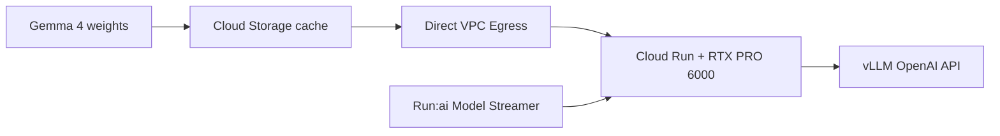

# Run inference of Gemma 4 model on Cloud Run with RTX 6000 Pro GPU with vLLM

<aside>
🎯

**한 줄 요약**: Google Cloud의 Cloud Run RTX PRO 6000 GPU에 Gemma 4 31B-it를 배포하고, vLLM과 Run:ai Model Streamer로 추론 성능과 인스턴스 시작 시간을 최적화하는 과정을 다룬다.

</aside>

## 목차

- [이 문서의 목표](#이-문서의-목표)
- [전체 흐름](#전체-흐름)
- [실습 결과](#실습-결과)
  - [1. 원문과 달라진 실제 문제](#1-원문과-달라진-실제-문제)
  - [2. 콜드 스타트 실측](#2-콜드-스타트-실측)
  - [3. 실험 목적과 결과](#3-실험-목적과-결과)
  - [4. 측정 원본과 터미널 출력](#4-측정-원본과-터미널-출력)
  - [5. 실습 증거](#5-실습-증거)
  - [6. 결과 해석과 한계](#6-결과-해석과-한계)
- 재현 부록
  - [A. 원문 배포 절차](#재현-부록-a-원문-배포-절차)
  - [B. 실제 배포에서 달라진 점](#재현-부록-b-실제-배포에서-달라진-점)
  - [C. 성능 측정 방법](#재현-부록-c-성능-측정-방법)
  - [D. 런타임 로그 주의사항](#재현-부록-d-런타임-로그-주의사항)
- [참고 자료](#참고-자료)

---

## 이 문서의 목표

이 문서의 목표는 다음 두 가지다.

1. Google Cloud의 **Cloud Run RTX PRO 6000 GPU에 Gemma 4 모델을 배포하는 방법**을 단계별로 정리한다.
2. **vLLM과 Run:ai Model Streamer를 사용해 추론 속도를 높이고 인스턴스 시작 시간을 단축하는 방법**을 실제 측정 결과와 함께 확인한다.

| 항목 | 내용 |
| --- | --- |
| 모델 | `google/gemma-4-31B-it` |
| 추론 엔진 | vLLM + Run:ai Model Streamer |
| 실행 환경 | Cloud Run Gen2, NVIDIA RTX PRO 6000 GPU 1개 |
| 모델 저장소 | Cloud Storage 단일 리전 버킷 |
| API | 인증된 OpenAI 호환 `/v1/chat/completions` |

> **주의**: 이 기능은 Pre-GA이며 지원 범위가 변경될 수 있다. GPU·Cloud Build·Cloud Storage 비용이 발생하므로 마지막 정리 단계를 반드시 실행한다.
>

## 전체 흐름



---

## 실습 결과

### 1. 원문과 달라진 실제 문제

| 지점 | 원문 | 실제 환경에서의 변경 | 배운 점 |
| --- | --- | --- | --- |
| 모델 복사 | `gcloud storage cp -r -D` | `-D`를 제거하고 GCS 서버사이드 복사 사용 | 58.28GiB를 로컬 회선으로 내려받았다가 다시 올리는 경로를 피함 |
| GPU 확장 | 최대 인스턴스 3 | 프로젝트 할당량에 맞춰 1로 축소 | 조회 명령보다 실제 배포 오류의 `requested: 3 allowed: 1`이 적용 한도를 정확히 보여줌 |
| CLI 준비 | beta 명령 바로 실행 | `gcloud components install beta --quiet` 선행 | 비대화형 환경에서는 설치 프롬프트도 배포를 멈출 수 있음 |

서버사이드 모델 복사는 미국 리전에서 `europe-west4`까지 **30분 56초**가 걸렸다. 이 차이는 단순한 명령 수정이 아니라 대형 모델을 어디에서 이동시키는지에 관한 문제다. 자세한 오류와 명령은 [재현 부록 B](#재현-부록-b-실제-배포에서-달라진-점)에 남겼다.

### 2. 콜드 스타트 실측

| 단계 | 시각(UTC) | 시작 후 경과 |
| --- | --- | ---: |
| 인스턴스 시작 | 18:50:36 | — |
| Run:ai Model Streamer 로딩 완료 | 18:53:07 | 모델 로딩 73초 |
| vLLM 서버 리슨 | 18:54:59 | 4분 23초 |
| Cloud Run `Ready=True` | 18:55:07 | **4분 31초** |

58.28GiB 체크포인트는 GPU에 31.47GiB로 적재됐고, 남은 57.09GiB가 KV cache 124,704토큰에 할당됐다. 따라서 이 구성에서 scale-to-zero는 유휴 비용을 줄이지만, 첫 요청이 약 4분 30초를 기다릴 수 있다는 의미이기도 하다.

### 3. 실험 목적과 결과

먼저 이 실험에서 궁금했던 점을 쉽게 풀면 다음과 같다.

| 실험 | 확인하려는 질문 | 실제 결과 | 쉽게 말하면 |
| --- | --- | --- | --- |
| A1 배칭 | 요청을 동시에 보내면 GPU 처리량은 계속 늘어날까? | 동시성 1→8에서 37.5→289.5 tok/s로 증가했지만, 16에서는 294.6 tok/s에 그쳤다. TTFT p50은 3.688초로 늘었다. | **8개까지는 함께 처리하는 효과가 크지만, 그 이상은 줄을 서서 기다리는 시간이 길어졌다.** |
| A2 Prefix Caching | 여러 요청이 같은 긴 앞부분을 쓰면 첫 응답이 빨라질까? | TTFT p50이 0.859초에서 0.470초로 45.3% 감소했다. | **반복되는 내용을 다시 계산하지 않아서 첫 토큰이 더 빨리 나왔다.** |
| A3 Prefill/Decode | 긴 입력과 긴 출력 중 무엇이 먼저 병목이 될까? | 긴 입력·동시성 8에서 TTFT p50 2.827초, goodput 25%였다. 긴 출력은 같은 조건에서 TTFT p50 0.403초, goodput 100%였다. | **이번 설정에서는 답변 길이보다 긴 입력을 읽는 과정이 먼저 느려졌다.** |
| A4 Goodput | 응답 성공 여부가 아니라 목표 시간까지 지키는 최대 동시성은 얼마일까? | 동시성 8까지 goodput 100%, 동시성 16에서는 50%였다. | **요청은 모두 성공했지만, 정해진 시간 안에 처리하려면 동시성 8이 안전선이었다.** |

warmup을 제외한 **143건이 모두 성공**했고 전 요청에서 API가 제공한 정확한 토큰 수를 사용했다. 여기서 goodput은 `TTFT 2초`와 `전체 응답 30초`를 모두 지킨 요청의 비율이다.

Run:ai Model Streamer는 58.28GiB 모델을 73초에 읽었고 Cloud Run은 인스턴스 시작 4분 31초 뒤 Ready 상태가 됐다. 다만 Model Streamer를 끈 비교 실험은 하지 않았으므로, 시작 시간이 정확히 얼마나 단축됐는지는 이 결과만으로 계산할 수 없다.

### 4. 측정 원본과 터미널 출력

143개 요청의 개별 이벤트는 제외하고, 결과 계산에 사용한 필드를 원본 JSON에서 추려 그대로 옮겼다. 숫자는 읽기 쉽도록 소수점 여섯 자리까지 표시했다.

<details>
<summary><strong>측정 결과 JSON</strong></summary>

```json
{
  "run": {
    "created_at": "2026-08-01T21:17:55.679622+00:00",
    "region": "europe-west4",
    "service": "gemma-rtx-vllm-codelab",
    "model": "google/gemma-4-31B-it",
    "ttft_slo_s": 2.0,
    "e2e_slo_s": 30.0,
    "goodput_target_pct": 95.0
  },
  "requests": {
    "warmup": 1,
    "measured": 143,
    "successes": 143,
    "failures": 0,
    "tokens_exact": 143
  },
  "derived": {
    "prefix_cache_hit_ttft_p50_s": 0.469756,
    "prefix_cache_miss_ttft_p50_s": 0.858663,
    "prefix_cache_ttft_reduction_pct": 45.292176,
    "max_concurrency_meeting_goodput_target": 8
  },
  "summaries": [
    {"experiment":"A1","scenario":"batching","concurrency":1,"ok":"8/8","ttft_p50_s":0.384592,"ttft_p95_s":0.410805,"e2e_p95_s":6.855011,"output_tok_per_s":37.512623,"goodput_pct":100.0},
    {"experiment":"A1","scenario":"batching","concurrency":2,"ok":"8/8","ttft_p50_s":0.418700,"ttft_p95_s":1.316903,"e2e_p95_s":7.572968,"output_tok_per_s":71.902403,"goodput_pct":100.0},
    {"experiment":"A1","scenario":"batching","concurrency":4,"ok":"8/8","ttft_p50_s":0.403521,"ttft_p95_s":0.429052,"e2e_p95_s":6.956934,"output_tok_per_s":147.543979,"goodput_pct":100.0},
    {"experiment":"A1","scenario":"batching","concurrency":8,"ok":"8/8","ttft_p50_s":0.474893,"ttft_p95_s":0.475532,"e2e_p95_s":7.069001,"output_tok_per_s":289.510321,"goodput_pct":100.0},
    {"experiment":"A1","scenario":"batching","concurrency":16,"ok":"16/16","ttft_p50_s":3.687515,"ttft_p95_s":7.190515,"e2e_p95_s":13.819057,"output_tok_per_s":294.617913,"goodput_pct":50.0},
    {"experiment":"A2","scenario":"cache-hit","concurrency":1,"ok":"5/5","ttft_p50_s":0.469756,"ttft_p95_s":0.541270,"e2e_p95_s":3.840943,"output_tok_per_s":33.910598,"goodput_pct":100.0},
    {"experiment":"A2","scenario":"cache-miss-control","concurrency":1,"ok":"5/5","ttft_p50_s":0.858663,"ttft_p95_s":0.938002,"e2e_p95_s":4.213359,"output_tok_per_s":30.719720,"goodput_pct":100.0},
    {"experiment":"A3","scenario":"short","concurrency":1,"ok":"4/4","ttft_p50_s":0.359859,"ttft_p95_s":0.393535,"e2e_p95_s":1.700972,"output_tok_per_s":31.587324,"goodput_pct":100.0},
    {"experiment":"A3","scenario":"short","concurrency":8,"ok":"8/8","ttft_p50_s":0.423872,"ttft_p95_s":0.424857,"e2e_p95_s":1.741515,"output_tok_per_s":236.841566,"goodput_pct":100.0},
    {"experiment":"A3","scenario":"prefill","concurrency":1,"ok":"4/4","ttft_p50_s":0.901325,"ttft_p95_s":0.911320,"e2e_p95_s":1.477946,"output_tok_per_s":15.789599,"goodput_pct":100.0},
    {"experiment":"A3","scenario":"prefill","concurrency":8,"ok":"8/8","ttft_p50_s":2.826886,"ttft_p95_s":4.250892,"e2e_p95_s":4.885585,"output_tok_per_s":37.651873,"goodput_pct":25.0},
    {"experiment":"A3","scenario":"decode","concurrency":1,"ok":"4/4","ttft_p50_s":0.365164,"ttft_p95_s":0.379683,"e2e_p95_s":1.644418,"output_tok_per_s":31.170304,"goodput_pct":100.0},
    {"experiment":"A3","scenario":"decode","concurrency":8,"ok":"8/8","ttft_p50_s":0.403023,"ttft_p95_s":0.438855,"e2e_p95_s":1.739240,"output_tok_per_s":235.939905,"goodput_pct":100.0},
    {"experiment":"A4","scenario":"goodput-capacity","concurrency":1,"ok":"8/8","ttft_p50_s":0.369643,"ttft_p95_s":0.450579,"e2e_p95_s":3.651564,"output_tok_per_s":35.650038,"goodput_pct":100.0},
    {"experiment":"A4","scenario":"goodput-capacity","concurrency":2,"ok":"8/8","ttft_p50_s":0.370180,"ttft_p95_s":0.390641,"e2e_p95_s":3.603506,"output_tok_per_s":71.384796,"goodput_pct":100.0},
    {"experiment":"A4","scenario":"goodput-capacity","concurrency":4,"ok":"8/8","ttft_p50_s":0.388962,"ttft_p95_s":0.411293,"e2e_p95_s":3.644974,"output_tok_per_s":140.702946,"goodput_pct":100.0},
    {"experiment":"A4","scenario":"goodput-capacity","concurrency":8,"ok":"8/8","ttft_p50_s":0.406731,"ttft_p95_s":0.438963,"e2e_p95_s":3.716558,"output_tok_per_s":275.375985,"goodput_pct":100.0},
    {"experiment":"A4","scenario":"goodput-capacity","concurrency":16,"ok":"16/16","ttft_p50_s":2.089280,"ttft_p95_s":3.799207,"e2e_p95_s":7.081058,"output_tok_per_s":289.098325,"goodput_pct":50.0}
  ]
}
```

</details>

<details>
<summary><strong>터미널 출력</strong></summary>

```text
target=gemma-rtx-vllm-codelab project=<PROJECT_ID> region=europe-west4
warmup ok=True TTFT=0.4333844170032535 E2E=0.528s (배칭 곡선에서는 제외)
A1 batching c=1 ok=8/8 TTFT p50/p95=0.385/0.411s E2E p95=6.855s tok/s=37.513 goodput=100.0%
A1 batching c=2 ok=8/8 TTFT p50/p95=0.419/1.317s E2E p95=7.573s tok/s=71.902 goodput=100.0%
A1 batching c=4 ok=8/8 TTFT p50/p95=0.404/0.429s E2E p95=6.957s tok/s=147.544 goodput=100.0%
A1 batching c=8 ok=8/8 TTFT p50/p95=0.475/0.476s E2E p95=7.069s tok/s=289.510 goodput=100.0%
A1 batching c=16 ok=16/16 TTFT p50/p95=3.688/7.191s E2E p95=13.819s tok/s=294.618 goodput=50.0%
A2 cache-hit c=1 ok=5/5 TTFT p50/p95=0.470/0.541s E2E p95=3.841s tok/s=33.911 goodput=100.0%
A2 cache-miss-control c=1 ok=5/5 TTFT p50/p95=0.859/0.938s E2E p95=4.213s tok/s=30.720 goodput=100.0%
A3 short c=1 ok=4/4 TTFT p50/p95=0.360/0.394s E2E p95=1.701s tok/s=31.587 goodput=100.0%
A3 short c=8 ok=8/8 TTFT p50/p95=0.424/0.425s E2E p95=1.742s tok/s=236.842 goodput=100.0%
A3 prefill c=1 ok=4/4 TTFT p50/p95=0.901/0.911s E2E p95=1.478s tok/s=15.790 goodput=100.0%
A3 prefill c=8 ok=8/8 TTFT p50/p95=2.827/4.251s E2E p95=4.886s tok/s=37.652 goodput=25.0%
A3 decode c=1 ok=4/4 TTFT p50/p95=0.365/0.380s E2E p95=1.644s tok/s=31.170 goodput=100.0%
A3 decode c=8 ok=8/8 TTFT p50/p95=0.403/0.439s E2E p95=1.739s tok/s=235.940 goodput=100.0%
A4 goodput-capacity c=1 ok=8/8 TTFT p50/p95=0.370/0.451s E2E p95=3.652s tok/s=35.650 goodput=100.0%
A4 goodput-capacity c=2 ok=8/8 TTFT p50/p95=0.370/0.391s E2E p95=3.604s tok/s=71.385 goodput=100.0%
A4 goodput-capacity c=4 ok=8/8 TTFT p50/p95=0.389/0.411s E2E p95=3.645s tok/s=140.703 goodput=100.0%
A4 goodput-capacity c=8 ok=8/8 TTFT p50/p95=0.407/0.439s E2E p95=3.717s tok/s=275.376 goodput=100.0%
A4 goodput-capacity c=16 ok=16/16 TTFT p50/p95=2.089/3.799s E2E p95=7.081s tok/s=289.098 goodput=50.0%
result=labs/cloudrun-gemma4-vllm/results/a1-a4-20260801-211752.json
```

</details>

### 5. 실습 증거

Cloud Run 콘솔은 원시 결과의 실행 구간 `2026-08-01 21:17:52~21:22:03Z`를 한국시간 `2026-08-02 06:17:52~06:22:03`으로 변환해 확인했다. 차트는 앞뒤 여유를 둔 `06:15~06:25` 범위다.


Metrics와 Logs는 서버 측 요청·지연·GPU 부하를 증명한다. TTFT·tok/s·goodput의 최종 근거는 벤치마크 JSON과 터미널 로그다.

### 6. 결과 해석과 한계

- **배칭**: 동시성 8까지는 처리량이 늘지만 16에서는 거의 포화되고 TTFT가 급격히 증가했다.
- **Prefix Caching**: 길이를 맞춘 miss 대조군과 비교해 TTFT 감소를 확인했다.
- **Prefill**: 긴 입력이 동시성 8에서 TTFT SLO를 먼저 무너뜨렸다. 입력 길이와 동시성을 함께 용량 계획에 반영해야 한다.
- **서버리스 GPU**: scale-to-zero는 유휴 GPU 비용을 줄이지만 4분대 콜드 스타트와 맞바꾼다.
- **FP8 한계**: 로그에는 보정되지 않은 scaling factor 1.0이 정확도를 낮출 수 있다는 경고가 남았다. 이번 실험은 성능 측정이며 품질 평가는 하지 않았다.
- **검증 범위**: 단일 GPU·단일 리전·한 차례의 측정 결과다. 설정값을 바꿔 반복 측정해야 최적 구성을 판단할 수 있다.

---

## 재현 부록 A. 원문 배포 절차

<details>
<summary><strong>1. 기본 리소스 준비</strong></summary>

### 환경 설정

Cloud Shell 또는 로컬 Cloud SDK에서 프로젝트·리전·리소스 이름을 고정한다.

아래의 프로젝트 ID와 리소스 이름을 자신의 환경에 맞게 설정한다.

```bash
export MODEL_NAME="google/gemma-4-31B-it"
export SERVICE_NAME="gemma-rtx-vllm-codelab"
export GOOGLE_CLOUD_PROJECT="<YOUR_PROJECT_ID>"
export GOOGLE_CLOUD_REGION="europe-west4"
export SERVICE_ACCOUNT="vllm-service-sa"
export SERVICE_ACCOUNT_EMAIL="$SERVICE_ACCOUNT@$GOOGLE_CLOUD_PROJECT.iam.gserviceaccount.com"
export MODEL_CACHE_BUCKET="$GOOGLE_CLOUD_PROJECT-$GOOGLE_CLOUD_REGION-hf-model-cache"
export GCS_MODEL_LOCATION="gs://$MODEL_CACHE_BUCKET/model-cache/$MODEL_NAME"
export VPC_NETWORK="vllm-$GOOGLE_CLOUD_REGION-net"
export VPC_SUBNET="vllm-$GOOGLE_CLOUD_REGION-subnet"
export SUBNET_RANGE="10.8.0.0/26"

gcloud config set project "$GOOGLE_CLOUD_PROJECT"
gcloud config set run/region "$GOOGLE_CLOUD_REGION"
```

필수 API:

```bash
gcloud services enable run.googleapis.com cloudbuild.googleapis.com   artifactregistry.googleapis.com iam.googleapis.com compute.googleapis.com   vpcaccess.googleapis.com storage.googleapis.com
```

### 서비스 계정 생성

Compute Engine 기본 서비스 계정 대신 Cloud Run 전용 서비스 계정을 만든다. 과도한 기본 권한을 피하기 위한 출발점이다.

```bash
gcloud iam service-accounts create "$SERVICE_ACCOUNT"   --project "$GOOGLE_CLOUD_PROJECT"   --display-name "vLLM Service Account"
```

### Cloud Storage 준비

가중치는 수십 GB 이상이므로 시작할 때마다 외부 모델 허브에서 받지 않는다. Cloud Run과 **동일한 단일 리전**의 GCS 버킷에 캐시한다.

```bash
gcloud storage buckets create "gs://$MODEL_CACHE_BUCKET"   --uniform-bucket-level-access   --public-access-prevention   --project "$GOOGLE_CLOUD_PROJECT"   --location "$GOOGLE_CLOUD_REGION"
```

- Uniform bucket-level access: 객체 ACL 대신 IAM으로 일관되게 제어
- Public access prevention: 실수로 모델을 공개하는 것을 차단
- 같은 리전: 지연과 모델 로딩 경로를 최소화

</details>

---

<details>
<summary><strong>2. 모델 캐시·네트워크·권한 구성</strong></summary>

### 모델 가중치 캐시

로컬 디스크를 거치지 않고 Cloud Build의 대용량 디스크를 사용해 모델을 GCS에 적재한다.

#### 옵션 A — 공개 GCS에서 복사

Google이 제공하는 Gemma 4 공개 버킷을 내 버킷으로 복사하는 가장 간단한 경로다. Codelab은 `E2_HIGHCPU_32`, 500GB 디스크의 Cloud Build를 사용한다.

```bash
gcloud storage cp -r -D   "gs://vertex-model-garden-public-us/gemma4/gemma-4-31B-it"   "$GCS_MODEL_LOCATION"
```

> `-D`(daisy-chain)는 실행 머신을 경유해 내려받았다 다시 올리는 모드다. Cloud Build 밖(로컬·Cloud Shell)에서 실행한다면 `-D`를 빼고 서버사이드 복사를 쓴다 — [실제 배포에서 달라진 점](#재현-부록-b-실제-배포에서-달라진-점) 참조.
>

### Direct VPC Egress 구성

Cloud Run이 VPC를 통해 Cloud Storage 같은 Google API에 접근하도록 구성한다. 서브넷에는 **Private Google Access**가 필요하다.

```bash
gcloud compute networks create "$VPC_NETWORK"   --subnet-mode=custom --bgp-routing-mode=regional   --project "$GOOGLE_CLOUD_PROJECT"

gcloud compute networks subnets create "$VPC_SUBNET"   --network="$VPC_NETWORK" --region="$GOOGLE_CLOUD_REGION"   --range="$SUBNET_RANGE" --enable-private-ip-google-access   --project "$GOOGLE_CLOUD_PROJECT"
```

### 서비스 계정 권한 설정

Cloud Run 런타임 서비스 계정이 모델 버킷을 읽을 수 있어야 한다. Codelab은 단순화를 위해 `Storage Admin`을 부여한다.

```bash
gcloud storage buckets add-iam-policy-binding "gs://$MODEL_CACHE_BUCKET"   --member "serviceAccount:$SERVICE_ACCOUNT_EMAIL"   --role "roles/storage.admin"   --project "$GOOGLE_CLOUD_PROJECT"
```

> 운영 환경에서는 필요한 작업을 확인한 후 가능한 한 `roles/storage.objectViewer` 등 더 좁은 권한으로 줄인다.
>

</details>

---

<details>
<summary><strong>3. vLLM 설정과 Cloud Run 배포</strong></summary>

### vLLM 및 Cloud Run 변수 설정

vLLM과 Cloud Run의 성능·용량 파라미터를 설정한다.

```bash
export MAX_MODEL_LEN="32767"
export QUANTIZATION_TYPE="fp8"
export KV_CACHE_DTYPE="fp8"
export GPU_MEM_UTIL="0.95"
export TENSOR_PARALLEL_SIZE="1"
export MAX_NUM_SEQS="8"

export CLOUD_RUN_CPU_NUM=20
export CLOUD_RUN_MEMORY_GB=80
export CLOUD_RUN_MAX_INSTANCES=3
export CLOUD_RUN_CONCURRENCY=16
```

> 기본 프로젝트의 RTX PRO 6000 할당량은 **1**이라 `CLOUD_RUN_MAX_INSTANCES=3`이면 배포가 거부된다. 증설 전에는 1로 두거나 `g.co/cloudrun/gpu-quota`에서 요청한다 — [실제 배포에서 달라진 점](#재현-부록-b-실제-배포에서-달라진-점) 참조.
>

| 파라미터 | 의미 / 조정 기준 |
| --- | --- |
| `MAX_MODEL_LEN` | 최대 컨텍스트 길이. 클수록 KV cache 메모리 사용량 증가 |
| `MAX_NUM_SEQS` | vLLM 배치 내 동시 시퀀스. 처리량은 늘지만 지연/OOM 위험도 증가 |
| `CLOUD_RUN_CONCURRENCY` | 인스턴스당 HTTP 동시 요청. `MAX_NUM_SEQS` 이상, 보통 약 2배부터 관측 |
| `GPU_MEM_UTIL` | vLLM GPU 메모리 사용 비율 |
| `CLOUD_RUN_MAX_INSTANCES` | 수평 확장 상한. 단일 인스턴스 지연이 허용될 때 전체 용량 확장 |

OOM이 나면 우선 `MAX_NUM_SEQS` 또는 `MAX_MODEL_LEN`을 낮춘다. FP8 모델/KV cache 양자화는 메모리를 줄이고 성능을 높일 수 있지만, 실제 품질 평가는 별도로 해야 한다.

### Cloud Run 배포

`--load-format runai_streamer`로 Model Streamer를 사용하고, Gemma 4의 tool call/reasoning parser를 지정한다.

```bash
CONTAINER_ARGS=(
  "vllm" "serve" "$GCS_MODEL_LOCATION"
  "--served-model-name" "$MODEL_NAME"
  "--enable-log-requests" "--enable-chunked-prefill" "--enable-prefix-caching"
  "--generation-config" "auto"
  "--enable-auto-tool-choice" "--tool-call-parser" "gemma4"
  "--reasoning-parser" "gemma4"
  "--dtype" "bfloat16" "--quantization" "$QUANTIZATION_TYPE"
  "--kv-cache-dtype" "$KV_CACHE_DTYPE"
  "--max-num-seqs" "$MAX_NUM_SEQS"
  "--gpu-memory-utilization" "$GPU_MEM_UTIL"
  "--tensor-parallel-size" "$TENSOR_PARALLEL_SIZE"
  "--load-format" "runai_streamer" "--port" "8080" "--host" "0.0.0.0"
)
if [[ "$MAX_MODEL_LEN" != "" ]]; then
  CONTAINER_ARGS+=("--max-model-len" "$MAX_MODEL_LEN")
fi
export CONTAINER_ARGS_STR="${CONTAINER_ARGS[*]}"
```

핵심 배포 옵션:

```bash
gcloud beta run deploy "$SERVICE_NAME"   --image="us-docker.pkg.dev/vertex-ai/vertex-vision-model-garden-dockers/pytorch-vllm-serve:gemma4"   --project "$GOOGLE_CLOUD_PROJECT" --region "$GOOGLE_CLOUD_REGION"   --service-account "$SERVICE_ACCOUNT_EMAIL" --execution-environment gen2   --no-allow-unauthenticated   --cpu="$CLOUD_RUN_CPU_NUM" --memory="$CLOUD_RUN_MEMORY_GB"Gi   --gpu=1 --gpu-type=nvidia-rtx-pro-6000 --no-gpu-zonal-redundancy   --no-cpu-throttling --max-instances "$CLOUD_RUN_MAX_INSTANCES"   --concurrency "$CLOUD_RUN_CONCURRENCY"   --network "$VPC_NETWORK" --subnet "$VPC_SUBNET" --vpc-egress all-traffic   --port=8080 --timeout=3600 --cpu-boost   --startup-probe tcpSocket.port=8080,initialDelaySeconds=240,failureThreshold=40,timeoutSeconds=10,periodSeconds=15   --command "bash" --args="^;^-c;$CONTAINER_ARGS_STR"
```

- `--no-allow-unauthenticated`: 인증된 호출만 허용
- `--gpu-type=nvidia-rtx-pro-6000`: GPU 종류 지정
- `--no-cpu-throttling`, `--cpu-boost`: 기동·추론 시 CPU 성능 확보
- 대형 모델의 느린 초기화에 맞춰 긴 timeout/startup probe 설정

</details>

---

<details>
<summary><strong>4. 호출 검증과 리소스 정리</strong></summary>

### API 호출 검증

서비스 URL을 얻은 뒤, Google ID 토큰으로 vLLM OpenAI 호환 API를 호출한다.

```bash
SERVICE_URL=$(gcloud run services describe "$SERVICE_NAME"   --project "$GOOGLE_CLOUD_PROJECT" --region "$GOOGLE_CLOUD_REGION"   --format 'value(status.url)')

curl -s "$SERVICE_URL/v1/chat/completions"   -H "Authorization: Bearer $(gcloud auth print-identity-token)"   -H "Content-Type: application/json"   -d '{
    "model": "'"$MODEL_NAME"'",
    "messages": [{"role":"user","content":"Why is the sky blue?"}],
    "chat_template_kwargs":{"enable_thinking":true},
    "skip_special_tokens":false
  }' | jq -r '.choices[0].message.content'
```

실패하면 호출자의 Cloud Run Invoker 권한, 서비스 Ready/startup probe 로그, 서비스 계정의 GCS 접근, GPU quota·리전 가용성, OOM 여부를 차례로 확인한다.

### 리소스 정리

비용 발생을 중지하려면 서비스·서비스 계정·버킷·VPC를 삭제한다.

```bash
gcloud run services delete "$SERVICE_NAME"   --project "$GOOGLE_CLOUD_PROJECT" --region "$GOOGLE_CLOUD_REGION" --quiet

gcloud iam service-accounts delete "$SERVICE_ACCOUNT_EMAIL"   --project "$GOOGLE_CLOUD_PROJECT" --quiet

gcloud storage rm --recursive "gs://$MODEL_CACHE_BUCKET"

gcloud compute networks subnets delete "$VPC_SUBNET"   --region "$GOOGLE_CLOUD_REGION" --project "$GOOGLE_CLOUD_PROJECT" --quiet
gcloud compute networks delete "$VPC_NETWORK"   --project "$GOOGLE_CLOUD_PROJECT" --quiet
```

실습 전용 프로젝트라면 `gcloud projects delete "$GOOGLE_CLOUD_PROJECT"`로 전체 프로젝트를 삭제할 수도 있다. 되돌릴 수 없으므로 프로젝트 ID를 확인한다.

</details>

---

## 재현 부록 B. 실제 배포에서 달라진 점

원문 절차를 그대로 실행했을 때 막혔던 두 지점과 해결 방법만 정리했다.

<details>
<summary><strong>5. 모델 복사와 GPU 할당량 문제</strong></summary>

### 문제 1 — 모델 복사 명령에서 `-D`를 뺐다

`-D`는 `--daisy-chain`으로, **객체를 실행 머신에 내려받은 뒤 다시 업로드**하는 모드다. Codelab이 이 명령을 `E2_HIGHCPU_32` + 500GB 디스크 Cloud Build에서 돌리는 이유가 이것이다. 로컬에서 그대로 실행하면 58GiB를 집 회선으로 내렸다 올리게 된다. 플래그를 빼면 GCS 서버사이드 복사(copy in the cloud)가 되어 로컬 대역폭을 쓰지 않는다.

```bash
# 로컬/Cloud Shell에서 실행할 때
gcloud storage cp -r "gs://vertex-model-garden-public-us/gemma4/gemma-4-31B-it" "$GCS_MODEL_LOCATION"
```

미국 → `europe-west4` 서버사이드 복사 소요: **30분 56초** (18:15:24 → 18:46:20 UTC).

### 문제 2 — `CLOUD_RUN_MAX_INSTANCES`를 3 → 1로 낮췄다

원문 값 3으로 배포하면 실패한다.

```
ERROR: (gcloud.beta.run.deploy) spec.template.metadata.annotations[autoscaling.knative.dev/maxScale]:
Max instances must be set to 1 or fewer in order to set GPU requirements.
Quota violated:
NvidiaRtxPro6000GpuAllocNoZonalRedundancyPerProjectRegion requested: 3 allowed: 1
```

> **주의**: 사전 확인용으로 쓴 `gcloud beta quotas info describe NvidiaRtxPro6000GpuAllocNoZonalRedundancyPerProjectRegion`은 `europe-west4`에 대해 `value: 1000`을 반환했지만, **실제 허용치는 1**이었다. 이 명령의 값은 적용 한도가 아니므로 신뢰하지 말고, 배포 에러 메시지(`requested: N allowed: M`)를 실측 기준으로 삼는다. GPU 인스턴스를 2개 이상 쓰려면 `g.co/cloudrun/gpu-quota`에서 증설을 요청해야 한다.

또 `gcloud beta run deploy`를 쓰므로 **beta 컴포넌트 설치가 선행**되어야 한다(`gcloud components install beta`). 비대화형 환경에서는 `--quiet` 없이는 설치 프롬프트에서 멈춘다.

</details>

## 재현 부록 C. 성능 측정 방법

<details>
<summary><strong>6. A1~A4 측정 프로토콜</strong></summary>

아래 7번에 첨부한 실행 스크립트는 다음 기준으로 측정한다.

- 첫 `content` 또는 `reasoning_content` 조각이 도착한 시점을 TTFT로 기록
- 스트리밍 `usage.completion_tokens`를 사용하고, 없을 때만 추정치로 표시
- 콜드 스타트 관측값을 warm 배칭 결과에서 분리
- A2 외 실험의 프롬프트 첫 블록을 고유화해 Prefix Caching 혼입 방지
- A2는 같은 길이의 고유 prefix miss 대조군과 cache hit 반복 비교
- 모든 요청과 집계값을 JSON으로 저장
- TTFT·E2E SLO를 모두 만족한 요청 비율을 goodput으로 계산

기본 측정에서는 reasoning 길이의 변동을 줄이려고 thinking을 끈다. reasoning을 포함한 별도 기준선이 필요하면 `--enable-thinking`을 붙이고 결과 파일을 분리한다.

| 실험 | 새 측정 내용 | 완료 판단 |
| --- | --- | --- |
| A1 | warm 동시성 `1,2,4,8,16`의 TTFT·정확한 tok/s | 처리량이 포화되기 시작하는 지점 |
| A2 | cache hit와 고유 prefix miss 대조군 | TTFT p50/p95 차이가 반복되는가 |
| A3 | 짧은 요청·긴 입력·긴 출력, 동시성 `1,8` | prefill은 TTFT, decode는 E2E/tok/s에 미치는 영향 |
| A4 | 동시성별 TTFT 2초·E2E 30초 goodput | SLO를 지키는 최대 동시성 |

먼저 스모크 테스트로 인증과 결과 저장만 확인한다. 이 명령은 scale-to-zero 상태의 GPU를 기동하므로 비용이 발생할 수 있다.

```bash
python3 benchmark_a1_a4.py \
  --project "$GOOGLE_CLOUD_PROJECT" \
  --region "$GOOGLE_CLOUD_REGION" \
  --service "$SERVICE_NAME" \
  --exp smoke \
  --output smoke.json
```

스모크 결과가 성공한 뒤 전체 실험을 실행한다.

```bash
python3 benchmark_a1_a4.py \
  --project "$GOOGLE_CLOUD_PROJECT" \
  --region "$GOOGLE_CLOUD_REGION" \
  --service "$SERVICE_NAME" \
  --exp all \
  --ttft-slo 2 \
  --e2e-slo 30 \
  --output a1-a4-result.json
```

`exact_usage_requests`가 성공 요청 수보다 작으면 해당 구간의 tok/s에 추정 토큰이 섞였다는 뜻이다. 그 결과는 정확한 기준선으로 승격하지 않는다.

</details>

---

<details>
<summary><strong>7. A1~A4 실행 스크립트</strong></summary>

아래 코드를 `benchmark_a1_a4.py`로 저장한 뒤 6번의 명령으로 실행한다. Notion 문서만 공유해도 그대로 복사해 사용할 수 있도록 전체 코드를 첨부했다.

```python
#!/usr/bin/env python3
"""Cloud Run의 OpenAI 호환 vLLM API에서 A1~A4 서빙 실험을 수행한다."""

from __future__ import annotations

import argparse
import asyncio
import dataclasses
import datetime as dt
import json
import math
import os
import statistics
import subprocess
import sys
import time
import urllib.error
import urllib.request
import uuid
from pathlib import Path
from typing import Any


MODEL_NAME = "google/gemma-4-31B-it"
SERVICE_NAME = "gemma-rtx-vllm-codelab"
REGION = "europe-west4"
EXPERIMENTS = ("smoke", "a1", "a2", "a3", "a4", "all")


@dataclasses.dataclass
class RequestResult:
    experiment: str
    scenario: str
    concurrency: int
    request_id: int
    ok: bool
    status: int
    ttft_s: float | None
    e2e_s: float
    output_tokens: int
    tokens_exact: bool
    error: str | None = None

    def as_dict(self) -> dict[str, Any]:
        return dataclasses.asdict(self)


def percentile(values: list[float], quantile: float) -> float | None:
    if not values:
        return None
    ordered = sorted(values)
    rank = (len(ordered) - 1) * quantile
    lower = math.floor(rank)
    upper = math.ceil(rank)
    if lower == upper:
        return ordered[lower]
    weight = rank - lower
    return ordered[lower] * (1 - weight) + ordered[upper] * weight


def parse_positive_ints(value: str) -> list[int]:
    try:
        values = [int(item.strip()) for item in value.split(",") if item.strip()]
    except ValueError as exc:
        raise argparse.ArgumentTypeError("쉼표로 구분한 정수를 입력하세요.") from exc
    if not values or any(item < 1 for item in values):
        raise argparse.ArgumentTypeError("값은 모두 1 이상이어야 합니다.")
    return values


def project_from_dotenv() -> str | None:
    """저장소 .env에서 프로젝트 ID 키만 읽는다. 다른 값은 로드하지 않는다."""
    env_path = Path(__file__).resolve().parents[2] / ".env"
    if not env_path.exists():
        return None
    for raw_line in env_path.read_text(encoding="utf-8").splitlines():
        line = raw_line.strip()
        if not line or line.startswith("#") or "=" not in line:
            continue
        key, value = line.split("=", 1)
        if key.strip() in {"PROJECT_ID", "GOOGLE_CLOUD_PROJECT", "GCLOUD_PROJECT"}:
            return value.strip().strip("\"'") or None
    return None


def default_project() -> str | None:
    return (
        os.getenv("PROJECT_ID")
        or os.getenv("GOOGLE_CLOUD_PROJECT")
        or os.getenv("GCLOUD_PROJECT")
        or project_from_dotenv()
    )


def run_gcloud(arguments: list[str]) -> str:
    try:
        return subprocess.check_output(
            ["gcloud", *arguments], text=True, stderr=subprocess.STDOUT
        ).strip()
    except (OSError, subprocess.CalledProcessError) as exc:
        detail = getattr(exc, "output", None) or str(exc)
        raise RuntimeError(f"gcloud 실행 실패: {detail.strip()}") from exc


def identity_token() -> str:
    return run_gcloud(["auth", "print-identity-token"])


def service_url(project: str, region: str, service: str) -> str:
    return run_gcloud(
        [
            "run",
            "services",
            "describe",
            service,
            "--project",
            project,
            "--region",
            region,
            "--format=value(status.url)",
        ]
    )


def estimate_tokens(text: str) -> int:
    """usage가 없는 호환 서버의 대체값이며 결과에 추정치임을 표시한다."""
    return max(0, round(len(text) / 4))


def uncached_user_messages(prompt: str) -> list[dict[str, str]]:
    """A2 외 실험에서 자동 prefix caching이 비교를 섞지 않도록 첫 블록을 고유화한다."""
    return [{"role": "user", "content": f"request-id={uuid.uuid4().hex}\n{prompt}"}]


def make_streaming_request(
    *,
    url: str,
    token: str,
    model: str,
    messages: list[dict[str, str]],
    max_tokens: int,
    experiment: str,
    scenario: str,
    concurrency: int,
    request_id: int,
    timeout_s: float,
    enable_thinking: bool,
) -> RequestResult:
    payload: dict[str, Any] = {
        "model": model,
        "messages": messages,
        "max_tokens": max_tokens,
        "temperature": 0,
        "seed": 42,
        "stream": True,
        "stream_options": {"include_usage": True},
        "chat_template_kwargs": {"enable_thinking": enable_thinking},
    }
    request = urllib.request.Request(
        f"{url.rstrip('/')}/v1/chat/completions",
        data=json.dumps(payload, ensure_ascii=False).encode("utf-8"),
        headers={
            "Authorization": f"Bearer {token}",
            "Content-Type": "application/json",
        },
        method="POST",
    )
    started = time.perf_counter()
    first_token_at: float | None = None
    output_parts: list[str] = []
    output_tokens: int | None = None
    status = 0

    try:
        with urllib.request.urlopen(request, timeout=timeout_s) as response:
            status = response.status
            for raw_line in response:
                line = raw_line.decode("utf-8").strip()
                if not line.startswith("data:"):
                    continue
                data = line[5:].strip()
                if data == "[DONE]":
                    break
                event = json.loads(data)
                usage = event.get("usage")
                if usage and usage.get("completion_tokens") is not None:
                    output_tokens = int(usage["completion_tokens"])
                for choice in event.get("choices", []):
                    delta = choice.get("delta", {})
                    for key in ("reasoning_content", "content"):
                        fragment = delta.get(key)
                        if fragment:
                            if first_token_at is None:
                                first_token_at = time.perf_counter()
                            output_parts.append(str(fragment))
        ended = time.perf_counter()
        exact = output_tokens is not None
        if output_tokens is None:
            output_tokens = estimate_tokens("".join(output_parts))
        return RequestResult(
            experiment=experiment,
            scenario=scenario,
            concurrency=concurrency,
            request_id=request_id,
            ok=200 <= status < 300 and first_token_at is not None,
            status=status,
            ttft_s=(first_token_at - started) if first_token_at else None,
            e2e_s=ended - started,
            output_tokens=output_tokens,
            tokens_exact=exact,
            error=None if first_token_at else "스트림에서 내용 토큰을 받지 못했습니다.",
        )
    except urllib.error.HTTPError as exc:
        ended = time.perf_counter()
        detail = exc.read(800).decode("utf-8", errors="replace")
        return RequestResult(
            experiment,
            scenario,
            concurrency,
            request_id,
            False,
            exc.code,
            None,
            ended - started,
            0,
            False,
            detail,
        )
    except Exception as exc:
        ended = time.perf_counter()
        return RequestResult(
            experiment,
            scenario,
            concurrency,
            request_id,
            False,
            status,
            None,
            ended - started,
            0,
            False,
            f"{type(exc).__name__}: {exc}",
        )


async def run_requests(
    *,
    url: str,
    token: str,
    model: str,
    messages_factory,
    max_tokens: int,
    experiment: str,
    scenario: str,
    concurrency: int,
    request_count: int,
    timeout_s: float,
    enable_thinking: bool,
) -> tuple[list[RequestResult], float]:
    semaphore = asyncio.Semaphore(concurrency)

    async def one(request_id: int) -> RequestResult:
        async with semaphore:
            return await asyncio.to_thread(
                make_streaming_request,
                url=url,
                token=token,
                model=model,
                messages=messages_factory(request_id),
                max_tokens=max_tokens,
                experiment=experiment,
                scenario=scenario,
                concurrency=concurrency,
                request_id=request_id,
                timeout_s=timeout_s,
                enable_thinking=enable_thinking,
            )

    started = time.perf_counter()
    results = await asyncio.gather(*(one(i) for i in range(request_count)))
    return list(results), time.perf_counter() - started


def summarize(
    results: list[RequestResult], wall_s: float, ttft_slo: float, e2e_slo: float
) -> dict[str, Any]:
    successful = [item for item in results if item.ok]
    ttfts = [item.ttft_s for item in successful if item.ttft_s is not None]
    e2es = [item.e2e_s for item in successful]
    good = [
        item
        for item in successful
        if item.ttft_s is not None
        and item.ttft_s <= ttft_slo
        and item.e2e_s <= e2e_slo
    ]
    total_tokens = sum(item.output_tokens for item in successful)
    return {
        "experiment": results[0].experiment,
        "scenario": results[0].scenario,
        "concurrency": results[0].concurrency,
        "requests": len(results),
        "successes": len(successful),
        "failures": len(results) - len(successful),
        "ttft_p50_s": percentile(ttfts, 0.50),
        "ttft_p95_s": percentile(ttfts, 0.95),
        "e2e_p50_s": percentile(e2es, 0.50),
        "e2e_p95_s": percentile(e2es, 0.95),
        "output_tokens": total_tokens,
        "output_tok_per_s": total_tokens / wall_s if wall_s > 0 else None,
        "goodput_pct": len(good) / len(results) * 100 if results else 0,
        "exact_usage_requests": sum(item.tokens_exact for item in successful),
        "wall_s": wall_s,
    }


def print_summary(item: dict[str, Any]) -> None:
    def display(value: float | None) -> str:
        return "-" if value is None else f"{value:.3f}"

    print(
        f"{item['experiment'].upper()} {item['scenario']} c={item['concurrency']} "
        f"ok={item['successes']}/{item['requests']} "
        f"TTFT p50/p95={display(item['ttft_p50_s'])}/{display(item['ttft_p95_s'])}s "
        f"E2E p95={display(item['e2e_p95_s'])}s "
        f"tok/s={display(item['output_tok_per_s'])} "
        f"goodput={item['goodput_pct']:.1f}%"
    )


async def run_group_and_record(
    records: dict[str, Any],
    *,
    args,
    token: str,
    url: str,
    experiment: str,
    scenario: str,
    concurrency: int,
    request_count: int,
    max_tokens: int,
    messages_factory,
) -> dict[str, Any]:
    results, wall_s = await run_requests(
        url=url,
        token=token,
        model=args.model,
        messages_factory=messages_factory,
        max_tokens=max_tokens,
        experiment=experiment,
        scenario=scenario,
        concurrency=concurrency,
        request_count=request_count,
        timeout_s=args.timeout,
        enable_thinking=args.enable_thinking,
    )
    summary = summarize(results, wall_s, args.ttft_slo, args.e2e_slo)
    records["summaries"].append(summary)
    records["requests"].extend(item.as_dict() for item in results)
    print_summary(summary)
    return summary


async def experiment_a1(records, args, token: str, url: str) -> None:
    prompt = (
        "Transformer와 self-attention의 구조를 LLM 서빙 관점에서 "
        "200단어 안팎으로 설명해 주세요."
    )
    for concurrency in args.concurrency:
        await run_group_and_record(
            records,
            args=args,
            token=token,
            url=url,
            experiment="a1",
            scenario="batching",
            concurrency=concurrency,
            request_count=max(args.requests_per_level, concurrency),
            max_tokens=256,
            messages_factory=lambda _i, prompt=prompt: uncached_user_messages(prompt),
        )


async def experiment_a2(records, args, token: str, url: str) -> None:
    common = (
        "당신은 LLM 서빙 인프라 전문가입니다. 다음 배경을 참고하세요. "
        + (
            "prefill은 입력을 처리해 KV cache를 만들고 decode는 토큰을 하나씩 생성합니다. "
            "PagedAttention은 KV cache를 블록 단위로 관리해 메모리 단편화를 줄입니다. "
        )
        * 80
    )
    hit_prefix = f"cache-group={'0' * 32}\n{common}"
    prime = make_streaming_request(
        url=url,
        token=token,
        model=args.model,
        messages=[
            {"role": "system", "content": hit_prefix},
            {"role": "user", "content": "핵심을 한 문장으로 요약해 주세요."},
        ],
        max_tokens=32,
        experiment="a2",
        scenario="cache-prime",
        concurrency=1,
        request_id=-1,
        timeout_s=args.timeout,
        enable_thinking=args.enable_thinking,
    )
    records["requests"].append(prime.as_dict())
    if not prime.ok:
        raise RuntimeError(f"A2 cache prime 실패: {prime.error}")

    hit_factory = lambda i: [
        {"role": "system", "content": hit_prefix},
        {"role": "user", "content": f"질문 {i}: PagedAttention의 장점을 설명해 주세요."},
    ]
    hit_summary = await run_group_and_record(
        records,
        args=args,
        token=token,
        url=url,
        experiment="a2",
        scenario="cache-hit",
        concurrency=1,
        request_count=args.prefix_repeats,
        max_tokens=128,
        messages_factory=hit_factory,
    )

    def miss_factory(i: int) -> list[dict[str, str]]:
        unique_prefix = f"cache-group={uuid.uuid4().hex}\n{common}"
        return [
            {"role": "system", "content": unique_prefix},
            {"role": "user", "content": "PagedAttention의 장점을 설명해 주세요."},
        ]

    miss_summary = await run_group_and_record(
        records,
        args=args,
        token=token,
        url=url,
        experiment="a2",
        scenario="cache-miss-control",
        concurrency=1,
        request_count=args.prefix_repeats,
        max_tokens=128,
        messages_factory=miss_factory,
    )
    hit_p50 = hit_summary["ttft_p50_s"]
    miss_p50 = miss_summary["ttft_p50_s"]
    reduction = None
    if hit_p50 is not None and miss_p50:
        reduction = (miss_p50 - hit_p50) / miss_p50 * 100
    records["derived"]["a2_prefix_cache"] = {
        "hit_ttft_p50_s": hit_p50,
        "miss_control_ttft_p50_s": miss_p50,
        "ttft_reduction_pct": reduction,
    }


async def experiment_a3(records, args, token: str, url: str) -> None:
    short_prompt = "prefill과 decode의 차이를 한 문장으로 설명해 주세요."
    long_prompt = (
        "다음 설명을 읽고 핵심 병목을 한 문장으로 답하세요.\n\n"
        + (
            "prefill은 입력 토큰을 병렬 처리해 KV cache를 만들고, decode는 저장된 "
            "KV cache를 읽으며 새 토큰을 순차 생성합니다. 입력 길이와 출력 길이는 "
            "서로 다른 병목을 만듭니다. "
        )
        * 80
    )
    scenarios = [
        ("short", short_prompt, 64),
        ("prefill", long_prompt, 64),
        ("decode", short_prompt, 512),
    ]
    for scenario, prompt, max_tokens in scenarios:
        for concurrency in args.a3_concurrency:
            await run_group_and_record(
                records,
                args=args,
                token=token,
                url=url,
                experiment="a3",
                scenario=scenario,
                concurrency=concurrency,
                request_count=max(args.a3_requests, concurrency),
                max_tokens=max_tokens,
                messages_factory=lambda _i, prompt=prompt: uncached_user_messages(prompt),
            )


async def experiment_a4(records, args, token: str, url: str) -> None:
    prompt = "GPU 한 장의 LLM 서버가 처리할 수 있는 요청량을 판단할 지표를 설명해 주세요."
    qualifying: list[int] = []
    for concurrency in args.concurrency:
        summary = await run_group_and_record(
            records,
            args=args,
            token=token,
            url=url,
            experiment="a4",
            scenario="goodput-capacity",
            concurrency=concurrency,
            request_count=max(args.requests_per_level, concurrency),
            max_tokens=128,
            messages_factory=lambda _i, prompt=prompt: uncached_user_messages(prompt),
        )
        if summary["goodput_pct"] >= args.goodput_target:
            qualifying.append(concurrency)
    records["derived"]["a4_capacity"] = {
        "goodput_target_pct": args.goodput_target,
        "max_concurrency_meeting_target": max(qualifying) if qualifying else None,
    }


def build_parser() -> argparse.ArgumentParser:
    parser = argparse.ArgumentParser(description=__doc__)
    parser.add_argument("--url", help="생략하면 gcloud로 Cloud Run URL 조회")
    parser.add_argument("--project", default=default_project())
    parser.add_argument("--region", default=os.getenv("GOOGLE_CLOUD_REGION", REGION))
    parser.add_argument("--service", default=SERVICE_NAME)
    parser.add_argument("--model", default=MODEL_NAME)
    parser.add_argument("--exp", choices=EXPERIMENTS, default="smoke")
    parser.add_argument("--concurrency", type=parse_positive_ints, default=[1, 2, 4, 8, 16])
    parser.add_argument("--requests-per-level", type=int, default=8)
    parser.add_argument("--a3-concurrency", type=parse_positive_ints, default=[1, 8])
    parser.add_argument("--a3-requests", type=int, default=4)
    parser.add_argument("--prefix-repeats", type=int, default=5)
    parser.add_argument("--ttft-slo", type=float, default=2.0)
    parser.add_argument("--e2e-slo", type=float, default=30.0)
    parser.add_argument("--goodput-target", type=float, default=95.0)
    parser.add_argument("--timeout", type=float, default=600)
    parser.add_argument("--enable-thinking", action="store_true")
    parser.add_argument("--skip-warmup", action="store_true")
    parser.add_argument("--output", type=Path)
    return parser


async def async_main(args) -> tuple[int, dict[str, Any]]:
    if not args.project:
        raise RuntimeError("GCP 프로젝트를 찾지 못했습니다. --project 또는 .env의 PROJECT_ID를 설정하세요.")
    if min(args.requests_per_level, args.a3_requests, args.prefix_repeats) < 1:
        raise RuntimeError("요청 수는 모두 1 이상이어야 합니다.")

    url = args.url or service_url(args.project, args.region, args.service)
    token = identity_token()
    records: dict[str, Any] = {
        "meta": {
            "created_at": dt.datetime.now(dt.timezone.utc).isoformat(),
            "project": args.project,
            "region": args.region,
            "service": args.service,
            "url": url,
            "model": args.model,
            "experiment": args.exp,
            "ttft_definition": "요청 시작부터 첫 content 또는 reasoning_content 조각까지",
            "throughput_definition": "성공 요청의 completion_tokens 합계 / 벽시계 시간",
            "goodput_definition": "TTFT와 E2E SLO를 모두 만족한 요청 비율",
            "ttft_slo_s": args.ttft_slo,
            "e2e_slo_s": args.e2e_slo,
            "goodput_target_pct": args.goodput_target,
            "enable_thinking": args.enable_thinking,
        },
        "warmup": None,
        "derived": {},
        "summaries": [],
        "requests": [],
    }
    print(f"target={args.service} project={args.project} region={args.region}")

    if not args.skip_warmup:
        warmup = make_streaming_request(
            url=url,
            token=token,
            model=args.model,
            messages=[{"role": "user", "content": "한 단어로 준비 상태를 답하세요."}],
            max_tokens=8,
            experiment="warmup",
            scenario="cold-start-observation",
            concurrency=1,
            request_id=0,
            timeout_s=args.timeout,
            enable_thinking=False,
        )
        records["warmup"] = warmup.as_dict()
        print(
            f"warmup ok={warmup.ok} TTFT={warmup.ttft_s} E2E={warmup.e2e_s:.3f}s "
            "(배칭 곡선에서는 제외)"
        )
        if not warmup.ok:
            return 1, records

    if args.exp == "smoke":
        await run_group_and_record(
            records,
            args=args,
            token=token,
            url=url,
            experiment="smoke",
            scenario="short",
            concurrency=1,
            request_count=1,
            max_tokens=32,
            messages_factory=lambda _i: [
                {"role": "user", "content": "하늘이 파란 이유를 한 문장으로 답하세요."}
            ],
        )
    else:
        if args.exp in {"a1", "all"}:
            await experiment_a1(records, args, token, url)
        if args.exp in {"a2", "all"}:
            await experiment_a2(records, args, token, url)
        if args.exp in {"a3", "all"}:
            await experiment_a3(records, args, token, url)
        if args.exp in {"a4", "all"}:
            await experiment_a4(records, args, token, url)

    ok = all(item["ok"] for item in records["requests"])
    return (0 if ok else 1), records


def default_output() -> Path:
    stamp = dt.datetime.now().strftime("%Y%m%d-%H%M%S")
    return Path(__file__).resolve().parent / "results" / f"gemma4-{stamp}.json"


def main(argv: list[str] | None = None) -> int:
    args = build_parser().parse_args(argv)
    output = args.output or default_output()
    try:
        exit_code, records = asyncio.run(async_main(args))
    except Exception as exc:
        print(f"실험 준비 실패: {exc}", file=sys.stderr)
        return 1
    output.parent.mkdir(parents=True, exist_ok=True)
    output.write_text(
        json.dumps(records, ensure_ascii=False, indent=2) + "\n", encoding="utf-8"
    )
    print(f"result={output}")
    return exit_code


if __name__ == "__main__":
    raise SystemExit(main())
```

</details>

---

## 재현 부록 D. 런타임 로그 주의사항

<details>
<summary><strong>8. FP8 KV cache 경고</strong></summary>

```
WARNING [kv_cache.py:147] Using uncalibrated q_scale 1.0 and/or prob_scale 1.0 with fp8 attention.
                          This may cause accuracy issues.
WARNING [kv_cache.py:108] Using KV cache scaling factor 1.0 for fp8_e4m3.
WARNING [kv_cache.py:94]  Checkpoint does not provide a q scaling factor. Setting it to k_scale.
```

`KV_CACHE_DTYPE=fp8`을 bf16 체크포인트에 적용하면 스케일링 팩터가 없어 **1.0으로 고정**된다. 메모리는 줄지만 정확도 저하 가능성이 있으므로, 성능과 별도로 출력 품질을 평가해야 한다.

그 밖에 `ulimit of 25000` 경고(`Too many open files` 위험)와 `num_gpu_blocks_override=16`(프로파일링 단계의 임시 오버라이드)이 함께 남는다.

</details>
---

## 참고 자료

- [원본 Google Codelab](https://codelabs.developers.google.com/codelabs/cloud-run/cloud-run-gpu-rtx-pro-6000-gemma4-vllm)
- [Cloud Run GPU best practices](https://docs.cloud.google.com/run/docs/configuring/services/gpu-best-practices)
- [vLLM 문서](https://docs.vllm.ai/en/stable)
- [Direct VPC Egress 문서](https://docs.cloud.google.com/run/docs/configuring/vpc-direct-vpc)
