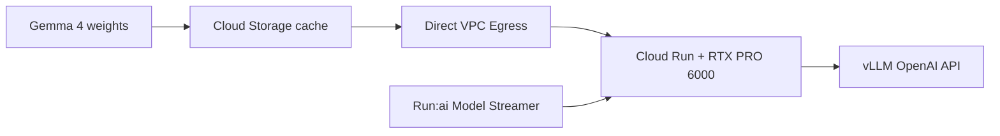
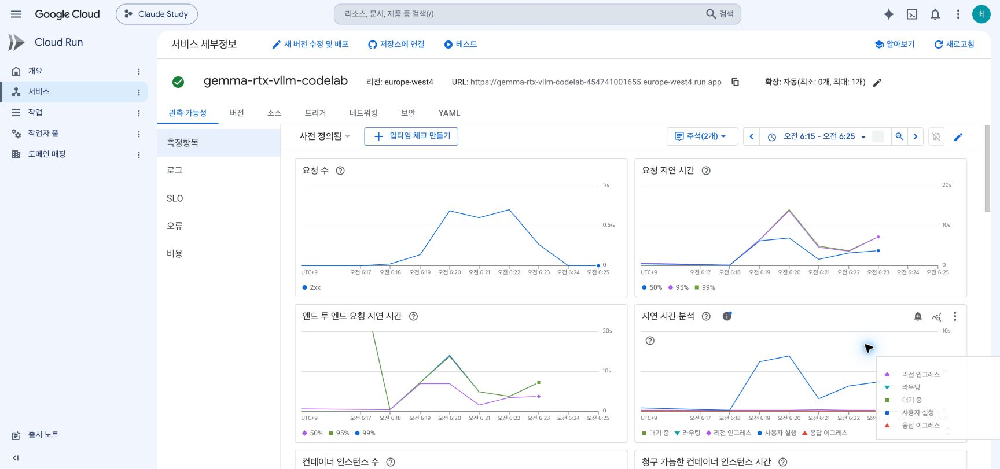
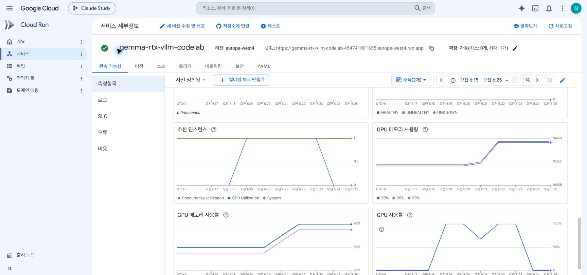
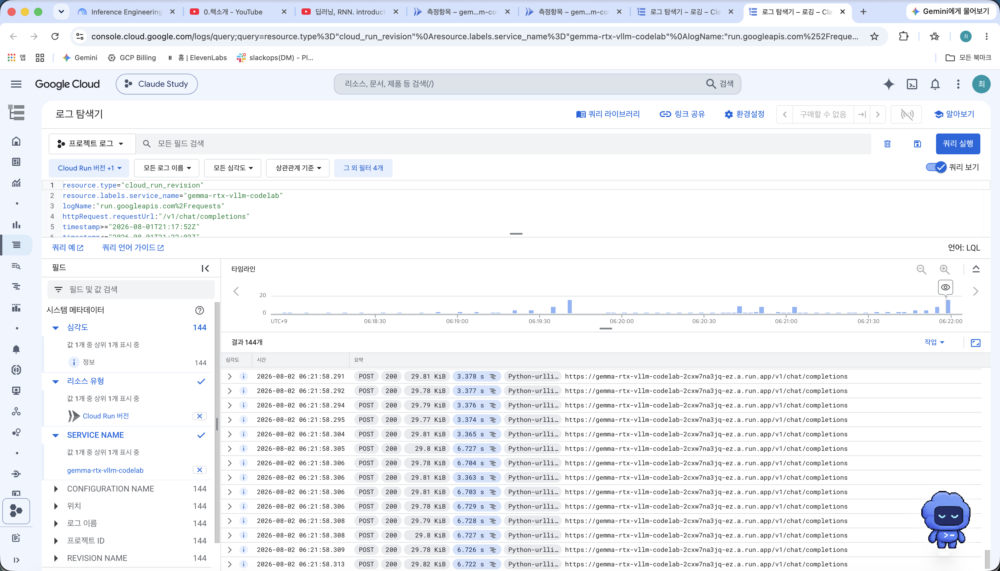
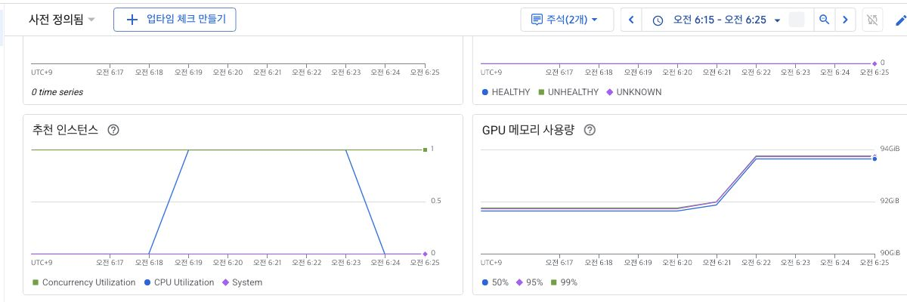

# Run inference of Gemma 4 model on Cloud Run with RTX 6000 Pro GPU with vLLM

<aside>
🎯

**한 줄 요약**: Gemma 4 31B-it 가중치를 Cloud Storage에 미리 캐시하고, Cloud Run의 RTX PRO 6000 GPU에서 vLLM으로 OpenAI 호환 API를 제공하는 실습이다. Direct VPC Egress와 Run:ai Model Streamer가 인스턴스 기동 시 모델 로딩 시간을 줄이는 핵심이다.

</aside>

## 목차

- [이 문서의 목표](#이-문서의-목표)
- [전체 흐름](#전체-흐름)
- [스터디 공유 본문](#스터디-공유-본문)
  - [3. 원문과 달라진 실제 문제](#3-원문과-달라진-실제-문제)
  - [4. 콜드 스타트 실측](#4-콜드-스타트-실측)
  - [5. A1~A4 최종 결과](#5-a1a4-최종-결과)
  - [6. 실습 증거](#6-실습-증거)
  - [7. 결과 해석과 한계](#7-결과-해석과-한계)
- 재현 부록
  - [A. 원문 배포 절차](#재현-부록-a-원문-배포-절차)
  - [B. 실제 GCP 수행 기록](#재현-부록-b-실제-gcp-수행-기록)
  - [C. 성능 측정과 인증 절차](#재현-부록-c-성능-측정과-인증-절차)
  - [D. 트러블슈팅과 운영 상태](#재현-부록-d-트러블슈팅과-운영-상태)
- [참고 자료](#참고-자료)

---

## 이 문서의 목표

| 항목 | 내용 |
| --- | --- |
| 모델 | `google/gemma-4-31B-it` |
| 추론 엔진 | vLLM + Run:ai Model Streamer |
| 실행 환경 | Cloud Run Gen2, NVIDIA RTX PRO 6000 GPU 1개 |
| 모델 저장소 | Cloud Storage 단일 리전 버킷 |
| API | 인증된 OpenAI 호환 `/v1/chat/completions` |

> **주의**: 이 기능은 Pre-GA이며 지원 범위가 변경될 수 있다. GPU·Cloud Build·Cloud Storage 비용이 발생하므로 마지막 정리 단계를 반드시 실행한다.
>

### 이 실습이 스터디에서 맡는 역할

쉽게 말하면, **책에서 배운 “LLM 서버가 빨라지는 원리”를 실제 31B 모델로 확인하는 실습**이다. 모델에게 질문이 되는지만 보는 것이 아니라, 요청이 늘거나 입력·출력이 길어질 때 어디서 느려지는지를 숫자로 확인한다.

| 실험 | 확인하는 것 | 스터디 연결 |
| --- | --- | --- |
| A1 배칭 | 요청을 함께 처리하면 처리량이 어디까지 늘어나는가 | CH3·CH6 배칭 |
| A2 Prefix Caching | 같은 긴 앞부분을 재사용하면 첫 토큰이 얼마나 빨라지는가 | CH6 KV cache·prefix caching |
| A3 Prefill/Decode | 긴 입력과 긴 출력은 각각 어떤 지표를 느리게 만드는가 | CH2 prefill·decode |
| A4 Goodput | 빠른 요청의 수가 아니라 SLO를 지킨 요청을 얼마나 처리하는가 | CH3·CH4 성능 측정·용량 계획 |

Cloud Run·GCS·VPC는 이 실험을 실행하는 **인프라**이고, vLLM의 배칭·캐싱·양자화와 TTFT·처리량·goodput이 이 스터디의 본론이다. 따라서 주제에는 잘 맞는다. 다만 한 번의 수치만으로 최적 설정을 결론 내리기보다, 같은 측정기를 WSL2와 EKS에서도 실행해 비교해야 학습 효과가 완성된다.

## 전체 흐름



---

## 스터디 공유 본문

### 3. 원문과 달라진 실제 문제

| 지점 | 원문 | 실제 환경에서의 변경 | 배운 점 |
| --- | --- | --- | --- |
| 모델 복사 | `gcloud storage cp -r -D` | `-D`를 제거하고 GCS 서버사이드 복사 사용 | 58.28GiB를 로컬 회선으로 내려받았다가 다시 올리는 경로를 피함 |
| GPU 확장 | 최대 인스턴스 3 | 프로젝트 할당량에 맞춰 1로 축소 | 조회 명령보다 실제 배포 오류의 `requested: 3 allowed: 1`이 적용 한도를 정확히 보여줌 |
| CLI 준비 | beta 명령 바로 실행 | `gcloud components install beta --quiet` 선행 | 비대화형 환경에서는 설치 프롬프트도 배포를 멈출 수 있음 |

서버사이드 모델 복사는 미국 리전에서 `europe-west4`까지 **30분 56초**가 걸렸다. 이 차이는 단순한 명령 수정이 아니라 대형 모델을 어디에서 이동시키는지에 관한 문제다. 자세한 오류와 명령은 [재현 부록 B](#재현-부록-b-실제-gcp-수행-기록)에 남겼다.

### 4. 콜드 스타트 실측

| 단계 | 시각(UTC) | 시작 후 경과 |
| --- | --- | ---: |
| 인스턴스 시작 | 18:50:36 | — |
| Run:ai Model Streamer 로딩 완료 | 18:53:07 | 모델 로딩 73초 |
| vLLM 서버 리슨 | 18:54:59 | 4분 23초 |
| Cloud Run `Ready=True` | 18:55:07 | **4분 31초** |

58.28GiB 체크포인트는 GPU에 31.47GiB로 적재됐고, 남은 57.09GiB가 KV cache 124,704토큰에 할당됐다. 따라서 이 구성에서 scale-to-zero는 유휴 비용을 줄이지만, 첫 요청이 약 4분 30초를 기다릴 수 있다는 의미이기도 하다.

### 5. A1~A4 최종 결과

측정 원본은 [`a1-a4-20260801-211752.json`](../labs/cloudrun-gemma4-vllm/results/a1-a4-20260801-211752.json), 터미널 출력은 [`a1-a4-20260801-211752.log`](../labs/cloudrun-gemma4-vllm/results/a1-a4-20260801-211752.log)에 있다. warmup을 제외한 **143건이 모두 성공**했고, 전 요청에서 API가 제공한 정확한 토큰 수를 사용했다.

| 실험 | 핵심 결과 | 해석 |
| --- | --- | --- |
| A1 배칭 | 동시성 1→8에서 출력 처리량 37.5→289.5 tok/s. 동시성 16은 294.6 tok/s로 증가 폭이 거의 없고 TTFT p50이 3.688초로 상승 | `MAX_NUM_SEQS=8` 이후에는 처리량보다 큐 대기가 커짐 |
| A2 Prefix Caching | miss 대조군 TTFT p50 0.859초, hit 0.470초 | 동일 prefix 재사용으로 TTFT **45.3% 감소** |
| A3 Prefill/Decode | 긴 입력·동시성 8에서 TTFT p50 2.827초, goodput 25%. 긴 출력·동시성 8은 TTFT p50 0.403초, goodput 100% | 이 조건에서는 긴 출력보다 긴 입력의 prefill이 SLO를 먼저 깨뜨림 |
| A4 Goodput | 동시성 1·2·4·8은 goodput 100%, 동시성 16은 50% | TTFT 2초·E2E 30초 SLO 기준 최대 동시성은 **8** |

단순 성공률만 보면 동시성 16도 16건 모두 성공한다. 그러나 절반은 TTFT SLO를 넘는다. 이 차이가 처리량만이 아니라 goodput을 함께 봐야 하는 이유다.

### 6. 실습 증거

Cloud Run 콘솔은 원시 결과의 실행 구간 `2026-08-01 21:17:52~21:22:03Z`를 한국시간 `2026-08-02 06:17:52~06:22:03`으로 변환해 확인했다. 차트는 앞뒤 여유를 둔 `06:15~06:25` 범위다.







Metrics와 Logs는 서버 측 요청·지연·GPU 부하를 증명한다. TTFT·tok/s·goodput의 최종 근거는 벤치마크 JSON과 터미널 로그다.

### 7. 결과 해석과 한계

- **배칭**: 동시성 8까지는 처리량이 늘지만 16에서는 거의 포화되고 TTFT가 급격히 증가했다.
- **Prefix Caching**: 길이를 맞춘 miss 대조군과 비교해 TTFT 감소를 확인했다.
- **Prefill**: 긴 입력이 동시성 8에서 TTFT SLO를 먼저 무너뜨렸다. 입력 길이와 동시성을 함께 용량 계획에 반영해야 한다.
- **서버리스 GPU**: scale-to-zero는 유휴 GPU 비용을 줄이지만 4분대 콜드 스타트와 맞바꾼다.
- **FP8 한계**: 로그에는 보정되지 않은 scaling factor 1.0이 정확도를 낮출 수 있다는 경고가 남았다. 이번 실험은 성능 측정이며 품질 평가는 하지 않았다.
- **검증 범위**: 단일 GPU·단일 리전·한 차례의 측정 결과다. 같은 측정기를 WSL2와 EKS에서 반복해야 환경별 차이를 비교할 수 있다.
- **남은 인증**: A1~A4 완료 터미널 화면과 실제 Container instance count 차트는 아직 보완이 필요하다.

---

## 재현 부록 A. 원문 배포 절차

<details>
<summary><strong>1. 기본 리소스 준비</strong></summary>

### 2. Setup and Requirements

Cloud Shell 또는 로컬 Cloud SDK에서 프로젝트·리전·리소스 이름을 고정한다.

이 저장소의 실제 프로젝트는 루트 `.env`의 `PROJECT_ID`에 들어 있다. 아래 값은 원문을 재사용할 수 있도록 자리표시자로 남겼으며, 보완한 벤치마크 스크립트는 `--project`를 생략하면 `.env`에서 이 키만 읽는다.

```bash
export MODEL_NAME="google/gemma-4-31B-it"
export SERVICE_NAME="gemma-rtx-vllm-codelab"
export GOOGLE_CLOUD_PROJECT="<YOUR_PROJECT_ID>"
export GOOGLE_CLOUD_REGION="europe-west4"
export SERVICE_ACCOUNT="vllm-service-sa"
export SERVICE_ACCOUNT_EMAIL="$SERVICE_ACCOUNT@$GOOGLE_CLOUD_PROJECT.iam.gserviceaccount.com"
export MODEL_CACHE_BUCKET="$GOOGLE_CLOUD_PROJECT-$GOOGLE_CLOUD_REGION-hf-model-cache"
export GCS_MODEL_LOCATION="gs://$MODEL_CACHE_BUCKET/model-cache/$MODEL_NAME"
export VPC_NETWORK="vllm-$GOOGLE_CLOUD_REGION-net"
export VPC_SUBNET="vllm-$GOOGLE_CLOUD_REGION-subnet"
export SUBNET_RANGE="10.8.0.0/26"

gcloud config set project "$GOOGLE_CLOUD_PROJECT"
gcloud config set run/region "$GOOGLE_CLOUD_REGION"
```

필수 API:

```bash
gcloud services enable run.googleapis.com cloudbuild.googleapis.com   artifactregistry.googleapis.com iam.googleapis.com compute.googleapis.com   vpcaccess.googleapis.com storage.googleapis.com
```

### 3. Create Service Account

Compute Engine 기본 서비스 계정 대신 Cloud Run 전용 서비스 계정을 만든다. 과도한 기본 권한을 피하기 위한 출발점이다.

```bash
gcloud iam service-accounts create "$SERVICE_ACCOUNT"   --project "$GOOGLE_CLOUD_PROJECT"   --display-name "vLLM Service Account"
```

### 4. Setup Cloud Storage

가중치는 수십 GB 이상이므로 시작할 때마다 외부 모델 허브에서 받지 않는다. Cloud Run과 **동일한 단일 리전**의 GCS 버킷에 캐시한다.

```bash
gcloud storage buckets create "gs://$MODEL_CACHE_BUCKET"   --uniform-bucket-level-access   --public-access-prevention   --project "$GOOGLE_CLOUD_PROJECT"   --location "$GOOGLE_CLOUD_REGION"
```

- Uniform bucket-level access: 객체 ACL 대신 IAM으로 일관되게 제어
- Public access prevention: 실수로 모델을 공개하는 것을 차단
- 같은 리전: 지연과 모델 로딩 경로를 최소화

</details>

---

<details>
<summary><strong>2. 모델 캐시·네트워크·권한 구성</strong></summary>

### 5. Retrieve and Cache Model Weights

로컬 디스크를 거치지 않고 Cloud Build의 대용량 디스크를 사용해 모델을 GCS에 적재한다.

#### 옵션 A — 공개 GCS에서 복사

Google이 제공하는 Gemma 4 공개 버킷을 내 버킷으로 복사하는 가장 간단한 경로다. Codelab은 `E2_HIGHCPU_32`, 500GB 디스크의 Cloud Build를 사용한다.

```bash
gcloud storage cp -r -D   "gs://vertex-model-garden-public-us/gemma4/gemma-4-31B-it"   "$GCS_MODEL_LOCATION"
```

> `-D`(daisy-chain)는 실행 머신을 경유해 내려받았다 다시 올리는 모드다. Cloud Build 밖(로컬·Cloud Shell)에서 실행한다면 `-D`를 빼고 서버사이드 복사를 쓴다 — [실제 GCP 수행 기록](#재현-부록-b-실제-gcp-수행-기록) 참조.
>

### 6. Configure Networking for Direct VPC Egress

Cloud Run이 VPC를 통해 Cloud Storage 같은 Google API에 접근하도록 구성한다. 서브넷에는 **Private Google Access**가 필요하다.

```bash
gcloud compute networks create "$VPC_NETWORK"   --subnet-mode=custom --bgp-routing-mode=regional   --project "$GOOGLE_CLOUD_PROJECT"

gcloud compute networks subnets create "$VPC_SUBNET"   --network="$VPC_NETWORK" --region="$GOOGLE_CLOUD_REGION"   --range="$SUBNET_RANGE" --enable-private-ip-google-access   --project "$GOOGLE_CLOUD_PROJECT"
```

### 7. Configure Service Account Access Policy

Cloud Run 런타임 서비스 계정이 모델 버킷을 읽을 수 있어야 한다. Codelab은 단순화를 위해 `Storage Admin`을 부여한다.

```bash
gcloud storage buckets add-iam-policy-binding "gs://$MODEL_CACHE_BUCKET"   --member "serviceAccount:$SERVICE_ACCOUNT_EMAIL"   --role "roles/storage.admin"   --project "$GOOGLE_CLOUD_PROJECT"
```

> 운영 환경에서는 필요한 작업을 확인한 후 가능한 한 `roles/storage.objectViewer` 등 더 좁은 권한으로 줄인다.
>

</details>

---

<details>
<summary><strong>3. vLLM 설정과 Cloud Run 배포</strong></summary>

### 8. Initialize Configuration Variables

vLLM과 Cloud Run의 성능·용량 파라미터를 설정한다.

```bash
export MAX_MODEL_LEN="32767"
export QUANTIZATION_TYPE="fp8"
export KV_CACHE_DTYPE="fp8"
export GPU_MEM_UTIL="0.95"
export TENSOR_PARALLEL_SIZE="1"
export MAX_NUM_SEQS="8"

export CLOUD_RUN_CPU_NUM=20
export CLOUD_RUN_MEMORY_GB=80
export CLOUD_RUN_MAX_INSTANCES=3
export CLOUD_RUN_CONCURRENCY=16
```

> 기본 프로젝트의 RTX PRO 6000 할당량은 **1**이라 `CLOUD_RUN_MAX_INSTANCES=3`이면 배포가 거부된다. 증설 전에는 1로 두거나 `g.co/cloudrun/gpu-quota`에서 요청한다 — [실제 GCP 수행 기록](#재현-부록-b-실제-gcp-수행-기록) 참조.
>

| 파라미터 | 의미 / 조정 기준 |
| --- | --- |
| `MAX_MODEL_LEN` | 최대 컨텍스트 길이. 클수록 KV cache 메모리 사용량 증가 |
| `MAX_NUM_SEQS` | vLLM 배치 내 동시 시퀀스. 처리량은 늘지만 지연/OOM 위험도 증가 |
| `CLOUD_RUN_CONCURRENCY` | 인스턴스당 HTTP 동시 요청. `MAX_NUM_SEQS` 이상, 보통 약 2배부터 관측 |
| `GPU_MEM_UTIL` | vLLM GPU 메모리 사용 비율 |
| `CLOUD_RUN_MAX_INSTANCES` | 수평 확장 상한. 단일 인스턴스 지연이 허용될 때 전체 용량 확장 |

OOM이 나면 우선 `MAX_NUM_SEQS` 또는 `MAX_MODEL_LEN`을 낮춘다. FP8 모델/KV cache 양자화는 메모리를 줄이고 성능을 높일 수 있지만, 실제 품질 평가는 별도로 해야 한다.

### 9. Deploy to Cloud Run

`--load-format runai_streamer`로 Model Streamer를 사용하고, Gemma 4의 tool call/reasoning parser를 지정한다.

```bash
CONTAINER_ARGS=(
  "vllm" "serve" "$GCS_MODEL_LOCATION"
  "--served-model-name" "$MODEL_NAME"
  "--enable-log-requests" "--enable-chunked-prefill" "--enable-prefix-caching"
  "--generation-config" "auto"
  "--enable-auto-tool-choice" "--tool-call-parser" "gemma4"
  "--reasoning-parser" "gemma4"
  "--dtype" "bfloat16" "--quantization" "$QUANTIZATION_TYPE"
  "--kv-cache-dtype" "$KV_CACHE_DTYPE"
  "--max-num-seqs" "$MAX_NUM_SEQS"
  "--gpu-memory-utilization" "$GPU_MEM_UTIL"
  "--tensor-parallel-size" "$TENSOR_PARALLEL_SIZE"
  "--load-format" "runai_streamer" "--port" "8080" "--host" "0.0.0.0"
)
if [[ "$MAX_MODEL_LEN" != "" ]]; then
  CONTAINER_ARGS+=("--max-model-len" "$MAX_MODEL_LEN")
fi
export CONTAINER_ARGS_STR="${CONTAINER_ARGS[*]}"
```

핵심 배포 옵션:

```bash
gcloud beta run deploy "$SERVICE_NAME"   --image="us-docker.pkg.dev/vertex-ai/vertex-vision-model-garden-dockers/pytorch-vllm-serve:gemma4"   --project "$GOOGLE_CLOUD_PROJECT" --region "$GOOGLE_CLOUD_REGION"   --service-account "$SERVICE_ACCOUNT_EMAIL" --execution-environment gen2   --no-allow-unauthenticated   --cpu="$CLOUD_RUN_CPU_NUM" --memory="$CLOUD_RUN_MEMORY_GB"Gi   --gpu=1 --gpu-type=nvidia-rtx-pro-6000 --no-gpu-zonal-redundancy   --no-cpu-throttling --max-instances "$CLOUD_RUN_MAX_INSTANCES"   --concurrency "$CLOUD_RUN_CONCURRENCY"   --network "$VPC_NETWORK" --subnet "$VPC_SUBNET" --vpc-egress all-traffic   --port=8080 --timeout=3600 --cpu-boost   --startup-probe tcpSocket.port=8080,initialDelaySeconds=240,failureThreshold=40,timeoutSeconds=10,periodSeconds=15   --command "bash" --args="^;^-c;$CONTAINER_ARGS_STR"
```

- `--no-allow-unauthenticated`: 인증된 호출만 허용
- `--gpu-type=nvidia-rtx-pro-6000`: GPU 종류 지정
- `--no-cpu-throttling`, `--cpu-boost`: 기동·추론 시 CPU 성능 확보
- 대형 모델의 느린 초기화에 맞춰 긴 timeout/startup probe 설정

</details>

---

<details>
<summary><strong>4. 호출 검증과 리소스 정리</strong></summary>

### 10. Test the Service

서비스 URL을 얻은 뒤, Google ID 토큰으로 vLLM OpenAI 호환 API를 호출한다.

```bash
SERVICE_URL=$(gcloud run services describe "$SERVICE_NAME"   --project "$GOOGLE_CLOUD_PROJECT" --region "$GOOGLE_CLOUD_REGION"   --format 'value(status.url)')

curl -s "$SERVICE_URL/v1/chat/completions"   -H "Authorization: Bearer $(gcloud auth print-identity-token)"   -H "Content-Type: application/json"   -d '{
    "model": "'"$MODEL_NAME"'",
    "messages": [{"role":"user","content":"Why is the sky blue?"}],
    "chat_template_kwargs":{"enable_thinking":true},
    "skip_special_tokens":false
  }' | jq -r '.choices[0].message.content'
```

실패하면 호출자의 Cloud Run Invoker 권한, 서비스 Ready/startup probe 로그, 서비스 계정의 GCS 접근, GPU quota·리전 가용성, OOM 여부를 차례로 확인한다.

### 12. Clean up

비용 발생을 중지하려면 서비스·서비스 계정·버킷·VPC를 삭제한다.

```bash
gcloud run services delete "$SERVICE_NAME"   --project "$GOOGLE_CLOUD_PROJECT" --region "$GOOGLE_CLOUD_REGION" --quiet

gcloud iam service-accounts delete "$SERVICE_ACCOUNT_EMAIL"   --project "$GOOGLE_CLOUD_PROJECT" --quiet

gcloud storage rm --recursive "gs://$MODEL_CACHE_BUCKET"

gcloud compute networks subnets delete "$VPC_SUBNET"   --region "$GOOGLE_CLOUD_REGION" --project "$GOOGLE_CLOUD_PROJECT" --quiet
gcloud compute networks delete "$VPC_NETWORK"   --project "$GOOGLE_CLOUD_PROJECT" --quiet
```

실습 전용 프로젝트라면 `gcloud projects delete "$GOOGLE_CLOUD_PROJECT"`로 전체 프로젝트를 삭제할 수도 있다. 되돌릴 수 없으므로 프로젝트 ID를 확인한다.

</details>

---

## 재현 부록 B. 실제 GCP 수행 기록

이 문서의 절차를 개인 GCP 프로젝트에서 처음부터 끝까지 실행한 기록이다. 아래 수치·로그는 모두 실행 결과에서 그대로 옮긴 것이다.

<details>
<summary><strong>5. 실행 환경</strong></summary>

| 항목 | 값 |
| --- | --- |
| 프로젝트 | 개인 실습 프로젝트 (`.env`의 `PROJECT_ID` 사용) |
| 리전 | `europe-west4` |
| 실행 위치 | 로컬 macOS + Google Cloud SDK 571.0.0 (Cloud Shell 아님) |
| 서비스 | `gemma-rtx-vllm-codelab`, 리비전 `gemma-rtx-vllm-codelab-00001-7pm` |
| GPU | `run.googleapis.com/accelerator=nvidia-rtx-pro-6000`, `nvidia.com/gpu: 1` |
| vLLM | `0.17.2rc1.dev133+g9279c59a0` (`pytorch-vllm-serve:gemma4`) |
| 모델 | 10개 객체 / 62,578,670,545 B (58.28 GiB), 소스와 바이트 단위 일치 |

</details>

---

<a id="원문과-결정적으로-갈라진-지점"></a>

<details>
<summary><strong>6. 원문과 결정적으로 갈라진 지점</strong></summary>

### 문제 1 — §5 `gcloud storage cp`에서 `-D`를 뺐다

`-D`는 `--daisy-chain`으로, **객체를 실행 머신에 내려받은 뒤 다시 업로드**하는 모드다. Codelab이 이 명령을 `E2_HIGHCPU_32` + 500GB 디스크 Cloud Build에서 돌리는 이유가 이것이다. 로컬에서 그대로 실행하면 58GiB를 집 회선으로 내렸다 올리게 된다. 플래그를 빼면 GCS 서버사이드 복사(copy in the cloud)가 되어 로컬 대역폭을 쓰지 않는다.

```bash
# 로컬/Cloud Shell에서 실행할 때
gcloud storage cp -r "gs://vertex-model-garden-public-us/gemma4/gemma-4-31B-it" "$GCS_MODEL_LOCATION"
```

미국 → `europe-west4` 서버사이드 복사 소요: **30분 56초** (18:15:24 → 18:46:20 UTC).

### 문제 2 — §8 `CLOUD_RUN_MAX_INSTANCES`를 3 → 1로 낮췄다

원문 값 3으로 배포하면 실패한다.

```
ERROR: (gcloud.beta.run.deploy) spec.template.metadata.annotations[autoscaling.knative.dev/maxScale]:
Max instances must be set to 1 or fewer in order to set GPU requirements.
Quota violated:
NvidiaRtxPro6000GpuAllocNoZonalRedundancyPerProjectRegion requested: 3 allowed: 1
```

> **주의**: 사전 확인용으로 쓴 `gcloud beta quotas info describe NvidiaRtxPro6000GpuAllocNoZonalRedundancyPerProjectRegion`은 `europe-west4`에 대해 `value: 1000`을 반환했지만, **실제 허용치는 1**이었다. 이 명령의 값은 적용 한도가 아니므로 신뢰하지 말고, 배포 에러 메시지(`requested: N allowed: M`)를 실측 기준으로 삼는다. GPU 인스턴스를 2개 이상 쓰려면 `g.co/cloudrun/gpu-quota`에서 증설을 요청해야 한다.

또 `gcloud beta run deploy`를 쓰므로 **beta 컴포넌트 설치가 선행**되어야 한다(`gcloud components install beta`). 비대화형 환경에서는 `--quiet` 없이는 설치 프롬프트에서 멈춘다.

</details>

---

<details>
<summary><strong>7. 콜드 스타트 타임라인 — Cloud Run 로그 실측</strong></summary>

| 시각(UTC) | 이벤트 | 소요 |
| --- | --- | --- |
| 18:50:36 | 인스턴스 시작 (`DEPLOYMENT_ROLLOUT`) | — |
| 18:51:17 | vLLM 프로세스 기동 | +41s |
| 18:51:44 | V1 엔진 초기화, fp8 온라인 양자화 커널 선택 | +27s |
| 18:53:07 | **Run:ai Model Streamer 로딩 완료** | 1188 텐서 / 1분 13초 |
| 18:54:24 | `torch.compile` 완료 | 62.19s |
| 18:54:40 | KV cache 확보 | — |
| 18:54:44 | `init engine (profile, create kv cache, warmup)` | 97.04s |
| 18:54:59 | `Starting vLLM server on http://0.0.0.0:8080` | — |
| 18:55:07 | Cloud Run `Ready=True` | — |

**인스턴스 시작 → 서버 리슨: 4분 23초**, → `Ready`: 4분 31초. 원문의 `initialDelaySeconds=240` + `failureThreshold=40` 설정이 왜 그 크기인지 실측으로 확인된다 — 240초 지연은 실제 서버 기동(263초)보다 짧아 프로브가 헛돌지 않고, 이후 15초 간격 재시도로 흡수된다.

핵심 로그:

```
Loading safetensors using Runai Model Streamer: 100% Completed | 1188/1188 [01:13<00:00, 16.21it/s]
INFO [gpu_model_runner.py:4601] Model loading took 31.47 GiB memory and 78.084206 seconds
INFO [__init__.py:255] Selected CutlassFP8ScaledMMLinearKernel for Fp8OnlineLinearMethod
INFO [gpu_worker.py:456] Available KV cache memory: 57.09 GiB
INFO [kv_cache_utils.py:1316] GPU KV cache size: 124,704 tokens
INFO [core.py:281] init engine (profile, create kv cache, warmup model) took 97.04 seconds
```

읽어낼 점 3가지:

1. **Model Streamer 처리량 약 0.8 GiB/s** — 58.28 GiB를 73초에 읽었다. Direct VPC Egress + 동일 리전 버킷 조합의 효과가 여기서 나온다.
2. **fp8 온라인 양자화가 실제로 걸렸다** — 디스크상 bf16 58.28 GiB가 GPU에는 31.47 GiB로 적재됐다. 원문 §8의 `--quantization fp8`은 fp8 체크포인트를 받는 게 아니라 **런타임에 양자화**하는 경로다.
3. **남은 메모리가 전부 KV cache로 간다** — 57.09 GiB / 124,704 토큰. `MAX_MODEL_LEN=32767` 기준 컨텍스트 3~4개 분량이며, `MAX_NUM_SEQS=8`이 여유 있게 들어간다.

</details>

---

<details>
<summary><strong>8. 추론 검증</strong></summary>

`/v1/models` → HTTP 200, `id: google/gemma-4-31B-it`, `max_model_len: 32767`, `root`가 GCS 경로로 표시된다.

원문의 `Why is the sky blue?` 호출 결과:

```
usage: {"prompt_tokens":21,"completion_tokens":993,"total_tokens":1014}
finish_reason: "stop"
model: "google/gemma-4-31B-it"
```

> The shortest answer is a phenomenon called **Rayleigh scattering**. … Because **blue light** travels in shorter, smaller waves, it crashes into the gas molecules and gets scattered (bounced) in every direction. …

| 측정 | 값 |
| --- | --- |
| 비스트리밍 993 토큰 생성 | 27.3s (≈36 tok/s) |
| 스트리밍 TTFT (warm) | **0.411s** |
| 스트리밍 decode 처리량 | **38.5 tok/s** |
| vLLM 로그상 generation throughput | 29.6 ~ 38.9 tok/s |

동시성 1 기준 수치다. `CLOUD_RUN_CONCURRENCY=16` / `MAX_NUM_SEQS=8`의 동시성 부하 및 Prefix Caching 효과는 아래 **실험 A1, A2**에서 처음 관찰했다.

</details>

---

## 재현 부록 C. 성능 측정과 인증 절차

<details>
<summary><strong>9. 왜 1차 A1·A2 결과를 다시 측정했는가</strong></summary>

초기 측정에서는 동시성 8 이후의 처리량 포화와 Prefix Caching의 TTFT 감소를 관찰했다. 하지만 다음 문제 때문에 숫자 자체는 최종 기준선에서 제외했다.

- TTFT를 첫 내용 토큰이 아니라 첫 SSE 이벤트로 측정했다.
- 출력 토큰 수를 API `usage` 대신 `문자 수 ÷ 4`로 추정했다.
- 동시성 1에만 콜드 스타트가 섞였고 요청별 원시 JSON이 없었다.
- Prefix Caching은 길이를 맞춘 miss 대조군 없이 첫 요청과 후속 요청만 비교했다.

따라서 1차 결과는 병목 가설을 세우는 용도로만 사용하고, 발표 수치는 다음 A1~A4 재측정 결과만 사용한다.

</details>

---

<details>
<summary><strong>10. 보완한 재측정 프로토콜 — A1~A4</strong></summary>

[`labs/cloudrun-gemma4-vllm/benchmark_a1_a4.py`](../labs/cloudrun-gemma4-vllm/benchmark_a1_a4.py)는 다음처럼 보완했다.

- 첫 `content` 또는 `reasoning_content` 조각이 도착한 시점을 TTFT로 기록
- 스트리밍 `usage.completion_tokens`를 사용하고, 없을 때만 추정치로 표시
- 콜드 스타트 관측값을 warm 배칭 결과에서 분리
- A2 외 실험의 프롬프트 첫 블록을 고유화해 Prefix Caching 혼입 방지
- A2는 같은 길이의 고유 prefix miss 대조군과 cache hit 반복 비교
- 모든 요청과 집계값을 JSON으로 저장
- TTFT·E2E SLO를 모두 만족한 요청 비율을 goodput으로 계산

기본 측정에서는 reasoning 길이의 변동을 줄이려고 thinking을 끈다. reasoning을 포함한 별도 기준선이 필요하면 `--enable-thinking`을 붙이고 결과 파일을 분리한다.

| 실험 | 새 측정 내용 | 완료 판단 |
| --- | --- | --- |
| A1 | warm 동시성 `1,2,4,8,16`의 TTFT·정확한 tok/s | 처리량이 포화되기 시작하는 지점 |
| A2 | cache hit와 고유 prefix miss 대조군 | TTFT p50/p95 차이가 반복되는가 |
| A3 | 짧은 요청·긴 입력·긴 출력, 동시성 `1,8` | prefill은 TTFT, decode는 E2E/tok/s에 미치는 영향 |
| A4 | 동시성별 TTFT 2초·E2E 30초 goodput | SLO를 지키는 최대 동시성 |

먼저 스모크 테스트로 인증과 결과 저장만 확인한다. 이 명령은 scale-to-zero 상태의 GPU를 기동하므로 비용이 발생할 수 있다.

```bash
python3 labs/cloudrun-gemma4-vllm/benchmark_a1_a4.py \
  --exp smoke \
  --output labs/cloudrun-gemma4-vllm/results/smoke.json
```

스모크 결과가 성공한 뒤 전체 실험을 실행한다.

```bash
python3 labs/cloudrun-gemma4-vllm/benchmark_a1_a4.py \
  --exp all \
  --ttft-slo 2 \
  --e2e-slo 30 \
  --output labs/cloudrun-gemma4-vllm/results/a1-a4-rerun.json
```

`exact_usage_requests`가 성공 요청 수보다 작으면 해당 구간의 tok/s에 추정 토큰이 섞였다는 뜻이다. 그 결과는 정확한 기준선으로 승격하지 않는다.

</details>

---

<details>
<summary><strong>11. 실습 인증 스크린샷</strong></summary>

#### 인증 캡처 현황 — 3종 통과, 1종 부분 통과, 1종 재촬영 필요

2026-08-02 로그인된 Chrome 세션으로 Cloud Run 콘솔을 직접 열어 다시 검수했다. 원시 결과의 UTC 실행 구간은 한국시간으로 `2026-08-02 06:17:52~06:22:03 (UTC+9)`이며, 측정항목 캡처는 앞뒤 여유를 둔 `06:15~06:25`로 맞췄다.

| 파일명 | 링크 | 검수 판정 | 확인 결과 |
| --- | --- | --- | --- |
| `proof-01-terminal-a1-a4.png` | — | ❌ 재촬영 | 실행 결과가 아니라 AI 작업 패널과 대기·캡처 명령이 보임. 공유본에는 첨부하지 않음 |
| `proof-02-request-load.png` | [proof-02](./screenshots/proof-02-request-load.png) | ✅ 통과 | `06:15~06:25` 범위에서 요청 수, 요청 지연 시간, 엔드 투 엔드 지연 시간과 부하 형태가 보임. 동시성별 용량 판정은 원시 JSON로 보완 |
| `proof-03-gpu-utilization.png` | [proof-03](./screenshots/proof-03-gpu-utilization.png) | ✅ 통과 | 같은 실행 구간에서 GPU 사용률이 최대 100%까지 올라가고 GPU 메모리 사용률이 약 95~98%로 유지되는 모습이 보임 |
| `proof-04-gpu-memory-instance.png` | [proof-04](./screenshots/proof-04-gpu-memory-instance.png) | ⚠️ 부분 통과 | 추천 인스턴스가 1까지 올라가고 GPU 메모리 사용량이 약 92~94GiB로 증가한 것은 확인됨. 실제 Container instance count 차트는 별도 캡처가 필요 |
| `proof-05-request-logs.png` | [proof-05](./screenshots/proof-05-request-logs.png) | ✅ 통과 | 절대 시각 쿼리, 결과 144건, POST·HTTP 200·요청별 latency가 한 화면에 보임 |

#### 검증된 재측정 결과

원시 파일은 [`a1-a4-20260801-211752.json`](../labs/cloudrun-gemma4-vllm/results/a1-a4-20260801-211752.json), 터미널 로그는 [`a1-a4-20260801-211752.log`](../labs/cloudrun-gemma4-vllm/results/a1-a4-20260801-211752.log)에 저장됐다.

| 검증 항목 | 결과 |
| --- | --- |
| 실행 구간 | `2026-08-01T21:17:52Z` ~ `2026-08-01T21:22:03Z` |
| warmup | 1건 성공, TTFT 0.433s |
| A1~A4 요청 | 143건 전부 성공, 실패 0건 |
| 토큰 집계 | 143건 모두 `tokens_exact=true` |
| Cloud Logging | warmup 포함 POST 144건 |
| Prefix Caching | TTFT p50 0.859s → 0.470s, 45.3% 감소 |
| Goodput 95% 용량 | 최대 동시성 8, 동시성 16에서는 goodput 50% |

대표 인증 이미지는 [스터디 공유 본문의 실습 증거](#6-실습-증거)에 표시했다. 이 부록에서는 파일별 판정과 재촬영 절차만 관리한다.

#### 1. 실행 시각과 원시 결과부터 남긴다

스모크 테스트를 먼저 끝내고, 전체 A1~A4는 별도 시간 구간에서 실행한다. 그래야 스모크 요청이 부하 테스트 로그에 섞이지 않는다.

```bash
set -o pipefail
RUN_STAMP=$(date -u +%Y%m%d-%H%M%S)
START_UTC=$(date -u +%Y-%m-%dT%H:%M:%SZ)

python3 labs/cloudrun-gemma4-vllm/benchmark_a1_a4.py \
  --exp all \
  --ttft-slo 2 \
  --e2e-slo 30 \
  --output "labs/cloudrun-gemma4-vllm/results/a1-a4-${RUN_STAMP}.json" \
  2>&1 | tee "labs/cloudrun-gemma4-vllm/results/a1-a4-${RUN_STAMP}.log"

END_UTC=$(date -u +%Y-%m-%dT%H:%M:%SZ)
printf 'START_UTC=%s\nEND_UTC=%s\n' "$START_UTC" "$END_UTC"
```

측정 직후에는 Monitoring 반영이 늦을 수 있으므로 3~5분 뒤 새로고침한다. Instance count의 0→1→0까지 남기려면 scale-to-zero가 확인될 때까지 기다린 뒤 `OBS_END_UTC=$(date -u +%Y-%m-%dT%H:%M:%SZ)`도 기록한다.

기본 설정의 `--exp all`은 다음 요청을 만든다.

| 구간 | 요청 수 |
| --- | ---: |
| warmup | 1 |
| A1 배칭 | 48 |
| A2 Prefix Caching | 11 |
| A3 prefill/decode | 36 |
| A4 goodput | 48 |
| **합계** | **144** |

`--skip-warmup`을 붙이면 143건이다. 실패·재시도가 있거나 실행 중 다른 호출이 들어오면 Cloud Logging 건수는 달라질 수 있으므로 JSON의 `requests` 길이와 함께 대조한다.

```bash
jq '{meta, warmup, derived, summaries, request_count: (.requests | length)}' \
  "labs/cloudrun-gemma4-vllm/results/a1-a4-${RUN_STAMP}.json"
```

정상 완료라면 JSON의 `request_count`는 warmup을 제외한 143이고 `warmup.ok`는 `true`다. Cloud Logging의 전체 POST 요청은 둘을 합친 144건이어야 한다.

#### 2. 터미널 인증 화면

파일명: `proof-01-terminal-a1-a4.png`

다음 항목이 한 화면에서 읽혀야 한다.

- 실행 명령이 `--exp all`인지
- A1·A2·A3·A4 요약 줄이 모두 있는지
- 실패 수와 goodput이 보이는지
- 마지막 `result=...a1-a4-<시각>.json`
- `START_UTC`, `END_UTC`

편집기 전체 화면, 다른 프로젝트 파일, AI 작업 패널, 실행 중인 spinner는 넣지 않는다. 명령이 끝난 뒤 터미널 영역만 확대하고 불필요한 주변 UI를 잘라낸다.

#### 3. 요청 수·지연·동시성 화면

파일명: `proof-02-request-load.png`

Cloud Run → `gemma-rtx-vllm-codelab` → **관측 가능성 → 측정항목**으로 이동한다.

1. 기간을 `지난 1일`이 아닌 **맞춤 범위**로 바꾼다.
2. 1번에서 기록한 `START_UTC` 1분 전부터 `OBS_END_UTC` 1분 후까지 지정한다.
   - 콘솔 차트가 `UTC+9`로 표시되면 UTC 시각에 9시간을 더한다. 이번 실행의 `21:17:52Z~21:22:03Z`는 한국시간 `06:17:52~06:22:03`이다.
3. 도움말·툴팁을 모두 닫는다.
4. 서비스 이름, 선택 기간, 차트 제목, 축, 범례가 보이게 한다.
5. **Request count**, **Request latency**, **Max concurrent requests**를 캡처한다.

Cloud Run 기본 화면에 Max concurrent requests가 없다면 Monitoring → Metrics Explorer에서 다음 메트릭을 선택한다.

```text
run.googleapis.com/request_count
run.googleapis.com/request_latencies
run.googleapis.com/container/max_request_concurrencies
```

리소스 유형은 `Cloud Run Revision`, 필터는 `service_name = gemma-rtx-vllm-codelab`로 고정한다.

#### 4. GPU·인스턴스 화면

파일명은 화면 수에 따라 다음처럼 나눈다.

- `proof-03-gpu-utilization.png`
- `proof-04-gpu-memory-instance.png`

Cloud Run 화면을 충분히 아래로 내리거나 Metrics Explorer에서 다음 메트릭을 각각 선택한다.

```text
run.googleapis.com/container/gpu/utilizations
run.googleapis.com/container/gpu/memory_utilizations
run.googleapis.com/container/instance_count
```

다음이 보여야 한다.

- A1~A4 실행 구간에서 GPU 사용률이 실제로 올라가는 모습
- 모델 상주 중 GPU 메모리 사용률
- 인스턴스가 0→1로 올라오고 실행 뒤 다시 0으로 내려가는 흐름
- 서비스 필터와 맞춤 시간 범위

GPU 차트가 보이지 않는 상단 요청 차트를 다시 찍어 `GPU 증빙`으로 사용하지 않는다.

#### 5. Logs Explorer 요청 목록

파일명: `proof-05-request-logs.png`

다음 쿼리에서 `START_UTC_VALUE`, `END_UTC_VALUE`를 1번의 실제 값으로 바꾼다.

```text
resource.type="cloud_run_revision"
resource.labels.service_name="gemma-rtx-vllm-codelab"
logName:"run.googleapis.com%2Frequests"
httpRequest.requestUrl:"/v1/chat/completions"
timestamp>="START_UTC_VALUE"
timestamp<="END_UTC_VALUE"
```

`지난 1주` 같은 상대 기간에 의존하지 않는다. 쿼리 자체에 절대 시각을 넣고 다음 항목이 보이게 캡처한다.

- 쿼리의 서비스명·URL 경로·시작·종료 시각
- 결과 건수
- 요청 시각
- POST와 HTTP 200
- 요청별 latency

같은 결과는 `gcloud`로 먼저 검증할 수 있다. `.env` 전체를 불러오지 않고 `PROJECT_ID`만 읽는다.

```bash
PROJECT_ID=$(grep '^PROJECT_ID=' .env | cut -d= -f2-)

gcloud logging read "
resource.type=\"cloud_run_revision\"
resource.labels.service_name=\"gemma-rtx-vllm-codelab\"
logName:\"run.googleapis.com%2Frequests\"
httpRequest.requestUrl:\"/v1/chat/completions\"
timestamp>=\"${START_UTC}\"
timestamp<=\"${END_UTC}\"
" \
  --project "$PROJECT_ID" \
  --limit 300 \
  --order asc \
  --format='table(timestamp,httpRequest.status,httpRequest.latency)'
```

기존 1차 A1·A2만 다시 확인할 때는 `2026-08-01T19:40:00Z`~`19:47:00Z`를 사용하며 기대값은 37건이다. 새 A1~A4 재측정은 이 과거 시각이나 37건을 사용하지 않는다.

#### 6. 선택 — 배포 설정 화면

파일명: `proof-06-revision-config.png`

```bash
gcloud run services describe gemma-rtx-vllm-codelab \
  --project "$PROJECT_ID" \
  --region europe-west4 \
  --format='yaml(
    status.latestReadyRevisionName,
    status.traffic,
    spec.template.metadata.annotations,
    spec.template.spec.containerConcurrency,
    spec.template.spec.containers[0].resources
  )'
```

리비전, 트래픽 100%, 동시성 16, GPU 1개, CPU 20, 메모리 80GiB가 보이는 터미널 영역만 캡처한다.

#### 7. 문서에 넣기 전 최종 검수

- [ ] 이미지가 실행 완료 후 촬영됐는가?
- [ ] 모든 Metrics 차트가 같은 `START_UTC`~`OBS_END_UTC` 관측 범위인가?
- [ ] Logs는 실제 요청 구간인 `START_UTC`~`END_UTC`만 조회했는가?
- [ ] 서비스 필터가 `gemma-rtx-vllm-codelab`인가?
- [ ] 터미널 결과 JSON과 Logs 요청 수가 설명 가능한가?
- [ ] GPU 차트 제목·축·범례가 실제로 보이는가?
- [ ] 도움말·툴팁·다른 탭·AI 작업 패널을 잘라냈는가?
- [ ] 액세스 토큰·이메일·결제 정보가 노출되지 않았는가?
- [ ] 문서에서 일반 링크가 아니라 이미지로 직접 표시했는가?

최종 파일을 만든 뒤 문서에는 다음 형식으로 넣는다.

```markdown




```

Cloud Run 화면만으로는 클라이언트가 첫 토큰을 받은 시점인 TTFT를 복원할 수 없다. Metrics와 Logs는 서버 측 요청·지연·GPU 부하의 증거이고, TTFT·tok/s·goodput은 보완한 측정기의 JSON과 터미널 캡처로 증명한다. 따라서 `proof-01-terminal-a1-a4.png`가 빠지면 완전한 성능 인증으로 보지 않는다.

</details>

---

## 재현 부록 D. 트러블슈팅과 운영 상태

<details>
<summary><strong>12. 로그에서 확인된 주의사항</strong></summary>

```
WARNING [kv_cache.py:147] Using uncalibrated q_scale 1.0 and/or prob_scale 1.0 with fp8 attention.
                          This may cause accuracy issues.
WARNING [kv_cache.py:108] Using KV cache scaling factor 1.0 for fp8_e4m3.
WARNING [kv_cache.py:94]  Checkpoint does not provide a q scaling factor. Setting it to k_scale.
```

`KV_CACHE_DTYPE=fp8`을 bf16 체크포인트에 적용하면 스케일링 팩터가 없어 **1.0으로 고정**된다. 메모리는 줄지만 정확도 저하 가능성이 로그로 명시된다. §8이 "실제 품질 평가는 별도로 해야 한다"고 적은 부분의 구체적 근거다.

그 밖에 `ulimit of 25000` 경고(`Too many open files` 위험)와 `num_gpu_blocks_override=16`(프로파일링 단계의 임시 오버라이드)이 함께 남는다.

</details>

---

<details>
<summary><strong>13. 재현용 명령과 운영 상태</strong></summary>

### 재현용 명령 요약

```bash
# 사전: gcloud components install beta --quiet
gcloud services enable run.googleapis.com cloudbuild.googleapis.com \
  artifactregistry.googleapis.com iam.googleapis.com compute.googleapis.com \
  vpcaccess.googleapis.com storage.googleapis.com

# §5 — -D 없이 (서버사이드 복사)
gcloud storage cp -r "gs://vertex-model-garden-public-us/gemma4/gemma-4-31B-it" "$GCS_MODEL_LOCATION"

# §8 — GPU 할당량 1인 기본 프로젝트 기준
export CLOUD_RUN_MAX_INSTANCES=1
```

### 운영 체크리스트 실행 결과

- [x]  목표 리전에 RTX PRO 6000 GPU와 필요한 quota가 있는가? → `europe-west4` 가용, **할당량 1**
- [x]  GCS 버킷과 Cloud Run 서비스가 같은 리전에 있는가? → 둘 다 `europe-west4`
- [x]  비공개 Cloud Run 호출자에게만 Invoker 권한을 부여했는가? → `--no-allow-unauthenticated`, ID 토큰 호출로 검증
- [x]  cold start, 첫 토큰 지연, 처리량, GPU 메모리를 측정했는가? → 4분 23초 / 0.411s / 38.5 tok/s / KV 57.09 GiB
- [ ]  서비스 계정 권한을 최소화했는가? → 원문대로 `roles/storage.admin` 유지 (실습 범위)
- [ ]  최대 인스턴스·타임아웃·예산 알림을 설정했는가? → max-instances 1, timeout 3600s. 예산 알림 미설정
- [ ]  검증 후 GPU 서비스와 모델 캐시를 삭제했는가? → §12 미실행

> **잔여 비용 주의**: 서비스는 min-instances 0이라 유휴 시 GPU 과금은 없지만, **GCS에 58.28 GiB가 남아 있다**(`europe-west4` 표준 스토리지 기준 월 $1 남짓). 더 쓸 일이 없으면 §12를 실행한다.

</details>

---

## 참고 자료

- [원본 Google Codelab](https://codelabs.developers.google.com/codelabs/cloud-run/cloud-run-gpu-rtx-pro-6000-gemma4-vllm)
- [Cloud Run GPU best practices](https://docs.cloud.google.com/run/docs/configuring/services/gpu-best-practices)
- [vLLM 문서](https://docs.vllm.ai/en/stable)
- [Direct VPC Egress 문서](https://docs.cloud.google.com/run/docs/configuring/vpc-direct-vpc)
