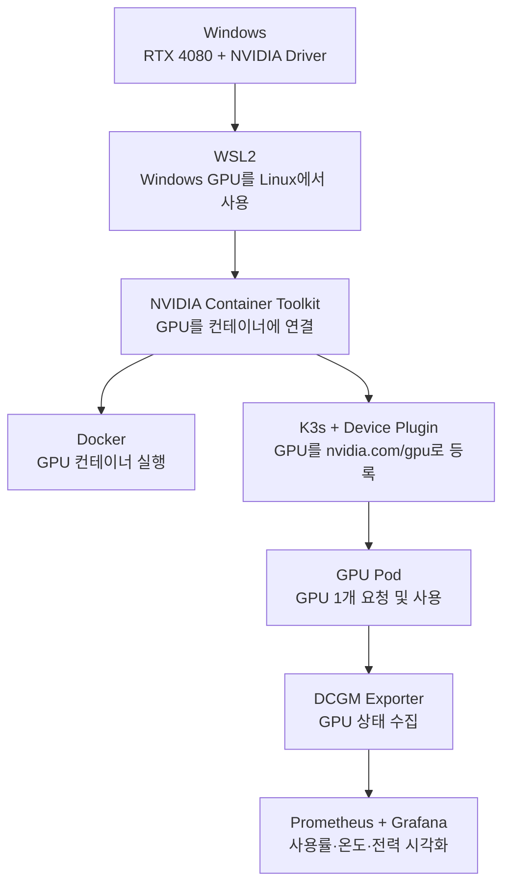

# WSL2를 로컬 GPU Kubernetes 개발 환경으로 사용하기

> **한 줄 요약**: Windows 노트북의 NVIDIA GPU를 **WSL2 → Docker → K3s(Kubernetes) 파드까지 연결하고, 실제 GPU 사용량을 Prometheus와 Grafana로 확인한 실습**이다.
> 

---

## 이 실습에서 확인한 것

이 문서는 GPU 내부 동작 자체를 깊게 분석하는 것이 목적이 아니다. 핵심은 **Windows에 있는 RTX 4080을 컨테이너와 Kubernetes에서도 실제로 사용할 수 있게 만드는 과정**을 이해하는 것이다.

1. WSL2에서 Windows의 NVIDIA GPU가 보이는지 확인한다.
2. Docker 컨테이너에서도 같은 GPU를 사용할 수 있게 연결한다.
3. Kubernetes가 GPU를 하나의 리소스로 인식하고 필요한 파드에 할당하도록 구성한다.
4. GPU 사용률·메모리·온도·전력을 Prometheus와 Grafana에서 확인한다.
5. 실제 연산 부하를 걸어 GPU가 제대로 사용되는지 검증한다.

<aside>

**먼저 기억해 둘 것**

Windows가 실제 GPU와 드라이버를 관리하고, WSL2는 그 GPU를 빌려 쓴다. NVIDIA Container Toolkit은 GPU를 컨테이너에 연결하고, Device Plugin은 Kubernetes가 GPU를 자원처럼 다룰 수 있게 한다. DCGM Exporter는 GPU 상태를 모니터링 시스템에 전달한다.

</aside>

### 용어를 쉽게 보면

| 용어 | 쉽게 말하면 |
| --- | --- |
| WSL2 | Windows 안에서 Linux를 실행하는 환경 |
| NVIDIA Container Toolkit | Docker 컨테이너가 호스트 GPU를 사용할 수 있게 연결해 주는 도구 |
| CDI | GPU를 컨테이너에 연결할 때 어떤 장치와 파일을 넣을지 적어 둔 설정 |
| NVIDIA Device Plugin | Kubernetes에게 "이 노드에 GPU가 몇 개 있다"고 알려주는 구성요소 |
| `nvidia.com/gpu` | Kubernetes에서 CPU·메모리처럼 GPU 개수를 표현하는 리소스 이름 |
| DCGM Exporter | GPU 사용률·온도·전력 같은 값을 Prometheus가 읽을 수 있게 내보내는 도구 |

## 왜 WSL2에서는 조금 다르게 보일까?

일반 Linux 서버에서는 Linux가 NVIDIA 드라이버를 설치하고 GPU를 직접 관리한다. 하지만 WSL2에서는 **GPU의 실제 관리자는 Windows**다. WSL2는 Windows가 제공하는 GPU 통로를 이용해 계산을 요청한다.

따라서 최종적으로 CUDA와 Kubernetes GPU 워크로드는 정상 동작하지만, Linux 안에서 보이는 디바이스 이름과 드라이버 위치가 일반 GPU 서버와 다르다.

| 구분 | 일반 Linux | Windows WSL2 |
| --- | --- | --- |
| GPU 드라이버 | Linux에 NVIDIA 커널 드라이버 설치 | Windows NVIDIA 드라이버 사용 |
| 디바이스 노드 | `/dev/nvidia0`, `/dev/nvidiactl` 등 | `/dev/dxg` |
| 드라이버 라이브러리 | Linux 호스트의 NVIDIA 라이브러리 | `/usr/lib/wsl/` 아래 Windows 드라이버 라이브러리 |
| 컨테이너 GPU 주입 | NVIDIA Container Toolkit | NVIDIA Container Toolkit + WSL용 CDI 구성 |
| Kubernetes GPU 리소스 | `nvidia.com/gpu` | `nvidia.com/gpu` |
| 모니터링 | DCGM 메트릭 대부분 사용 가능 | 기본 GPU 메트릭은 사용 가능하지만 일부 프로파일링/XID 메트릭은 제한됨 |

<aside>

**쉽게 말하면**: 일반 Linux에서는 `/dev/nvidia0`을 통해 GPU를 직접 보지만, WSL2에서는 `/dev/dxg`라는 통로를 사용한다. 이후 Docker와 Kubernetes는 이 차이를 NVIDIA Container Toolkit과 CDI가 처리해 주기 때문에 애플리케이션은 CUDA를 정상적으로 사용할 수 있다.

</aside>

---

## 실습 환경

- **환경과 버전 정보**
    
    
    | 항목 | 값 |
    | --- | --- |
    | 호스트 OS | Windows 11 Home 10.0.26200 |
    | GPU | GeForce RTX 4080 Laptop GPU (12282MiB, AD104, Compute Capability 8.9) |
    | Windows 드라이버 | 581.57 / CUDA 13.0 |
    | WSL | 2.7.8.0 (커널 6.18.33.1-microsoft-standard-WSL2) |
    | 배포판 | **Ubuntu 26.04 LTS (resolute)** |
    | WSL 할당 | 23Gi RAM / 8 vCPU / 8Gi swap (`.wslconfig`) |
    | Docker | 29.6.2 (containerd v2.2.6) |
    | NVIDIA Container Toolkit | 1.19.1 |
    | K3s | v1.36.2+k3s1 (containerd 2.3.2-k3s2) |
    | Device Plugin | v0.17.1 |
    | kube-prometheus-stack | Chart 87.21.0 (operator v0.92.1), Grafana 13.1.1 |
    | DCGM Exporter | Chart 4.8.3 (binary 4.6.0-4.8.3) |

---

## 전체 흐름

먼저 큰 흐름만 보면 아래와 같다.



- **실제 WSL2 내부 경로까지 자세히 보기**
    
    ```mermaid
    flowchart TD
        W["Windows NVIDIA Driver"] -->|GPU-PV| D["/dev/dxg"]
        D --> L["/usr/lib/wsl/drivers/<br/>CUDA/NVIDIA 라이브러리"]
        L --> C["NVIDIA Container Toolkit<br/>CDI: /var/run/cdi/nvidia.yaml"]
        C --> DK["Docker --gpus all"]
        C --> K["K3s RuntimeClass nvidia"]
        K --> DP["NVIDIA Device Plugin<br/>nvidia.com/gpu: 1"]
        DP --> P["GPU Pod"]
        P --> M["DCGM Exporter → Prometheus → Grafana"]
    ```
    

---

## 1. Windows GPU를 WSL2에서 사용하기

- **1장 실습 결과와 증빙**
    
    첫 단계는 **WSL2가 Windows의 RTX 4080을 볼 수 있는지 확인하는 것**이다. WSL2에는 Linux용 NVIDIA 커널 드라이버를 다시 설치하지 않는다. Windows에 설치된 NVIDIA 드라이버가 GPU를 관리하고, WSL2는 그 기능을 전달받는다. 따라서 WSL 터미널에서 바로 `nvidia-smi`를 실행할 수 있다.
    
    ```bash
    # 드라이버 설치 없이 이미 동작한다
    nvidia-smi
    ```
    
    ```
    Wed Jul 29 23:15:40 2026
    +-----------------------------------------------------------------------------------------+
    | NVIDIA-SMI 580.102.01             Driver Version: 581.57         CUDA Version: 13.0     |
    +-----------------------------------------+------------------------+----------------------+
    |   0  NVIDIA GeForce RTX 4080 ...    On  |   00000000:01:00.0 Off |                  N/A |
    | N/A   47C    P3             23W /  105W |       0MiB /  12282MiB |      0%      Default |
    +-----------------------------------------+------------------------+----------------------+
    ```
    
    `Driver Version`이 **Windows 쪽 값(581.57)** 으로 표시되는 것이 핵심이다. WSL 내부에 별도 NVIDIA 커널 드라이버가 있는 것이 아니라 Windows 드라이버를 통해 GPU에 접근한다.
    
    ```bash
    $ which nvidia-smi
    /usr/lib/wsl/lib/nvidia-smi     # ← 배포판 패키지가 아니라 WSL 전용 shim
    ```
    
    ### WSL2의 GPU 디바이스 파일
    
    일반 Linux와 달리 WSL2에는 `/dev/nvidia0` 계열 디바이스가 생성되지 않는다.
    
    ```bash
    $ ls /dev/nvidia*
    ls: cannot access '/dev/nvidia*': No such file or directory
    
    $ ls -l /dev/dxg
    crw-rw-rw- 1 root root 10, 258 Jul 29 23:08 /dev/dxg
    ```
    
    **`/dev/nvidia0`은 없고 `/dev/dxg`가 대신 존재한다.** 쉽게 말하면 `/dev/dxg`는 WSL2가 Windows의 GPU와 통신하는 통로다. 일반 Linux처럼 GPU 하드웨어를 직접 잡는 대신 Windows를 한 단계 거쳐 사용한다.
    
    CUDA나 일반적인 GPU 컨테이너 실행에는 문제가 없지만, GPU를 아주 낮은 수준에서 직접 제어하는 일부 기능은 제한될 수 있다.
    
    - **증빙 — /usr/lib/wsl/lib 내용 (Windows 드라이버가 투영된 위치)**
        
        ```
        total 389960
        -r-xr-xr-x 4 root root    175248 Oct 10  2025 libcuda.so
        -r-xr-xr-x 4 root root    175248 Oct 10  2025 libcuda.so.1
        -r-xr-xr-x 4 root root    175248 Oct 10  2025 libcuda.so.1.1
        -r-xr-xr-x 1 root root  10444456 Jul 27  2025 libcudadebugger.so.1
        -r-xr-xr-x 1 root root    801840 Oct 20  2023 libd3d12.so
        -r-xr-xr-x 1 root root   6880344 Oct 20  2023 libd3d12core.so
        -r-xr-xr-x 1 root root    942048 Mar 31  2024 libdxcore.so
        -r-xr-xr-x 3 root root  20548432 Oct 10  2025 libnvcuvid.so
        -r-xr-xr-x 1 root root 153723328 Jul 27  2025 libnvdxdlkernels.so
        -r-xr-xr-x 2 root root    264328 Jul 27  2025 libnvidia-encode.so
        ```
        

---

## 2. Docker 컨테이너에서 GPU 사용하기

- **2장 실습 결과와 증빙**
    
    WSL2에서 GPU가 보인다고 해서 Docker 컨테이너가 자동으로 GPU를 사용할 수 있는 것은 아니다. **NVIDIA Container Toolkit이 호스트의 GPU와 필요한 드라이버 구성요소를 컨테이너에 연결**해 준다. 그래서 `docker run --gpus all`로 실행한 컨테이너에서도 `nvidia-smi`와 CUDA를 사용할 수 있다.
    
    ### 설치 결과
    
    ```bash
    $ docker --version
    Docker version 29.6.2, build dfc4efb
    $ nvidia-ctk --version
    NVIDIA Container Toolkit CLI version 1.19.1
    
    $ cat /etc/docker/daemon.json
    {
        "runtimes": {
            "nvidia": {
                "args": [],
                "path": "nvidia-container-runtime"
            }
        }
    }
    ```
    
    Docker에는 `nvidia-container-runtime`이 정상적으로 등록됐다.
    
    ### 기본 Ubuntu 이미지에서 확인한 nvidia-smi
    
    ```bash
    $ docker run --rm --gpus all ubuntu:24.04 nvidia-smi
    ```
    
    ```
    +-----------------------------------------------------------------------------------------+
    | NVIDIA-SMI 580.102.01             Driver Version: 581.57         CUDA Version: 13.0     |
    |   0  NVIDIA GeForce RTX 4080 ...    On  |   00000000:01:00.0 Off |                  N/A |
    +-----------------------------------------------------------------------------------------+
    ```
    
    기본 `ubuntu` 이미지 자체에는 `nvidia-smi`가 없지만 `--gpus all`로 실행하면 정상 동작한다. NVIDIA Container Toolkit이 컨테이너 실행 시 필요한 드라이버 구성요소를 주입했기 때문이다.
    
    ### 컨테이너에 실제로 무엇이 연결됐나?
    
    | # | 주입 | 일반 Linux | Windows WSL2 |
    | --- | --- | --- | --- |
    | 1 | 디바이스 노드 | `/dev/nvidia0`, `/dev/nvidiactl`, `/dev/nvidia-uvm` | **`/dev/dxg` 하나** |
    | 2 | 드라이버 라이브러리 | `/usr/lib/x86_64-linux-gnu/libcuda*` | **`/usr/lib/wsl/drivers/nvmii.inf_amd64_.../` 9종** (9p 마운트) |
    | 3 | 환경변수 | `NVIDIA_VISIBLE_DEVICES=all` | **`=void`** |
    | 4 | device cgroup | GPU major/minor 허용 | cgroup v2, `DeviceRequests: [{Capabilities:[[gpu]]}]` |
    
    ```bash
    # (1) 디바이스 노드
    $ docker run --rm --gpus all ubuntu:24.04 sh -c "ls /dev/ | grep -E 'nvidia|dxg'"
    dxg
    
    # (2) x86_64 경로에는 아무것도 없다
    $ docker run --rm --gpus all ubuntu:24.04 sh -c "ls /usr/lib/x86_64-linux-gnu/ | grep -E 'libcuda|libnvidia-ml'"
    (없음)
    
    # (2') 대신 ldconfig 캐시가 WSL 경로로 해결해준다
    $ docker run --rm --gpus all ubuntu:24.04 sh -c "ldconfig -p | grep -Ei 'cuda|nvidia|dxcore'"
        libnvidia-ptxjitcompiler.so.1 => /usr/lib/wsl/drivers/nvmii.inf_amd64_c5b5db3e12daa5e3/libnvidia-ptxjitcompiler.so.1
        libnvidia-ml.so.1             => /usr/lib/wsl/drivers/nvmii.inf_amd64_c5b5db3e12daa5e3/libnvidia-ml.so.1
        libdxcore.so                  => /usr/lib/wsl/lib/libdxcore.so
        libcuda.so.1                  => /usr/lib/wsl/drivers/nvmii.inf_amd64_c5b5db3e12daa5e3/libcuda.so.1
    
    # (3) 환경변수
    $ docker run --rm --gpus all ubuntu:24.04 env | grep NVIDIA
    NVIDIA_VISIBLE_DEVICES=void
    ```
    
    `NVIDIA_VISIBLE_DEVICES=void`가 보여도 GPU 연결이 실패한 것은 아니다. 이 환경에서는 실제 GPU 연결 정보를 **CDI 설정이 담당**하고 있기 때문이다. 즉, 이 환경변수 하나만 보고 GPU 사용 가능 여부를 판단하면 안 된다.
    
    ### CDI 설정에는 무엇이 적혀 있나?
    
    CDI 파일은 쉽게 말해 **"이 컨테이너가 GPU를 쓰려면 이것들을 연결하라"는 목록**이다. WSL2에서는 `/dev/dxg`, CUDA 드라이버 라이브러리, `nvidia-smi` 같은 항목이 여기에 기록된다.
    
    ```bash
    $ grep -i spec-dirs /etc/nvidia-container-runtime/config.toml
    spec-dirs = ["/etc/cdi", "/var/run/cdi"]
    
    $ cat /var/run/cdi/nvidia.yaml
    ```
    
    ```yaml
    cdiVersion: 0.3.0
    kind: nvidia.com/gpu
    devices:
        - name: all
          containerEdits:
            deviceNodes:
                - path: /dev/dxg          # ← (1) 디바이스: 이것 하나뿐
                  major: 10
                  minor: 258
                  fileMode: 438
                  permissions: rwm
    containerEdits:
        env:
            - NVIDIA_VISIBLE_DEVICES=void  # ← (3) 환경변수
        hooks:
            - hookName: createContainer    # ← nvidia-smi 를 /usr/bin 에 심볼릭 링크
              path: /usr/bin/nvidia-cdi-hook
              args:
                - nvidia-cdi-hook
                - create-symlinks
                - --link
                - /usr/lib/wsl/drivers/nvmii.inf_amd64_c5b5db3e12daa5e3/nvidia-smi::/usr/bin/nvidia-smi
            - hookName: createContainer    # ← ldconfig 캐시 갱신 = (2)를 해결하는 장치
              path: /usr/bin/nvidia-cdi-hook
              args:
                - nvidia-cdi-hook
                - update-ldcache
                - --folder
                - /usr/lib/wsl/drivers/nvmii.inf_amd64_c5b5db3e12daa5e3
                - --folder
                - /usr/lib/wsl/lib
        mounts:                            # ← (2) 라이브러리 9종 bind-mount
            - hostPath: /usr/lib/wsl/lib/libdxcore.so
              containerPath: /usr/lib/wsl/lib/libdxcore.so
              options: [ro, nosuid, nodev, rbind, rprivate]
            - hostPath: /usr/lib/wsl/drivers/nvmii.inf_amd64_c5b5db3e12daa5e3/libcuda.so.1.1
              ...
            # libcuda_loader.so / libnvdxgdmal.so.1 / libnvidia-ml.so.1 /
            # libnvidia-ml_loader.so / libnvidia-ptxjitcompiler.so.1 /
            # nvcubins.bin / nvidia-smi
    ```
    
    CDI 스펙에는 WSL2 컨테이너에 주입할 디바이스와 라이브러리가 선언되어 있다. `update-ldcache` 훅도 함께 적용되므로 `/usr/lib/x86_64-linux-gnu`에 CUDA 드라이버 라이브러리가 없어도 `libcuda.so.1`을 정상적으로 찾을 수 있다.
    
    라이브러리가 실제로 어떤 마운트로 들어오는지 확인하면 9p 파일시스템임이 드러납니다.
    
    ```
    834 824 0:36 /nvmii.inf_amd64_c5b5db3e12daa5e3/libcuda.so.1.1
        /usr/lib/wsl/drivers/nvmii.inf_amd64_c5b5db3e12daa5e3/libcuda.so.1.1
        ro,nosuid,nodev,noatime - 9p drivers ro,aname=drivers;fmask=222;dmask=222,...
    ```
    

---

## 3. Kubernetes가 GPU를 자원으로 인식하게 만들기

- **3장 실습 결과와 증빙**
    
    Docker에서는 `--gpus all`로 GPU 사용을 직접 요청할 수 있다. Kubernetes에서는 여러 파드 중 **어떤 파드가 GPU를 사용할지 스케줄러가 판단해야 하므로 GPU를 하나의 자원으로 등록해야 한다.** 이 역할을 NVIDIA Device Plugin이 담당한다.
    
    ### K3s가 NVIDIA 런타임을 자동 발견한다
    
    NVIDIA Container Toolkit을 먼저 설치한 상태에서 K3s를 구성하면 NVIDIA 런타임을 감지해 RuntimeClass를 등록한다.
    
    ```bash
    $ k3s --version
    k3s version v1.36.2+k3s1 (01b6f04a)
    
    $ kubectl get node -owide
    NAME              STATUS   ROLES           VERSION        INTERNAL-IP     OS-IMAGE           CONTAINER-RUNTIME
    desktop-n9ed6es   Ready    control-plane   v1.36.2+k3s1   172.21.83.181   Ubuntu 26.04 LTS   containerd://2.3.2-k3s2
    
    $ grep -A3 "runtimes.'nvidia'" /var/lib/rancher/k3s/agent/etc/containerd/config.toml
    [plugins.'io.containerd.cri.v1.runtime'.containerd.runtimes.'nvidia']
      runtime_type = "io.containerd.runc.v2"
    [plugins.'io.containerd.cri.v1.runtime'.containerd.runtimes.'nvidia'.options]
      BinaryName = "/usr/bin/nvidia-container-runtime"
      SystemdCgroup = true
    ```
    
    RuntimeClass도 손으로 만들 필요가 없었습니다 (`nvidia`, `nvidia-experimental` 포함 10종 자동 등록).
    
    ```bash
    $ kubectl get runtimeclass
    NAME                  HANDLER               AGE
    crun                  crun                  4h59m
    nvidia                nvidia                4h59m
    nvidia-experimental   nvidia-experimental   4h59m
    wasmedge              wasmedge              4h59m
    ... (총 10종)
    ```
    
    > 설치 직후 조회하면 결과가 비어 있을 수 있습니다. K3s가 부팅 후 등록하므로 **몇 십 초 기다려야** 보입니다. 이걸 모르고 "미등록"으로 판단해 직접 만들면 `configured`(이미 존재)가 뜹니다.
    > 
    
    ### Device Plugin 등록 로그
    
    ```bash
    $ kubectl logs -n kube-system -l name=nvidia-device-plugin-ds --tail=6
    I0729 14:08:18.092515       1 main.go:356] Retrieving plugins.
    I0729 14:08:18.133679       1 server.go:195] Starting GRPC server for 'nvidia.com/gpu'
    I0729 14:08:18.134279       1 server.go:139] Starting to serve 'nvidia.com/gpu' on /var/lib/kubelet/device-plugins/nvidia-gpu.sock
    I0729 14:08:18.135657       1 server.go:146] Registered device plugin for 'nvidia.com/gpu' with Kubelet
    ```
    
    마지막 로그는 Device Plugin이 `nvidia.com/gpu` 리소스로 kubelet에 등록된 시점을 보여준다. kubelet 로그에서도 같은 등록 요청을 확인할 수 있다.
    
    ```
    k3s[192]: I0729 18:18:15.535492  server.go:161] "Got registration request from device plugin with resource" resourceName="nvidia.com/gpu"
    ```
    
    ### Device Plugin은 GPU를 직접 사용하는가?
    
    Device Plugin의 핵심 역할은 GPU 연산을 수행하는 것이 아니라 **GPU의 존재와 할당 정보를 kubelet에 알려주는 것**이다. 그래서 GPU 전체를 직접 마운트하거나 강한 권한을 가질 필요가 없다.
    
    Device Plugin 파드는 `privileged: true`나 `/dev` 전체 마운트를 사용하지 않는다. 필요한 권한만 제한적으로 사용한다.
    
    ```bash
    $ kubectl get pod -n kube-system -l name=nvidia-device-plugin-ds \
        -o jsonpath='{.items[0].spec.containers[0].securityContext}'
    {"allowPrivilegeEscalation":false,"capabilities":{"drop":["ALL"]}}
    
    runtimeClassName: nvidia
    
    hostPath 볼륨:
    device-plugin -> /var/lib/kubelet/device-plugins    # ← 이 하나뿐
    ```
    
    ```bash
    $ ls -l /var/lib/kubelet/device-plugins/
    srwxr-xr-x 1 root root   0 Jul 29 23:08 kubelet.sock
    -rw------- 1 root root 413 Jul 29 23:08 kubelet_internal_checkpoint
    srwxr-xr-x 1 root root   0 Jul 29 23:08 nvidia-gpu.sock    # ← 플러그인이 등록하며 만든 소켓
    ```
    
    ### Kubernetes에서 GPU 1개가 자원으로 보인다
    
    ```bash
    $ kubectl get node -o jsonpath='{.items[0].status.capacity.nvidia\.com/gpu}'      # 1
    $ kubectl get node -o jsonpath='{.items[0].status.allocatable.nvidia\.com/gpu}'   # 1
    ```
    

---

## 4. GPU가 필요한 파드에 실제로 할당하기

- **4장 실습 결과와 증빙**
    
    Kubernetes에 GPU가 등록됐으면 파드는 `nvidia.com/gpu: 1`처럼 필요한 GPU 개수를 요청한다. 그러면 스케줄러와 Device Plugin이 사용 가능한 GPU를 선택하고 해당 파드가 GPU를 사용할 수 있도록 런타임을 구성한다.
    
    ```bash
    $ kubectl apply -f - <<'EOF'
    apiVersion: v1
    kind: Pod
    metadata:
      name: gpu-check
    spec:
      runtimeClassName: nvidia
      restartPolicy: Never
      containers:
      - name: cuda
        image: nvidia/cuda:12.6.0-base-ubuntu24.04
        command: ["sleep", "600"]
        resources:
          limits:
            nvidia.com/gpu: 1
    EOF
    
    $ kubectl get pod gpu-check -o wide
    NAME        READY   STATUS    RESTARTS   AGE   IP            NODE
    gpu-check   1/1     Running   0          1s    10.42.0.133   desktop-n9ed6es
    ```
    
    ### Docker와 Kubernetes의 환경변수 차이
    
    ```bash
    $ kubectl exec gpu-check -- sh -c "env | grep -E 'NVIDIA_VISIBLE_DEVICES|NVIDIA_DRIVER_CAPABILITIES'"
    NVIDIA_DRIVER_CAPABILITIES=compute,utility
    NVIDIA_VISIBLE_DEVICES=GPU-a281f91d-a6ff-c999-bea8-4eff2389aad3
    ```
    
    Docker 단독 실행과 달리 Kubernetes 파드에는 **실제로 할당된 GPU의 UUID**가 들어온다. 즉, `nvidia.com/gpu: 1`을 요청하면 Device Plugin이 사용 가능한 GPU 하나를 골라 그 파드에 연결해 준 결과를 여기서 확인할 수 있다.
    
    디바이스와 드라이버 라이브러리 주입 구조는 앞서 확인한 Docker 실행과 동일하다.
    
    ```bash
    $ kubectl exec gpu-check -- sh -c "ls /dev/ | grep -E 'nvidia|dxg'"
    dxg
    
    $ kubectl exec gpu-check -- sh -c "ldconfig -p | grep -Ei 'libcuda|libnvidia-ml|dxcore'"
        libnvidia-ml.so.1 => /usr/lib/wsl/drivers/nvmii.inf_amd64_c5b5db3e12daa5e3/libnvidia-ml.so.1
        libdxcore.so      => /usr/lib/wsl/lib/libdxcore.so
        libcudart.so.12   => /usr/local/cuda/targets/x86_64-linux/lib/libcudart.so.12   # ← 이미지 자체 제공
        libcuda.so.1      => /usr/lib/wsl/drivers/nvmii.inf_amd64_c5b5db3e12daa5e3/libcuda.so.1
    
    $ kubectl get pod gpu-check -o jsonpath='{.spec.containers[0].resources}'
    {"limits":{"nvidia.com/gpu":"1"},"requests":{"nvidia.com/gpu":"1"}}
    ```
    
    정리하면 **CUDA 프로그램 자체는 컨테이너 안에 있고, 실제 GPU와 통신하는 드라이버 부분은 호스트에서 연결된다.** 그래서 컨테이너 이미지에 GPU 드라이버 전체를 넣지 않아도 CUDA 애플리케이션을 실행할 수 있다.
    

---

## 5. GPU 사용량을 Prometheus와 Grafana에서 보기

- **5장 실습 결과와 증빙**
    
    GPU가 동작하는 것만으로는 운영하기 어렵다. CPU 사용률을 모니터링하듯 GPU도 **사용률, VRAM, 온도, 전력, 클럭**을 확인해야 한다. DCGM Exporter가 NVIDIA GPU 상태를 Prometheus 메트릭으로 내보내고, Prometheus가 수집한 값을 Grafana에서 시각화한다.
    
    ```bash
    $ helm list -n monitoring
    NAME                    CHART                           APP VERSION  STATUS
    dcgm-exporter           dcgm-exporter-4.8.3             4.8.3        deployed
    kube-prometheus-stack   kube-prometheus-stack-87.21.0   v0.92.1      deployed
    ```
    
    ### 프로파일링 메트릭 수집 로그
    
    ```
    level=INFO msg="NVML provider successfully initialized for Kubernetes MIG support"
    level=INFO msg="DCGM successfully initialized!"
    level=INFO msg="Not collecting DCP metrics: Profiling is not supported for this group of GPUs or GPU"
    level=WARN msg="Skipping line 19 ('DCGM_FI_PROF_GR_ENGINE_ACTIVE'): metric not enabled"
    level=WARN msg="Skipping line 20 ('DCGM_FI_PROF_PIPE_TENSOR_ACTIVE'): metric not enabled"
    level=WARN msg="Skipping line 21 ('DCGM_FI_PROF_DRAM_ACTIVE'): metric not enabled"
    level=WARN msg="Skipping line 22 ('DCGM_FI_PROF_PCIE_TX_BYTES'): metric not enabled"
    level=WARN msg="Skipping line 23 ('DCGM_FI_PROF_PCIE_RX_BYTES'): metric not enabled"
    level=INFO msg="Not collecting NvSwitch metrics; no switches to monitor"
    level=INFO msg="Kubernetes metrics collection enabled!"
    ```
    
    로그를 보면 기본 DCGM 초기화는 성공하지만 `DCGM_FI_PROF_*` 계열 프로파일링 메트릭은 활성화되지 않는다.
    
    ### 실제로 노출된 메트릭 17종
    
    ```bash
    $ curl -s http://<dcgm-pod-ip>:9400/metrics | grep -oE '^DCGM_[A-Z_0-9]+' | sort -u
    DCGM_FI_DEV_CORRECTABLE_REMAPPED_ROWS
    DCGM_FI_DEV_DEC_UTIL
    DCGM_FI_DEV_ENC_UTIL
    DCGM_FI_DEV_FB_FREE
    DCGM_FI_DEV_FB_USED
    DCGM_FI_DEV_GPU_TEMP
    DCGM_FI_DEV_GPU_UTIL
    DCGM_FI_DEV_MEMORY_TEMP
    DCGM_FI_DEV_MEM_CLOCK
    DCGM_FI_DEV_MEM_COPY_UTIL
    DCGM_FI_DEV_PCIE_REPLAY_COUNTER
    DCGM_FI_DEV_POWER_USAGE
    DCGM_FI_DEV_ROW_REMAP_FAILURE
    DCGM_FI_DEV_SM_CLOCK
    DCGM_FI_DEV_TOTAL_ENERGY_CONSUMPTION
    DCGM_FI_DEV_UNCORRECTABLE_REMAPPED_ROWS
    DCGM_FI_DEV_VGPU_LICENSE_STATUS
    ```
    
    실제로는 기본 `DCGM_FI_DEV_*` 계열의 온도·전력·클럭·프레임버퍼 메트릭은 정상적으로 수집됐다. 제한되는 범위는 주로 `DCGM_FI_PROF_*` 프로파일링 계열과 `DCGM_FI_DEV_XID_ERRORS`였다.
    
    ### DCGM과 nvidia-smi 12회 동시 샘플링
    
    `nvidia-smi`와 DCGM을 4초 간격으로 나란히 찍었습니다 (부하: 6144×6144 FP32 행렬곱 연속).
    
    ```
    n    | nvidia-smi util/mem/W/T  | DCGM util/FB_USED/W/T
    -----|--------------------------|----------------------
    1    | 100,5114,104.21,69       | 100/5113/104.874/68
    2    | 100,5114,104.91,69       | 100/5113/104.874/68
    5    | 100,5114,105.00,70       | 100/5113/104.874/68
    8    | 100,5114,104.90,70       | 100/5113/104.231/70
    12   | 100,5114,104.78,71       | 100/5113/104.231/70
    
    nvidia-smi util>50 : 12 / 12
    DCGM       util>50 : 12 / 12
    ```
    
    util·메모리·전력·온도는 `nvidia-smi`와 일치했습니다. DCGM 값은 스크레이프 주기에 맞춰 계단식으로 갱신됐습니다.
    
    ### Prometheus 수집·부하 반영·알림 규칙
    
    
    
    Prometheus targets — dcgm-exporter UP
    
    > Prometheus Target health 화면. `serviceMonitor/monitoring/dcgm-exporter/0`이 `1/1 up`, 엔드포인트 `http://10.42.0.125:9400/metrics`, 스크레이프 2ms. Helm의 `serviceMonitor.enabled=true`가 실제 수집으로 이어진 것을 확인.
    > 
    
    
    
    DCGM_FI_DEV_GPU_UTIL 100% under load
    
    > `DCGM_FI_DEV_GPU_UTIL` 15분 그래프. 20:40에 부하 파드를 띄운 직후 0 → 100으로 상승. 범례의 라벨에 `exported_pod="gpu-burn"`, `exported_container="burn"`, `exported_namespace="default"`가 붙어 있어 **DCGM Exporter가 GPU 사용량을 특정 쿠버네티스 파드에 귀속**시킨 것을 확인 (로그의 `Kubernetes metrics collection enabled!`가 이것). 20:33의 24% 봉우리는 `nvidia-smi` 폴링 등 짧은 조회 부하.
    > 
    
    
    
    Prometheus alerts — gpu.rules
    
    > Prometheus Alerts 화면. 설정한 PrometheusRule 3종(`GpuXidError`, `HighGpuTemperature`, `HighGpuMemoryUsage`)이 `gpu.rules` 그룹으로 로드되어 `INACTIVE (3)` 상태다. 규칙 파일 경로도 표시되어 Operator가 ConfigMap으로 정상 마운트한 것을 확인할 수 있다.
    > 
    
    ### Grafana 대시보드 12239
    
    Grafana에는 NVIDIA DCGM Exporter Dashboard **12239**를 임포트했다.
    
    
    
    Grafana DCGM dashboard under load
    
    > 대시보드 상단. 05:40에 부하 파드를 띄운 시점이 모든 패널에서 동시에 꺾입니다 — GPU Temperature 45℃ → **78℃**, GPU Power Usage 20W대 → **105W 플래토**(Mean 101W / Max 105W), GPU SM Clocks Mean 1.57GHz. 유휴 구간(노란 계열)의 톱니 모양은 `nvidia-smi` 폴링 등 순간 조회 부하입니다. 우측 게이지는 GPU Avg. Temp 56.9℃.
    > 
    
    > ※ `GPU Power Total 2.91 kW`는 대시보드가 구간 전력을 합산해 표시하는 값이며 순간 전력이 아닙니다 (실제 상한은 105W).
    > 
    
    
    
    Grafana GPU Utilization 100% and empty Tensor Core panel
    
    > `GPU Utilization`은 0% → **100%**(Mean 95.8% / Max 100%)로 정상 표시되지만, 바로 아래 **`Tensor Core Utilization` 패널은 비어 있습니다.** 이 패널이 참조하는 `DCGM_FI_PROF_PIPE_TENSOR_ACTIVE`가 앞선 로그의 `Skipping line 20 ... metric not enabled`처럼 수집되지 않기 때문입니다. 대시보드와 패널은 정상으로 보여도 데이터가 없을 수 있다는 "프로파일링 메트릭 미지원"의 한계를 확인했습니다.
    > 
    
    ### 발화할 수 없는 Alert Rule
    
    ```bash
    $ kubectl get prometheusrule -n monitoring gpu-alert-rules \
        -o jsonpath='{range .spec.groups[0].rules[*]}{.alert}{" : "}{.expr}{"\n"}{end}'
    HighGpuTemperature : DCGM_FI_DEV_GPU_TEMP > 85
    GpuXidError        : DCGM_FI_DEV_XID_ERRORS > 0
    HighGpuMemoryUsage : DCGM_FI_DEV_FB_USED / (DCGM_FI_DEV_FB_USED + DCGM_FI_DEV_FB_FREE) * 100 > 90
    ```
    
    ```
    [O] DCGM_FI_DEV_GPU_TEMP
    [X] DCGM_FI_DEV_XID_ERRORS  <-- 미노출
    [O] DCGM_FI_DEV_FB_USED
    [O] DCGM_FI_DEV_FB_FREE
    ```
    
    여기서 중요한 점은 **알림 규칙이 등록됐다고 실제로 동작하는 것은 아니라는 것**이다. `GpuXidError` 규칙이 사용하는 메트릭 자체가 WSL2에서 나오지 않기 때문에, 규칙은 정상으로 보이지만 실제 장애가 발생해도 이 알림은 울릴 수 없다.
    

---

## 6. 실제로 GPU에 부하를 걸어보기

- **6장 실습 결과와 증빙**
    
    마지막으로 단순히 GPU가 "보이는 것"을 넘어 실제 계산이 GPU에서 수행되는지 확인했다. PyTorch 행렬곱과 CUDA 샘플을 실행해 GPU 사용률, 처리량, 전력, 온도 변화를 함께 측정했다.
    
    ### PyTorch 행렬곱
    
    호스트 Python 3.14용 PyTorch 휠이 없어 **컨테이너에서 실행**했습니다 (`pytorch/pytorch:2.9.0-cuda12.8-cudnn9-runtime`).
    
    ```
    torch: 2.9.0+cu128 / cuda: 12.8
    GPU: NVIDIA GeForce RTX 4080 Laptop GPU
    VRAM: 12.0 GB
    Compute Capability: 8.9
    1.61s, 17.1 TFLOPS
    결과 checksum: -240301.09375
    GPU 메모리 사용량(MB): 200.125
    --- 60초 연속 부하 시작 (스로틀링 관찰) ---
    60초간 8457회, 평균 17.0 TFLOPS
    ```
    
    동시 모니터링 샘플(0.5초 간격):
    
    ```
    util, mem, sm clock, power, temp
      0 %,    0 MiB, 1665 MHz,  21.39 W, 45     ← 유휴
    100 %,  504 MiB, 1590 MHz, 105.22 W, 58
    100 %,  504 MiB, 1560 MHz, 105.00 W, 62
    100 %,  504 MiB, 1590 MHz, 104.94 W, 64
    100 %,  504 MiB, 1575 MHz, 104.88 W, 66
    100 %,  504 MiB, 1530 MHz, 104.95 W, 68
    100 %,  504 MiB, 1545 MHz, 104.92 W, 70
    100 %,  504 MiB, 1530 MHz, 105.07 W, 70
    ```
    
    > 실습 중 `power.limit`이 105W → 84W → `[N/A]`로 변하는 것도 관측됐다. 랩탑 GPU는 전원 어댑터 연결 상태에 따라 전력 제한이 달라질 수 있으므로 성능 측정 시 전원 상태를 함께 기록하는 것이 좋다.
    > 
    
    ### CUDA 샘플 nbody
    
    ```bash
    $ kubectl logs gpu-load
    ```
    
    ```
    MapSMtoCores for SM 8.9 is undefined.  Default to use 128 Cores/SM
    MapSMtoArchName for SM 8.9 is undefined.  Default to use Ampere
    GPU Device 0: "Ampere" with compute capability 8.9
    
    > Compute 8.9 CUDA device: [NVIDIA GeForce RTX 4080 Laptop GPU]
    Warning: "number of bodies" specified 1000000 is not a multiple of 256.
    Rounding up to the nearest multiple: 1000192.
    1000192 bodies, total time for 10 iterations: 14086.918 ms
    = 710.151 billion interactions per second
    = 14203.022 single-precision GFLOP/s at 20 flops per interaction
    ```
    
    | 출력 | 의미 |
    | --- | --- |
    | `1,000,000 → 1,000,192` | GPU thread/block 효율을 위해 **256의 배수**로 자동 상향 |
    | `아키텍처 "Ampere"` | SM 8.9(Ada Lovelace) 매핑 테이블이 샘플 이미지에 없어 기본값으로 처리된다. GPU 자체의 오류는 아니다. |
    | `14,203 GFLOP/s` | FP32. PyTorch 측정치(17.1 TFLOPS)와 자릿수 일치 |
    
    > CUDA 샘플은 공식 벤치마크가 아니므로 수치는 참고용으로만 사용했습니다.
    > 

---

## 7. WSL2에서 알아둘 제약과 트러블슈팅

기본적인 CUDA, Docker GPU, Kubernetes GPU 파드는 정상적으로 동작했다. 다만 WSL2는 실제 Linux GPU 서버와 구조가 다르기 때문에 **일부 저수준 GPU 기능과 운영 방식에는 차이**가 있다. 아래는 실습 중 실제로 확인한 항목이다.

- **7.1 일반 Linux와 달라지는 지점**
    
    
    | 관련 장 | 항목 | 일반 Linux | Windows WSL2 |
    | --- | --- | --- | --- |
    | 1. GPU 인식 | 디바이스 파일 | `/dev/nvidia0` 등 3종 | **`/dev/dxg` 하나** |
    | 2. 컨테이너 | 라이브러리 주입 경로 | `/usr/lib/x86_64-linux-gnu` | **`/usr/lib/wsl/drivers/...` (9p) + `update-ldcache` 훅** |
    | 2. 컨테이너 | Docker 환경변수 | `NVIDIA_VISIBLE_DEVICES=all` | **`void`** (K8s 파드는 GPU UUID) |
    | 1. GPU 인식 | 리눅스 드라이버 설치 | 필수 | **금지** (Windows 드라이버 투영) |
    | 1. GPU 인식 | Secure Boot 해제 | 필수 | 불필요 |
    | 6. 성능 측정 | 벤치 스로틀링 | 발열로 TFLOPS 하락 | **전력 상한(105W)에 먼저 걸려 처리량 유지** |
    | 5. 모니터링 | DCGM 메트릭 | 기본 메트릭과 프로파일링 메트릭 사용 가능 | **기본 17종 정상, `PROF_*`·`XID_ERRORS`만 부재** |
    | 5. 모니터링 | Alert Rule | 3종 유효 | **`GpuXidError`는 발화 불가** |
    | 5. 모니터링 | Grafana 12239 | 전 패널 동작 | 임포트·대부분 패널 정상, **`Tensor Core Utilization`만 빈 패널** (그림 5-5) |
    | 3. 쿠버네티스 | RuntimeClass | K3s 자동 등록 | 자동 등록되지만 **조회 타이밍 주의** |
    | 3. 쿠버네티스 | Device Plugin namespace | — | 매니페스트에 `kube-system`이 지정되어 있어 다른 namespace 강제 지정 시 실패 |
- **7.2 재현할 수 없었던 항목**
    
    MIG, NVIDIA GPU Operator, NVLink/NCCL 멀티 GPU, HAMi, DCGM 프로파일링, PCIe 대역폭 측정은 이 환경에서 재현할 수 없었습니다. 4~6주차 실습에서는 클라우드 GPU로 옮겨야 합니다.
    
- **7.3 Device Plugin 적용 실패**
    
    Device Plugin 매니페스트에는 `namespace: kube-system`이 지정되어 있으므로 다른 namespace를 강제로 지정하면 적용에 실패한다. 매니페스트의 namespace를 그대로 사용해 배포한다.
    
    `runtimeClassName: nvidia` 설정도 필요하다. 매니페스트의 특정 행 번호를 직접 수정하면 버전에 따라 깨질 수 있으므로 `kubectl patch` 방식이 더 안전하다.
    
    ```bash
    kubectl -n kube-system patch daemonset nvidia-device-plugin-daemonset \
      --type merge -p '{"spec":{"template":{"spec":{"runtimeClassName":"nvidia"}}}}'
    ```
    
- **7.4 성능 측정에서 발열 스로틀링이 나타나지 않은 이유**
    
    장시간 GPU 부하에서 클럭이 내려가면 열 스로틀링으로 해석하기 쉽지만, 이번 환경에서는 처리량이 **17.1 → 17.0 TFLOPS로 거의 유지**됐다. 클럭은 1665 → 1530~1590MHz로 내려갔지만 `Pwr:Usage`가 처음부터 **105W 전력 상한에 밀착**해 있었다.
    
    이 랩탑은 TGP 상한에 먼저 도달해 클럭이 낮게 유지됐고, 열 스로틀링이 추가로 개입할 여지가 없었습니다. 랩탑에서는 클럭과 전력 상한을 함께 기록해 두 원인을 구분합니다.
    
- **7.5 WSL 세션이 없으면 k3s가 종료되는 문제**
    
    증상: 명령 사이 몇 분만 비워도 파드가 전부 `Completed`/`Error`로 떨어지고 `nvidia.com/gpu`가 `0`이 됩니다.
    
    ```
    k3s[192]: pod_workers.go:1324] "Error syncing pod, skipping"
      err="... unable to start unit \"kubepods-burstable-pod....slice\" ...:
      Transaction for ....slice/start is destructive
      (systemd-poweroff.service has 'start' job queued, but 'stop' is included in transaction)."
    systemd[1]: Stopped k3s.service - Lightweight Kubernetes.
    ```
    
    원인은 WSL이 유휴 상태에서 배포판 systemd에 poweroff를 요청하기 때문입니다.
    
    시도한 해결과 결과:
    
    | 방법 | 결과 |
    | --- | --- |
    | `.wslconfig`에 `[experimental] vmIdleTimeout=-1` | **실패.** 게다가 WSL이 값을 거부하며 `experimental.vmIdleTimeout ... 무시` 경고 |
    | WSL 세션을 하나 붙잡아두기 (`wsl -d Ubuntu -u root -- sleep infinity`) | **성공.** 붙잡은 동안 `NRestarts=0` 유지, 파드 전부 `Running` |
    
    실습 중에는 WSL 터미널을 하나 열어 두어야 했습니다. 재부팅 후 k3s는 systemd에 의해 자동 기동하지만, 파드를 안정적으로 유지하려면 세션이 필요했습니다.
    
- **7.6 node-exporter의 CreateContainerError**
    
    ```
    Error: failed to generate container spec: failed to generate spec:
      path "/" is mounted on "/" but it is not a shared or slave mount
    ```
    
    node-exporter는 호스트 `/`를 `mountPropagation: HostToContainer`로 마운트하는데, WSL2의 루트는 private mount입니다.
    
    ```bash
    $ findmnt -o TARGET,PROPAGATION /
    TARGET PROPAGATION
    /      private          # ← 변경 전
    
    $ mount --make-rshared /
    $ findmnt -o TARGET,PROPAGATION /
    TARGET PROPAGATION
    /      shared
    ```
    
    재부팅 후에도 유지되도록 유닛을 등록했습니다.
    
    ```
    # /etc/systemd/system/wsl-rshared.service
    [Unit]
    Description=Make / rshared for k8s mountPropagation (WSL2)
    DefaultDependencies=no
    After=local-fs.target
    Before=k3s.service
    
    [Service]
    Type=oneshot
    ExecStart=/bin/mount --make-rshared /
    RemainAfterExit=yes
    
    [Install]
    WantedBy=multi-user.target
    ```
    
    ```bash
    $ systemctl enable wsl-rshared.service
    $ kubectl get pod -n monitoring -l app.kubernetes.io/name=prometheus-node-exporter
    NAME                                                   READY   STATUS    RESTARTS   AGE
    kube-prometheus-stack-prometheus-node-exporter-s7pb5   1/1     Running   4          4h14m
    ```
    
    PC 재부팅 후에도 `1/1 Running`으로 확인되어 영구 적용을 검증했습니다.
    
- **7.7 Windows에서 NodePort가 열리지 않는 문제**
    
    Windows에서 WSL2의 K3s NodePort로 바로 접속하려 했지만 연결되지 않았다. WSL2의 [localhost](http://localhost) 릴레이는 **실제 리스닝 소켓만** 인식하는 반면, K3s의 NodePort는 klipper-lb의 hostPort와 iptables DNAT를 사용하므로 Windows 쪽 릴레이가 이를 직접 감지하지 못한다.
    
    ```bash
    # Windows PowerShell
    > Invoke-WebRequest http://localhost:30002/api/health
    원격 서버에 연결할 수 없습니다.
    ```
    
    실제 소켓을 여는 `port-forward`로 우회했습니다.
    
    ```bash
    kubectl -n monitoring port-forward --address 0.0.0.0 \
      svc/kube-prometheus-stack-grafana 30002:80 &
    kubectl -n monitoring port-forward --address 0.0.0.0 \
      svc/kube-prometheus-stack-prometheus 30001:9090 &
    ```
    
    이후 Windows에서 `http://localhost:30001`, `http://localhost:30002` 모두 정상 접속됐습니다.
    

---

## 핵심 정리

- WSL2에서는 Linux용 NVIDIA 커널 드라이버 대신 **Windows NVIDIA 드라이버와 GPU-PV**를 통해 GPU를 사용한다. 따라서 `/dev/nvidia0` 대신 `/dev/dxg`가 핵심 디바이스가 된다.
- NVIDIA Container Toolkit과 CDI는 이 WSL2 구조를 컨테이너까지 연결한다. 실제 주입 대상은 `/var/run/cdi/nvidia.yaml`에서 확인할 수 있다.
- K3s와 NVIDIA Device Plugin을 사용하면 WSL2에서도 GPU가 `nvidia.com/gpu` 리소스로 등록되고 일반 Kubernetes 리소스처럼 파드에 할당된다.
- DCGM Exporter로 온도, 전력, 클럭, GPU 사용률 등 기본 메트릭은 수집할 수 있다. 다만 일부 `DCGM_FI_PROF_*` 프로파일링 메트릭과 XID 관련 메트릭은 노출되지 않았다.
- 랩탑 GPU의 성능을 해석할 때는 온도뿐 아니라 **TGP 전력 상한**을 함께 봐야 한다. 이번 측정에서는 열 스로틀링보다 105W 전력 제한이 먼저 성능 특성을 결정했다.
- WSL2에서 K3s를 장시간 실행하려면 WSL 세션 유지, mount propagation, Windows에서의 port-forward 경로까지 함께 관리해야 한다.

---

## 다음 편

이 글에서 확인한 것은 GPU가 컨테이너와 쿠버네티스에서 **보이는가**까지다. 다음 편에서는 이 환경 위에 vLLM을 올려 **그 GPU가 실제로 얼마나 일하는가**를 측정한다.

> [Continuous Batching이 처리량을 높이는 방식](./Continuous%20Batching%EC%9D%B4%20%EC%B2%98%EB%A6%AC%EB%9F%89%EC%9D%84%20%EB%86%92%EC%9D%B4%EB%8A%94%20%EB%B0%A9%EC%8B%9D.md) — vLLM의 `max-num-seqs`를 1 → 16 → 64로 바꿔가며 측정. 같은 GPU에서 출력 처리량이 약 **113 → 2,627 tok/s**로 증가했다.

---

## Reference

- [(따라하며 확인하는) PC에 GPU 설정 및 사용 by Docker / K8S](https://app.notion.com/p/39750aec5edf806d8070d580fac38917?pvs=21)

위 실습을 Windows 11 + WSL2 환경에서 재현하면서 **Linux 환경과 달라지는 지점과 실제 측정 결과**를 중심으로 정리했다