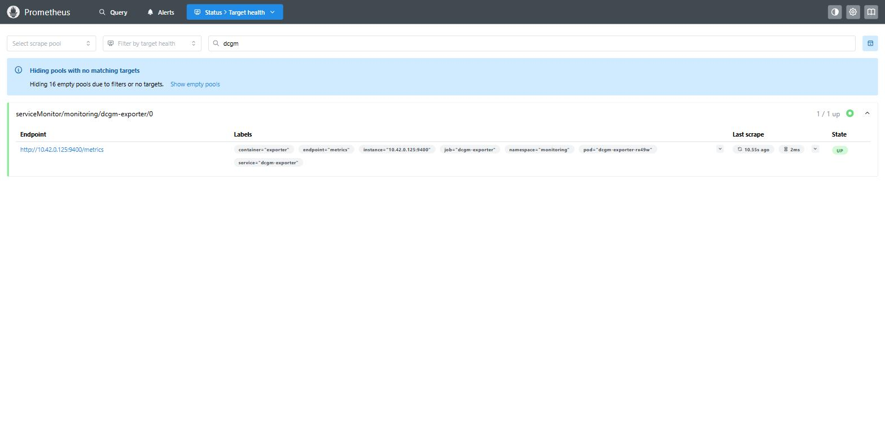
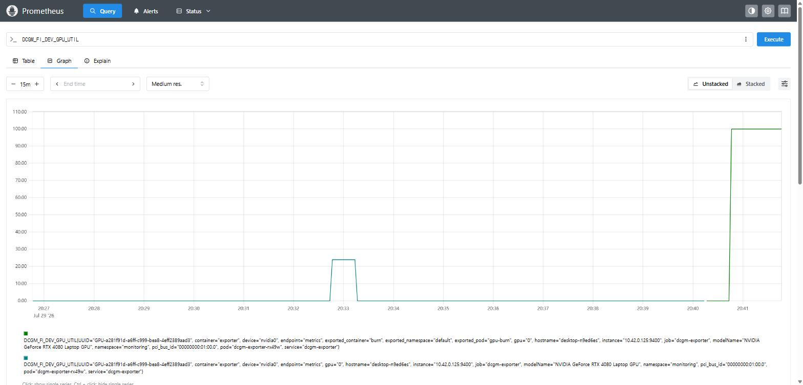
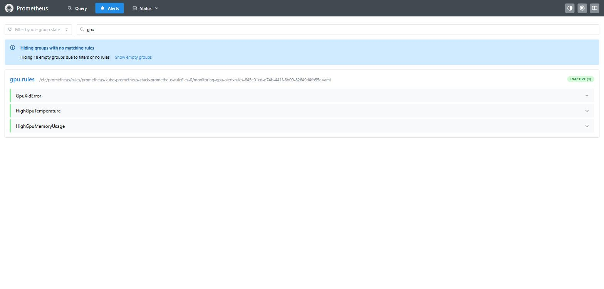
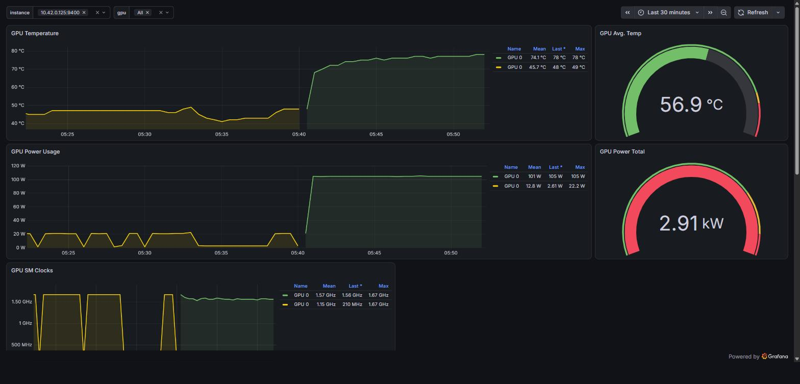
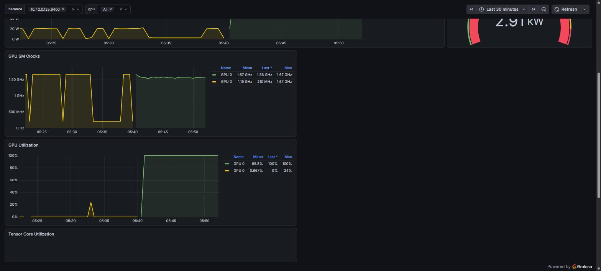

# Appendix. Windows WSL2에서 GPU 실습 재현 기록 (실습 인증)

| 구분 | 내용 |
|---|---|
| 원본 실습 | [`gpu-setup-docker-k8s.md`](../knowledge/subpages/gpu-setup-docker-k8s.md) — Ubuntu 24.04 Server **베어메탈** 기준 |
| WSL2 안내서 | [`gpu-setup-windows-wsl2.md`](../knowledge/subpages/gpu-setup-windows-wsl2.md) — Windows 11 + WSL2 |
| 실행 일자 | **2026-07-29 ~ 07-30** |

> 위 두 문서를 끝까지 실행한 뒤, 명령과 출력을 가공하지 않고 남긴 실습 기록입니다. 절차를 다시 설명하기보다 **재현 결과와 증빙**을 보여주는 데 초점을 맞췄습니다.

## 목차

- [이 문서의 목표](#이-문서의-목표)
- [실습 환경](#실습-환경)
- [전체 흐름](#전체-흐름)
- [1. GPU 인식 — 드라이버를 설치하지 않는데 동작하는 이유](#1-gpu-인식--드라이버를-설치하지-않는데-동작하는-이유)
- [2. 컨테이너 레이어 — OCI 훅의 4가지 주입](#2-컨테이너-레이어--oci-훅의-4가지-주입)
- [3. 쿠버네티스 레이어 — K3s와 Device Plugin](#3-쿠버네티스-레이어--k3s와-device-plugin)
- [4. GPU 파드 — Device Plugin이 "결정"한 것](#4-gpu-파드--device-plugin이-결정한-것)
- [5. 모니터링 — DCGM Exporter](#5-모니터링--dcgm-exporter)
- [6. 성능 측정](#6-성능-측정)
- [7. 트러블슈팅 기록](#7-트러블슈팅-기록)
- [핵심 정리](#핵심-정리)
- [출처와 주의](#출처와-주의)

---

## 이 문서의 목표

원문 실습은 **"GPU가 OS → 컨테이너 → 쿠버네티스 안에서 어떤 경로로 노출되는지"** 확인하는 데 목적이 있습니다. 원문은 PCIe 패스스루가 아닌 GPU-PV(Paravirtualization) 구조를 이유로 WSL을 **명시적으로 비권장**합니다.

이 기록에서는 다음 두 가지를 확인했습니다.

1. §1~§6의 구조가 WSL2에서도 재현되는가
2. 원문과 다른 결과가 어느 단계에서 나타나며, 그 이유는 무엇인가

실습 결과, **메커니즘은 모두 재현됐고 주입 대상만 달라졌습니다.** 차이는 `/var/run/cdi/nvidia.yaml`에 선언되어 있습니다.

---

## 실습 환경

<details>
<summary>**환경과 버전 정보 펼치기**</summary>

	| 항목 | 값 |
	|---|---|
	| 호스트 OS | Windows 11 Home 10.0.26200 |
	| GPU | GeForce RTX 4080 Laptop GPU (12282MiB, AD104, Compute Capability 8.9) |
	| Windows 드라이버 | 581.57 / CUDA 13.0 |
	| WSL | 2.7.8.0 (커널 6.18.33.1-microsoft-standard-WSL2) |
	| 배포판 | **Ubuntu 26.04 LTS (resolute)** ← 문서는 24.04 |
	| WSL 할당 | 23Gi RAM / 8 vCPU / 8Gi swap (`.wslconfig`) |
	| Docker | 29.6.2 (containerd v2.2.6) |
	| NVIDIA Container Toolkit | 1.19.1 |
	| K3s | v1.36.2+k3s1 (containerd 2.3.2-k3s2) |
	| Device Plugin | v0.17.1 |
	| kube-prometheus-stack | Chart 87.21.0 (operator v0.92.1), Grafana 13.1.1 |
	| DCGM Exporter | Chart 4.8.3 (binary 4.6.0-4.8.3) |

	> 배포판은 원문의 24.04가 아니라 26.04입니다. Docker apt 저장소가 `resolute`를 지원했고 K3s·Toolkit도 정상 동작했지만, 원문의 "24.04 권장('26.7.8 기준)" 판단은 여전히 유효합니다. 이 결과는 26.04에서 확인한 **단일 사례**입니다.

</details>

---

## 전체 흐름

<details>
<summary>**GPU가 파드와 모니터링까지 전달되는 경로 펼치기**</summary>

	```mermaid
	flowchart TD
	    W["Windows 드라이버 581.57<br/>dxgkrnl"] -->|GPU-PV| D["/dev/dxg<br/>(≠ /dev/nvidia0)"]
	    D --> L["/usr/lib/wsl/drivers/...<br/>libcuda.so.1, libnvidia-ml.so.1<br/>(9p 파일시스템)"]
	    L --> C["NVIDIA Container Toolkit 1.19.1<br/>CDI 스펙: /var/run/cdi/nvidia.yaml"]
	    C --> DK["docker run --gpus all<br/>NVIDIA_VISIBLE_DEVICES=void"]
	    C --> K["K3s containerd<br/>RuntimeClass nvidia"]
	    K --> DP["Device Plugin v0.17.1<br/>nvidia.com/gpu: 1"]
	    DP --> P["GPU 파드<br/>NVIDIA_VISIBLE_DEVICES=GPU-a281f91d-..."]
	    P --> M["DCGM Exporter → Prometheus → Grafana"]
	```

	원문의 4계층(로컬 PC → 컨테이너 → 쿠버네티스 → 모니터링)은 WSL2에서도 성립합니다. 다만 첫 계층에서 `/dev/nvidia0` 대신 `/dev/dxg`를 사용하며, 이 차이가 상위 계층에도 이어집니다.

</details>

---

## 1. GPU 인식 — 드라이버를 설치하지 않는데 동작하는 이유

<details>
<summary>**1장 실습 결과와 증빙 펼치기**</summary>

	원문 §2는 리눅스에 `nvidia-driver-595-open`을 설치하고 `nvidia.ko` 커널 모듈과 `/dev/nvidia0`을 확인합니다. **WSL2에서는 이 단계를 전부 건너뜁니다.**

	```bash
	# 드라이버 설치 없이 이미 동작한다
	nvidia-smi
	```

	```
	Wed Jul 29 23:15:40 2026
	+-----------------------------------------------------------------------------------------+
	| NVIDIA-SMI 580.102.01             Driver Version: 581.57         CUDA Version: 13.0     |
	+-----------------------------------------+------------------------+----------------------+
	|   0  NVIDIA GeForce RTX 4080 ...    On  |   00000000:01:00.0 Off |                  N/A |
	| N/A   47C    P3             23W /  105W |       0MiB /  12282MiB |      0%      Default |
	+-----------------------------------------+------------------------+----------------------+
	```

	`Driver Version`이 **Windows 쪽 값(581.57)** 인 점이 핵심입니다. 리눅스가 드라이버를 가진 게 아니라 Windows 것을 빌려 쓰고 있습니다.

	```bash
	$ which nvidia-smi
	/usr/lib/wsl/lib/nvidia-smi     # ← 배포판 패키지가 아니라 WSL 전용 shim
	```

	### WSL2의 GPU 디바이스 파일

	원문은 "애플리케이션이 GPU와 통신할 때 실제로 여는 파일은 `/dev/nvidia0`"이라고 설명합니다.

	```bash
	$ ls /dev/nvidia*
	ls: cannot access '/dev/nvidia*': No such file or directory

	$ ls -l /dev/dxg
	crw-rw-rw- 1 root root 10, 258 Jul 29 23:08 /dev/dxg
	```

	**`/dev/nvidia0`이 없고 `/dev/dxg`(major 10, minor 258)가 대신 있습니다.** WSL2는 PCIe 디바이스를 패스스루하지 않고 `dxgkrnl`이라는 Windows 그래픽 커널 인터페이스를 반가상화해 넘깁니다. 리눅스 커널이 GPU를 직접 잡는 게 아니라 **Windows에게 대신 요청**하는 구조입니다.

	원문이 WSL을 비권장하는 이유, 그리고 뒤에서 MIG·GPU Operator가 막히는 이유가 이 두 줄로 설명됩니다.

	<details>
	<summary>**증빙 — /usr/lib/wsl/lib 내용 (Windows 드라이버가 투영된 위치)**</summary>

		```
		total 389960
		-r-xr-xr-x 4 root root    175248 Oct 10  2025 libcuda.so
		-r-xr-xr-x 4 root root    175248 Oct 10  2025 libcuda.so.1
		-r-xr-xr-x 4 root root    175248 Oct 10  2025 libcuda.so.1.1
		-r-xr-xr-x 1 root root  10444456 Jul 27  2025 libcudadebugger.so.1
		-r-xr-xr-x 1 root root    801840 Oct 20  2023 libd3d12.so
		-r-xr-xr-x 1 root root   6880344 Oct 20  2023 libd3d12core.so
		-r-xr-xr-x 1 root root    942048 Mar 31  2024 libdxcore.so
		-r-xr-xr-x 3 root root  20548432 Oct 10  2025 libnvcuvid.so
		-r-xr-xr-x 1 root root 153723328 Jul 27  2025 libnvdxdlkernels.so
		-r-xr-xr-x 2 root root    264328 Jul 27  2025 libnvidia-encode.so
		```

	</details>

</details>

---

## 2. 컨테이너 레이어 — OCI 훅의 4가지 주입

<details>
<summary>**2장 실습 결과와 증빙 펼치기**</summary>

	원문 §3은 `runc`가 컨테이너를 격리시키려는 찰나에 toolkit이 훅으로 끼어들어 4가지를 수행한다고 설명합니다. WSL2에서 그 4가지가 각각 어떻게 바뀌는지 직접 확인했습니다.

	### 설치 결과

	```bash
	$ docker --version
	Docker version 29.6.2, build dfc4efb
	$ nvidia-ctk --version
	NVIDIA Container Toolkit CLI version 1.19.1

	$ cat /etc/docker/daemon.json
	{
	    "runtimes": {
	        "nvidia": {
	            "args": [],
	            "path": "nvidia-container-runtime"
	        }
	    }
	}
	```

	`daemon.json`은 원문과 **완전히 동일**합니다.

	### 기본 Ubuntu 이미지에서 확인한 nvidia-smi

	```bash
	$ docker run --rm --gpus all ubuntu:24.04 nvidia-smi
	```

	```
	+-----------------------------------------------------------------------------------------+
	| NVIDIA-SMI 580.102.01             Driver Version: 581.57         CUDA Version: 13.0     |
	|   0  NVIDIA GeForce RTX 4080 ...    On  |   00000000:01:00.0 Off |                  N/A |
	+-----------------------------------------------------------------------------------------+
	```

	기본 `ubuntu` 이미지에는 없는 `nvidia-smi`가 실행됐습니다. 원문에서 "toolkit이 호스트 것을 밀어준다"고 표현한 동작을 이 결과로 확인했습니다.

	### OCI 훅의 네 가지 주입 결과

	| # | 주입 | 원문 (베어메탈) | 실측 (WSL2) |
	|---|---|---|---|
	| 1 | 디바이스 노드 | `/dev/nvidia0`, `/dev/nvidiactl`, `/dev/nvidia-uvm` | **`/dev/dxg` 하나** |
	| 2 | 드라이버 라이브러리 | `/usr/lib/x86_64-linux-gnu/libcuda*` | **`/usr/lib/wsl/drivers/nvmii.inf_amd64_.../` 9종** (9p 마운트) |
	| 3 | 환경변수 | `NVIDIA_VISIBLE_DEVICES=all` | **`=void`** |
	| 4 | device cgroup | GPU major/minor 허용 | cgroup v2, `DeviceRequests: [{Capabilities:[[gpu]]}]` |

	```bash
	# (1) 디바이스 노드
	$ docker run --rm --gpus all ubuntu:24.04 sh -c "ls /dev/ | grep -E 'nvidia|dxg'"
	dxg

	# (2) x86_64 경로에는 아무것도 없다
	$ docker run --rm --gpus all ubuntu:24.04 sh -c "ls /usr/lib/x86_64-linux-gnu/ | grep -E 'libcuda|libnvidia-ml'"
	(없음)

	# (2') 대신 ldconfig 캐시가 WSL 경로로 해결해준다
	$ docker run --rm --gpus all ubuntu:24.04 sh -c "ldconfig -p | grep -Ei 'cuda|nvidia|dxcore'"
	    libnvidia-ptxjitcompiler.so.1 => /usr/lib/wsl/drivers/nvmii.inf_amd64_c5b5db3e12daa5e3/libnvidia-ptxjitcompiler.so.1
	    libnvidia-ml.so.1             => /usr/lib/wsl/drivers/nvmii.inf_amd64_c5b5db3e12daa5e3/libnvidia-ml.so.1
	    libdxcore.so                  => /usr/lib/wsl/lib/libdxcore.so
	    libcuda.so.1                  => /usr/lib/wsl/drivers/nvmii.inf_amd64_c5b5db3e12daa5e3/libcuda.so.1

	# (3) 환경변수
	$ docker run --rm --gpus all ubuntu:24.04 env | grep NVIDIA
	NVIDIA_VISIBLE_DEVICES=void
	```

	**`void`가 나오는 것이 고장이 아닙니다.** WSL 모드에서는 GPU를 개별 지정하지 않고 CDI 스펙의 단일 `all` 디바이스로 처리하며, `void`는 레거시 훅에게 "네가 따로 주입하지 마라"를 알리는 값입니다. 실제 주입은 아래 CDI 스펙이 담당합니다.

	### CDI 스펙에 기록된 주입 항목

	```bash
	$ grep -i spec-dirs /etc/nvidia-container-runtime/config.toml
	spec-dirs = ["/etc/cdi", "/var/run/cdi"]

	$ cat /var/run/cdi/nvidia.yaml
	```

	```yaml
	cdiVersion: 0.3.0
	kind: nvidia.com/gpu
	devices:
	    - name: all
	      containerEdits:
	        deviceNodes:
	            - path: /dev/dxg          # ← (1) 디바이스: 이것 하나뿐
	              major: 10
	              minor: 258
	              fileMode: 438
	              permissions: rwm
	containerEdits:
	    env:
	        - NVIDIA_VISIBLE_DEVICES=void  # ← (3) 환경변수
	    hooks:
	        - hookName: createContainer    # ← nvidia-smi 를 /usr/bin 에 심볼릭 링크
	          path: /usr/bin/nvidia-cdi-hook
	          args:
	            - nvidia-cdi-hook
	            - create-symlinks
	            - --link
	            - /usr/lib/wsl/drivers/nvmii.inf_amd64_c5b5db3e12daa5e3/nvidia-smi::/usr/bin/nvidia-smi
	        - hookName: createContainer    # ← ldconfig 캐시 갱신 = (2)를 해결하는 장치
	          path: /usr/bin/nvidia-cdi-hook
	          args:
	            - nvidia-cdi-hook
	            - update-ldcache
	            - --folder
	            - /usr/lib/wsl/drivers/nvmii.inf_amd64_c5b5db3e12daa5e3
	            - --folder
	            - /usr/lib/wsl/lib
	    mounts:                            # ← (2) 라이브러리 9종 bind-mount
	        - hostPath: /usr/lib/wsl/lib/libdxcore.so
	          containerPath: /usr/lib/wsl/lib/libdxcore.so
	          options: [ro, nosuid, nodev, rbind, rprivate]
	        - hostPath: /usr/lib/wsl/drivers/nvmii.inf_amd64_c5b5db3e12daa5e3/libcuda.so.1.1
	          ...
	        # libcuda_loader.so / libnvdxgdmal.so.1 / libnvidia-ml.so.1 /
	        # libnvidia-ml_loader.so / libnvidia-ptxjitcompiler.so.1 /
	        # nvcubins.bin / nvidia-smi
	```

	원문 §3의 네 가지 주입 항목은 이 파일에 모두 선언되어 있으며, WSL2에서는 대상만 달라집니다. `update-ldcache` 훅이 있기 때문에 `/usr/lib/x86_64-linux-gnu`가 비어 있어도 `libcuda.so.1`이 해결됩니다.

	라이브러리가 실제로 어떤 마운트로 들어오는지 확인하면 9p 파일시스템임이 드러납니다.

	```
	834 824 0:36 /nvmii.inf_amd64_c5b5db3e12daa5e3/libcuda.so.1.1
	    /usr/lib/wsl/drivers/nvmii.inf_amd64_c5b5db3e12daa5e3/libcuda.so.1.1
	    ro,nosuid,nodev,noatime - 9p drivers ro,aname=drivers;fmask=222;dmask=222,...
	```

</details>

---

## 3. 쿠버네티스 레이어 — K3s와 Device Plugin

<details>
<summary>**3장 실습 결과와 증빙 펼치기**</summary>

	### K3s가 nvidia 런타임을 자동 발견한다

	원문이 "K3s의 편한 점"으로 꼽은 부분이 그대로 성립했습니다. Toolkit을 먼저 깔아두면 K3s 설치 시 알아서 잡습니다.

	```bash
	$ k3s --version
	k3s version v1.36.2+k3s1 (01b6f04a)

	$ kubectl get node -owide
	NAME              STATUS   ROLES           VERSION        INTERNAL-IP     OS-IMAGE           CONTAINER-RUNTIME
	desktop-n9ed6es   Ready    control-plane   v1.36.2+k3s1   172.21.83.181   Ubuntu 26.04 LTS   containerd://2.3.2-k3s2

	$ grep -A3 "runtimes.'nvidia'" /var/lib/rancher/k3s/agent/etc/containerd/config.toml
	[plugins.'io.containerd.cri.v1.runtime'.containerd.runtimes.'nvidia']
	  runtime_type = "io.containerd.runc.v2"
	[plugins.'io.containerd.cri.v1.runtime'.containerd.runtimes.'nvidia'.options]
	  BinaryName = "/usr/bin/nvidia-container-runtime"
	  SystemdCgroup = true
	```

	RuntimeClass도 손으로 만들 필요가 없었습니다 (`nvidia`, `nvidia-experimental` 포함 10종 자동 등록).

	```bash
	$ kubectl get runtimeclass
	NAME                  HANDLER               AGE
	crun                  crun                  4h59m
	nvidia                nvidia                4h59m
	nvidia-experimental   nvidia-experimental   4h59m
	wasmedge              wasmedge              4h59m
	... (총 10종)
	```

	> 설치 직후 조회하면 결과가 비어 있을 수 있습니다. K3s가 부팅 후 등록하므로 **몇 십 초 기다려야** 보입니다. 이걸 모르고 "미등록"으로 판단해 직접 만들면 `configured`(이미 존재)가 뜹니다.

	### Device Plugin 등록 로그

	```bash
	$ kubectl logs -n kube-system -l name=nvidia-device-plugin-ds --tail=6
	I0729 14:08:18.092515       1 main.go:356] Retrieving plugins.
	I0729 14:08:18.133679       1 server.go:195] Starting GRPC server for 'nvidia.com/gpu'
	I0729 14:08:18.134279       1 server.go:139] Starting to serve 'nvidia.com/gpu' on /var/lib/kubelet/device-plugins/nvidia-gpu.sock
	I0729 14:08:18.135657       1 server.go:146] Registered device plugin for 'nvidia.com/gpu' with Kubelet
	```

	마지막 줄이 원문이 강조한 **"gRPC 스트림이 열린 순간"** 입니다. kubelet 쪽에서도 대응 로그가 확인됩니다.

	```
	k3s[192]: I0729 18:18:15.535492  server.go:161] "Got registration request from device plugin with resource" resourceName="nvidia.com/gpu"
	```

	### Device Plugin의 권한 범위

	원문이 강조한 대로 이 파드는 `privileged: true`도, `/dev` 전체 마운트도 쓰지 않습니다.

	```bash
	$ kubectl get pod -n kube-system -l name=nvidia-device-plugin-ds \
	    -o jsonpath='{.items[0].spec.containers[0].securityContext}'
	{"allowPrivilegeEscalation":false,"capabilities":{"drop":["ALL"]}}

	runtimeClassName: nvidia

	hostPath 볼륨:
	device-plugin -> /var/lib/kubelet/device-plugins    # ← 이 하나뿐
	```

	```bash
	$ ls -l /var/lib/kubelet/device-plugins/
	srwxr-xr-x 1 root root   0 Jul 29 23:08 kubelet.sock
	-rw------- 1 root root 413 Jul 29 23:08 kubelet_internal_checkpoint
	srwxr-xr-x 1 root root   0 Jul 29 23:08 nvidia-gpu.sock    # ← 플러그인이 등록하며 만든 소켓
	```

	### 노드에 GPU가 "숫자 있는 자원"으로 잡혔다

	```bash
	$ kubectl get node -o jsonpath='{.items[0].status.capacity.nvidia\.com/gpu}'      # 1
	$ kubectl get node -o jsonpath='{.items[0].status.allocatable.nvidia\.com/gpu}'   # 1
	```


</details>

---

## 4. GPU 파드 — Device Plugin이 "결정"한 것

<details>
<summary>**4장 실습 결과와 증빙 펼치기**</summary>

	```bash
	$ kubectl apply -f - <<'EOF'
	apiVersion: v1
	kind: Pod
	metadata:
	  name: gpu-check
	spec:
	  runtimeClassName: nvidia
	  restartPolicy: Never
	  containers:
	  - name: cuda
	    image: nvidia/cuda:12.6.0-base-ubuntu24.04
	    command: ["sleep", "600"]
	    resources:
	      limits:
	        nvidia.com/gpu: 1
	EOF

	$ kubectl get pod gpu-check -o wide
	NAME        READY   STATUS    RESTARTS   AGE   IP            NODE
	gpu-check   1/1     Running   0          1s    10.42.0.133   desktop-n9ed6es
	```

	### Docker와 Kubernetes의 환경변수 차이

	```bash
	$ kubectl exec gpu-check -- sh -c "env | grep -E 'NVIDIA_VISIBLE_DEVICES|NVIDIA_DRIVER_CAPABILITIES'"
	NVIDIA_DRIVER_CAPABILITIES=compute,utility
	NVIDIA_VISIBLE_DEVICES=GPU-a281f91d-a6ff-c999-bea8-4eff2389aad3
	```

	Docker에서는 `void`였는데 파드에서는 **GPU UUID**가 들어옵니다. 이것이 원문 §6이 설명한 `AllocateResponse`의 `DeviceIDs`입니다 — **Device Plugin이 "어떤 GPU를 줄지" 결정한 결과가 환경변수로 관측되는 지점**입니다.

	나머지는 §2의 Docker 때와 동일합니다.

	```bash
	$ kubectl exec gpu-check -- sh -c "ls /dev/ | grep -E 'nvidia|dxg'"
	dxg

	$ kubectl exec gpu-check -- sh -c "ldconfig -p | grep -Ei 'libcuda|libnvidia-ml|dxcore'"
	    libnvidia-ml.so.1 => /usr/lib/wsl/drivers/nvmii.inf_amd64_c5b5db3e12daa5e3/libnvidia-ml.so.1
	    libdxcore.so      => /usr/lib/wsl/lib/libdxcore.so
	    libcudart.so.12   => /usr/local/cuda/targets/x86_64-linux/lib/libcudart.so.12   # ← 이미지 자체 제공
	    libcuda.so.1      => /usr/lib/wsl/drivers/nvmii.inf_amd64_c5b5db3e12daa5e3/libcuda.so.1

	$ kubectl get pod gpu-check -o jsonpath='{.spec.containers[0].resources}'
	{"limits":{"nvidia.com/gpu":"1"},"requests":{"nvidia.com/gpu":"1"}}
	```

	`libcudart`(CUDA 런타임)는 이미지가 제공하고 `libcuda`(드라이버 API)는 호스트에서 주입됩니다 — 이 경계가 컨테이너에서 CUDA가 동작하는 구조 그 자체입니다.

</details>

---

## 5. 모니터링 — DCGM Exporter

<details>
<summary>**5장 실습 결과와 증빙 펼치기**</summary>

	```bash
	$ helm list -n monitoring
	NAME                    CHART                           APP VERSION  STATUS
	dcgm-exporter           dcgm-exporter-4.8.3             4.8.3        deployed
	kube-prometheus-stack   kube-prometheus-stack-87.21.0   v0.92.1      deployed
	```

	### 프로파일링 메트릭 수집 로그

	```
	level=INFO msg="NVML provider successfully initialized for Kubernetes MIG support"
	level=INFO msg="DCGM successfully initialized!"
	level=INFO msg="Not collecting DCP metrics: Profiling is not supported for this group of GPUs or GPU"
	level=WARN msg="Skipping line 19 ('DCGM_FI_PROF_GR_ENGINE_ACTIVE'): metric not enabled"
	level=WARN msg="Skipping line 20 ('DCGM_FI_PROF_PIPE_TENSOR_ACTIVE'): metric not enabled"
	level=WARN msg="Skipping line 21 ('DCGM_FI_PROF_DRAM_ACTIVE'): metric not enabled"
	level=WARN msg="Skipping line 22 ('DCGM_FI_PROF_PCIE_TX_BYTES'): metric not enabled"
	level=WARN msg="Skipping line 23 ('DCGM_FI_PROF_PCIE_RX_BYTES'): metric not enabled"
	level=INFO msg="Not collecting NvSwitch metrics; no switches to monitor"
	level=INFO msg="Kubernetes metrics collection enabled!"
	```

	원문이 예고한 "`DCGM_FI_PROF_*` 대부분 미지원"을 위 로그 다섯 줄에서 확인했습니다.

	### 실제로 노출된 메트릭 17종

	```bash
	$ curl -s http://<dcgm-pod-ip>:9400/metrics | grep -oE '^DCGM_[A-Z_0-9]+' | sort -u
	DCGM_FI_DEV_CORRECTABLE_REMAPPED_ROWS
	DCGM_FI_DEV_DEC_UTIL
	DCGM_FI_DEV_ENC_UTIL
	DCGM_FI_DEV_FB_FREE
	DCGM_FI_DEV_FB_USED
	DCGM_FI_DEV_GPU_TEMP
	DCGM_FI_DEV_GPU_UTIL
	DCGM_FI_DEV_MEMORY_TEMP
	DCGM_FI_DEV_MEM_CLOCK
	DCGM_FI_DEV_MEM_COPY_UTIL
	DCGM_FI_DEV_PCIE_REPLAY_COUNTER
	DCGM_FI_DEV_POWER_USAGE
	DCGM_FI_DEV_ROW_REMAP_FAILURE
	DCGM_FI_DEV_SM_CLOCK
	DCGM_FI_DEV_TOTAL_ENERGY_CONSUMPTION
	DCGM_FI_DEV_UNCORRECTABLE_REMAPPED_ROWS
	DCGM_FI_DEV_VGPU_LICENSE_STATUS
	```

	**문서의 "상당수 미지원"보다 양호합니다.** 기본 `DCGM_FI_DEV_*` 계열은 온도·전력·클럭·프레임버퍼까지 전부 살아 있습니다. 없는 것은 `DCGM_FI_PROF_*` 프로파일링 계열과 `DCGM_FI_DEV_XID_ERRORS`입니다.

	### DCGM과 nvidia-smi 12회 동시 샘플링

	`nvidia-smi`와 DCGM을 4초 간격으로 나란히 찍었습니다 (부하: 6144×6144 FP32 행렬곱 연속).

	```
	n    | nvidia-smi util/mem/W/T  | DCGM util/FB_USED/W/T
	-----|--------------------------|----------------------
	1    | 100,5114,104.21,69       | 100/5113/104.874/68
	2    | 100,5114,104.91,69       | 100/5113/104.874/68
	5    | 100,5114,105.00,70       | 100/5113/104.874/68
	8    | 100,5114,104.90,70       | 100/5113/104.231/70
	12   | 100,5114,104.78,71       | 100/5113/104.231/70

	nvidia-smi util>50 : 12 / 12
	DCGM       util>50 : 12 / 12
	```

	util·메모리·전력·온도는 `nvidia-smi`와 일치했습니다. DCGM 값은 스크레이프 주기에 맞춰 계단식으로 갱신됐습니다.

	### Prometheus 수집·부하 반영·알림 규칙

	

	> 그림 5-1. (실습 인증) Prometheus Target health 화면. `serviceMonitor/monitoring/dcgm-exporter/0`이 `1/1 up`, 엔드포인트 `http://10.42.0.125:9400/metrics`, 스크레이프 2ms. Helm의 `serviceMonitor.enabled=true`가 실제 수집으로 이어진 것을 확인.

	

	> 그림 5-2. (실습 인증) `DCGM_FI_DEV_GPU_UTIL` 15분 그래프. 20:40에 부하 파드를 띄운 직후 0 → 100으로 상승. 범례의 라벨에 `exported_pod="gpu-burn"`, `exported_container="burn"`, `exported_namespace="default"`가 붙어 있어 **DCGM Exporter가 GPU 사용량을 특정 쿠버네티스 파드에 귀속**시킨 것을 확인 (로그의 `Kubernetes metrics collection enabled!`가 이것). 20:33의 24% 봉우리는 `nvidia-smi` 폴링 등 짧은 조회 부하.

	

	> 그림 5-3. (실습 인증) Prometheus Alerts 화면. 원문의 PrometheusRule 3종(`GpuXidError`, `HighGpuTemperature`, `HighGpuMemoryUsage`)이 `gpu.rules` 그룹으로 로드되어 `INACTIVE (3)` 상태. 규칙 파일 경로까지 표시되어 Operator가 ConfigMap으로 마운트한 것을 확인.

	### Grafana 대시보드 12239

	문서가 안내한 Grafana 대시보드 ID **12239**(NVIDIA DCGM Exporter Dashboard)를 임포트했습니다.

	

	> 그림 5-4. (실습 인증) 대시보드 상단. 05:40에 부하 파드를 띄운 시점이 모든 패널에서 동시에 꺾입니다 — GPU Temperature 45℃ → **78℃**, GPU Power Usage 20W대 → **105W 플래토**(Mean 101W / Max 105W), GPU SM Clocks Mean 1.57GHz. 유휴 구간(노란 계열)의 톱니 모양은 `nvidia-smi` 폴링 등 순간 조회 부하입니다. 우측 게이지는 GPU Avg. Temp 56.9℃.
	>
	> ※ `GPU Power Total 2.91 kW`는 대시보드가 구간 전력을 합산해 표시하는 값이며 순간 전력이 아닙니다 (실제 상한은 105W).

	

	> 그림 5-5. (실습 인증) `GPU Utilization`은 0% → **100%**(Mean 95.8% / Max 100%)로 정상 표시되지만, 바로 아래 **`Tensor Core Utilization` 패널은 비어 있습니다.** 이 패널이 참조하는 `DCGM_FI_PROF_PIPE_TENSOR_ACTIVE`가 앞선 로그의 `Skipping line 20 ... metric not enabled`처럼 수집되지 않기 때문입니다. 대시보드와 패널은 정상으로 보여도 데이터가 없을 수 있다는 "프로파일링 메트릭 미지원"의 한계를 확인했습니다.

	### 발화할 수 없는 Alert Rule

	```bash
	$ kubectl get prometheusrule -n monitoring gpu-alert-rules \
	    -o jsonpath='{range .spec.groups[0].rules[*]}{.alert}{" : "}{.expr}{"\n"}{end}'
	HighGpuTemperature : DCGM_FI_DEV_GPU_TEMP > 85
	GpuXidError        : DCGM_FI_DEV_XID_ERRORS > 0
	HighGpuMemoryUsage : DCGM_FI_DEV_FB_USED / (DCGM_FI_DEV_FB_USED + DCGM_FI_DEV_FB_FREE) * 100 > 90
	```

	```
	[O] DCGM_FI_DEV_GPU_TEMP
	[X] DCGM_FI_DEV_XID_ERRORS  <-- 미노출
	[O] DCGM_FI_DEV_FB_USED
	[O] DCGM_FI_DEV_FB_FREE
	```

	`GpuXidError`가 참조하는 `DCGM_FI_DEV_XID_ERRORS`가 노출되지 않으므로, 이 규칙은 **문법상 정상이고 로드도 되지만 절대 발화하지 않습니다.** 관측성 관점에서 가장 위험한 형태의 실패(조용한 실패)이며, 6주차 EKS 실습과 대비하기 좋은 소재입니다.

</details>

---

## 6. 성능 측정

<details>
<summary>**6장 실습 결과와 증빙 펼치기**</summary>

	### PyTorch 행렬곱

	호스트 Python 3.14용 PyTorch 휠이 없어 **컨테이너에서 실행**했습니다 (`pytorch/pytorch:2.9.0-cuda12.8-cudnn9-runtime`).

	```
	torch: 2.9.0+cu128 / cuda: 12.8
	GPU: NVIDIA GeForce RTX 4080 Laptop GPU
	VRAM: 12.0 GB
	Compute Capability: 8.9
	1.61s, 17.1 TFLOPS
	결과 checksum: -240301.09375
	GPU 메모리 사용량(MB): 200.125
	--- 60초 연속 부하 시작 (스로틀링 관찰) ---
	60초간 8457회, 평균 17.0 TFLOPS
	```

	동시 모니터링 샘플(0.5초 간격):

	```
	util, mem, sm clock, power, temp
	  0 %,    0 MiB, 1665 MHz,  21.39 W, 45     ← 유휴
	100 %,  504 MiB, 1590 MHz, 105.22 W, 58
	100 %,  504 MiB, 1560 MHz, 105.00 W, 62
	100 %,  504 MiB, 1590 MHz, 104.94 W, 64
	100 %,  504 MiB, 1575 MHz, 104.88 W, 66
	100 %,  504 MiB, 1530 MHz, 104.95 W, 68
	100 %,  504 MiB, 1545 MHz, 104.92 W, 70
	100 %,  504 MiB, 1530 MHz, 105.07 W, 70
	```

	> 참고로 실습 중 `power.limit`이 105W → 84W → `[N/A]`로 바뀌는 것도 관측됐습니다. 문서 §0의 "전원 어댑터 연결" 항목이 측정 재현성에 직결됩니다.

	### CUDA 샘플 nbody

	```bash
	$ kubectl logs gpu-load
	```

	```
	MapSMtoCores for SM 8.9 is undefined.  Default to use 128 Cores/SM
	MapSMtoArchName for SM 8.9 is undefined.  Default to use Ampere
	GPU Device 0: "Ampere" with compute capability 8.9

	> Compute 8.9 CUDA device: [NVIDIA GeForce RTX 4080 Laptop GPU]
	Warning: "number of bodies" specified 1000000 is not a multiple of 256.
	Rounding up to the nearest multiple: 1000192.
	1000192 bodies, total time for 10 iterations: 14086.918 ms
	= 710.151 billion interactions per second
	= 14203.022 single-precision GFLOP/s at 20 flops per interaction
	```

	| 출력 | 의미 |
	|---|---|
	| `1,000,000 → 1,000,192` | GPU thread/block 효율을 위해 **256의 배수**로 자동 상향 |
	| `아키텍처 "Ampere"` | SM 8.9(Ada Lovelace) 매핑 테이블이 샘플 이미지에 없어 기본값 처리 — **버그 아님** (원문과 동일 현상) |
	| `14,203 GFLOP/s` | FP32. PyTorch 측정치(17.1 TFLOPS)와 자릿수 일치 |

	> CUDA 샘플은 공식 벤치마크가 아니므로 수치는 참고용으로만 사용했습니다.

</details>

---

## 7. 트러블슈팅 기록

원문과 다른 관찰 결과, 재현할 수 없었던 범위, 실습 진행을 막은 문제를 관련 장별로 모았습니다.

<details>
<summary>**7.1 실습 단계별 차이**</summary>

	| 관련 장 | 항목 | 원문 | 실측 (WSL2) |
	|---|---|---|---|
	| 1. GPU 인식 | 디바이스 파일 | `/dev/nvidia0` 등 3종 | **`/dev/dxg` 하나** |
	| 2. 컨테이너 | 라이브러리 주입 경로 | `/usr/lib/x86_64-linux-gnu` | **`/usr/lib/wsl/drivers/...` (9p) + `update-ldcache` 훅** |
	| 2. 컨테이너 | Docker 환경변수 | `NVIDIA_VISIBLE_DEVICES=all` | **`void`** (K8s 파드는 GPU UUID) |
	| 1. GPU 인식 | 리눅스 드라이버 설치 | 필수 | **금지** (Windows 드라이버 투영) |
	| 1. GPU 인식 | Secure Boot 해제 | 필수 | 불필요 |
	| 6. 성능 측정 | 벤치 스로틀링 | 발열로 TFLOPS 하락 | **전력 상한(105W)에 먼저 걸려 처리량 유지** |
	| 5. 모니터링 | DCGM 메트릭 | 상당수 미지원(문서 예상) | **기본 17종 정상, `PROF_*`·`XID_ERRORS`만 부재** |
	| 5. 모니터링 | Alert Rule | 3종 유효 | **`GpuXidError`는 발화 불가** |
	| 5. 모니터링 | Grafana 12239 | 전 패널 동작 | 임포트·대부분 패널 정상, **`Tensor Core Utilization`만 빈 패널** (그림 5-5) |
	| 3. 쿠버네티스 | RuntimeClass | K3s 자동 등록 | 자동 등록되지만 **조회 타이밍 주의** |
	| 3. 쿠버네티스 | Device Plugin namespace | — | 매니페스트에 `kube-system` 하드코딩 (문서의 `-n gpu-operator`는 실패) |

</details>

<details>
<summary>**7.2 재현할 수 없었던 항목**</summary>

	MIG, NVIDIA GPU Operator, NVLink/NCCL 멀티 GPU, HAMi, DCGM 프로파일링, PCIe 대역폭 측정은 이 환경에서 재현할 수 없었습니다. 4~6주차 실습에서는 클라우드 GPU로 옮겨야 합니다.

</details>

<details>
<summary>**7.3 Device Plugin 적용 실패**</summary>

	매니페스트에 `namespace: kube-system`이 하드코딩되어 있어 원문처럼 `-n gpu-operator`로 적용하면 실패합니다. 원문(베어메탈판)과 같이 namespace를 지정하지 않고 적용해야 합니다.

	`runtimeClassName: nvidia` 패치도 필요합니다. 원문은 `sed`로 30행에 삽입하지만, 버전에 따라 행 번호가 달라질 수 있어 다음 패치 명령을 사용했습니다.

	```bash
	kubectl -n kube-system patch daemonset nvidia-device-plugin-daemonset \
	  --type merge -p '{"spec":{"template":{"spec":{"runtimeClassName":"nvidia"}}}}'
	```

</details>

<details>
<summary>**7.4 성능 측정에서 발열 스로틀링이 나타나지 않은 이유**</summary>

	원문은 "30초 이상 돌리면 `clocks.sm`이 떨어지고 TFLOPS가 같이 내려간다(발열 스로틀링)"고 설명합니다. 실측 처리량은 **17.1 → 17.0 TFLOPS로 유지**됐습니다. 클럭은 1665 → 1530~1590MHz로 내려갔지만, `Pwr:Usage`가 처음부터 **105W 상한에 밀착**해 있었습니다.

	이 랩탑은 TGP 상한에 먼저 도달해 클럭이 낮게 유지됐고, 열 스로틀링이 추가로 개입할 여지가 없었습니다. 랩탑에서는 클럭과 전력 상한을 함께 기록해 두 원인을 구분합니다.

</details>

<details>
<summary>**7.5 WSL 세션이 없으면 k3s가 종료되는 문제**</summary>

	증상: 명령 사이 몇 분만 비워도 파드가 전부 `Completed`/`Error`로 떨어지고 `nvidia.com/gpu`가 `0`이 됩니다.

	```
	k3s[192]: pod_workers.go:1324] "Error syncing pod, skipping"
	  err="... unable to start unit \"kubepods-burstable-pod....slice\" ...:
	  Transaction for ....slice/start is destructive
	  (systemd-poweroff.service has 'start' job queued, but 'stop' is included in transaction)."
	systemd[1]: Stopped k3s.service - Lightweight Kubernetes.
	```

	원인은 WSL이 유휴 상태에서 배포판 systemd에 poweroff를 요청하기 때문입니다.

	시도한 해결과 결과:

	| 방법 | 결과 |
	|---|---|
	| `.wslconfig`에 `[experimental] vmIdleTimeout=-1` | **실패.** 게다가 WSL이 값을 거부하며 `experimental.vmIdleTimeout ... 무시` 경고 |
	| WSL 세션을 하나 붙잡아두기 (`wsl -d Ubuntu -u root -- sleep infinity`) | **성공.** 붙잡은 동안 `NRestarts=0` 유지, 파드 전부 `Running` |

	실습 중에는 WSL 터미널을 하나 열어 두어야 했습니다. 재부팅 후 k3s는 systemd에 의해 자동 기동하지만, 파드를 안정적으로 유지하려면 세션이 필요했습니다.

</details>

<details>
<summary>**7.6 node-exporter의 CreateContainerError**</summary>

	```
	Error: failed to generate container spec: failed to generate spec:
	  path "/" is mounted on "/" but it is not a shared or slave mount
	```

	node-exporter는 호스트 `/`를 `mountPropagation: HostToContainer`로 마운트하는데, WSL2의 루트는 private mount입니다.

	```bash
	$ findmnt -o TARGET,PROPAGATION /
	TARGET PROPAGATION
	/      private          # ← 변경 전

	$ mount --make-rshared /
	$ findmnt -o TARGET,PROPAGATION /
	TARGET PROPAGATION
	/      shared
	```

	재부팅 후에도 유지되도록 유닛을 등록했습니다.

	```ini
	# /etc/systemd/system/wsl-rshared.service
	[Unit]
	Description=Make / rshared for k8s mountPropagation (WSL2)
	DefaultDependencies=no
	After=local-fs.target
	Before=k3s.service

	[Service]
	Type=oneshot
	ExecStart=/bin/mount --make-rshared /
	RemainAfterExit=yes

	[Install]
	WantedBy=multi-user.target
	```

	```bash
	$ systemctl enable wsl-rshared.service
	$ kubectl get pod -n monitoring -l app.kubernetes.io/name=prometheus-node-exporter
	NAME                                                   READY   STATUS    RESTARTS   AGE
	kube-prometheus-stack-prometheus-node-exporter-s7pb5   1/1     Running   4          4h14m
	```

	PC 재부팅 후에도 `1/1 Running`으로 확인되어 영구 적용을 검증했습니다.

</details>

<details>
<summary>**7.7 Windows에서 NodePort가 열리지 않는 문제**</summary>

	문서는 `http://$MYPCIP:30001`로 접속하라고 하지만, WSL2의 localhost 릴레이는 **실제 리스닝 소켓만** 인식합니다. K3s의 NodePort는 klipper-lb의 hostPort(iptables DNAT)라 소켓이 없어 잡히지 않습니다.

	```bash
	# Windows PowerShell
	> Invoke-WebRequest http://localhost:30002/api/health
	원격 서버에 연결할 수 없습니다.
	```

	실제 소켓을 여는 `port-forward`로 우회했습니다.

	```bash
	kubectl -n monitoring port-forward --address 0.0.0.0 \
	  svc/kube-prometheus-stack-grafana 30002:80 &
	kubectl -n monitoring port-forward --address 0.0.0.0 \
	  svc/kube-prometheus-stack-prometheus 30001:9090 &
	```

	이후 Windows에서 `http://localhost:30001`, `http://localhost:30002` 모두 정상 접속됐습니다.

</details>

---

## 핵심 정리

- **메커니즘은 모두 재현됐습니다.** OCI 훅의 4가지 주입, Device Plugin의 kubelet 등록과 `ListAndWatch`, 스케줄러의 `nvidia.com/gpu` 자원 취급, DCGM 수집까지 원문 설명 그대로 관측됐습니다.
- **바뀌는 것은 주입 대상뿐이고, 그 차이는 `/var/run/cdi/nvidia.yaml` 한 파일에 선언적으로 다 적혀 있습니다.** GPU-PV가 무엇인지 이해하기에 이 파일 하나가 가장 좋은 교재입니다.
- **`ls -l /dev/*`와 `env | grep NVIDIA`를 각 레이어에서 반복해 찍는 것**이 이 실습의 핵심이며, WSL2에서는 그 값이 계층마다 달라지는 것(`void` → GPU UUID)이 오히려 Device Plugin의 역할을 선명하게 보여줍니다.
- **랩탑 측정은 전력 상한을 함께 기록해야 합니다.** 발열 스로틀링과 TGP 제한은 증상이 비슷하지만 원인이 다릅니다.
- **가상화 계층에서는 관측성의 공백이 드러나지 않을 수 있습니다.** `GpuXidError` 규칙은 문법상 정상이고 로드도 되지만 참조 메트릭이 없어 절대 발화하지 않습니다. Grafana 대시보드 12239도 정상 임포트되고 `Tensor Core Utilization` 패널까지 그려지지만 **데이터만 비어 있습니다**(그림 5-5). "규칙이 있다"·"패널이 있다"와 "값이 온다"는 다른 문제이며, 이것이 6주차 EKS 실습과 대비할 핵심 주제입니다.
- **환경 유지 자체가 실습의 일부입니다.** WSL 세션 유지, `mount --make-rshared /`, port-forward — 문서에 없던 세 가지가 실제로는 진행을 막는 요인이었습니다.
- **다음 단계인 실제 모델 서빙까지 측정을 마쳤습니다.** [`WSL2·K3s vLLM GPU 서빙 기준선 런북`](../knowledge/subpages/vllm-gpu-serving-baseline-runbook-wsl2.md)에서 같은 환경에 vLLM을 올려 TTFT·처리량·goodput을 측정했습니다. Qwen2.5-1.5B는 **동시성 16까지 goodput 100%**(TTFT p95 0.066초, 1691 tok/s), 7B AWQ도 12GB에서 OOM 없이 돌아 **처리량이 ×0.68**에 그쳤습니다. 이 문서의 두 결론이 그대로 이어집니다 — ① 병목은 발열이 아니라 **TGP 105W 상한**이었고(두 모델 모두 약 104W, SM 클럭만 하락), ② 여기서 지적한 `GpuXidError`의 조용한 실패를 `absent_over_time` 규칙으로 바꾸자 **실제로 발화**했습니다. Grafana 12239의 `Tensor Core Utilization` 빈 패널도 **실제 LLM 부하에서 재확인**됐습니다. 실행 파일은 [`labs/wsl2-vllm-baseline/`](../labs/wsl2-vllm-baseline/)에 있습니다.

---

## 출처와 주의

- 실습 구조·개념 설명: 노션 서브페이지 [(따라하며 확인하는) PC에 GPU 설정 및 사용 by Docker / K8S](https://gasidaseo.notion.site/PC-GPU-by-Docker-K8S-39750aec5edf806d8070d580fac38917) (멤버 전용)
- 원문 요약본: [`gpu-setup-docker-k8s.md`](../knowledge/subpages/gpu-setup-docker-k8s.md) / WSL2 판: [`gpu-setup-windows-wsl2.md`](../knowledge/subpages/gpu-setup-windows-wsl2.md)
- 참고 자료: [GPU-Enabled Platforms on Kubernetes](../knowledge/references/pdfs.md) CH1 Foundations
- 이 문서의 모든 명령 출력·스크린샷은 2026-07-29~30 본인 환경 실측입니다.

> 원문 노션은 외부 공개·전파 금지입니다. 이 문서는 개인 학습용 기록이며 그대로 외부에 공개하지 마세요. → [`03-study-rules.md`](../knowledge/03-study-rules.md)
