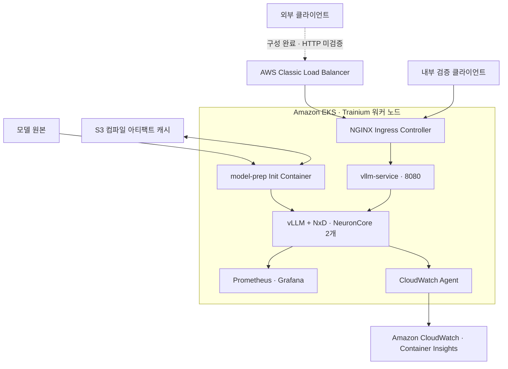

# AWS Trainium·EKS로 LLM을 서비스로 연결하기

**모델 준비와 배포에서 Ingress, 모니터링, 부하 테스트, 오토스케일링까지 이어 본 AWS 워크샵**

> **핵심 내용**
>
> - Trainium에서 실행하는 vLLM을 EKS의 Service·Ingress와 연결하고, 내부 NGINX 경유 일반·스트리밍 응답을 확인했습니다.
> - Prometheus·Grafana로 요청과 자원을 함께 관측하고, CloudWatch Agent와 로그 전송 권한을 구성해 Pod CPU·메모리 수집까지 확인했습니다.
> - 부하 테스트와 HPA 검증에서는 응답 지연, 확장 기준, 실제 배치 가능한 자원이 서로 연결돼 있음을 확인했습니다. 이 글은 각 구성 요소가 어떤 역할을 하고 어디까지 검증됐는지 설명합니다.

## 1. 모델이 실행된 다음에는 무엇이 필요한가

LLM을 처음 띄울 때는 모델이 정상적으로 응답하는지에 집중합니다. 하지만 다른 클라이언트가 호출하고, 상태를 관측하고, 요청이 늘었을 때 대응하려면 모델 밖의 구성도 필요합니다.

이번 [AWS 워크샵](https://app.notion.com/p/3d94c2420ac4803a9c8eeb60e2ba4b3d)에서는 Trainium에서 실행하는 모델을 Amazon EKS 위의 서비스로 연결했습니다. 기존 Lab 1·2 환경의 클러스터와 vLLM 배포 상태를 확인한 뒤, Lab 3의 Ingress부터 Lab 6의 HPA까지 진행했습니다. 워크샵을 처음부터 새로 프로비저닝한 기록과는 구분합니다.

[이전 글](https://app.notion.com/p/3c44c2420ac48157aaebe78f971e05c9)에서는 서빙 구조가 처리량에 미치는 영향을 비교했습니다. 이번에는 AWS에서 모델 준비, 네트워크 연결, 관측, 확장을 하나의 흐름으로 이어 보았습니다. 성능 실험은 그 구성이 실제 요청을 받을 때 어떻게 동작하는지 확인하는 과정에 포함했습니다.

### 전체 구성에서 각 요소가 맡은 역할

**Trainium은 모델 연산을 실행하고, Neuron 소프트웨어와 NxD는 이 가속기에서 모델을 실행하는 데 필요한 환경을 제공합니다.** vLLM은 그 위에서 OpenAI 호환 API를 제공합니다. EKS는 이 컨테이너를 어느 노드에 배치하고 몇 개 유지할지 관리합니다.

모델을 준비하는 경로와 사용자 요청을 처리하는 경로는 다릅니다. 워크샵의 Init Container는 모델을 준비하고 컴파일 아티팩트를 캐시하며, 메인 컨테이너는 준비된 모델로 추론 요청을 처리합니다. S3는 컴파일 아티팩트를 보존하는 데 사용합니다.



*모델 준비 부분은 워크샵의 설계입니다. 요청 경로는 내부 검증 클라이언트 → NGINX → vLLM 구간에서 실제 HTTP 응답을 확인했습니다. 외부 CLB 호출은 검증하지 못했습니다.*

<details>
<summary>이번 환경의 주요 설정</summary>

| 항목 | 설정 |
| --- | --- |
| 리전·워커 노드 | `us-west-2`, `trn1.2xlarge` 1대 |
| Kubernetes | `v1.33.13-eks-cb19647` |
| 모델 | `tinyLlama/TinyLlama-1.1B-Chat-v1.0` |
| 실행 이미지 | vLLM `0.9.1` · Neuron SDK `2.25.0` 계열 |
| 모델 설정 | TP=2, `max_num_seqs=4`, `max_model_len=1024`, Bucketing OFF |
| 노드 가속기 자원 | Neuron 1개, NeuronCore 2개 |
| vLLM CPU | request 4코어, limit 8코어 |

측정 시점은 2026-09-12입니다. 정확한 이미지 태그와 구성은 [클러스터 상태 원본](../labs/eks-trainium-workshop/results/2026-09-12/cluster-state.json)에 남겼습니다.

</details>

## 2. 모델 준비와 요청 처리를 나눠 배포한다

### EKS에서 Trainium 자원을 인식시키는 구성

일반적인 CPU 컨테이너와 달리, 가속기를 사용하는 Pod는 노드가 제공하는 가속기 자원을 할당받아야 합니다. 워크샵은 Neuron device plugin과 스케줄러 구성을 사용하며, 확인한 노드에는 Neuron 1개와 NeuronCore 2개가 할당 가능한 자원으로 표시됐습니다.

vLLM은 Neuron 1개를 요청하고 TP=2로 실행했습니다. 여기서 2는 GPU 두 장이 아니라 이 환경의 NeuronCore 두 개를 사용하는 설정입니다. 이 자원 구성을 알아야 뒤에서 새 Pod가 왜 Pending에 머물렀는지도 설명할 수 있습니다.

### Init Container가 모델을 준비하고 vLLM이 API를 제공한다

워크샵의 `model-prep` Init Container는 먼저 S3에 컴파일 아티팩트가 있는지 확인합니다. 캐시가 없으면 모델을 내려받아 Neuron용으로 컴파일하고 결과를 저장합니다. 메인 `vllm-server` 컨테이너는 준비된 아티팩트를 사용해 API를 시작합니다. 워크샵에서는 S3 CSI Driver와 PV/PVC를 사용해 캐시를 연결합니다.

이 구조에서는 **모델 준비 실패와 추론 서버 실행 실패를 나눠 확인할 수 있습니다.** 이번 Pod의 초기화 컨테이너에는 재시작 이력이 있었지만 마지막 실행은 `Completed`, 종료 코드는 0이었습니다. 메인 컨테이너는 재시작 없이 응답했고, 설정에는 컴파일 아티팩트 경로가 `/shared/model/cache`로 지정돼 있었습니다.

다만 이번에 첫 컴파일과 캐시 재사용 기동 시간을 따로 비교하지는 않았습니다. 캐시를 사용하는 설계와 실제 기동 시간 단축의 측정 결과는 구분했습니다. [Neuron SDK 2.25 vLLM·NxD 가이드](https://awsdocs-neuron.readthedocs-hosted.com/en/v2.25.0/libraries/nxd-inference/developer_guides/vllm-user-guide.html)

<details>
<summary>배포 상태를 확인한 명령</summary>

워크샵 접속용 EC2에서는 `sudo -i`로 진입한 root 셸에 EKS kubeconfig가 준비돼 있었습니다. `ubuntu` 계정에서의 연결 실패를 클러스터 장애로 판단하지 않고 실행 계정과 context부터 확인했습니다.

```bash
sudo -i
kubectl config current-context
kubectl get deployment vllm-deployment -o wide
kubectl get pods -l app.kubernetes.io/name=vllm-server -o wide
kubectl logs -l app.kubernetes.io/name=vllm-server -c model-prep --tail=50
kubectl logs -l app.kubernetes.io/name=vllm-server -c vllm-server --tail=50
```

</details>

## 3. Ingress를 붙이고 요청이 지나가는 경로를 확인한다

Lab 3에서는 NGINX Ingress Controller를 설치하고 `/` 경로를 `vllm-service:8080`에 연결했습니다. Service가 vLLM Pod를 가리키고, Ingress Controller가 HTTP 요청을 해당 Service로 전달하는 구성입니다.

Controller를 `LoadBalancer` 타입 Service로 노출하자 AWS Classic Load Balancer가 생성됐습니다. Ingress 상태에도 CLB의 DNS 이름이 들어왔고, AWS 콘솔에서는 Internet-facing 구성과 **서비스 중인 대상 1/1**을 확인했습니다.


*실제 워크샵 콘솔 화면입니다. CLB 생성과 대상 상태를 확인한 근거이며, 외부 API 호출 성공을 의미하지는 않습니다.*

다음으로 내부 클라이언트에서 NGINX 주소로 API를 호출했습니다. Pod에 직접 요청하는 검사에 그치지 않고 Controller가 실제 backend로 전달하는지도 접근 로그와 대조했습니다.

| 확인 항목 | 실제 결과 |
| --- | --- |
| `/health` | HTTP 200 |
| `/v1/models` | HTTP 200, TinyLlama 모델 ID 확인 |
| 일반 Chat Completion | HTTP 200, 입력 24토큰·생성 32토큰 |
| 스트리밍 Chat Completion | HTTP 200, JSON chunk 33개와 `[DONE]` 수신 |
| NGINX 접근 로그 | backend `default-vllm-service-8080`, upstream 200 |

일반 응답은 설정한 32토큰 상한에서 끝났습니다. 이 단계에서 확인한 것은 요청 경로와 API 동작이며, 모델 답변의 품질은 아닙니다. 외부 CLB 경유 HTTP 검사는 사용한 도구의 접근 제한으로 완료하지 못했습니다. 내부 호출 성공과 외부 공개 경로의 검증을 따로 기록했습니다.

<details>
<summary>Ingress 규칙과 CLB 리스너</summary>

Ingress는 `nginx` 클래스로 `/` Prefix를 `vllm-service:8080`에 전달했습니다. API 경로를 그대로 유지하므로 경로 재작성 annotation은 넣지 않았습니다. Controller는 Helm chart `4.15.1`, 애플리케이션 버전 `1.15.1`로 설치했습니다.


TCP 80은 NodePort 30429로, TCP 443은 32305로 연결됐습니다. 인증서와 HTTPS 동작은 검증하지 않았습니다. Ingress NGINX는 유지보수가 종료된 프로젝트이므로 이 구성은 제공된 워크샵의 재현 범위입니다. 새 운영 환경의 기술 선택에는 그 상태를 반영해야 합니다. [Kubernetes 공식 안내](https://kubernetes.io/blog/2025/11/11/ingress-nginx-retirement/)

</details>

### 기존 요청이 성공해도 새 배포는 멈출 수 있었다

배포 상태를 확인하던 중 기존 vLLM Pod 한 개는 Running인데 새 ReplicaSet의 Pod는 Pending인 상황도 발견했습니다. 기존 Pod를 유지하면서 새 Pod를 추가하는 RollingUpdate 방식이었지만, 노드의 가속기를 기존 Pod가 이미 사용하고 있었습니다. 이벤트에는 가속기·CPU·임시 저장 공간 부족이 함께 기록됐습니다.

두 ReplicaSet의 차이는 재시작 시각 annotation뿐이었습니다. 그 차이를 제거해 기존 ReplicaSet으로 복귀했고, 실행 중인 모델을 유지한 채 Pending을 정리했습니다. 이후 rollout 완료도 확인했습니다.

이 경험은 단일 가속기 노드에서 배포 전략을 선택할 때의 제약을 보여 줍니다. 새 Pod가 잠시 더 실행될 여유 자원이 없다면, 기존 Pod를 유지하는 업데이트 방식이 자동으로 완료되리라 기대하기 어렵습니다. 현재 서비스의 응답 상태와 새 배포의 진행 상태를 함께 확인해야 합니다.

## 4. Prometheus·Grafana와 CloudWatch로 상태를 관측한다

### 요청 지표와 자원 지표를 같은 시간축에 놓는다

Lab 4에서는 `monitoring` namespace에 Prometheus와 Grafana를 설치했습니다. vLLM의 `/metrics`를 10초마다 수집하고, kube-state-metrics와 cAdvisor 지표를 함께 조회했습니다.

대시보드에는 생성 토큰 처리량, 실행·대기 요청, TTFT, CPU 사용량, Deployment와 HPA의 복제본 수를 배치했습니다. 이 구성이 있어야 요청이 늦어졌을 때 서버 안의 대기, CPU 부하, 확장 상태를 같은 시간대에서 대조할 수 있습니다.

Prometheus 수집 대상은 11개 모두 `up`이었고 vLLM 지표도 실제 값이 조회됐습니다. Grafana와 Prometheus는 ClusterIP로 유지하고 SSH 터널과 localhost 포트포워딩으로 접속했습니다.


*모니터링 구성 후 실제 화면입니다. 당시 HPA를 만들기 전이라 HPA 패널에는 데이터가 없습니다. 이 화면에는 준비 중 부하가 섞여 있으므로 성능 비교 수치는 별도로 완료한 벤치마크 JSON을 사용했습니다.*

### CloudWatch는 대시보드 저장 뒤에도 수집 경로를 확인해야 했다

CloudWatch에서는 처음에 EC2 CPU만 보이고 Pod 패널은 비어 있었습니다. 클러스터에 수집기가 없었기 때문입니다. CloudWatch Agent를 설치한 뒤에도 바로 해결되지는 않았습니다. Agent는 Ready였지만 로그 전송 단계에서 `logs:PutLogEvents`의 `AccessDenied`가 발생했습니다.

노드 역할에 해당 클러스터의 performance 로그 그룹만 허용하는 정책을 추가하자 로그 스트림이 생성됐습니다. 이후 `ContainerInsights` namespace에서 **Pod CPU·메모리의 실제 1분 datapoint**를 조회했고, 대시보드에도 값이 표시됐습니다.


**대시보드, 수집기, 전송 권한은 각각 확인할 대상이었습니다.** 화면을 만들었거나 Agent가 Running이라는 사실만으로 지표가 들어온다고 판단할 수 없었습니다. 이번에는 CloudWatch API 조회와 콘솔 그래프를 함께 확인했습니다.

CPU 비율의 기준도 맞춰야 합니다. CloudWatch의 Pod CPU 비율은 노드 CPU 한도를, 이번 HPA는 Pod CPU request를 분모로 사용합니다. 두 화면의 백분율이 다르다고 곧바로 수집 오류로 판단하지 않았습니다. [CloudWatch 지표 정의](https://docs.aws.amazon.com/AmazonCloudWatch/latest/monitoring/Container-Insights-metrics-EKS.html)

<details>
<summary>관측 구성과 보존한 근거</summary>

Prometheus chart는 `29.28.1`, Grafana chart는 `10.5.15`, CloudWatch Agent 이미지는 `1.300071.0b1720`입니다. 워크샵에서는 Prometheus·Grafana의 영속 볼륨을 사용하지 않았으므로 장기 데이터 보존을 갖춘 운영 구성은 아닙니다.

CloudWatch 로그 정책은 해당 performance 로그 그룹에 `CreateLogGroup`, `CreateLogStream`, `PutLogEvents`, `DescribeLogStreams`만 허용합니다. [정책 파일](../labs/eks-trainium-workshop/cloudwatch/performance-log-policy.json)과 [datapoint 조회 결과](../labs/eks-trainium-workshop/results/2026-09-12-extra/cloudwatch-datapoints.json)를 보존했습니다. Pod CPU·메모리는 확인했지만 선택적 가속기 지표 전체를 검증한 것은 아닙니다.

</details>

## 5. 부하 테스트로 서비스가 요청을 처리하는 모습을 확인한다

연결과 모니터링이 준비된 뒤 Lab 5의 부하 테스트를 진행했습니다. 같은 클러스터의 테스트 Pod에서 NGINX 경유 스트리밍 API를 호출했습니다. 짧은 한국어 입력과 최대 출력 64토큰을 유지하고 동시 요청을 1·2·4·8개로 늘렸습니다. 단계별 30건, 총 120건 모두 성공했습니다.

| 동시 요청 | 생성 토큰/초 | TTFT p95 | E2E p95 |
| --- | --- | --- | --- |
| 1 | 114.64 | 0.046초 | 0.562초 |
| 2 | 210.25 | 0.089초 | 0.615초 |
| 4 | 353.76 | 0.173초 | 0.696초 |
| 8 | 356.50 | 0.856초 | 1.373초 |

동시 요청 4→8에서 처리량은 약 0.8% 늘었지만 첫 내용이 도착하기까지의 시간인 TTFT p95는 약 4.9배로 길어졌습니다. 서버의 동시 실행 슬롯은 `max_num_seqs=4`로 유지한 상태였습니다. 추가 요청이 대기한다는 해석과 맞는 결과입니다.

llmperf로 입력·출력 길이를 분산시킨 시험도 실행했습니다. 동시 요청 5개로 50건을 완료했고 오류는 없었습니다. TTFT p95는 0.603초, E2E p95는 1.554초, 도구가 집계한 처리량은 339.67토큰/초였습니다. 입력 조건과 토큰 집계 방식이 다르므로 앞 표의 성능과 직접 비교하지 않았습니다.

### 출력 길이를 늘려 운영상 의미를 더 확인했다

짧은 출력에서는 TTFT 2초·E2E 30초라는 실험용 지연 목표를 모두 통과했습니다. 출력이 길어져도 같은 동시 요청을 감당하는지 확인하려고 출력 상한 64·256토큰과 동시 요청 4·8을 각각 3회 반복했습니다. 총 384건 모두 응답했지만, 256토큰·동시 요청 8개에서는 지연 목표 충족률이 12.5%로 낮아졌습니다.


*각 조건은 32건씩 3회 반복했습니다. p95는 각 실행에서 계산한 p95의 평균입니다. 앞의 120건 시험과 별도 실행이며 값을 섞지 않았습니다.*

같은 256토큰 출력을 320건씩 지속해서 보내는 시험도 비교했습니다. 동시 요청 8개에서는 452.81토큰/초·TTFT p95 2.447초·지연 목표 충족률 1.25%였습니다. 후속으로 4개를 유지했을 때는 451.52토큰/초·0.174초·100%였습니다. 이 조건에서는 요청을 더 많이 동시에 보내도 처리량 이득은 거의 없고 대기가 길어졌습니다.

이 추가 실험은 운영할 동시 요청 범위를 검토하는 근거입니다. 클라이언트의 동시 발행 수를 바꾼 비교이므로, 실제 서비스의 요청 유입 제한이나 별도 대기열 정책을 검증한 결과로 확대하지 않았습니다.

<details>
<summary>부하 테스트 조건과 추가 결과</summary>

기본 벤치마크는 시작 전 warmup 3건을 제외했습니다. 처리량은 성공한 요청의 서버 `usage.completion_tokens` 합을 해당 그룹 전체 경과 시간으로 나눴습니다. 모든 측정 요청에서 정확한 usage를 받았습니다.

llmperf는 동시 요청 5개, 입력 목표 평균 256·표준편차 50토큰, 출력 목표 평균 100·표준편차 20토큰, temperature 0.7 조건입니다. 최종 집계에서 별도 토크나이저로 생성문을 재토큰화하므로 서버 usage 기반 결과와 정의가 다릅니다.

| 출력 상한 | 동시 요청 | 생성 토큰/초, 평균 ± SD | TTFT p95 평균 | 지연 목표 충족률 |
| --- | --- | --- | --- | --- |
| 64토큰 | 4 | 371.08 ± 0.26 | 0.172초 | 100% |
| 64토큰 | 8 | 373.35 ± 0.30 | 0.862초 | 100% |
| 256토큰 | 4 | 452.58 ± 0.94 | 0.173초 | 100% |
| 256토큰 | 8 | 453.41 ± 0.99 | 2.433초 | 12.5% |

위 표는 3회 평균과 표본 표준편차입니다. 출력 상한별 warmup 2건은 제외했고 두 번째 반복은 조건 순서를 뒤집었습니다. 320건 지속 시험은 동시 요청별 1회씩 실행했습니다. 8개 시험에서 목표를 만족한 요청은 처음 네 건이었고, 짧은 시험의 4/32와 지속 시험의 4/320 차이가 충족률에 반영됐습니다.

</details>

## 6. HPA의 목표 조정과 실제 용량 증가를 구분한다

Lab 6에서는 Metrics Server를 설치해 Kubernetes가 CPU 사용량을 읽도록 하고, HPA를 CPU request 대비 70%, 최소 1·최대 3개로 설정했습니다. 확장·축소 안정화 구간은 30초였습니다.

HPA의 제어 동작을 확인할 때는 종료 시간이 정해진 CPU 부하를 사용했습니다. vLLM Pod는 CPU 4코어를 요청했고 부하 중 사용률은 request 대비 약 197%까지 올라갔습니다. HPA 목표 복제본은 **1→2→3개로 늘었다가 부하 종료 후 1개로 돌아왔습니다.**


*가용 복제본은 계속 1개입니다. 목표 수가 늘었다는 사실과 새 모델 서버가 요청을 처리할 수 있다는 사실을 구분했습니다.*

새 Pod는 모두 Pending에 머물렀고, 앞서 배포 중 확인했던 것과 같은 가속기·CPU·임시 저장 공간 부족이 기록됐습니다. HPA는 Deployment의 목표를 바꿨지만 노드 자원을 추가하지 않았습니다. 따라서 이번에는 **HPA 제어와 자동 축소는 확인했고, 실제 서빙 복제본 증설은 달성하지 못했습니다.** [Kubernetes HPA 문서](https://kubernetes.io/docs/concepts/workloads/autoscaling/horizontal-pod-autoscale/)

부하 테스트에서 관측한 실제 LLM 요청은 다른 양상을 보였습니다. 동시 요청 8개·256토큰 지속 부하에서는 실행·대기가 각각 4건이었지만 CPU는 1분 rate 최댓값 기준 약 0.465코어였습니다. request 대비 약 11.6%로 HPA 기준보다 낮았고, 목표 복제본은 1개로 유지됐습니다.

이 워크샵에서는 확장할 **시점을 판단하는 지표**와 확장 요청을 **실행할 자원**을 따로 확인할 수 있었습니다. CPU 기반 HPA가 추론 대기를 감지하지 못하는 문제와, 추가 Pod를 실행할 자원이 없는 문제는 각각 해결해야 합니다.

<details>
<summary>실제 추론 부하와 HPA를 함께 본 화면</summary>


19:36:15~19:39:00 KST 구간의 Prometheus 16개 표본에서 실행·대기는 각각 4건, HPA 목표·가용 복제본은 1개였습니다. 이 화면의 TTFT는 서버 histogram의 추정 분위수이며 벤치마크의 클라이언트 p95와 계산 방식이 다릅니다. CPU rate도 순간 최대값이 아닙니다.

</details>

## 7. 워크샵에서 확인한 LLM 서비스의 운영 조건

이번 워크샵에서는 모델 준비와 서빙을 분리한 구조를 확인하고, vLLM을 Service·Ingress에 연결했습니다. Prometheus·Grafana와 CloudWatch로 요청과 자원 지표를 수집했으며, 부하 테스트와 HPA 동작까지 이어서 확인했습니다.

과정을 따라가며 각 단계의 완료 기준도 구체적으로 달라졌습니다. **모델 준비는 Init Container 완료와 API 응답으로, 네트워크 연결은 실제 요청 경로로, 관측은 수집된 datapoint로, 확장은 가용 복제본과 응답 상태로 확인해야 했습니다.** 어느 한 화면의 Running이나 정상 표시가 전체 서비스의 준비 상태를 대신하지는 못했습니다.

배포에서는 단일 가속기 노드의 자원 제약이 업데이트를 막았습니다. 모니터링에서는 수집기가 실행돼도 로그 전송 권한이 없어 데이터가 들어오지 않았습니다. 부하를 보내자 동시 요청이 늘어도 처리량이 거의 같고 대기만 길어지는 조건이 드러났습니다. HPA는 설정대로 목표를 조정했지만 실제 용량을 늘리지는 못했습니다. 각각의 기능을 설치하는 것에서 더 나아가, 기능 사이의 연결을 검증해야 하는 이유입니다.

**이 구성에서 다음 운영 검증은 외부 호출 경로를 끝까지 확인하고, 애플리케이션의 준비 상태를 probe로 연결하며, 새 Pod가 실행될 자원과 모델 준비 시간을 포함해 배포·확장을 검증하는 순서입니다.** 캐시 재사용의 기동 시간과 추가 복제본의 처리량 효과도 그 과정에서 측정할 항목입니다. 동시 요청 수와 확장 지표는 실제 입력·출력 길이별 지연 목표를 기준으로 정해야 합니다.

이번 AWS 실습의 결론은 **LLM 서비스가 모델 실행, 요청 연결, 관측, 배포·확장의 조건을 함께 갖춰야 한다는 것**입니다. 추가 성능 실험은 이 조건들이 요청을 받을 때 어떻게 드러나는지 확인하는 데 사용했습니다. 워크샵 구성 요소를 설치하는 데서 끝내지 않고, 각 단계가 실제 서비스 동작으로 이어지는지 확인하는 것이 운영 준비의 기준입니다.

## 검증 범위와 재현 자료

측정은 단일 Trainium 노드와 같은 노드의 내부 클라이언트에서 수행했습니다. 인터넷 사용자 트래픽, 응답 품질, 긴 입력, 다중 노드 확장의 효과를 검증한 결과는 아닙니다. 기존 vLLM Deployment에는 readiness probe가 없어 HTTP 검사를 별도로 수행했습니다.

마지막 부하 후 내부 API를 재검사했고 테스트 Pod는 삭제했습니다. EKS·노드·Ingress·모니터링·HPA는 검증 시점에 유지했으며 전체 리소스 종료는 수행하지 않았습니다.

[실습 README](../labs/eks-trainium-workshop/README.md)에 단계별 명령을, [실행 기록](../labs/eks-trainium-workshop/execution-record.md)에 상세 이력을 보존했습니다. [Lab 3~6 원본 결과](../labs/eks-trainium-workshop/results/2026-09-12/cluster-final.json), [추가 반복 시험](../labs/eks-trainium-workshop/results/2026-09-12-extra/output-matrix-results.json), [지속 부하 비교](../labs/eks-trainium-workshop/results/2026-09-12-extra/sustained-comparison.json)와 실제 스크린샷을 함께 남겼습니다.
