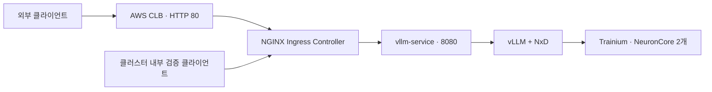
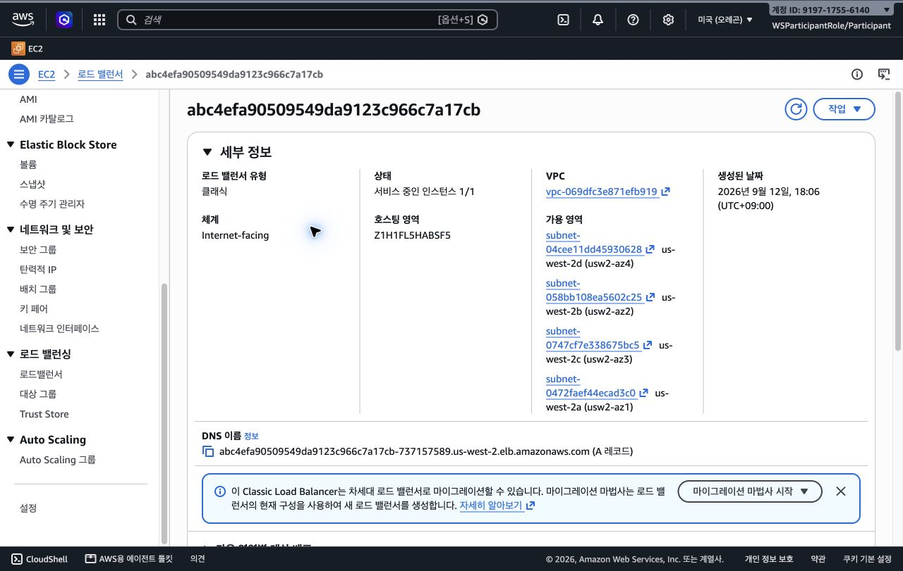
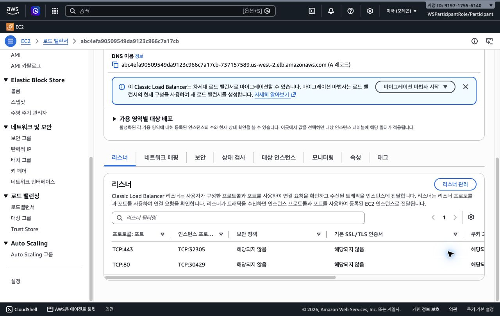
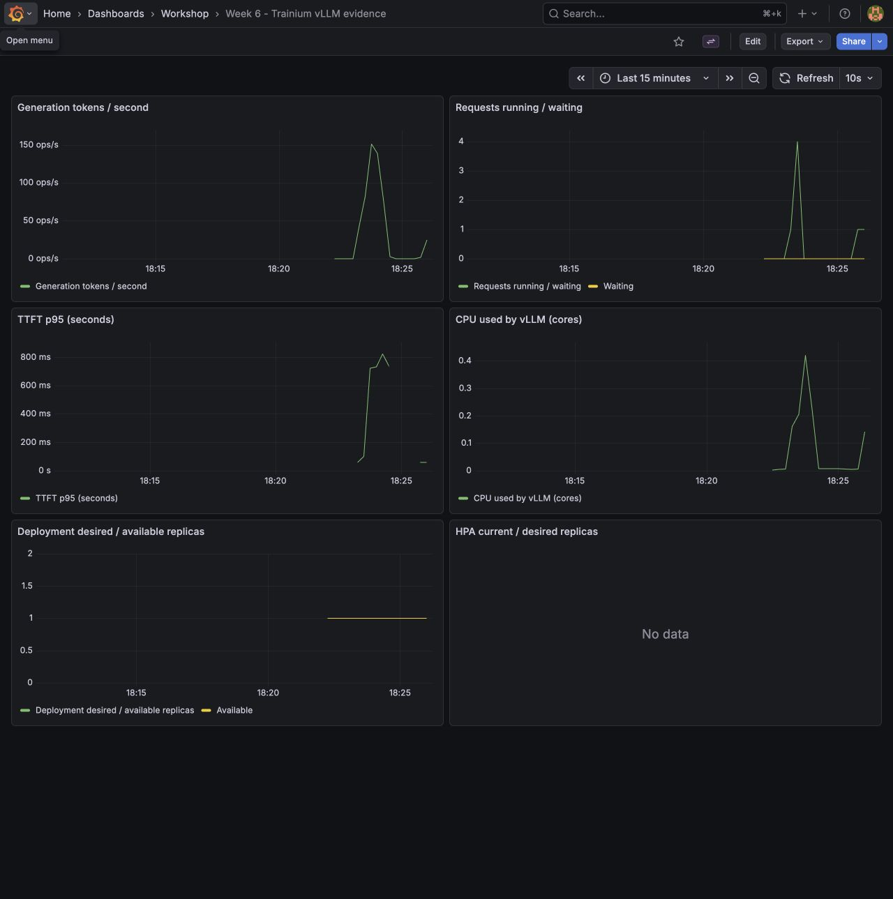
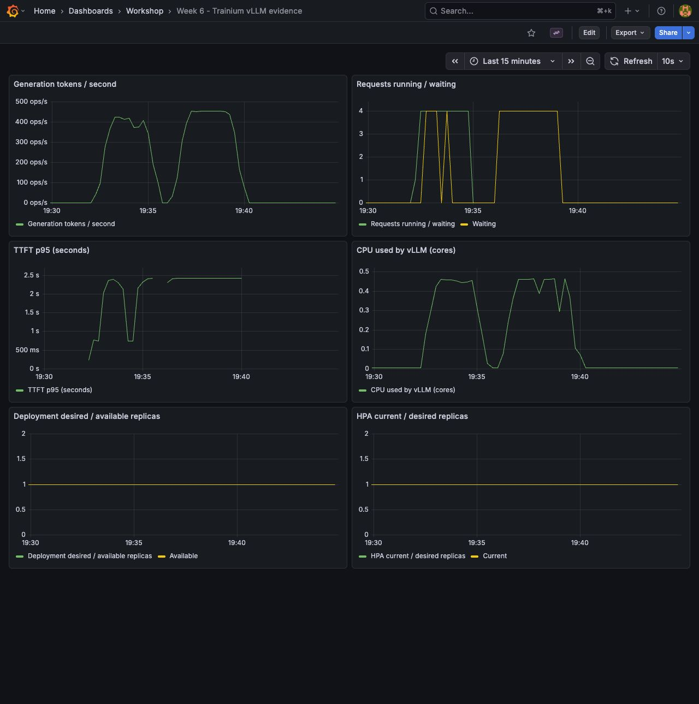

# 2026-09-12 Trainium·EKS Lab 3~6 실행 기록

> 2026-09-12, AWS 워크샵 Lab 3~6 실습 기록. TinyLlama의 동시 요청을 4개에서 8개로 늘리자 처리량은 약 354→356 토큰/초로 거의 같았지만 TTFT p95는 0.173→0.856초로 늘었다. Ingress·관측성·부하 테스트·HPA를 연결해, 응답 성공과 처리 용량 증가가 어떻게 다른지 확인한다. 추가 실험에서는 출력 256토큰·동시 요청 8개의 지속 부하 320건이 모두 성공했지만 TTFT 2초·E2E 30초를 함께 만족한 비율은 1.25%였다. CloudWatch Pod 지표 수집까지 확인했으며, 외부 CLB 호출은 도구 제한으로 미검증이다.

## 모델이 응답하는 것과 외부에서 호출할 수 있는 것은 별개다

6주차에는 AWS에서 제공한 워크샵 환경으로 Trainium과 Amazon EKS를 사용했다. 실습을 이어받았을 때 TinyLlama를 서빙하는 vLLM Pod와 Service는 이미 만들어져 있었다. 여기서 확인하려던 질문은 단순하다. **모델이 내부에서 응답한다면, Ingress를 붙여 외부 접근 경로까지 만들 수 있을까?**

이를 확인하려면 Pod 실행 상태, Service 연결, Ingress 경로, AWS Load Balancer를 각각 살펴봐야 한다. `Running` 표시 하나만으로 모든 구간이 정상이라고 판단할 수는 없다. 이번에는 Lab 1·2의 기존 결과를 상태와 로그로 확인하고, Lab 3의 Ingress부터 Lab 6의 HPA까지 진행했다. 이어지는 질문은 **동시 요청을 늘리면 처리량도 계속 늘어나는가, HPA가 복제본을 요청하면 실제 서빙 용량도 늘어나는가**다.

## 요청이 지나가는 구성 요소

Trainium은 추론 연산을 실행하는 AWS 가속기다. Neuron 소프트웨어와 NxD가 모델 실행을 담당하고, vLLM은 OpenAI 호환 API를 제공한다. 이 실습에서 TP=2는 Trainium 칩 1개의 NeuronCore 2개에 모델을 나누는 설정이다. NVIDIA GPU 2장을 사용한다는 뜻은 아니다.

Kubernetes의 Service는 실행 중인 vLLM Pod로 연결되는 주소를 제공한다. Ingress는 URL 경로를 어느 Service에 전달할지 선언하고, NGINX Ingress Controller가 그 규칙을 실제로 처리한다. Controller를 `LoadBalancer` 타입 Service로 노출하면서 AWS CLB가 추가로 생성됐다.



그림의 외부 경로는 이번에 구성한 경로다. 실제 HTTP 검증을 끝낸 구간은 **클러스터 내부 클라이언트 → NGINX → vLLM**이다. 아래에서 두 범위를 구분한다.

## 실험 조건과 완료 기준

아래 값은 [클러스터 상태 원본](./results/2026-09-12/cluster-state.json)에서 확인했다.

| 항목 | 확인한 설정 |
| --- | --- |
| 리전·클러스터 | `us-west-2` · `ai-infra-summit-test-cluster` |
| 워커 노드 | `trn1.2xlarge` 1대 |
| Kubernetes | `v1.33.13-eks-cb19647` |
| 노드의 할당 가능 가속기 | `aws.amazon.com/neuron: 1`, `aws.amazon.com/neuroncore: 2` |
| vLLM 이미지 | `public.ecr.aws/neuron/pytorch-inference-vllm-neuronx:0.9.1-neuronx-py310-sdk2.25.0-ubuntu22.04` |
| API에 등록된 모델명 | `tinyLlama/TinyLlama-1.1B-Chat-v1.0` |
| 모델 실행 설정 | TP=2, `max_num_seqs=4`, `max_model_len=1024`, Bucketing OFF |
| 컴파일 아티팩트 경로 | `/shared/model/cache` |
| Ingress Controller | Helm chart `4.15.1` · Controller `1.15.1` |
| Ingress 규칙 | 클래스 `nginx`, `/` Prefix → `vllm-service:8080` |

먼저 내부 `/health`가 응답하는지 확인했다. 그다음 Controller와 Ingress를 설치하고 같은 API를 NGINX 경유로 호출했다. 일반 응답과 스트리밍 응답을 모두 검사하고, 접근 로그의 backend가 `default-vllm-service-8080`인지 대조했다. 마지막 완료 기준은 외부 클라이언트에서 CLB 주소로 같은 검사를 통과하는 것이다.

## 먼저 실행 계정을 맞춰야 했다

SSH로 접속한 `ubuntu` 계정에서는 `kubectl`이 `localhost:8080`으로 연결을 시도하다 실패했다. 해당 계정에는 kubeconfig와 current context가 없었다.

`sudo -i`로 root 로그인 셸에 들어가자 워크샵에서 준비한 EKS context를 사용할 수 있었다. 따라서 이 오류는 클러스터나 모델이 내려갔다는 증거가 아니었다. **어느 계정에서 어떤 kubeconfig를 사용하는지부터 확인해야 하는 문제**였다.

```bash
sudo -i
kubectl config current-context
kubectl get deployment vllm-deployment -o wide
kubectl get pods -l app.kubernetes.io/name=vllm-server -o wide
```

root 셸에서 Kubernetes API는 정상 조회됐다. 다만 같은 셸의 AWS CLI는 EC2 인스턴스 역할을 사용했으며 `elasticloadbalancing:DescribeLoadBalancers`가 거부됐다. Kubernetes 접근 가능 여부와 AWS CLI의 권한 범위도 구분해야 했다. CLB 상태는 로그인된 AWS 콘솔에서 확인했다.

## Ingress를 설치하고 실제 응답 경로를 확인했다

워크샵 페이지의 일부 코드에는 줄바꿈이 붙어 있었다. 예를 들어 두 `export` 문이 연결되면 리전 값이 `us-west-2export`가 된다. 명령을 분리하고, 페이지의 예시 클러스터 이름도 현재 context의 실제 이름으로 맞췄다.

Controller는 공식 Helm 저장소에서 설치하되 재현할 수 있도록 chart 버전을 고정했다. Ingress에는 `/` Prefix 규칙을 두고 API 경로를 그대로 전달했다. 경로를 바꿀 필요가 없어 원문의 `rewrite-target: /` annotation은 넣지 않았다. 이것이 원문 실패의 원인이라고 검증한 것은 아니다.

배포 뒤 Controller Pod는 Ready가 됐고, Ingress status에 CLB의 DNS 이름이 들어왔다. AWS 콘솔에서도 Internet-facing CLB와 **서비스 중인 인스턴스 1/1**을 확인했다.



*실제 AWS 콘솔 캡처. CLB 생성 시각은 2026-09-12 18:06 KST다. 이 화면은 리소스 생성·대상 상태의 근거이며 외부 Chat Completion 성공을 증명하는 화면은 아니다.*



*실제 리스너 화면. TCP 80은 NodePort 30429로, TCP 443은 NodePort 32305로 연결됐다. 인증서와 HTTPS 동작은 이번 실습에서 검증하지 않았다.*

NGINX Controller의 내부 Service 주소로 요청을 보낸 결과는 다음과 같다. [HTTP 응답 원본](./results/2026-09-12/internal-http.json)과 [Controller 접근 로그](./results/2026-09-12/ingress-access.log)를 함께 보존했다.

| 검사 | 2026-09-12 18:10 KST 관측 |
| --- | --- |
| `GET /health` | HTTP 200 |
| `GET /v1/models` | HTTP 200, TinyLlama 모델 ID 확인 |
| `GET /openapi.json` | HTTP 200, Chat Completion 경로 존재 |
| 일반 Chat Completion | HTTP 200, 입력 24토큰·생성 32토큰 |
| 스트리밍 Chat Completion | HTTP 200, JSON chunk 33개·`[DONE]` 수신 |
| NGINX backend | `default-vllm-service-8080`, upstream 응답 200 |

일반 응답은 설정한 32토큰 상한에서 끝나 `finish_reason=length`였다. 이 검사는 모델의 답변 품질이나 처리량을 평가하지 않는다. 스트리밍 chunk 수 역시 생성 토큰 수와 같은 지표로 취급하지 않았다.

## 정상 응답 중에도 업데이트는 멈출 수 있었다

vLLM Pod는 1개가 Running이고, 다른 ReplicaSet의 새 Pod 1개는 Pending이었다. 이벤트에는 다음 세 자원 부족이 함께 나타났다.

```text
Insufficient aws.amazon.com/neuron
Insufficient cpu
Insufficient ephemeral-storage
```

기존 Deployment는 `RollingUpdate`, `maxSurge=25%`, `maxUnavailable=25%`였다. 기존 Pod를 유지한 채 새 Pod를 올리려 했지만 노드에는 가속기가 1개뿐이었다. 새 Pod가 요구하는 CPU와 임시 저장 공간도 부족했다. 18:12 KST 상태 수집에서는 `Available=True`와 `Progressing=False / ProgressDeadlineExceeded`가 동시에 확인됐다.

즉, **현재 요청을 처리할 수 있다는 사실과 새 배포가 완료됐다는 사실은 다르다.** 두 ReplicaSet의 Pod 설정을 비교하니 차이는 재시작 시각 annotation뿐이었다. 그 annotation만 제거해 기존 ReplicaSet으로 복귀했고, 기존 Running Pod를 유지하면서 Pending Pod가 정리됐다. `kubectl rollout status`도 성공했다. 이후 HPA 시험은 이 정상 기준 상태에서 시작했다. 모델 재기동·캐시 실험에는 별도의 교체 방식과 자원 계획이 필요하다.

기존 Pod의 초기화 컨테이너는 재시작 8회 이력이 있었지만, 마지막 실행은 `Completed`, exit code 0이었다. 메인 컨테이너는 재시작 없이 응답했다. 이전 초기화 실패의 원인 전체를 이번 Lab 3에서 조사한 것은 아니다.

## Lab 4 — 수집 대상이 살아 있고 그래프에 데이터가 들어오는가

Prometheus chart `29.28.1`, Grafana chart `10.5.15`를 `monitoring` namespace에 설치했다. vLLM의 `/metrics`를 10초마다 수집하고, kube-state-metrics와 노드의 cAdvisor 지표로 CPU·Deployment 복제본도 함께 보았다. Grafana와 Prometheus는 ClusterIP로 두고 SSH 터널과 localhost 포트포워딩으로 접속했다.

[Prometheus 조회 원본](./results/2026-09-12/prometheus-baseline.json)에서 수집 대상 11개가 모두 `up`이었으며 vLLM도 `up=1`이었다. 누적 생성 토큰, 실행·대기 요청, CPU 사용량, 목표·가용 복제본 값이 실제 조회됐다. Grafana 대시보드는 이 쿼리를 사용하도록 직접 구성했다.



*18:26 KST 실제 화면. HPA를 만들기 전이므로 오른쪽 아래 HPA 패널에는 데이터가 없다. 준비 중 부하와 재측정 일부가 함께 포함된 관측 화면이며, 아래 성능 표는 별도 최종 JSON만 사용한다. 처리량 패널은 1분 `rate()`여서 짧은 테스트 전체의 토큰/경과 시간과 값이 같지 않다.*

수집이 된다고 모든 운영 조건이 갖춰지는 것은 아니다. 워크샵에 맞춰 영속 볼륨을 끈 상태라 Pod 교체 시 Prometheus·Grafana 데이터가 사라질 수 있다. Grafana chart도 설치 시 deprecated 경고가 나왔다. 장기 운영 구성으로 검증한 것은 아니다.

### CloudWatch — 수집기 설치와 로그 전송 권한을 나눠 확인했다

처음에는 클러스터에 CloudWatch 수집기가 없었다. 참가자 역할로 대시보드를 저장해도 EC2 CPU만 보이고 Pod 패널은 비어 있었다. 이후 AWS 공식 Container Insights manifest를 적용하고 CloudWatch Agent 이미지를 `1.300071.0b1720`으로 고정했다. Agent가 Ready여도 로그에는 `logs:PutLogEvents`의 `AccessDenied`가 남았다. 데이터를 모으는 단계와 AWS로 보내는 단계가 달랐다.

사용자 승인 후 참가자 역할의 AWS CLI로 **노드 역할에 해당 클러스터의 performance 로그 그룹만 허용하는 인라인 정책**을 추가했다. 허용 작업은 `CreateLogGroup`, `CreateLogStream`, `PutLogEvents`, `DescribeLogStreams` 네 가지다. 관리자 권한이나 계정 전체 로그 접근은 추가하지 않았다. [적용 정책](./cloudwatch/performance-log-policy.json)과 [IAM 재조회 결과](./results/2026-09-12-extra/applied-log-policy.json)를 보존했다.

이후 `/aws/containerinsights/ai-infra-summit-test-cluster/performance`에 로그 스트림이 생겼고, `ContainerInsights` namespace에서 `pod_cpu_utilization`과 `pod_memory_utilization`의 실제 1분 datapoint가 각각 8개 조회됐다. 차원은 `ClusterName`, `Namespace=default`, `PodName=vllm-deployment`다. [AWS CLI 조회 원본](./results/2026-09-12-extra/cloudwatch-datapoints.json)이 확인 근거다. 함께 조회한 `pod_cpu_usage_total`은 performance 로그의 원시 필드이며 이 조건에서 게시된 metric이 아니므로 빈 결과를 CPU 사용량 0으로 해석하지 않는다.


*권한 적용 후 실제 AWS 콘솔 화면. [대시보드 JSON](./cloudwatch-dashboard.json)을 CLI로 저장했고 검증 메시지는 비어 있었다. Pod CPU·메모리 수집은 확인했지만, 선택적 GPU·확장 지표 전체를 검증한 것은 아니다.*

CloudWatch의 Pod CPU 비율은 **노드 CPU 한도**를 분모로 삼는다. HPA의 CPU 비율은 **Pod CPU request**를 분모로 삼는다. 같은 부하에서도 두 백분율은 직접 비교할 수 없다. 메모리 비율도 노드 메모리 한도 대비 working set이다. [AWS 지표 정의](https://docs.aws.amazon.com/AmazonCloudWatch/latest/monitoring/Container-Insights-metrics-EKS.html)

## Lab 5 — 처리량보다 먼저 늘어난 것은 대기 시간이었다

클러스터 내부의 Python 3.10 테스트 Pod에서 NGINX 경유 스트리밍 API를 호출했다. 동일한 짧은 한국어 입력, 최대 출력 64토큰, 동시 요청 1·2·4·8, 단계별 30건, 시작 전 warmup 3건으로 구성했다. 입력은 재현 스크립트의 `short` 시나리오이며 모델 설정은 바꾸지 않았다. 설치와 겹친 예비 측정은 따로 보관했고, 아래는 설치가 끝난 뒤 다시 실행한 결과다.

처리량은 **성공 응답의 `usage.completion_tokens` 합 ÷ 그룹 전체 경과 시간**이다. 병렬 요청의 개별 지연 시간을 더한 값으로 나누지 않았다. TTFT는 클라이언트가 첫 내용 chunk를 받을 때까지의 시간이다. 모든 요청에서 정확한 usage가 수신됐고, 각 단계의 생성량은 1,920토큰이었다.

| 동시 요청 | 성공/전체 | 생성 토큰/초 | TTFT p95 | E2E p95 |
| --- | --- | --- | --- | --- |
| 1 | 30/30 | 114.64 | 0.046초 | 0.562초 |
| 2 | 30/30 | 210.25 | 0.089초 | 0.615초 |
| 4 | 30/30 | 353.76 | 0.173초 | 0.696초 |
| 8 | 30/30 | 356.50 | 0.856초 | 1.373초 |

[최종 부하 시험 JSON](./results/2026-09-12/benchmark-final.json)에 요청별 결과와 집계가 있다. 4→8에서 처리량 증가는 약 0.8%지만 TTFT p95는 약 4.9배다. 서버의 `max_num_seqs=4`와 함께 보면 실행 슬롯이 차고 추가 요청이 기다리는 해석과 일치한다. 다만 이 설정을 바꾼 대조 실험이나 커널 프로파일링으로 원인을 완전히 분리한 것은 아니다.

이번 goodput은 TTFT 2초와 E2E 30초를 모두 만족한 비율로, 네 단계 모두 100%였다. 이 느슨한 기준만 보면 4와 8의 차이가 가려진다. 서비스의 실제 허용 지연을 먼저 정해야 하는 이유다. 단일 짧은 입력과 단계별 30건, 동일 노드의 클라이언트로 얻은 결과여서 최대 성능·품질·인터넷 지연의 평가로 일반화하지 않는다.

### llmperf로 입력·출력 길이를 분산시켜 다시 확인했다

공식 llmperf의 커밋 `f1d6bed47e4501b0e371082b41601b59ab55269f`를 사용했다. 동시 요청 5개, 입력 목표 평균 256·표준편차 50토큰, 출력 목표 평균 100·표준편차 20토큰, temperature 0.7, 50건으로 실행했다. 처음에는 일반 패키지 설치에서 `sonnet.txt`가 빠져 실패했고, 원문의 editable 설치 방식으로 바꿔 정상 실행했다.

[llmperf 원본 결과](./results/2026-09-12/llmperf-results.json)는 **50/50 완료, 오류 0건**, TTFT p95 **0.603초**, E2E p95 **1.554초**, 도구가 집계한 생성 처리량 **339.67토큰/초**다. 이는 앞 표와 입력·출력 조건이 다른 별도 시험이다.

토큰 정의에도 차이가 있다. 이 커밋의 최종 집계는 생성문을 `hf-internal-testing/llama-tokenizer`로 재토큰화한다. 서버의 `usage.completion_tokens`를 읽은 값이 아니다. 또한 클라이언트의 Ray object store가 작은 `/dev/shm` 대신 `/tmp`를 사용한다는 경고가 있었다. 이 결과로 서버의 절대 최대 성능을 주장하지 않는다. [실행 로그](./results/2026-09-12/llmperf-run.log)와 [설치 버전](./results/2026-09-12/llmperf-freeze.txt)을 함께 남겼다.

## Lab 6 — HPA는 복제본을 늘렸지만 가용 Pod는 늘지 않았다

클러스터에는 처음에 `metrics.k8s.io` API가 없었다. Metrics Server `v0.8.1`을 설치한 뒤 `kubectl top`이 정상 동작했고, TLS 검증을 끄는 옵션은 추가하지 않았다. HPA는 CPU 70%, 최소 1·최대 3개, 확장·축소 안정화 구간 30초로 구성했다.

여기서 CPU 70%는 노드 전체의 70%가 아니라 **Pod의 CPU request 대비 사용률**이다. vLLM의 request는 4 CPU다. 8개 CPU 작업을 180초 동안 실행하자 약 7.9 CPU, request 대비 약 197%가 관측됐다. 원문의 무한 루프와 광범위한 `pkill` 대신, 생성한 자식에게 종료 시각을 주고 그 자식만 정리하는 스크립트를 사용했다.

| 시각(KST)·구간 | 관측 |
| --- | --- |
| 18:27:55 | CPU 부하 시작, 목표·가용 복제본 1개 |
| 18:28:47 | HPA 확장 시각, 목표 2개 |
| 18:29:47 | 추가 확장 시각, 목표 3개 |
| 18:30:09 상태 수집 | 목표 3·가용 1, 나머지 2개 Pending, CPU 197% |
| 18:30:55 | CPU 부하 종료, 남은 자식 프로세스 0개 |
| 18:31:48 축소 이벤트·18:32:07 상태 수집 | 목표·가용 1개로 자동 복귀, Pending 제거 |

[HPA 관측 시계열](./results/2026-09-12/hpa-timeline.jsonl)과 [부하 시작·종료 로그](./results/2026-09-12/hpa-stress.jsonl)를 함께 보존했다. HPA의 `currentReplicas`는 Ready Pod 수를 의미하지 않는다. 3으로 보였던 시점에도 Deployment의 `availableReplicas`는 1이었다.


*실제 모니터링 화면. 왼쪽 아래의 가용 복제본 선은 계속 1이며, 목표 복제본만 3까지 올라갔다. CPU 그래프는 실제 코어 수이고 HPA의 197%와 단위가 다르다.*

Pending 이벤트는 `Insufficient aws.amazon.com/neuron`, `Insufficient cpu`, `Insufficient ephemeral-storage`였다. 단일 노드가 제공하는 가속기 1개를 기존 vLLM이 이미 사용한다. HPA는 Deployment의 목표 수를 조정했지만, 새 Pod가 실행될 노드 자원을 만들지는 않았다. 따라서 이번 결과는 **HPA 제어·자동 축소 검증 성공, 실제 서빙 복제본 증설은 자원 부족으로 미달성**이다.

이 시험은 가속기 추론량을 늘린 시험과도 다르다. CPU 루프가 높인 것은 CPU 지표다. 별도로 `neuron-monitor`를 5초 제한으로 실행해 [실제 Neuron 상태](./results/2026-09-12/neuron-monitor.jsonl)를 수집했지만, 추론 부하 구간의 가속기 포화도를 입증하는 자료로 쓰지 않는다.

마지막으로 내부 Ingress 경유 `/health`, 모델 목록, OpenAPI, 일반·스트리밍 응답을 다시 검사했다. [부하 후 API 검사](./results/2026-09-12/post-hpa-http.json)와 [최종 클러스터 상태](./results/2026-09-12/cluster-final.json)에 복귀 결과를 남겼다. HPA 설정과 모니터링은 유지했고, 결과를 회수한 테스트 Pod는 삭제했다. 추가 노드나 쿼터 증설은 수행하지 않았다.

## 추가 실험 — 출력이 길어지면 같은 동시 요청도 SLO를 넘었다

64토큰 시험에서는 TTFT 2초 기준을 모두 통과했다. 그렇다면 **출력 길이만 늘려도 대기가 사용자 기준을 넘는가**를 확인했다. 같은 `short` 입력, temperature 0, 동일 모델 설정을 유지하고 출력 상한 64·256토큰과 동시 요청 4·8을 조합했다. 각 조건을 32건씩 3회 반복했고, 출력 상한별 warmup 2건은 집계에서 제외했다. 두 번째 반복은 실행 순서를 뒤집었다. 무작위 순서나 독립 노드 반복 시험은 아니다.

측정 요청은 **384/384 성공**했고 서버의 정확한 usage를 모두 받았다. 아래 처리량은 3회 평균 ± 표본 표준편차다. p95 열은 각 실행의 p95를 평균한 값이며, 96건을 합쳐 다시 계산한 p95가 아니다.

| 출력 상한 | 동시 요청 | 생성 토큰/초, 평균 ± SD | TTFT p95 평균 | E2E p95 평균 | SLO 충족 비율 |
| --- | --- | --- | --- | --- | --- |
| 64 | 4 | 371.08 ± 0.26 | 0.172초 | 0.698초 | 100% |
| 64 | 8 | 373.35 ± 0.30 | 0.862초 | 1.387초 | 100% |
| 256 | 4 | 452.58 ± 0.94 | 0.173초 | 2.279초 | 100% |
| 256 | 8 | 453.41 ± 0.99 | 2.433초 | 4.530초 | 12.5% |

[반복별·요청별 원본](./results/2026-09-12-extra/output-matrix-results.json)과 [조건별 집계](./results/2026-09-12-extra/output-matrix-summary.json)를 보존했다. Lab 5의 단발 결과와 이번 3회 반복 평균을 섞지 않는다. 출력 256토큰에서 동시 요청을 4→8로 늘려도 처리량 차이는 약 0.2%였지만 TTFT p95는 약 14배가 됐다. 더 긴 출력에서 토큰/초가 높아진 것은 관측 사실이며, 커널 효율 개선을 따로 입증한 결과는 아니다.

### 실제 추론 대기는 늘어도 CPU HPA는 움직이지 않았다

출력 256토큰·동시 요청 8개를 **320건, 약 181초** 동안 이어서 실행했다. 별도 CPU 스트레스는 넣지 않았다. 320/320 성공, 생성량 81,920토큰, 처리량 452.81토큰/초였다. TTFT p95는 2.447초, E2E p95는 4.554초였고 TTFT 2초·E2E 30초를 모두 만족한 요청은 **4/320, 1.25%**였다. 앞선 32건 시험의 12.5%도 4/32다. 시작 시 비어 있던 실행 슬롯의 효과가 짧은 시험의 비율에 크게 반영됐다.

실험은 19:36:03~19:39:09 KST에 실행했다. 그 안의 19:36:15~19:39:00 구간에서 Prometheus 10초 간격 16개 표본을 대조했다. 모든 표본에서 실행 4건·대기 4건, HPA 목표 1·가용 복제본 1이었다. vLLM CPU의 1분 rate 최댓값은 약 0.465코어로, CPU request 4코어의 약 11.6%에 해당한다. 70% 임계값과는 거리가 있었다. 초기 표본에는 rate의 부하 이전 구간이 섞이므로 이 최댓값을 순간 최대 CPU로 해석하지 않는다.



*실제 Grafana 화면. 19:36~19:39가 지속 부하 구간이다. 앞쪽은 반복 실험 일부다. 화면의 TTFT는 서버 histogram의 추정 분위수이며, 표의 클라이언트 요청별 p95와 계산 방식이 다르다.*

[지속 부하 원본](./results/2026-09-12-extra/sustained.json), [Prometheus 시계열](./results/2026-09-12-extra/prometheus-history.json), [구간 집계](./results/2026-09-12-extra/inference-metrics-summary.json)를 함께 남겼다. 별도 kubectl 관측 파일은 파일 쓰기 권한 오류로 수집되지 않았으므로, 연속 HPA 관측의 근거는 Prometheus다.

이 조건에서는 CPU HPA만으로 응답 대기를 감지할 수 없었다. 운영에서는 TTFT·대기 요청과 SLO를 함께 보고 확장 지표를 설계할 필요가 있다. 다만 이번에는 사용자 정의 지표 기반 HPA를 구현하지 않았다. 지표를 바꿔도 단일 노드의 가속기 자원 부족은 별도로 해결해야 한다.

추가 시험 후 내부 Ingress API를 재검사하고 테스트 Pod를 정리했다. EKS·Trainium 노드·vLLM·Ingress·HPA·CloudWatch Agent·Prometheus·Grafana는 유지했다. 클러스터 전체 리소스 삭제와 로그 보존 정책 변경은 수행하지 않았다.

## 아직 확인하지 못한 것

외부 API 검증은 남아 있다. 브라우저 자동화는 새 CLB의 `/docs` 주소에 대해 `ERR_BLOCKED_BY_CLIENT`를 반환했고, 로컬 셸의 `/health` 호출은 저장소 실행 규칙의 `curl` 금지로 실행 전에 거부됐다. 이것은 애플리케이션의 HTTP 오류가 아니다. 접근 제한을 우회하지 않았으며, 내부 경유 호출과 CLB 대상 상태를 외부 호출 성공으로 바꾸어 기록하지 않는다.

Lab 3 이전에 존재하던 vLLM 직결 LoadBalancer의 8080 포트는 접속용 EC2에서 연결 시간 초과가 났다. 새 Ingress CLB와는 다른 주소이며, 그 원인을 새 Ingress의 실패 원인으로 단정하지 않았다. [검증 범위와 제한 기록](./results/2026-09-12/verification-limits.json)에 두 상황을 구분했다.

또한 기본 vLLM Deployment에는 readiness probe가 없었다. 이번에는 HTTP 상태 확인을 별도로 수행했으므로, Pod의 Ready 표시만을 애플리케이션 준비 상태의 근거로 쓰지 않는다. 단일 노드에서 수행한 시험이며, 고가용성·응답 품질·비용 절감은 검증하지 않았다. CPU 스트레스와 실제 LLM 추론 부하는 서로 다른 시험으로 구분한다.

Ingress NGINX는 2026년 3월에 유지보수가 종료된 프로젝트다. 이번 설치는 제공된 워크샵을 재현하는 범위이며, 새 운영 환경의 기술 선택으로 일반화하지 않는다. [Kubernetes 공식 안내](https://kubernetes.io/blog/2025/11/11/ingress-nginx-retirement/)

## 재현 절차

Lab 3~6 전체 명령과 설정 파일은 [실습 자산 README](./README.md)에 정리했다. `prometheus-values.yaml`, `grafana-values.yaml`, 대시보드 JSON, 테스트 Pod·HPA manifest, 부하·관측 스크립트를 함께 제공한다. 아래는 Ingress와 최종 외부 확인 절차다.

Lab 1·2가 준비된 워크샵 EC2에서 root 로그인 셸로 실행한다. 아래 manifest와 검사 스크립트는 이 저장소의 `labs/eks-trainium-workshop/`에 있다. 개인 키와 HF 토큰은 글이나 결과 파일에 넣지 않는다.

```bash
sudo -i
export AWS_REGION=us-west-2
export CLUSTER_NAME=ai-infra-summit-test-cluster
kubectl config current-context

helm upgrade --install ingress-nginx ingress-nginx \
  --repo https://kubernetes.github.io/ingress-nginx \
  --version 4.15.1 \
  --namespace ingress-nginx --create-namespace \
  --wait --timeout 5m

kubectl apply -f vllm-ingress-simple.yaml
kubectl get ingress vllm-ingress-simple -o wide
kubectl get endpointslice -l kubernetes.io/service-name=vllm-service
```

[적용한 Ingress manifest](./vllm-ingress-simple.yaml)는 `default/vllm-service:8080`을 사용한다. 다른 실습에서는 실제 Service와 포트를 먼저 확인해야 한다.

[HTTP 확인 스크립트](./verify_http.py)는 Python 표준 라이브러리만 사용한다. 이번에 실행한 내부 경로 확인은 아래와 같다. `VLLM_POD`에는 Running인 Pod의 실제 이름을 넣는다.

```bash
kubectl exec -i "$VLLM_POD" -c vllm-server -- python3 - \
  --endpoint http://ingress-nginx-controller.ingress-nginx.svc.cluster.local \
  --origin inside-vllm-pod \
  < verify_http.py > internal-http.json
```

다음 명령은 **아직 통과하지 않은 외부 검증 절차**다. 접근이 허용된 외부 클라이언트에서 CLB 주소를 사용해 실행하고, 결과 JSON의 `origin`을 실제 실행 위치에 맞게 남긴다.

```bash
export VLLM_ENDPOINT="http://$(kubectl get ingress vllm-ingress-simple \
  -o jsonpath='{.status.loadBalancer.ingress[0].hostname}')"
python3 verify_http.py --endpoint "$VLLM_ENDPOINT" \
  --origin external-client > external-http.json
```

## 여기까지의 결론

Ingress 경유 응답과 실측 모니터링을 연결하고, 동시 요청을 늘릴 때 처리량이 정체되는 반면 첫 응답 대기는 길어지는 것을 확인했다. 요청 성공률 100%나 Pod의 Running 표시는 지연과 용량을 대신 설명하지 못했다. HPA 역시 목표를 3개로 올렸지만 가속기 자원이 없어 가용 Pod는 1개였다. 지연 지표와 실제 배치 가능한 자원을 함께 봐야 한다. CloudWatch는 제한된 로그 전송 권한을 추가한 뒤 Pod CPU·메모리 수집까지 확인했다. 추가 지속 부하는 응답 성공률 100%와 SLO 충족 비율 1.25%가 동시에 나타날 수 있음을 보여 주었다. 외부 CLB 호출·실제 복제본 증설·제출표 공유는 남아 있다.

## 참고 자료

- [AWSKRUS 워크샵 — Ingress 실습](https://catalog.us-east-1.prod.workshops.aws/event/dashboard/en-US/workshop/vllm/ingress): 제공된 실습의 구성과 진행 범위. 참가자 접근이 필요할 수 있다.
- [Ingress NGINX 공식 설치 가이드](https://kubernetes.github.io/ingress-nginx/deploy/): Helm 설치와 Controller 상태 확인.
- [Kubernetes Ingress 개념](https://kubernetes.io/docs/concepts/services-networking/ingress/): Ingress 규칙과 Controller의 관계.
- [Neuron SDK 2.25의 vLLM·NxD 가이드](https://awsdocs-neuron.readthedocs-hosted.com/en/v2.25.0/libraries/nxd-inference/developer_guides/vllm-user-guide.html): 이번 이미지 계열의 모델 설정과 컴파일 아티팩트 재사용.

- [Kubernetes HPA 공식 문서](https://kubernetes.io/docs/concepts/workloads/autoscaling/horizontal-pod-autoscale/): CPU request 대비 사용률과 복제본 산정, 지표가 없는 Pod 처리.
- [Metrics Server 공식 저장소](https://github.com/kubernetes-sigs/metrics-server): `metrics.k8s.io` 제공과 HPA 전제 조건.
- [llmperf 최종 집계 코드](https://github.com/ray-project/llmperf/blob/f1d6bed47e4501b0e371082b41601b59ab55269f/token_benchmark_ray.py): 최종 출력 토큰 재계산과 처리량 정의.

- [CloudWatch Container Insights performance 로그 필드](https://docs.aws.amazon.com/AmazonCloudWatch/latest/monitoring/Container-Insights-reference-performance-entries-EKS.html): metric과 원시 필드, CPU·메모리 분모 구분.
- [AWS 공식 CloudWatch Agent manifest](https://github.com/aws-samples/amazon-cloudwatch-container-insights/tree/main/k8s-deployment-manifest-templates/deployment-mode/daemonset/container-insights-monitoring/cwagent): 수집기 배포 원본.


## 아티클 후속 실험 — 동시 요청 4개 지속 부하

독자용 글의 운영 결론을 검증하려고 같은 서버·모델 설정에서 동시 요청 4개·출력 256토큰·320건을 추가 실행했다. 20:00:49~20:03:55 KST, warmup 2건 제외. 생성 81,920토큰·451.52 tok/s·TTFT p95 0.174초·E2E p95 2.285초·목표 충족 320/320이었다. 앞선 8개 지속 부하 대비 처리량 차이는 약 −0.3%다. 각 지속 조건 1회 비교이며 처리량 차이를 유의한 성능 저하로 해석하지 않는다.

실행 전후 Deployment 이미지·배포 전략과 ConfigMap을 대조했고, 내부 API를 재검사한 뒤 테스트 Pod만 정리했다. 별도의 도착률 제어·요청 거절·외부 대기열 정책을 적용한 실험은 아니다. [원본](./results/2026-09-12-extra/sustained-c4.json)·[비교 집계](./results/2026-09-12-extra/sustained-comparison.json)에 수치를 보존했다.
