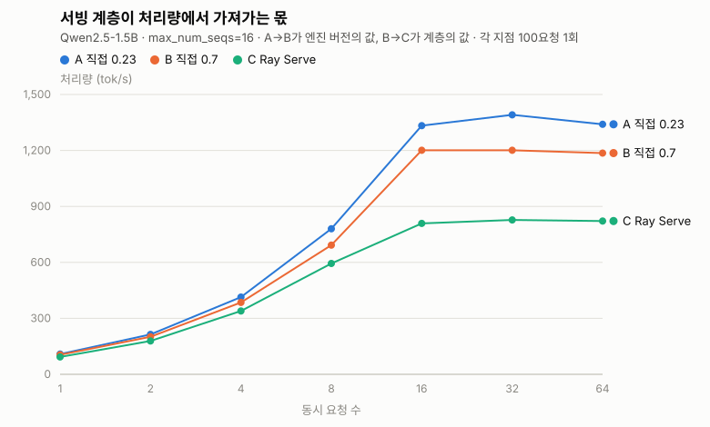
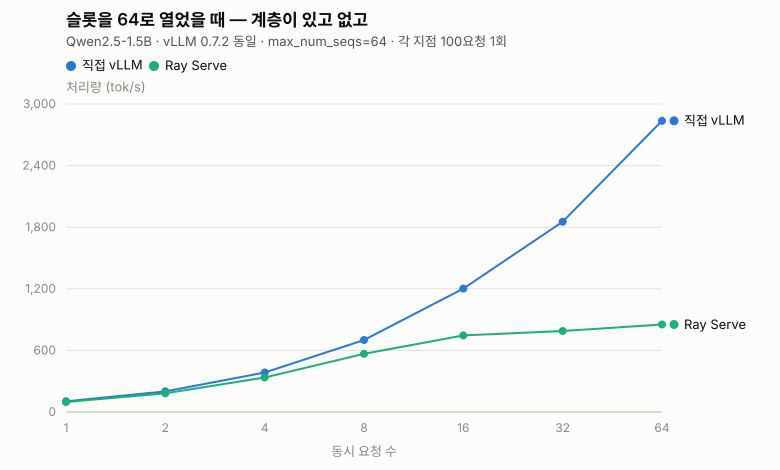
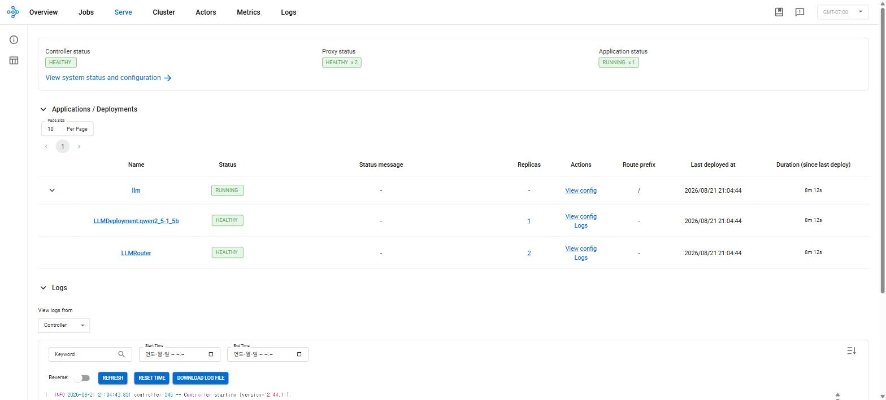
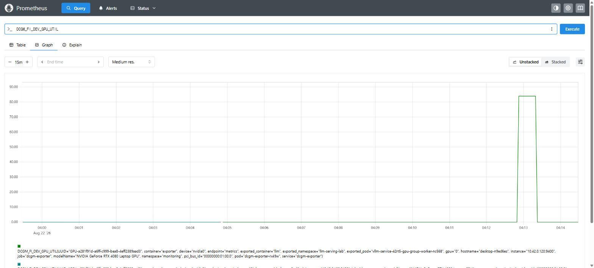
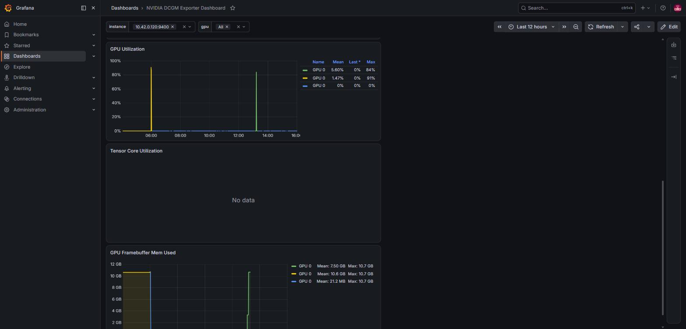
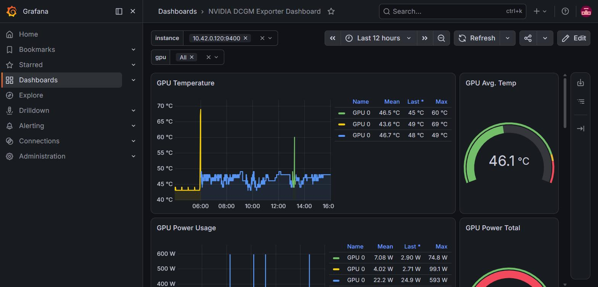
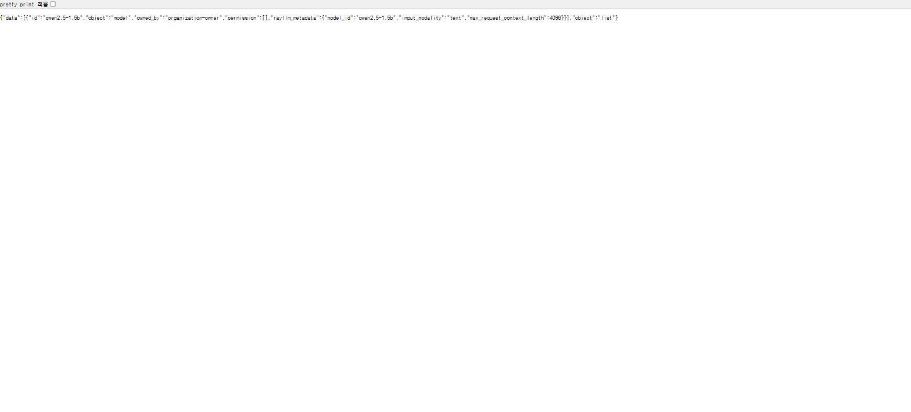
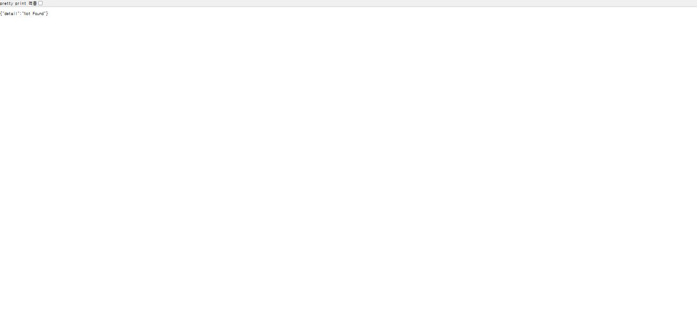
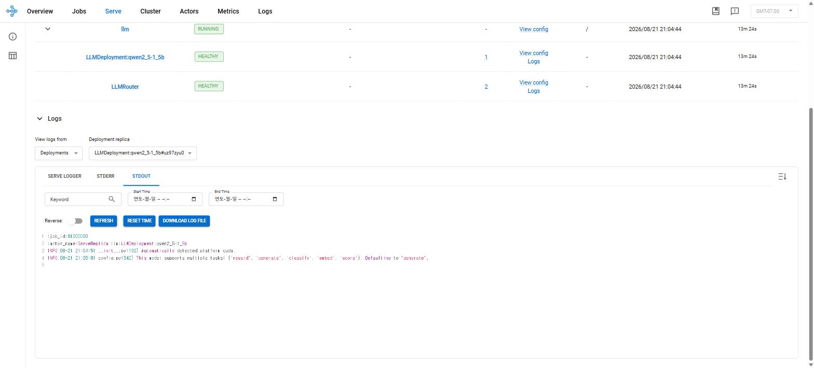
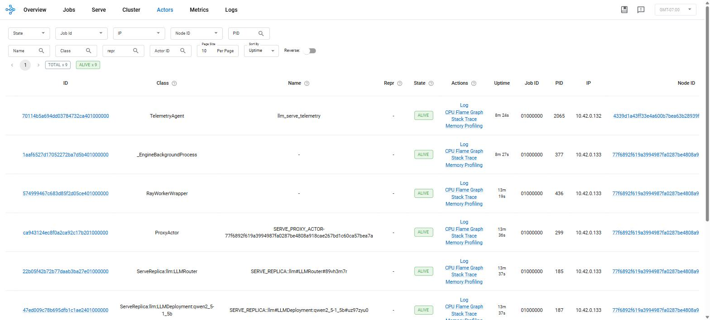

# 슬롯을 4배로 늘렸는데 처리량이 그대로였다

**GPU 한 장짜리 LLM 서빙에서 병목을 한 층씩 벗겨 찾은 기록**

> **핵심 요약**
>
> 지난 편에서 `max_num_seqs`(슬롯)를 1 → 64로 늘려 처리량을 **23배** 올렸습니다. 이번에 Ray Serve 위에서 같은 노브를 16 → 64로 올렸더니 **+3.7%**에 그쳤습니다. 같은 모델, 같은 노브인데 듣지 않았습니다.
>
> 요청이 지나는 층을 하나씩 벗겨 확인한 결과, 병목은 엔진이 아니라 **그 앞의 서빙 계층**이었습니다. 같은 엔진·같은 설정에서 계층만 걷어내자 같은 부하에서 **852 → 2,837 tok/s(3.3배)**, goodput은 **19% → 100%**가 됐습니다.
>
> 함께 확인한 것: KV cache 노브는 동시성 상한을 4.5배 흔들지만 처리량은 ±17% 안이었고, 교재의 KV 공식은 GQA 모델에서 **6배** 어긋났습니다.

---

## 목차

- [1. 문제 — 지난 편의 노브가 이번엔 듣지 않았다](#1-문제--지난-편의-노브가-이번엔-듣지-않았다)
- [2. 어디를 의심할 것인가 — 요청이 지나는 세 층](#2-어디를-의심할-것인가--요청이-지나는-세-층)
- [3. 첫 번째 층 — 앞단](#3-첫-번째-층--앞단)
- [4. 두 번째 층 — 엔진 메모리](#4-두-번째-층--엔진-메모리)
- [5. 세 번째 층 — 배칭 방식](#5-세-번째-층--배칭-방식)
- [6. 병목은 어디였나](#6-병목은-어디였나)
- [7. 운영 관점에서의 판단](#7-운영-관점에서의-판단)
- [측정 증거](#측정-증거)
- [한계와 다음 단계](#한계와-다음-단계)
- [결론 — 실험하며 배운 것](#결론--실험하며-배운-것)
- [부록. 재현 절차](#부록-재현-절차)
- [참고 자료](#참고-자료)

---

## 1. 문제 — 지난 편의 노브가 이번엔 듣지 않았다

앞 편 [Continuous Batching이 처리량을 높이는 방식](./Continuous%20Batching%EC%9D%B4%20%EC%B2%98%EB%A6%AC%EB%9F%89%EC%9D%84%20%EB%86%92%EC%9D%B4%EB%8A%94%20%EB%B0%A9%EC%8B%9D.md)에서 GPU 한 장 위의 vLLM에 `--max-num-seqs`만 바꿔가며 부하를 걸었습니다. 슬롯 1 → 64에서 113 → 2,627 tok/s. **23배**였습니다. 결론은 분명해 보였습니다 — 슬롯이 처리량을 만든다.

이번 주에는 그 위에 Ray Serve를 얹었습니다. 실서비스는 vLLM을 맨몸으로 띄우지 않으니까요. 그리고 같은 노브를 다시 돌렸습니다. **슬롯 16 → 64.**

| 동시성 | slots=16 | slots=64 | 변화 |
|---|---|---|---|
| 16 | 809 | 746 | −7.8% |
| 32 | 827 | 789 | −4.6% |
| 64 | 822 | 852 | **+3.7%** |

**4배로 늘렸는데 그대로입니다.** 동시성 16과 32에서는 오히려 줄었습니다.

지난 편의 23배와 이번의 3.7%는 같은 모델, 같은 노브, 같은 GPU에서 나온 값입니다. 달라진 건 앞에 Ray Serve가 한 겹 끼었다는 것뿐입니다.

그래서 이번 글의 질문은 이것입니다.

> **슬롯을 늘려도 처리량이 안 오른다면, 무엇이 막고 있는가.**

---

## 2. 어디를 의심할 것인가 — 요청이 지나는 세 층

요청 하나가 토큰이 되어 돌아오기까지 지나는 길을 층으로 나누면 셋입니다.

```
클라이언트
   ↓  ① 앞단 — HTTP 라우팅, 프록시, 배포 관리
서빙 계층 (Ray Serve)
   ↓  ② 엔진 스케줄러 — 어떤 요청을 지금 굴릴지
vLLM 엔진
   ↓  ③ 메모리 — KV cache가 몇 개까지 담을지
GPU
```

병목은 이 중 하나에 있습니다. 각 층을 무엇으로 확인할지, 그리고 **왜 그 도구를 골랐는지**를 먼저 정리했습니다.

| 층 | 의심 | 확인 방법 | 그 도구를 고른 이유 |
|---|---|---|---|
| **① 앞단** | 계층이 요청을 엔진에 제때 못 넣어준다 | 같은 엔진을 **계층 있이/없이** 재기 | Ray Serve는 교재 CH4의 공식 도전과제이자, 교재가 권장하는 K8s 서빙 스택입니다. 무엇보다 **얹고 안 얹고를 비교할 수 있어** 계층의 몫만 떼어낼 수 있습니다 |
| **② 메모리** | KV cache 예산이 동시 요청 수를 막는다 | `max_model_len`·`max_num_seqs`·`util` 스윕 | 교재 CH5 「Estimating KV Cache Size」와 공식 도전과제 2가 요구하는 바로 그 세 노브입니다. RayService는 이 셋을 `serveConfigV2`에 그대로 노출하고 **무중단으로 갈아끼워** 스윕이 깨끗합니다 |
| **③ 배칭 방식** | 요청을 묶는 방식이 잘못됐다 | 최대 배치 크기 · 최대 대기 시간을 돌려보기 | **vLLM에는 이 두 노브가 없습니다.** dynamic batching 모드 자체가 없어서 같은 시스템에서 잴 수 없습니다. 그 두 노브를 실제로 가진 도구가 Triton이라 옆에서 원리만 확인했습니다 |

③에 미리 단서를 답니다. **이 층만 다른 시스템에서 쟀습니다.** 그래서 ①·②와 나란히 놓고 "셋 중 누가 천장이냐"를 겨룰 수는 없습니다. 대신 "vLLM은 왜 이 방식을 안 쓰는가"라는 곁가지 질문에 답합니다. [5장](#5-세-번째-층--배칭-방식)에서 다시 짚습니다.

### 실험 환경

| 항목 | 값 |
|---|---|
| GPU | NVIDIA GeForce RTX 4080 Laptop, 12,282 MiB |
| 드라이버 | 581.57 |
| 커널 | 6.18.33.1-microsoft-standard-WSL2 |
| k3s | v1.36.2+k3s1 |
| 모델 | `Qwen/Qwen2.5-1.5B-Instruct` |

GPU가 한 장이라 세 실험은 서로 배타적입니다. 앞의 것을 완전히 내리고 `nvidia-smi`로 VRAM 반환을 눈으로 확인한 뒤 다음을 띄웠습니다.

부하는 지난 편과 **같은 명령, 같은 시나리오**입니다. 짧은 프롬프트, 동시성 1·2·4·8·16·32·64, 각 100요청, 요청마다 프롬프트 앞에 고유 접두사를 붙여 캐시 효과를 배제했습니다.

```bash
python3 benchmark.py --scenarios short --concurrency 1,2,4,8,16,32,64 \
  --requests-per-level 100 --warmup 1 --unique-prefix \
  --ttft-slo 0.5 --e2e-slo 10 --output results/c3-rayserve-short.json
```

---

## 3. 첫 번째 층 — 앞단

### 3-1. 재려다 만난 벽 — 통제 변수가 깨져 있었다

계층의 값을 재려면 **엔진이 같아야** 합니다. 그런데 Ray Serve LLM을 띄우는 `rayproject/ray-llm:2.44.1-py311-cu124` 이미지가 품은 vLLM은 **0.7.2**였습니다. 지난 편 기준선은 **0.23.0**입니다. 마이너 버전이 16개 벌어집니다.

이대로 두 값을 빼면 나오는 건 계층의 값이 아니라 계층과 엔진 버전 차이의 합계입니다.

그래서 구성을 하나 더 만들었습니다. **같은 ray-llm 이미지로, Ray 없이 vLLM만** 띄운 것입니다. 이미지가 같으니 엔진도 같고, 남는 변수가 계층 하나로 좁혀집니다.

| # | 구성 | 이미지 | vLLM | 계층 | 이 구성이 하는 일 |
|---|---|---|---|---|---|
| **A** | 직접 vLLM (지난 편) | `vllm-openai:v0.23.0` | 0.23.0 | 없음 | 기존 기준선 |
| **B** | 직접 vLLM (신규) | `ray-llm:2.44.1` | 0.7.2 | 없음 | **A와의 차 = 엔진 버전의 값** |
| **C** | Ray Serve | `ray-llm:2.44.1` | 0.7.2 | Ray Serve | **B와의 차 = 계층의 순수 값** |

세 구성 모두 `max_model_len=4096` / `gpu_memory_utilization=0.85`로 맞췄습니다.

### 3-2. 갈라놓으면 이렇게 나옵니다 (슬롯 16)

먼저 지난 편과 같은 슬롯 16에서 쟀습니다.

**엔진 버전의 값 (A → B) — 계층은 양쪽 다 없음**

| 동시성 | A (0.23.0) | B (0.7.2) | 차이 % |
|---|---|---|---|
| 1 | 108.8 | 104.7 | −3.8% |
| 8 | 780.2 | 692.6 | −11.2% |
| 16 | 1,333.1 | 1,200.9 | **−9.9%** |
| 32 | 1,391.0 | 1,201.2 | −13.6% |
| 64 | 1,340.0 | 1,186.1 | −11.5% |

**계층의 값 (B → C) — 같은 엔진, 계층만 다름**

| 동시성 | B 직접 | C Ray Serve | 차이 % |
|---|---|---|---|
| 1 | 104.7 | 93.3 | −10.9% |
| 4 | 385.1 | 339.5 | −11.9% |
| 8 | 692.6 | 594.2 | −14.2% |
| 16 | 1,200.9 | 809.1 | **−32.6%** |
| 32 | 1,201.2 | 827.3 | −31.1% |
| 64 | 1,186.1 | 821.6 | −30.7% |

A와 C를 그냥 빼면 −39.3%가 나옵니다. 갈라놓으면 계층 몫은 **32.6%**이고 나머지 약 10%는 엔진이 16개 버전 낡은 값이었습니다. 통제 변수를 하나 안 잡았으면 계층에 7%p를 잘못 씌울 뻔했습니다.



A와 B는 거의 붙어 갑니다. 엔진 버전 차이는 눈에 잘 안 띌 정도입니다. 갈라지는 건 C 하나뿐이고, 갈라지기 시작하는 지점이 **동시성 16**입니다.

### 3-3. 결정적 확인 — 엔진에 여유를 주면

여기까지로는 아직 부족합니다. 슬롯이 16이면 **엔진 자체가 1,200 tok/s에서 막힙니다.** 계층이 그보다 낮은 809에서 막는다는 것만 알 뿐, 엔진에 여유를 줬을 때 계층이 어디까지 따라오는지는 모릅니다.

그래서 **구성 B를 슬롯 64로 다시 띄웠습니다.** 구성 C의 슬롯 64와 같은 조건입니다.

| 동시성 | B 직접 (slots=64) | C Ray Serve (slots=64) | 차이 % |
|---|---|---|---|
| 1 | 104.6 | 97.6 | −6.7% |
| 4 | 384.8 | 336.2 | −12.6% |
| 8 | 700.9 | 567.3 | −19.1% |
| 16 | 1,201.5 | 745.8 | −37.9% |
| 32 | 1,853.1 | 788.8 | −57.4% |
| 64 | **2,836.8** | **852.3** | **−70.0%** |



**여기서 갈립니다.** 같은 엔진, 같은 설정인데 동시성 64에서 **3.3배** 차이가 납니다.

같은 노브를 양쪽에서 돌려보면 더 분명합니다.

| 슬롯 16 → 64, 동시성 64에서 | 처리량 변화 |
|---|---|
| 직접 vLLM | 1,186 → 2,837 (**+139%**) |
| Ray Serve | 822 → 852 (**+3.7%**) |

**노브는 고장 나지 않았습니다.** 계층 없이 돌리면 그대로 듣습니다. 계층 아래서만 안 듣습니다.

지연은 더 벌어집니다.

| 동시성 | B 직접 TTFT p95 | C Ray Serve TTFT p95 | 차이 |
|---|---|---|---|
| 1 | 0.027 s | 0.068 s | +0.040 s |
| 16 | 0.112 s | 0.285 s | +0.173 s |
| 32 | 0.190 s | 1.698 s | +1.507 s |
| 64 | **0.330 s** | **4.006 s** | **+3.676 s** |

동시성 64에서 직접은 TTFT p95가 **0.330초**로 SLO(0.5초) 안에 들어옵니다. goodput **100%**입니다. 같은 부하에서 Ray Serve는 4.006초, goodput **19%**입니다.

### 3-4. 이 층에서 배운 것

**계층의 값은 고정 통행료가 아닙니다.** 엔진이 얼마나 달릴 수 있느냐에 따라 달라집니다.

| 조건 | 엔진이 낼 수 있는 값 | 계층이 먹는 몫 |
|---|---|---|
| 슬롯 16 (엔진이 1,200에서 막힘) | 1,186 | 30.7% |
| 슬롯 64 (엔진이 2,837까지 감) | 2,836.8 | **70.0%** |

엔진이 한가할 땐 계층이 통행료를 받고, 엔진에 여유를 줄수록 계층 자신이 천장이 됩니다. **엔진을 튜닝할수록 계층의 손해가 커진다**는 뜻이라, 엔진 최적화와 계층 선택은 따로 볼 문제가 아닙니다.

그리고 방법론 하나 — **비교를 성립시키는 데 15분이 더 들었습니다.** 구성 B를 만들지 않았다면 계층에 39.3%를 씌웠을 것이고, 슬롯 64로 다시 재지 않았다면 32.6%에서 멈췄을 겁니다. 실제 값은 70%였습니다.

---

## 4. 두 번째 층 — 엔진 메모리

계층이 범인이라는 게 밝혀졌지만, 두 번째 후보도 확인해야 소거가 끝납니다. **메모리가 동시 요청 수를 막고 있었던 건 아닌가.**

### 4-1. 이 세 노브를 고른 이유

교재 CH5는 KV cache 크기가 동시 요청 수의 상한을 정한다고 설명하고, 공식 도전과제 2가 **`max batch size`·`max model length`·`max number of tokens`** 세 값을 바꿔가며 성능을 비교하라고 요구합니다. RayService의 `serveConfigV2 → engine_kwargs`에 그 셋이 그대로 노출돼 있어, 계층은 고정한 채 메모리만 흔들 수 있습니다.

RayService를 쓴 실무적 이유도 있습니다. `serveConfigV2`만 바뀌면 **파드를 갈지 않고 Serve 앱만 제자리에서 교체**합니다. 지난 편에서 `kubectl set env`로 재배포하다 13일 전 구버전이 떠 있어 변경이 조용히 무시된 사고가 있었는데, 여기서는 구조적으로 안 생깁니다. 실제로 스윕 네 번 동안 **파드 재시작 0회**였고 엔드포인트는 계속 살아 있었습니다.

### 4-2. 네 조합

| # | `max_model_len` | `max_num_seqs` | `util` | 활성화 피크 | **KV 예산** | **`Maximum concurrency`** |
|---|---|---|---|---|---|---|
| 1 | 4096 | 16 | 0.85 | 0.26 GiB | 7.00 GiB | **64.02x** |
| 2 | 4096 | 64 | 0.85 | 0.48 GiB | 6.79 GiB | 62.04x |
| 3 | 16384 | 64 | 0.85 | 1.02 GiB | 6.25 GiB | **14.28x** |
| 4 | 4096 | 64 | 0.60 | 0.48 GiB | 3.79 GiB | 34.62x |

노브가 상한을 **4.5배**(14.28 ↔ 64.02) 흔듭니다. 예상대로입니다.

### 4-3. 그런데 처리량은 따라 움직이지 않았습니다

| # | 설정 | `Maximum concurrency` | tok/s (c=16) | tok/s (c=32) | tok/s (c=64) |
|---|---|---|---|---|---|
| 1 | len4096 / seqs16 / 0.85 | 64.02x | 809 | 827 | 822 |
| 2 | len4096 / seqs64 / 0.85 | 62.04x | 746 | 789 | 852 |
| 3 | len16384 / seqs64 / 0.85 | 14.28x | 878 | 948 | **964** |
| 4 | len4096 / seqs64 / 0.60 | 34.62x | 814 | 927 | 961 |

상한이 4.5배 갈리는데 처리량은 **822 ~ 964, ±17% 안**입니다. 게다가 상한이 가장 낮은 3번(14.28x)이 처리량은 가장 높습니다.

이유는 `Maximum concurrency`의 정의에 있습니다. **그 값은 "모든 요청이 `max_model_len`을 꽉 채워 쓴다면"이라는 최악 가정의 입장 제한**입니다. 이 실험의 프롬프트는 짧아서 요청 하나가 실제로 쓰는 KV는 그 가정의 몇십분의 일입니다. 그러니 상한에 닿을 일이 없고, 상한을 낮춰도 아프지 않습니다.

**두 번째 후보는 소거됩니다.** 이 워크로드에서 메모리는 병목이 아니었습니다. 그리고 3장에서 슬롯 16 → 64가 계층 아래서 안 들었던 것도 메모리 탓이 아니었습니다 — 같은 노브가 계층 없이는 +139%를 냈으니까요.

### 4-4. 기동할 때마다 KV 예산이 달라지는 이유

지난 편에 이런 걸 남겼습니다. *"같은 `slots=64`인데 `Maximum concurrency`가 59.50x / 28.77x로 갈렸다. 원인 미확인."*

위 표의 1번 → 2번을 보면 메커니즘이 보입니다. 가중치(2.89 GiB)도 `util`(0.85)도 그대로인데 KV 예산이 **7.00 → 6.79 GiB**로 줄었습니다. 줄어든 만큼이 활성화 피크로 갔습니다(0.26 → 0.48 GiB).

vLLM은 KV 예산을 이렇게 잡습니다.

```
KV 예산 = 총 VRAM × util − 가중치 − 활성화 피크
```

그리고 **활성화 피크는 기동할 때 프로파일링을 한 번 돌려서 재는 값**입니다. 상수가 아닙니다. 슬롯을 늘리면 배치가 커지고, 배치가 커지면 중간 텐서가 커집니다. 그만큼 KV에 남는 몫이 깎입니다. 3번에서 컨텍스트를 4배로 늘렸을 때 활성화가 1.02 GiB까지 뛴 것도 같은 이유입니다.

다만 정직하게 적어두면, 이번에 관측한 변동은 **3% 수준**(64.02 → 62.04)이고 지난 편의 59.50 ↔ 28.77은 2배입니다. 이 메커니즘만으로는 설명이 안 됩니다. 직전 파드가 VRAM을 덜 돌려준 상태에서 다음이 떴다는 가설이 여전히 유력하고 **미확인으로 남습니다.**

한 가지 더 — 같은 설정(`len4096 / seqs64 / 0.85`)을 **계층 없이** 띄웠을 때도 `Maximum concurrency`는 **62.04x**로 똑같았습니다. 계층은 처리량을 70% 먹었지만 **KV 예산은 건드리지 않습니다.** 두 층이 서로 다른 자원을 쓴다는 확인입니다.

### 4-5. 곁가지 — 교재 공식이 6배 어긋난 자리

위 표의 KV 예산이 맞는지 손으로 검산하려다 발견한 것입니다.

CH5는 KV cache 크기를 이렇게 계산합니다.

```
토큰당 KV = 2(K,V) × 층 수 × 어텐션 헤드 수 × head_dim × 정밀도(바이트)
```

Llama-2-7b 예시로 `2 × 32 × 32 × 128 × 2 = 0.5 MB/token`.

**이 공식을 우리 모델에 그대로 넣으면 안 맞습니다.** 교재가 각주로 예고해 둔 그대로입니다. *"기본적인 멀티헤드 어텐션(MHA) 형태를 사용하는 Llama-2-7b를 사용하겠습니다"*, *"이후 장에서 MQA, GQA, MLA 등 KV 캐시를 축소하고 압축하는 다른 아이디어들을 소개할 예정"*. 그 "이후 장"이 이번 주 CH6이고, **Qwen2.5-1.5B가 바로 GQA**입니다.

`config.json`을 직접 열어 봤습니다.

| 항목 | 값 |
|---|---|
| `num_hidden_layers` | 28 |
| `num_attention_heads` | **12** |
| `num_key_value_heads` | **2** |
| head_dim | 128 |
| dtype | bfloat16 (2바이트) |

쿼리 헤드 12개가 KV 헤드 2개를 **6:1로 공유**합니다. KV cache는 K와 V만 저장하므로 세어야 하는 건 KV 헤드 수입니다.

| | 공식 | 토큰당 KV |
|---|---|---|
| 교재 그대로 (MHA 가정) | 2 × 28 × **12** × 128 × 2 | 172,032 B = **168.0 KiB** |
| GQA 반영 | 2 × 28 × **2** × 128 × 2 | 28,672 B = **28.0 KiB** |

**6배**입니다. 어느 쪽이 맞는지는 엔진이 기동 로그에 직접 찍어 줍니다.

| 설정 | KV 예산 | 요청당 KV | **GQA 손계산** | **로그 실측** | MHA 공식이었다면 |
|---|---|---|---|---|---|
| len4096 / seqs16 / 0.85 | 7.00 GiB | 112 MiB | 64.0x | **64.02x** | 10.7x |
| len4096 / seqs64 / 0.85 | 6.79 GiB | 112 MiB | 62.1x | **62.04x** | 10.3x |
| len16384 / seqs64 / 0.85 | 6.25 GiB | 448 MiB | 14.3x | **14.28x** | 2.4x |
| len4096 / seqs64 / 0.60 | 3.79 GiB | 112 MiB | 34.7x | **34.62x** | 5.8x |

**네 줄 모두 소수점 둘째 자리까지 맞습니다.** 교재 공식대로 계산했다면 "동시 요청 10개가 상한"이라고 결론냈을 자리에서 실제 상한은 64입니다. 자기 모델의 `num_key_value_heads`를 확인하지 않고 CH5 공식을 그대로 쓰면 GQA 모델에서 용량을 몇 배로 과대평가합니다.

---

## 5. 세 번째 층 — 배칭 방식

### 5-1. 이 층은 같은 시스템에서 잴 수 없습니다

세 번째 후보는 "요청을 묶는 방식이 잘못됐나"입니다. 그런데 **vLLM에는 이 노브가 없습니다.** vLLM은 continuous batching만 하고, dynamic batching의 두 파라미터(최대 배치 크기·최대 대기 시간)를 노출하지 않습니다. 켜고 끄며 비교할 대상이 애초에 없습니다.

교재 CH6에는 「Dynamic Batching in Online Inference」 절이 통째로 있는데, 그걸 vLLM으로는 실측할 수 없다는 뜻입니다. 그래서 그 두 노브를 실제로 가진 **Triton**으로 옮겨, 다른 모델(`mobilenet_v2`)에서 **원리만** 확인했습니다.

> ⚠️ **이 실험은 앞의 두 층과 같은 저울이 아닙니다.** 모델도 서버도 지표도 다릅니다(mobilenet · Triton · inf/s). "이 배포의 천장이 셋 중 누구냐"를 겨루는 후보에서는 **빠집니다.** 대신 *"그래서 vLLM은 왜 이 방식을 안 쓰는가"* 에 답합니다.

### 5-2. 모델부터 다시 만들어야 했습니다

교재 실습의 `densenet_onnx`로는 이 실험을 **시작할 수조차 없습니다.** `config.pbtxt`가 이렇게 되어 있습니다.

```protobuf
max_batch_size : 0                       # 배칭 자체가 꺼짐
dims: [ 3, 224, 224 ]
reshape { shape: [ 1, 3, 224, 224 ] }    # 배치 차원 1을 억지로 끼워 넣는 중
```

그 ONNX는 **배치 축이 1로 고정**이라 `max_batch_size`를 켜면 모델이 로드를 거부합니다. `reshape`가 그 우회 흔적입니다. 그래서 배치 축을 연 모델을 새로 만들었습니다. 핵심은 export 한 줄입니다.

```python
torch.onnx.export(
    model, dummy, "model.onnx",
    input_names=["input"], output_names=["output"],
    dynamic_axes={"input": {0: "batch"}, "output": {0: "batch"}},   # ★ 이 한 줄
    opset_version=17,
)
```

> **서빙 계층만 봐서는 안 보이는 제약입니다.** 배칭을 켜려면 모델이 먼저 배치를 받아들여야 합니다. "설정에서 켜면 되는 기능"이 아니라 **모델 export 시점에 결정되는 성질**입니다.

### 5-3. 결과 — 효과는 설정값이 아니라 도착률이 정합니다

`max_batch_size: 8` 고정, `max_queue_delay_microseconds`만 바꿔가며 각 조합에 동시성 1·8·32로 300요청씩.

| 대기 시간 | **평균 배치 크기** | 큐 대기 (ms/req) | 연산 (ms/req) |
|---|---|---|---|
| **off (대조군)** | **1.00** | 16.5 | 1.83 |
| 0 | 2.16 | 19.5 | 14.1 |
| 1 ms | 2.03 | 34.1 | 15.6 |
| 5 ms | 2.37 | 14.2 | 8.44 |
| 20 ms | 2.39 | 10.1 | 6.59 |

평균 배치 크기는 `nv_inference_request_success / nv_inference_exec_count`를 구간 차분해서 구했습니다. 대조군이 **정확히 1.00**(960요청 / 960실행)으로 나와 비교가 성립합니다. 배칭을 켜면 배치가 2.0~2.4로 올라가지만 `max_batch_size` 8은 못 채웁니다 — 대기 창이 닫히기 전에 8개가 도착하지 않았다는 뜻입니다.

**처리량 (inf/s)**

| 대기 시간 | 동시성 1 | 동시성 8 | 동시성 32 |
|---|---|---|---|
| off | **352.1** | 583.7 | 597.2 |
| 0 | 334.5 | 132.4 | 623.3 |
| 1 ms | 255.9 | 99.8 | 402.6 |
| 5 ms | 105.3 | 542.1 | 569.3 |
| 20 ms | **37.5** | 558.3 | **1,371.2** |

**`20 ms` 한 줄만 보세요.** 동시성 1에서 37.5 inf/s로 대조군의 9분의 1이고, 동시성 32에서 1,371 inf/s로 대조군의 2.3배입니다. 같은 설정, 같은 서버, 같은 모델입니다.

지연을 보면 이유가 분명합니다. 동시성 1일 때 p50:

| 대기 시간 | p50 지연 (c=1) |
|---|---|
| off | 2.40 ms |
| 5 ms | 9.32 ms |
| 20 ms | **26.81 ms** |

**대기 창을 그대로 다 기다리고 있습니다.** 동시성 1이면 같이 묶일 요청이 애초에 없으니 설정한 시간만큼 앉아 있다가 혼자 계산됩니다. 20 ms 설정에 p50 26.8 ms — 대기 20 ms + 연산 약 7 ms입니다.

(동시성 8의 `delay=0`·`1ms` 두 칸이 c=1·c=32보다 낮게 나온 건 곡선 모양과 어긋납니다. 재측정하지 못했으므로 **측정 잡음으로 보고 결론에 쓰지 않았습니다.**)

### 5-4. 이 층에서 배운 것 — vLLM이 이 방식을 버린 이유

dynamic batching은 두 가지를 전제합니다.

1. 요청들이 **비슷한 시각에** 도착한다 → 5-3이 보여준 도착률 의존성
2. 요청들이 **비슷한 시간이 걸린다** → 배치를 통째로 묶었다 통째로 내보내니까

mobilenet은 둘째 전제를 완벽히 만족합니다. 이미지 크기가 같으면 연산량이 같습니다.

**LLM은 둘째 전제가 깨집니다.** 같은 배치에 20토큰짜리와 500토큰짜리가 섞이면 20토큰 요청은 끝나고도 500토큰이 끝날 때까지 배치 안에 붙잡혀 있습니다. 배치 전체가 가장 긴 요청에 인질로 잡힙니다.

continuous batching은 이 전제를 **버려서** 문제를 풉니다. 배치를 통째로 다루지 않고 iteration마다 끝난 것을 빼고 기다리던 것을 넣습니다. 지난 편의 23배가 그 값어치였습니다.

| 배칭 방식 | 평균 배치 | 이 시리즈에서 |
|---|---|---|
| 없음 | 1.00 | (미수행 — 다음 편) |
| static | — | (미수행 — 다음 편) |
| **dynamic** | **1.00 → 2.4** | **이번 편 5장** (Triton, mobilenet) |
| **continuous** | — | 지난 편 (vLLM, 23배) |

---

## 6. 병목은 어디였나

처음 질문은 *"슬롯을 늘려도 처리량이 안 오른다면 무엇이 막고 있는가"* 였습니다.

| 층 | 판정 | 근거 |
|---|---|---|
| **① 앞단 (서빙 계층)** | **범인** | 같은 엔진·같은 슬롯 64에서 계층만 걷어내니 852 → 2,837 tok/s. 슬롯 노브도 계층 없이는 +139%로 정상 작동 |
| ② 엔진 메모리 (KV cache) | 무혐의 | 노브가 상한을 4.5배 흔드는 동안 처리량은 ±17% 안. 짧은 프롬프트라 상한에 닿지 않음 |
| ③ 배칭 방식 | 판정 불가 | vLLM에 해당 노브가 없어 같은 저울로 잴 수 없음. 다른 시스템에서 원리만 확인 |

**답은 앞단이었습니다.** 그리고 그 값은 고정돼 있지 않습니다 — 엔진이 낼 수 있는 값이 커질수록 계층이 먹는 비율도 커져, 슬롯 64 조건에서는 **70%**였습니다.

---

## 7. 운영 관점에서의 판단

### 비용 — 수용 인원은 설정에 따라 4배 달라집니다

이 GPU 한 장(12 GB)에서 Qwen2.5-1.5B를 4096 컨텍스트로 서빙할 때, **goodput 100%를 유지하는 동시 요청 수**는 이렇습니다.

| 구성 | c=16 | c=32 | c=64 |
|---|---|---|---|
| 직접 vLLM, slots=16 | 100% | 16% | 16% |
| Ray Serve, slots=16 | 100% | 39% | 16% |
| Ray Serve, slots=64 | 100% | 48% | 19% |
| **직접 vLLM, slots=64** | **100%** | **100%** | **100%** |

같은 GPU인데 **동시 16명에서 64명까지** 갈립니다. `Maximum concurrency`가 보고한 64와 우연히 같은 숫자지만 근거는 다릅니다 — 저건 메모리가 허용하는 입장 제한이고, 이건 지연 목표까지 지키며 실제로 받아낸 수입니다.

용량 산정에 쓸 숫자는 **지연 목표를 걸고 실제로 재본 값**뿐입니다.

### 안정성

- **`Maximum concurrency`가 흔들려도 에러가 나지 않습니다.** KV 예산이 조용히 줄고 처리량 천장만 낮아집니다. 그래서 롤아웃마다 이 로그 줄을 파일로 남기는 규칙을 만들었습니다.
- **RayService는 지난 편의 재배포 사고를 구조적으로 막습니다.** `serveConfigV2`만 바뀌면 파드를 갈지 않고 Serve 앱만 교체합니다. 다만 반영됐는지는 반드시 확인해야 합니다 — 이번에도 `/v1/models` 응답과 기동 로그를 양쪽으로 봤습니다.

### 확장성

컨텍스트 길이와 동시성은 **같은 KV 예산을 두고 경쟁**합니다. `max_model_len`을 4배로 늘리면 이론 동시성이 4분의 1이 됩니다(64.02x → 14.28x). 다만 워크로드가 실제로 그 길이를 안 쓰면 처리량에는 티가 안 납니다. **"열어둔 길이"가 아니라 "실제로 쓰는 길이"로 용량을 잡아야 합니다.**

### 복잡도와 관측성

계층의 대가는 처리량만이 아니었습니다.

| | Ray Serve | 같은 엔진, Ray 없음 |
|---|---|---|
| `:8000/metrics` | **404** | 200 |
| `vllm:*` 메트릭 | **0개** | 15개 |
| 대신 나오는 것 | `ray_*` 184개 (워커/헤드 `:8080`) | — |

**같은 vLLM 0.7.2인데 계층 유무로 갈립니다.** 지난 편의 서버 측 교차검증은 전부 그 메트릭에 기대고 있었습니다. `num_requests_running`이 천장을 치고 초과분이 `num_requests_waiting`으로 쌓이는 궤적을 **이 환경에서는 볼 수 없습니다.**

**계층이 주는 것**도 적어야 공평합니다. 무중단 롤아웃, 오토스케일링, 멀티 애플리케이션 라우팅, 대시보드. GPU 한 장에서는 첫 번째만 체감했지만 레플리카가 여럿인 환경에서는 값이 다를 수 있습니다. 이 실험이 말할 수 있는 건 **"가격이 얼마인가"까지**입니다.

### 진입 비용

Triton은 **모델을 다시 export해야 했습니다**(5-2). 배칭을 켜려면 모델이 배치 축을 갖고 있어야 하고, 그건 서빙 설정이 아니라 모델 산출 시점의 결정입니다.

---

## 측정 증거

> ⚠️ **아래 화면은 본문 표를 만든 그 실행이 아닙니다.** 측정을 마치고 GPU를 내린 뒤, 같은 매니페스트로 **다시 띄워 찍은 확인용 재현**입니다(2026-08-22). 기동값이 본문과 같게 나오는지, 관측성 관련 주장이 실제 화면에서 성립하는지를 보이려는 것입니다. 숫자를 본문 표와 섞어 읽지 마세요.

### 배포가 실제로 떠 있다



`LLMDeployment:qwen2_5-1_5b` replica 1개 + `LLMRouter` replica 2개입니다.

### GPU가 워커에만 붙어 있다

![Ray Dashboard Cluster 탭 — 노드 2개 ALIVE. head 노드는 GPU N/A, gpu-group-worker 노드만 GPU [0] 83.0% · GRAM 10962MiB/12282MiB](./screenshots/proof-w3-02-ray-cluster-gpu.jpg)

헤드는 `GPU N/A`, 워커만 `[0] 83.0%` / `10962MiB/12282MiB`입니다. 4-2의 KV 예산 계산이 이 12,282 MiB를 분모로 씁니다.

### 부하가 GPU까지 닿았다



시계열 라벨의 `exported_pod`가 **Ray 워커 파드**라, 이 GPU 일이 어디서 나왔는지가 메트릭 자체에 박혀 있습니다. 이 그래프를 만든 것은 동시성 64로 900요청을 건 **별도의 지속 부하**입니다(1,036.9 tok/s, goodput 2.1%). 본문 표는 각 지점 100요청이라 조건이 다릅니다.

### Grafana DCGM 대시보드



- **GPU Utilization** — 측정 구간에서 **84% / 91%** 까지 오릅니다.
- **GPU Framebuffer Mem Used** — 최대 **10.7 GB**. `nvidia-smi`의 10,628 MiB, Ray Dashboard의 10,962 MiB와 같은 값입니다.
- **Tensor Core Utilization — `No data`** ★ — 「한계와 다음 단계」에 적어둔 그대로입니다. **WSL2에서는 `DCGM_FI_PROF_*` 계열이 노출되지 않아** 패널은 있는데 채울 데이터가 오지 않습니다.



> ⚠️ 같은 화면의 `GPU Power Usage`는 **최대 593 W**로 읽힙니다. 이 GPU는 70 W 제품이라 그대로 믿을 수 없는 값이고, 원인을 확인하지 않았으므로 **전력 수치는 쓰지 않았습니다.**

### 엔진 설정이 본문과 같다



### 그런데 `/metrics`는 없다



바로 위에서 `/v1/models`가 정상 응답한 **같은 포트**입니다. 「복잡도와 관측성」에서 표로 적은 404가 이것입니다.

### 기동 로그가 replica에 없다





`_EngineBackgroundProcess`가 `ServeReplica`와 **별개 액터**(PID 377 vs 187)입니다. vLLM 엔진은 replica가 아니라 이 액터 안에서 돌고 로그도 그쪽 파일로 갑니다. `Maximum concurrency` 한 줄을 찾으려면 파드에 들어가 `/tmp/ray/session_latest/logs/`를 뒤져야 하는 이유가 이 구조입니다.

> **Triton(5장) 화면은 없습니다.** GPU가 한 장이라 Ray Serve와 배타적이고, Triton은 대시보드 UI가 없어 캡처할 화면이 사실상 메트릭 텍스트뿐입니다. 증빙은 `labs/triton-dynamic-batching/results/`의 구간 차분 기록으로 남겼습니다.

---

## 한계와 다음 단계

1. **부하가 짧은 프롬프트 한 종류입니다.** 4-3의 결론("상한을 낮춰도 처리량이 안 아프다")은 긴 프롬프트에서는 뒤집힐 수 있습니다. 오히려 그 조건이 KV 상한이 실제로 물리는 조건입니다.
2. **계층이 왜 막는지는 규명하지 못했습니다.** 프록시인지, 라우터 replica 수인지, 직렬화인지 — "얼마나 막는가"까지만 쟀습니다. `ray_serve_*` 지표로 구간을 나눠보는 것이 다음 편의 첫 과제입니다.
3. **각 지점 1회 측정입니다.** 5-3의 동시성 8 두 칸처럼 곡선과 어긋나는 값이 있어도 재측정하지 못했습니다.
4. **레플리카가 1개입니다.** Ray Serve의 오토스케일링·로드밸런싱·KV cache aware routing은 GPU 한 장에서는 볼 수 없습니다. 계층이 주는 값을 제대로 재려면 이게 필요합니다.
5. **Triton 실험은 LLM이 아닙니다.** mobilenet으로 "요청 시간이 같을 때"를 보인 것이고, LLM에서 깨진다는 것은 지난 편 결과와의 대비로 논증했지 같은 실험으로 재지 못했습니다.
6. **`Maximum concurrency` 2배 변동(59.50 ↔ 28.77)은 여전히 미확인입니다.**
7. **WSL2에서 `pin_memory=False`로 동작합니다.** 세 구성 모두 같은 조건이라 비교에는 중립이지만 절대값은 낮게 나옵니다.
8. **chunked prefill(도전과제 3)은 하지 못했습니다.** 다만 ray-llm 2.44.1의 vLLM 0.7.2는 V0 엔진이고 `chunked_prefill_enabled=False`가 기본이라 ON/OFF 비교가 **가능한** 환경임은 확인했습니다.
9. **KServe는 다루지 않았습니다.** 교재의 권장 스택이 vLLM/Triton 중심이라 이번 범위에서 뺐습니다. 대안 스택 비교는 다음 편으로 넘깁니다.
10. **배칭 4종 중 "없음"·"static"은 빈칸**입니다. 교재 자작 서버 실습을 하지 않아서입니다.

---

## 결론 — 실험하며 배운 것

**병목은 엔진이 아니라 그 앞에 있었습니다.** 슬롯을 4배로 늘려도 처리량이 그대로였던 이유는 노브가 고장 나서가 아니라, 계층이 이미 그보다 낮은 곳에서 막고 있었기 때문입니다. 계층을 걷어내자 같은 노브가 +139%를 냈습니다.

실험을 진행하면서 배운 것은 결과보다 **재는 방법** 쪽이 컸습니다.

**첫째, 비교는 저절로 성립하지 않습니다.** ray-llm 이미지의 vLLM이 기준선보다 16개 버전 낡았다는 걸 못 봤다면 계층에 39.3%를 씌우고 끝냈을 겁니다. 구성 하나를 더 만드는 데 15분이 들었고, 그게 이 글에서 확신할 수 있는 숫자를 만들었습니다.

**둘째, 한 조건에서 잰 값은 그 조건의 값입니다.** 슬롯 16에서 계층 비용은 32.6%였습니다. 거기서 멈췄다면 "계층이 3분의 1 정도 먹는다"고 썼을 겁니다. 엔진에 여유를 준 슬롯 64에서 다시 재니 **70%**였습니다. 계층 비용은 상수가 아니라 **엔진이 낼 수 있는 값의 함수**였습니다.

**셋째, 지표는 이름이 아니라 정의로 읽어야 합니다.** `Maximum concurrency` 64는 동시 사용자 64명이 아니라 "모든 요청이 컨텍스트를 꽉 채운다면"의 입장 제한이었습니다. 교재의 KV 공식은 MHA 전제였고 GQA 모델에서 6배 어긋났습니다. 둘 다 액면대로 읽었으면 용량 산정을 몇 배로 틀렸을 자리입니다.

**넷째, 잴 수 없는 것은 잴 수 없다고 적는 편이 낫습니다.** dynamic batching은 vLLM에 노브가 없어 같은 저울에 올릴 수 없었습니다. 다른 시스템에서 원리만 확인하고, 천장 후보에서는 뺐습니다. 억지로 끼워 넣었으면 세 층을 비교한 것처럼 보였겠지만 그건 비교가 아닙니다.

---

## 부록. 재현 절차

<details>
<summary>펼치기</summary>

### 0. 준비

```bash
# WSL 세션 붙잡기 (유휴 poweroff로 k3s가 내려가는 것을 막는다) — 별도 창에서
wsl -d Ubuntu -u root -- sleep infinity

# 이미지 (실측: ray-llm 11.9 GiB 다운로드 / Triton 디스크 27.4GB)
k3s ctr images pull docker.io/rayproject/ray-llm:2.44.1-py311-cu124
docker pull nvcr.io/nvidia/tritonserver:24.12-py3

helm repo add kuberay https://ray-project.github.io/kuberay-helm/ && helm repo update
helm install kuberay-operator kuberay/kuberay-operator --version 1.4.2 -n kuberay --create-namespace
```

### 1. 구성 C — Ray Serve

```bash
kubectl -n llm-serving-lab scale deploy/vllm-baseline --replicas=0
nvidia-smi                                   # ★ VRAM 반환 확인
kubectl apply -f labs/rayserve-on-k8s/rayservice-qwen.yaml
kubectl -n llm-serving-lab get rayservice vllm-service -w
```

> ⚠️ `accelerator_type: null`을 쓰지 마세요. Ray 2.44.1의 `LLMConfig` 검증이 `Unsupported accelerator type: None`으로 거부해 **Serve 앱 배포가 통째로 실패**합니다. 그런데 파드는 둘 다 정상으로 보이고 `NUM SERVE ENDPOINTS`만 비어 있어 증상이 조용합니다. **필드를 통째로 생략**해야 합니다.

기동 로그는 `kubectl logs`에 **안 나옵니다.** Ray가 액터별 파일로 따로 씁니다.

```bash
W=$(kubectl -n llm-serving-lab get pod -l ray.io/node-type=worker -o jsonpath={.items[0].metadata.name})
kubectl -n llm-serving-lab exec "$W" -- bash -lc \
  'grep -rhE "Maximum concurrency|reserved for KV Cache" /tmp/ray/session_latest/logs/ \
   | grep -E "^INFO [0-9]{2}-[0-9]{2}" | sort -k2,2 -k3,3 | tail -2'
```

> ⚠️ **`grep -r ... | tail -1`은 시간순이 아닙니다.** 엔진이 재기동하면 새 액터 = 새 파일이라, 파일 이름 순으로 잘못 집습니다. 줄에 박힌 타임스탬프로 정렬해야 합니다.

### 2. 구성 B — 같은 이미지, Ray 없음 (통제 변수 분리)

```bash
kubectl delete -f labs/rayserve-on-k8s/rayservice-qwen.yaml
nvidia-smi                                   # ★ 0 MiB 확인
kubectl apply -f labs/rayserve-on-k8s/vllm-v072-direct.yaml
```

> ⚠️ 2주차의 `huggingface-cache` PVC를 붙이면 죽습니다. `vllm/vllm-openai`는 root로, `rayproject/ray-llm`은 uid 1000(`ray`)으로 돌아 `/root/.cache`를 못 읽습니다(`PermissionError`).

### 3. ★ 구성 B를 슬롯 64로 — 계층이 천장임을 확인하는 단계

```bash
sed 's/value: "16"/value: "64"/' labs/rayserve-on-k8s/vllm-v072-direct.yaml > /tmp/vllm-v072-seqs64.yaml
kubectl apply -f /tmp/vllm-v072-seqs64.yaml
# 같은 벤치마크를 돌려 results/b-direct-v072-seqs64.json 생성
```

이 단계를 빼면 "슬롯이 안 듣는다"까지만 알고 **왜 안 듣는지는 모른 채** 끝납니다.

### 4. KV cache 스윕

원본 매니페스트는 테스트가 지키고 있으므로 **복사본으로만** 바꿉니다.

```bash
sed -e 's/^\( *\)max_model_len: .*/\1max_model_len: 16384/' \
    -e 's/^\( *\)max_num_seqs: .*/\1max_num_seqs: 64/' \
    labs/rayserve-on-k8s/rayservice-qwen.yaml > /tmp/rayservice-sweep.yaml
kubectl apply -f /tmp/rayservice-sweep.yaml

# 반영 확인 — 상태가 RUNNING이어도 반드시 두 곳을 본다
curl -s localhost:8000/v1/models | grep -o 'max_request_context_length[^,]*'
```

### 5. Triton

WSL의 `python3`(3.14)에는 pip이 없어 `numpy`·`tritonclient`를 넣을 수 없습니다. **컨테이너 안에서 돌립니다.**

```bash
LAB=$(pwd)/labs/triton-dynamic-batching
docker run -d --name triton --gpus all -p8009:8000 -p8010:8001 -p8011:8002 \
  -v "$LAB":/lab nvcr.io/nvidia/tritonserver:24.12-py3 \
  tritonserver --model-repository=/lab/model_dir --model-control-mode=explicit

docker exec triton pip install --quiet 'tritonclient[http]'
docker exec -e HTTP=localhost:8000 -e METRICS=http://localhost:8002/metrics \
  -e CONFIG=/lab/model_dir/mobilenet_v2/config.pbtxt -e OUT=/lab/results \
  triton bash /lab/sweep.sh
```

> ⚠️ 클라이언트가 보내는 텐서에는 **배치 차원이 있어야 합니다** — `(1, 3, 224, 224)`. `config.pbtxt`의 `dims: [3, 224, 224]`는 샘플 하나의 모양이고 Triton이 `max_batch_size`를 보고 배치 축을 앞에 붙입니다. `(3, 224, 224)`로 보내면 **config는 멀쩡한데 요청만 전량 실패**합니다.

### 6. 표와 그래프

```bash
python3 summarize_results.py \
  results/b-direct-v072-seqs64.json results/b3-seqs64.json \
  --label-regex '(b-direct-v072-seqs64|b3-seqs64)' --delta --metric output_tok_per_s

python3 tools/make_figures.py        # → articles/figures/*.svg
```

</details>

---

## 참고 자료

- 지난 편 — [Continuous Batching이 처리량을 높이는 방식](./Continuous%20Batching%EC%9D%B4%20%EC%B2%98%EB%A6%AC%EB%9F%89%EC%9D%84%20%EB%86%92%EC%9D%B4%EB%8A%94%20%EB%B0%A9%EC%8B%9D.md)
- 환경 구축 편 — [WSL2를 로컬 GPU Kubernetes 개발 환경으로 사용하기](./WSL2%EB%A5%BC%20%EB%A1%9C%EC%BB%AC%20GPU%20Kubernetes%20%EA%B0%9C%EB%B0%9C%20%ED%99%98%EA%B2%BD%EC%9C%BC%EB%A1%9C%20%EC%82%AC%EC%9A%A9%ED%95%98%EA%B8%B0.md)
- 측정 원본 — `labs/wsl2-vllm-baseline/results/` · `labs/triton-dynamic-batching/results/`
- 계층 비용 비교 — `results/c3-layer-cost.md`(슬롯 16) · `results/c3-layer-cost-seqs64.md`(슬롯 64)
- KV 손계산 검증 — `results/b3-kv-handcalc.md`
