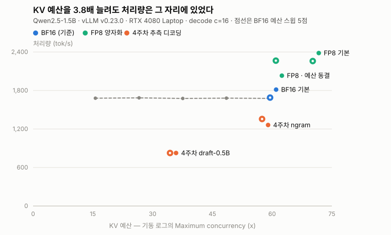
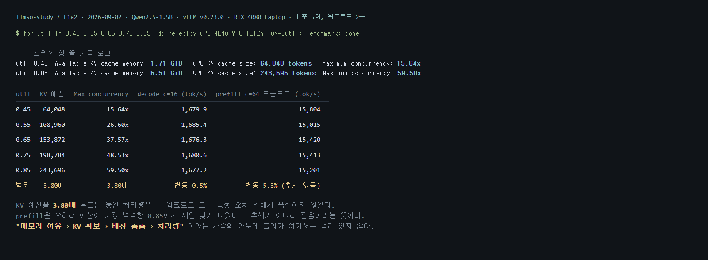
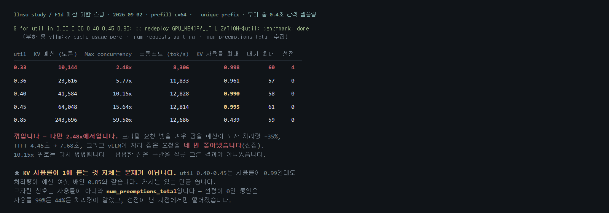
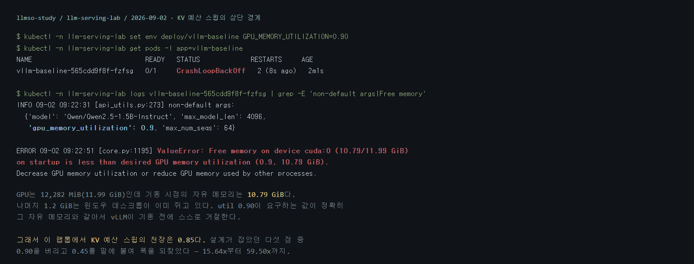
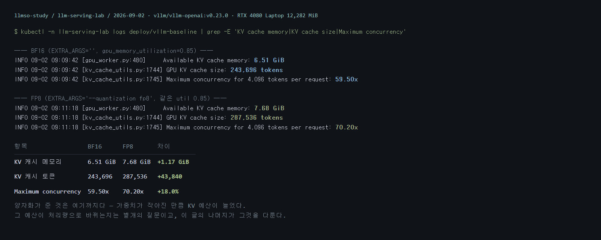
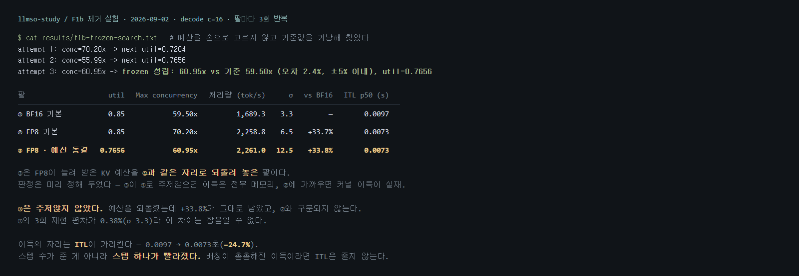
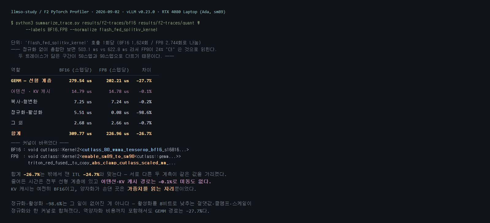
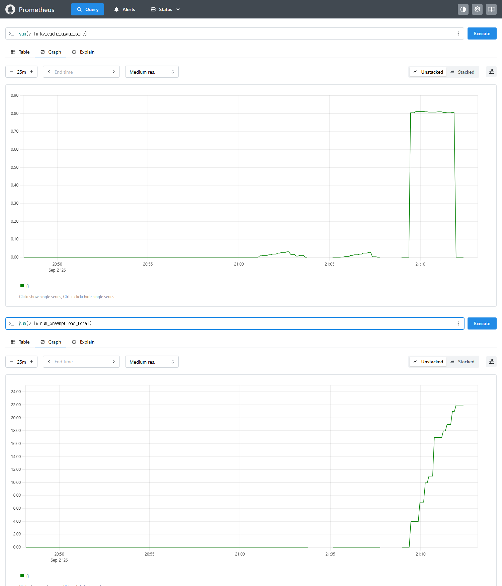
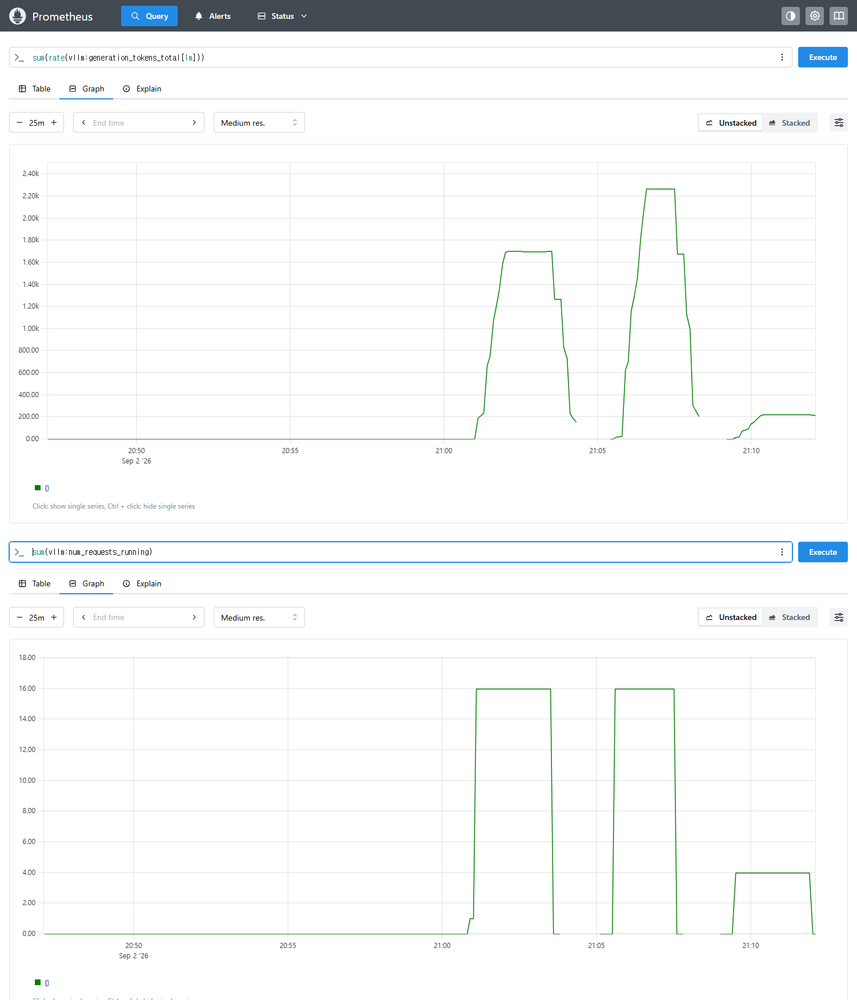
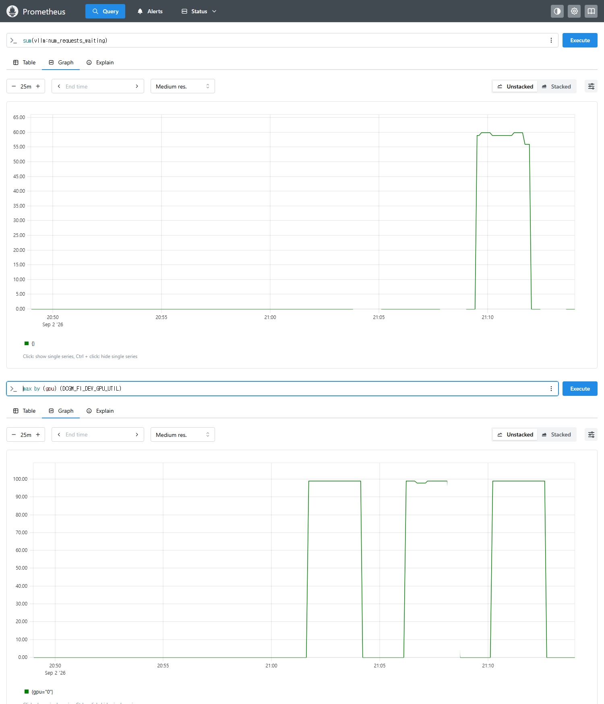

# 처리량이 올랐다면 무엇이 빨라진 것인가

**FP8 양자화를 켜자 처리량이 33.7% 올랐습니다. 교재는 그 이득의 경로를 "메모리 여유 → KV 캐시 확보 → 배칭 촘촘"으로 설명합니다. 그 경로를 끊어 봤더니 이득은 그대로 남았습니다.**

> **실험에서 확인한 세 가지**
>
> - **KV 예산은 움직이지 않았습니다.** `gpu_memory_utilization`만 바꿔 KV 예산을 **3.80배**(64,048 → 243,696 토큰) 늘렸는데 처리량은 **0.5%** 안에서 그대로였습니다.
> - **예산을 되돌려도 이득은 남았습니다.** FP8의 KV 예산을 BF16과 같은 자리로 조였는데 처리량 이득 **+33.8%**가 그대로였습니다. 예산의 기여분은 0%였습니다.
> - **줄어든 시간은 전부 선형 계층에 있었습니다.** 프로파일러로 스텝당 커널 시간을 나눠 보니 GEMM 경로가 **−27.7%**인데 어텐션·KV 캐시 경로는 **−0.1%**로 미동도 없었습니다. 같은 결론이 Prometheus 대시보드에서도 그대로 보입니다 — 동시 실행 요청 수가 **양쪽 16개로 같은데** 처리량만 **+33.2%** 올랐습니다.

## 결과 한눈에 보기

| 실험 | 결과 | 운영에서 볼 점 |
|---|---|---|
| **KV 예산 스윕** | 예산 **3.80배**에 처리량 변동 **0.5%** | 예산은 *몇 개를 담는가*를 정하지 *초당 몇 토큰을 계산하는가*를 정하지 않음 |
| **양자화 제거 실험** | 예산을 되돌려도 **+33.8%** 유지 | 처리량이 올랐다고 메모리가 병목이었다고 결론지으면 안 됨 |
| **ITL** | 0.0097초 → 0.0073초 (**−24.7%**) | 이득이 배칭에서 왔는지 커널에서 왔는지는 ITL이 가름 |
| **커널 프로파일** | GEMM 경로 **−27.7%** / 어텐션·KV 경로 **−0.1%** | 손댄 곳은 가중치를 읽는 자리뿐이었음 |
| **워크로드 격자** | 여덟 칸 모두 이득 (**+11.1% ~ +35.4%**) | 이득의 크기는 대역폭이 병목인 정도를 따라감 |
| **꺾이는 점** | 예산을 **2.48x**까지 조여야 처리량이 −35% | KV 사용률 99%는 정상, 모자란 신호는 **선점(preemption)** |
| **모니터링 스택 확인** | Prometheus에서도 **+33.2%** (동시 실행 16 동일) | GPU 사용률 99%는 세 구간 모두 같았음 — 사용률만으로는 판단 불가 |

운영에서 물어야 할 것은 **무엇을 켰더니 빨라졌나**가 아닙니다. **그 이득을 껐다 켰다 할 수 있는가**를 확인해야 합니다. 껐는데도 이득이 남는다면 원인을 잘못 짚은 것입니다.

---

## 목차

- [1. 무엇을 어떻게 측정했나](#1-무엇을-어떻게-측정했나)
- [2. KV 예산을 3.8배 늘려도 처리량은 그 자리에 있었다](#2-kv-예산을-38배-늘려도-처리량은-그-자리에-있었다)
- [3. 양자화의 이득을 되돌려 놓으려 했지만 되돌아가지 않았다](#3-양자화의-이득을-되돌려-놓으려-했지만-되돌아가지-않았다)
- [4. 이득은 워크로드에 따라 크기가 달랐다](#4-이득은-워크로드에-따라-크기가-달랐다)
- [5. 프로파일러가 가리킨 자리](#5-프로파일러가-가리킨-자리)
- [5-B. 같은 결론을 모니터링 스택에서 다시 본다](#5-b-같은-결론을-모니터링-스택에서-다시-본다)
- [6. 세 주의 결과가 한 그림 위에 놓인다](#6-세-주의-결과가-한-그림-위에-놓인다)
- [7. 운영에서 무엇부터 확인할 것인가](#7-운영에서-무엇부터-확인할-것인가)
- [8. 이 결과를 적용할 수 있는 범위](#8-이-결과를-적용할-수-있는-범위)
- [부록](#부록)
- [참고 자료](#참고-자료)

---

## 1. 무엇을 어떻게 측정했나

[지난 글](./%EC%BC%9C%EB%A9%B4%20%EC%9D%B4%EB%93%9D%EC%9D%B8%20%EC%B5%9C%EC%A0%81%ED%99%94%EB%8A%94%20%EC%97%86%EB%8B%A4.md)에서는 최적화 기능의 이득이 **언제** 손해로 뒤집히는지를 다뤘습니다. 조건은 한 스텝의 토큰 예산이었습니다. 이번 질문은 그다음입니다. **이득이 났을 때, 그 이득은 어디서 온 것인가?**

CH9은 이 질문을 첫 줄에서 직접 던집니다.

> *"처리량이 올랐다는 건 GPU가 더 빨리 계산해서인가, 아니면 그냥 덜 다시 계산해서인가?"*

그리고 챕터가 스스로 답을 냅니다 — 양자화로 처리량이 2.7배 올랐는데 Nsight로 들여다본 GEMM 커널 실행시간은 거의 같았다는 관측입니다. 즉 **개선의 원인은 연산이 빨라진 것이 아니라 `메모리 여유 → KV 캐시 확보 → 배칭 촘촘 → 스케줄링 효율`이라는 간접 인과**라는 설명입니다.

이 글은 그 인과 사슬을 **끊어 보는 실험**입니다. 관찰로는 사슬의 존재를 증명할 수 없습니다. 양자화를 켜면 KV 예산도 늘고 처리량도 오르지만, 그 둘이 인과인지 동반 현상인지는 켜고 끄는 것만으로는 구분되지 않습니다. 그래서 **가운데 고리만 따로 붙잡아 되돌려 놓았습니다.**

| 실험 | 바꾼 것 | 물은 것 |
|---|---|---|
| **F1a** KV 예산 스윕 | `gpu_memory_utilization`만 0.45~0.85 | 처리량은 KV 예산의 함수인가 |
| **F1b** 제거 실험 | FP8의 KV 예산을 BF16과 같게 조임 | 예산을 되돌리면 이득이 사라지는가 |
| **F1c** 워크로드 격자 | 프리필·디코드 × 동시성 1·4·16·64 | 양자화가 지는 구간이 있는가 |
| **F2** 프로파일링 | 연산자·커널 단위 계측 | 줄어든 시간은 어느 연산에서 나왔는가 |

### 실험 환경

| 항목 | 값 |
|---|---|
| GPU | NVIDIA GeForce RTX 4080 Laptop, 12,282 MiB |
| 커널 | 6.18.33.1-microsoft-standard-WSL2 |
| k3s | v1.36.2+k3s1 |
| 이미지 | `vllm/vllm-openai:v0.23.0` (전 실험 동일) |
| 모델 | `Qwen/Qwen2.5-1.5B-Instruct` |

2주차부터 써 온 것과 같은 저울입니다. `max_model_len=4096`, `max_num_seqs=64`를 전 구성에 고정했고, 실험마다 다른 것은 매니페스트의 `EXTRA_ARGS` env로 들어가는 **플래그 하나**와 `GPU_MEMORY_UTILIZATION` env **하나**입니다. 매니페스트 자체는 한 줄도 고치지 않았습니다.

양자화 팔은 `--quantization fp8` 하나로 만들었습니다. BF16 체크포인트를 기동 시점에 W8A8로 바꾸는 방식이라 **모델 파일을 새로 받지 않습니다.** 같은 체크포인트·같은 이미지·같은 실행 경로가 유지되므로, 팔 사이에서 달라지는 것이 가중치 정밀도 하나로 좁혀집니다.

측정 워크로드는 4주차와 같은 두 종류입니다.

| 워크로드 | 입력 | 출력 | 특징 |
|---|---|---|---|
| **`decode`** | 짧은 입력 | 512토큰 | 새 내용을 길게 생성하는 디코드 지배 워크로드 |
| **`prefill`** | 같은 문단을 24회 반복한 긴 문맥 | 64토큰 | 입력을 되짚는 프리필 지배 워크로드 |

### 무엇을 근거로 삼았는가

모든 팔에서 **기동 로그의 `Maximum concurrency` 줄을 먼저 기록하고 비교 성립 여부를 판정**했습니다. 이 값은 정적 공식이 아니라 vLLM이 기동 시 실제로 프로파일링해서 정하는 값이라, 같은 설정이라도 롤아웃마다 흔들릴 수 있습니다. 예산이 조용히 달라진 채로 처리량만 비교하면 엉뚱한 결론이 나옵니다.

재현 편차도 먼저 쟀습니다. BF16 기준 팔을 세 번 반복해 **0.38%**(σ 3.3 tok/s)를 확인했습니다. 이 글이 결론의 근거로 쓰는 차이는 **+33.8%**이니 잡음의 90배 가까이 됩니다.

---

## 2. KV 예산을 3.8배 늘려도 처리량은 그 자리에 있었다

제거 실험을 하려면 먼저 좌표계가 필요합니다. **KV 예산이 처리량을 얼마나 움직이는가**를 알아야, 나중에 양자화가 만든 이득 중 예산 몫이 얼마인지 나눌 수 있기 때문입니다.

그래서 다른 것은 전부 고정하고 `gpu_memory_utilization`만 다섯 점으로 스윕했습니다. 매니페스트의 일급 env라 재배포 한 줄로 KV 예산이 돌아갑니다. 배포 한 번에 두 워크로드를 이어 재서, 같은 파드 안에서 예산이 정확히 같도록 했습니다.

| util | KV 예산 (토큰) | Maximum concurrency | decode c=16 (tok/s) | prefill c=64 프롬프트 (tok/s) |
|---|---|---|---|---|
| 0.45 | 64,048 | 15.64x | 1,679.9 | 12,976 |
| 0.55 | 108,960 | 26.60x | 1,685.4 | 12,328 |
| 0.65 | 153,872 | 37.57x | 1,676.3 | 12,661 |
| 0.75 | 198,784 | 48.53x | 1,680.6 | 12,655 |
| 0.85 | 243,696 | 59.50x | 1,677.2 | 12,481 |
| **범위** | **3.80배** | **3.80배** | **변동 0.5%** | **변동 5.3%** |





**예산을 3.80배 흔드는 동안 처리량은 재현 편차(0.38%) 수준에서 움직이지 않았습니다.** 프리필 쪽 5.3%도 추세가 아닙니다 — 예산이 가장 넉넉한 0.85에서 오히려 가장 낮게 나왔습니다.

곡선을 기대했지만 나온 것은 **평평한 선**이었습니다.

### 왜 평평한가

계산해 보면 바로 나옵니다.

`decode` 요청 하나가 쓰는 KV는 프롬프트 약 40토큰에 출력 512토큰을 더해 **약 550토큰**입니다. 동시성 16이면 8,800토큰입니다. 예산이 가장 좁은 `util=0.45`에서도 KV는 64,048토큰이라 **7배가 남습니다.** 남는 예산을 더 늘려 봐야 아무 일도 일어나지 않습니다.

`prefill`은 사정이 다릅니다. 프롬프트가 **2,028토큰**(서버의 `vllm:prompt_tokens_total` 증가분으로 실측)이라 동시성 64면 수요가 약 **134,000토큰**으로 `util=0.45`의 예산을 두 배 넘습니다. 그런데도 처리량은 같았습니다. 프리필은 **연산 바운드**이기 때문입니다. 예산이 커지면 더 많은 요청이 동시에 GPU 안에 머무를 수 있지만, GPU가 초당 처리하는 토큰 수는 그대로입니다. 이미 포화된 연산기 앞에 대기줄이 길어질 뿐입니다.

> KV 예산은 **동시에 몇 개를 담을 수 있는가**를 정하지, **초당 몇 토큰을 계산하는가**를 정하지 않습니다.

이 구분이 이 글의 나머지를 지탱합니다. 교재가 말한 사슬의 가운데 고리 — *KV 확보 → 배칭 촘촘 → 처리량* — 는 **예산이 이미 남아도는 구간에서는 아무것도 전달하지 않습니다.**

### 그러면 어디서 꺾이는가

여기까지는 *"예산이 병목이 되는 구간을 애초에 밟지 않은 것 아니냐"* 는 반론이 가능합니다. 그래서 예산을 더 아래로 내려 **꺾이는 점을 실제로 찾았습니다.**

| util | KV 예산 (토큰) | Maximum concurrency | prefill c=64 프롬프트 (tok/s) | TTFT p50 (s) | KV 사용률 최대 | 선점 |
|---|---|---|---|---|---|---|
| 0.33 | 10,144 | 2.48x | **8,306** | **7.679** | 0.998 | **4회** |
| 0.36 | 23,616 | 5.77x | 11,833 | 5.193 | 0.961 | 0 |
| 0.40 | 41,584 | 10.15x | 12,828 | 4.699 | 0.990 | 0 |
| 0.45 | 64,048 | 15.64x | 12,814 | 4.738 | 0.995 | 0 |
| 0.85 | 243,696 | 59.50x | 12,686 | 4.448 | 0.439 | 0 |



**꺾입니다 — 다만 2.48x에서입니다.** 예산이 프리필 요청 넷을 겨우 담을 만큼 줄어들자 처리량이 **35% 떨어지고** TTFT가 1.7배로 늘었으며, vLLM이 이미 자리를 잡은 요청을 **네 번 쫓아냈습니다**(선점). 10.15x 위로는 다시 평평합니다.

**여기서 한 가지가 더 나옵니다.** `util=0.45`의 KV 사용률은 **0.995**입니다. 캐시가 거의 꽉 찼는데도 처리량은 예산이 네 배 넉넉한 `util=0.85`와 같습니다.

> **KV 캐시가 꽉 찼다는 것 자체는 문제가 아닙니다.** 문제는 GPU를 계속 바쁘게 할 만큼의 요청을 담지 못할 때 시작되고, 그 신호는 사용률이 아니라 **선점(preemption)** 입니다.

### 스윕의 천장

설계는 `util`을 0.90까지 올릴 생각이었지만 그 점은 기동 자체가 되지 않았습니다.

```
ValueError: Free memory on device cuda:0 (10.79/11.99 GiB) on startup is less than
desired GPU memory utilization (0.9, 10.79 GiB).
```



GPU는 11.99 GiB인데 기동 시점의 자유 메모리가 10.79 GiB입니다. 나머지 1.2 GiB는 윈도우 데스크톱이 이미 쥐고 있습니다. 그래서 이 랩톱에서 스윕의 천장은 **0.85**이고, 대신 0.45를 아래에 붙여 폭을 되찾았습니다.

---

## 3. 양자화의 이득을 되돌려 놓으려 했지만 되돌아가지 않았다

FP8을 켜면 두 가지가 동시에 일어납니다.

| | BF16 | FP8 | 차이 |
|---|---|---|---|
| Available KV cache memory | 6.51 GiB | 7.68 GiB | +1.17 GiB |
| GPU KV cache size | 243,696 토큰 | 287,536 토큰 | +43,840 |
| Maximum concurrency | 59.50x | 70.20x | **+18.0%** |
| decode c=16 처리량 | 1,689.3 tok/s | 2,258.8 tok/s | **+33.7%** |



예산도 늘고 처리량도 올랐습니다. 교재의 설명이 맞다면 앞의 것이 뒤의 것을 만든 원인입니다.

**그래서 앞의 것만 되돌려 놓았습니다.** FP8 팔의 `gpu_memory_utilization`을 조여 `Maximum concurrency`를 BF16과 같은 자리로 끌어내린 세 번째 팔을 만들었습니다.

목표값은 손으로 고르지 않았습니다. BF16의 59.50x를 과녁으로 놓고, 실측한 예산에서 선형 보정으로 다음 `util`을 계산해 재기동하기를 반복했습니다.

```
attempt 1: conc=70.20x -> next util=0.7204
attempt 2: conc=55.99x -> next util=0.7656
attempt 3: conc=60.95x -> 성립 (기준 59.50x 대비 오차 2.4%, ±5% 이내)
```

판정 기준은 실험 전에 정해 두었습니다. **③이 ①로 주저앉으면 이득은 전부 메모리에서 온 것이고, ②에 가까우면 다른 데서 온 것입니다.**

| 팔 | util | Maximum concurrency | 처리량 (tok/s, 3회) | σ | vs BF16 | ITL p50 (s) |
|---|---|---|---|---|---|---|
| ① BF16 기본 | 0.85 | 59.50x | 1,689.3 | 3.3 | — | 0.0097 |
| ② FP8 기본 | 0.85 | 70.20x | 2,258.8 | 6.5 | +33.7% | 0.0073 |
| ③ **FP8 · 예산 동결** | 0.7656 | **60.95x** | **2,261.0** | 12.5 | **+33.8%** | 0.0073 |



**③은 주저앉지 않았습니다.** 예산을 BF16과 같은 자리로 되돌렸는데 이득은 그대로였고, 오차 범위 안에서 ②와 구분되지 않습니다. 재현 편차가 0.38%이므로 이 결과는 잡음이 아닙니다.

**양자화가 만든 +33.7% 가운데 KV 예산이 기여한 몫은 0%였습니다.**

### 이득의 자리는 ITL이 가리킨다

처리량 숫자만으로는 어디서 벌었는지 알 수 없습니다. 같은 처리량 증가라도 두 가지 경로가 있습니다.

- **더 많이 처리했다** — 배칭이 촘촘해져 한 스텝에 더 많은 요청이 들어간 경우
- **더 빨리 처리했다** — 스텝 하나에 걸리는 시간이 줄어든 경우

둘은 **토큰 간 간격(ITL)** 에서 갈립니다. 배칭이 촘촘해진 이득이라면 ITL은 그대로거나 오히려 늘어납니다 — 같은 스텝에 더 많은 요청이 들어가므로 사용자 한 명이 체감하는 간격은 짧아질 이유가 없습니다.

측정된 ITL은 **0.0097초에서 0.0073초로 24.7% 줄었습니다.** 스텝 수가 준 것이 아니라 스텝 하나가 빨라졌습니다.

이유는 W8A8 양자화가 무엇을 바꾸는지 보면 간단합니다. 디코드는 토큰 하나를 만들 때마다 **모델 가중치 전체를 다시 읽습니다.** 1.54B 파라미터를 BF16으로 두면 약 3.1 GB이고 8비트면 약 1.5 GB이니, 스텝마다 메모리에서 끌어오는 바이트가 절반 가까이 줄어듭니다. 배치가 작을 때 디코드의 병목은 연산기가 아니라 이 **가중치 읽기 대역폭**입니다.

같은 원인이 KV 예산도 늘립니다. 기동 로그로 확인된 증가분은 **+1.17 GiB**로, 가중치를 전부 8비트로 바꿨을 때의 이론값(약 1.5 GB)보다 조금 작습니다. vLLM이 임베딩과 출력 레이어까지 양자화하지는 않기 때문입니다. 어느 쪽이든 **예산 증가는 같은 원인이 만든 부수 효과일 뿐 이득의 경로가 아니었습니다** — F1b가 그 부수 효과를 걷어내고도 이득이 남는 것을 보였습니다.

---

## 4. 이득은 워크로드에 따라 크기가 달랐다

4주차에 추측 디코딩은 같은 서버에서 **+194.8%와 −52.8%** 사이를 오갔습니다. 워크로드와 동시성이 바뀌면 이득이 손해로 뒤집혔습니다. 양자화도 그런지 확인하려고 **4주차와 같은 격자**를 그대로 다시 돌렸습니다 — 프리필·디코드 × 동시성 1·4·16·64, 팔마다 2회.

| 워크로드 | 동시성 | BF16 (tok/s) | FP8 (tok/s) | 차이 | ITL 변화 |
|---|---|---|---|---|---|
| `decode` | 1 | 115.7 | 155.7 | **+34.6%** | −24.0% |
| `decode` | 4 | 449.1 | 608.0 | **+35.4%** | −23.9% |
| `decode` | 16 | 1,295.8 | 1,740.7 | **+34.3%** | −24.8% |
| `decode` | 64 | 4,759.5 | 5,476.5 | **+15.1%** | −12.9% |
| `prefill` | 1 | 111.9 | 149.4 | **+33.5%** | −24.2% |
| `prefill` | 4 | 410.6 | 533.2 | **+29.8%** | −25.7% |
| `prefill` | 16 | 1,065.2 | 1,327.6 | **+24.6%** | −32.0% |
| `prefill` | 64 | 2,861.7 | 3,179.0 | **+11.1%** | −19.2% |

**여덟 칸 모두 이득이었습니다.** 범위는 +11.1%에서 +35.4% 사이이고, 뒤집히는 칸은 없었습니다.

W4A16 같은 방식은 compute-bound 구간에서 역양자화 비용이 이득을 넘어설 수 있어 부호가 뒤집힐 자리를 찾을 생각이었습니다. 이 구성에서는 나오지 않았습니다. 운영자에게는 그것도 답입니다 — **추측 디코딩과 달리 FP8 양자화는 잰 범위 전체에서 안전했습니다.**

### 다만 이득의 크기는 규칙적으로 줄었다

뒤집히지는 않았지만 **동시성이 오를수록 이득이 작아지는 패턴은 뚜렷합니다.**

- `decode`: 34.6% → 35.4% → 34.3% → **15.1%**
- `prefill`: 33.5% → 29.8% → 24.6% → **11.1%**

3장에서 본 기제로 설명됩니다. 양자화가 아끼는 것은 **스텝마다 다시 읽는 가중치 바이트**입니다. 그런데 그 읽기는 배치 안의 모든 요청이 나눠 씁니다. 동시 요청이 하나면 가중치 3.1 GB를 읽어 토큰 하나를 만들지만, 동시 요청이 64개면 같은 3.1 GB를 읽어 64토큰을 만듭니다. **배치가 커질수록 가중치 읽기의 비중이 희석되고, 그만큼 양자화가 아낄 몫도 줄어듭니다.**

`prefill`이 더 빨리 줄어드는 것도 같은 이유입니다. 프리필은 애초에 연산 바운드라 가중치 읽기의 비중이 디코드보다 작습니다.

정리하면 이렇습니다.

> 양자화의 이득은 **가중치 읽기가 전체 시간에서 차지하는 비중**만큼입니다. 그 비중이 큰 곳(작은 배치·디코드)에서 크고, 작은 곳(큰 배치·프리필)에서 작습니다.

이 규칙은 앞 장의 결론과 같은 것을 다른 각도에서 말합니다. 이득의 크기를 정하는 것은 KV 예산이 아니라 **메모리 대역폭이 병목인 정도**입니다.

> 동시성 64의 두 칸은 재현폭이 각각 1.9%와 4.4%였습니다. 이 랩에서 c=64는 10%까지 흔들리는 것으로 알려져 있어, 그 두 칸의 값은 추세를 읽는 데만 쓰고 결론의 근거로는 쓰지 않았습니다.

---
## 5. 프로파일러가 가리킨 자리

앞 장까지는 밖에서 본 숫자입니다. 처리량과 ITL은 **결과**이지 **원인의 위치**가 아닙니다. CH10이 제안하는 순서 — 지표에서 시작해 타임라인으로, 다시 커널로 좁혀 들어가기 — 를 따라 안을 열어 봤습니다.

### 계층을 하나 잃고 시작했다

설계는 Nsight Systems → PyTorch Profiler → Nsight Compute 세 계층을 잡았지만, 첫 계층이 없었습니다.

```
$ kubectl -n llm-serving-lab exec <pod> -- sh -c "command -v nsys ncu"
NOT_FOUND
```

`vllm/vllm-openai:v0.23.0` 이미지에 Nsight 바이너리가 들어 있지 않습니다. 권한 문제가 아니라 **부재**라 컨테이너 안에서는 해결할 방법이 없습니다. 그래서 남은 계층 — vLLM이 직접 여는 **PyTorch Profiler** — 하나로 좁혔습니다.

여기서도 한 번 막혔습니다. 문서가 알려주는 `VLLM_TORCH_PROFILER_DIR`을 넣었더니 서버가 이렇게 답했습니다.

```
WARNING [envs.py:2088] Unknown vLLM environment variable detected: VLLM_TORCH_PROFILER_DIR
$ curl -X POST .../start_profile
curl: (22) The requested URL returned error: 404
```

v0.23.0에서 프로파일러 설정이 환경 변수에서 **`--profiler-config.*` CLI 플래그로 옮겨갔기 때문입니다. 소스(`vllm/config/profiler.py`)를 열어 확인했고, 옮겨간 자리에는 유용한 옵션이 함께 있었습니다 — 앞 몇 iteration을 버리고 정해진 개수만 담는 기능입니다. 이것으로 트레이스를 1 MB 아래로 묶었습니다.

```
--profiler-config.profiler=torch
--profiler-config.torch_profiler_dir=/root/.cache/huggingface/profiles
--profiler-config.torch_profiler_with_stack=false
--profiler-config.delay_iterations=20 --profiler-config.max_iterations=100
```

### 총합을 그대로 비교하면 부호가 거꾸로 읽힌다

두 트레이스를 받아 커널 시간을 더했더니 이렇게 나왔습니다.

| | BF16 | FP8 |
|---|---|---|
| 총 GPU 커널 시간 | 503.1 ms | 622.8 ms |

FP8이 **24% 더 썼다**는 숫자입니다. 앞 장들과 정반대입니다.

원인은 간단합니다. **두 트레이스가 담은 구간의 길이가 다릅니다.** 어텐션 커널 호출 수를 세어 보면 BF16이 1,624회, FP8이 2,744회입니다. 모델이 28층이니 각각 58스텝과 98스텝을 담은 것입니다. 프로파일러가 같은 개수의 iteration을 담도록 지정했지만 부하가 끝나는 시점이 달라 실제로 담긴 양이 달라졌습니다.

**총합이 아니라 스텝당으로 나눠야 비교가 됩니다.**

| 역할 | BF16 (스텝당) | FP8 (스텝당) | 차이 |
|---|---|---|---|
| **GEMM — 선형 계층** | 279.54 us | 202.21 us | **−27.7%** |
| **어텐션 · KV 캐시** | 14.79 us | 14.78 us | **−0.1%** |
| 복사·형변환 | 7.25 us | 7.24 us | −0.2% |
| 정규화·활성화 | 5.51 us | 0.08 us | −98.6% |
| 그 외 | 2.68 us | 2.66 us | −0.7% |
| **합계** | **309.77 us** | **226.96 us** | **−26.7%** |



### 세 줄이 이 글의 결론을 닫는다

**첫째, 합계 −26.7%는 밖에서 잰 ITL −24.7%와 맞습니다.** 서로 다른 두 계측이 같은 값을 가리켰습니다.

**둘째, 줄어든 시간은 전부 선형 계층에 있습니다.** GEMM 경로가 −27.7%인데 **어텐션·KV 캐시 경로는 −0.1%로 미동도 하지 않았습니다.** KV 캐시는 여전히 BF16이고, 양자화가 손댄 곳은 **가중치를 읽는 자리**뿐입니다. 3장에서 예산을 되돌려도 이득이 남았던 이유가 여기 그대로 보입니다 — 이득은 애초에 KV 쪽에서 나온 적이 없습니다.

**셋째, 정규화·활성화가 −98.6%로 사라진 것은 그 일이 없어졌다는 뜻이 아닙니다.** FP8 팔의 커널 목록을 보면 `triton_red_fused__to_copy_abs_clamp_cutlass_scaled_mm...`이라는 이름이 있습니다. 활성화를 8비트로 낮추면서 필요한 절댓값·클램프·스케일 계산이 정규화와 **한 커널로 합쳐진** 것입니다. 즉 역양자화 비용은 사라진 게 아니라 GEMM 경로 안으로 들어갔고, **그것까지 포함해서도 −27.7%**입니다.

### 교재와 다른 결과가 나왔다

CH9은 Nsight 딥다이브에서 **양자화 전후 GEMM 커널 실행시간이 거의 같았다**고 적었습니다. 그 관측이 "빨라진 원인은 연산이 아니라 메모리"라는 교재 결론의 근거입니다.

이 랩에서는 반대로 나왔습니다. GEMM 경로가 **27.7% 빨라졌고**, 그것이 전체 감소분의 거의 전부입니다.

모순은 아닙니다. 커널 이름을 보면 이유가 보입니다.

```
BF16 : void cutlass::Kernel2<cutlass_80_wmma_tensorop_bf16_...>
FP8  : void cutlass::Kernel2<enable_sm89_to_sm90<cutlass::gemm...>>
```

`sm89`는 Ada 세대 텐서코어를 가리킵니다. **FP8은 같은 커널을 더 빨리 돌린 것이 아니라 아예 다른 커널로 갈아탄 것**이고, 그 커널이 8비트 입력을 네이티브로 받습니다. 교재가 쓴 GPU 세대와 양자화 방식(W4A16 계열)에서는 가중치만 4비트로 저장하고 계산 직전에 되돌리므로 GEMM 자체는 그대로일 수 있습니다.

그래서 이 대목의 교훈은 "교재가 틀렸다"가 아니라 이것입니다.

> **양자화가 어디서 버는지는 방식과 하드웨어가 정합니다.** 가중치만 줄이는 방식이면 이득은 메모리 쪽에, 계산까지 낮은 정밀도로 하는 방식이면 커널 쪽에 남습니다. 같은 "양자화"라는 말로 두 경우를 함께 다루면 원인을 잘못 짚게 됩니다.

**지표로는 안 보였는데 프로파일러에서 보인 것**이 정확히 이것입니다. 처리량과 ITL은 "빨라졌다"까지만 말했고, **어느 경로가 빨라졌는지**는 커널 시간을 나눠 본 뒤에야 나왔습니다.

---
## 5-B. 같은 결론을 모니터링 스택에서 다시 본다

여기까지의 숫자는 벤치마크 클라이언트와 0.4초 간격으로 긁은 서버 지표에서 나왔습니다. 그런데 운영에서 실제로 보는 화면은 대시보드입니다. **같은 결론이 Prometheus에서도 보이는지** 확인해야 이 글이 운영에 쓸모가 있습니다.

바로 되짚어 보려다 한 번 막혔습니다. Prometheus는 이 클러스터에서 **15초에 한 번** 긁는데, 앞의 측정은 한 구간이 10~20초짜리 버스트였습니다. 그래서 F1d에서 **0.998**까지 올라간 KV 사용률이 Prometheus 기록에는 **0.078**까지밖에 남지 않았습니다 — 피크가 스크랩 사이로 빠져나간 것입니다.

> 짧은 버스트 측정은 **되짚어 찍기에 맞지 않습니다.** 대시보드 증거가 필요하면 같은 대비를 **스크랩 주기보다 충분히 길게** 다시 거는 편이 빠릅니다.

그래서 같은 세 가지 상태를 **한 구간에 3분씩** 다시 걸었습니다. 새 결론을 만드는 것이 아니라, 이미 낸 결론이 모니터링 화면에서 어떻게 보이는지를 남기는 것입니다.

| 구간 | 구성 | 워크로드 | 확인할 것 |
|---|---|---|---|
| **A** | BF16 · util 0.85 | `decode` c=16 | 예산이 놀고 있는 상태 |
| **B** | FP8 · util 0.85 | `decode` c=16 (동일) | 같은 부하에서 처리량만 오르는지 |
| **C** | BF16 · util 0.33 | `prefill` c=64 | 예산이 실제로 걸리는 상태 |

### 대시보드가 같은 말을 한다

세 구간을 한 화면에 놓고 읽으면 이렇습니다.

| 구간 | 생성 처리량 (tok/s) | 동시 실행 | 대기 | KV 사용률 | 누적 선점 | GPU 사용률 |
|---|---|---|---|---|---|---|
| **A** BF16 · `decode` | 1,703.6 | 16 | 0 | **0.031** | 0 | 99% |
| **B** FP8 · `decode` | **2,269.3** | 16 | 0 | **0.028** | 0 | 99% |
| **C** BF16 util 0.33 · `prefill` | 224.0 | **4** | **60** | **0.812** | **19** | 99% |



**A와 B를 나란히 보면 3장의 결론이 그대로 보입니다.** 동시에 실행 중인 요청 수가 **양쪽 다 16개로 같고**, KV 사용률은 오히려 FP8 쪽이 **약간 더 낮습니다**(0.031 → 0.028). 그런데 생성 처리량은 **1,703.6에서 2,269.3으로 33.2% 올랐습니다.**

벤치마크 클라이언트가 잰 **+33.7%** 와 대시보드가 본 **+33.2%** 가 맞습니다. 그리고 이 화면에는 *"배칭이 촘촘해져서"* 라고 말할 여지가 없습니다 — 배치에 든 요청 수가 눈에 보이게 같기 때문입니다.



**C 구간이 예산이 걸린다는 것이 어떤 모습인지 보여줍니다.** KV 사용률이 0.81까지 차오르고, 담기지 못한 요청 **60개**가 대기열에 쌓이며, vLLM이 이미 자리를 잡은 요청을 **19번** 쫓아냅니다. A·B에서 선점은 계속 0이었습니다.



### 이 화면에서 한 가지가 더 나온다

**GPU 사용률은 세 구간 모두 99%입니다.** 예산이 남아돌던 A에서도, 대기열이 60개까지 쌓인 C에서도 GPU는 똑같이 바빴습니다.

이것이 운영에서 제일 흔한 오독을 정리해 줍니다.

> **GPU 사용률 99%는 "잘 쓰고 있다"는 뜻도, "더 못 넣는다"는 뜻도 아닙니다.** 같은 99%에서 처리량이 1,703이기도 하고 2,269이기도 했습니다. 사용률은 GPU가 노는지만 말하고, **무엇을 하느라 바쁜지는 말하지 않습니다.**

---
## 6. 세 주의 결과가 한 그림 위에 놓인다

앞 그림의 가로축은 KV 예산입니다. BF16 스윕이 그린 점선이 **평평하다**는 것이 이 그림의 전부입니다. 가로로 움직인 것은 아무것도 바꾸지 못했고, **세로로 벗어난 점만이 무언가를 했습니다.**

그 위에 4주차에 잰 팔 둘을 추가 측정 없이 그대로 얹었습니다. 같은 랩·같은 이미지·같은 `decode` c=16이라 같은 축에 올라갑니다.

| 팔 | Maximum concurrency | decode c=16 (tok/s) | 선에서 벗어난 방향 |
|---|---|---|---|
| BF16 기준 | 59.50x | 1,689.3 | 선 위 |
| FP8 기본 | 70.20x | 2,258.8 | **위로** |
| FP8 · 예산 동결 | 60.95x | 2,261.0 | **위로** |
| 4주차 ngram | 57.48x | 1,356.2 | **아래로** |
| 4주차 draft-0.5B | 34.38x | 825.7 | **아래로** |

위로 벗어난 점은 스텝을 빠르게 만든 것이고, 아래로 벗어난 점은 스케줄러에서 무언가를 빼앗긴 것입니다. **어느 쪽도 가로축으로는 설명되지 않습니다.**

### 지난주에 내린 판단 하나가 여기서 무너진다

4주차에는 draft 모델 팔을 본문 비교에서 제외했습니다. 이유는 이랬습니다.

> *12GB에 1.5B와 0.5B를 같이 올리는 순간 KV 예산의 42%가 사라집니다. 이 상태의 숫자는 "추측 디코딩의 값"이 아닙니다. 손해에서 추측 디코딩 탓과 KV가 좁아진 탓을 분리할 수 없기 때문입니다.*

이번 스윕이 그 전제를 무너뜨립니다. draft 팔의 34.38x는 이번에 쓸어 본 구간(15.64x ~ 59.50x) **안쪽**이고, 그 구간에서 `decode` c=16 처리량은 **0.5%** 안에서 움직였습니다. 즉 예산이 42% 줄어든 것은 그 팔의 손해에 기여하지 않았습니다.

**분리할 수 없다고 판단했던 두 원인은 사실 분리할 필요가 없었습니다.** 예산 쪽 기여가 0이므로 관측된 −49.7%는 전부 추측 디코딩 방식 자체의 값이었습니다. 지난주의 제외는 과했고, 그 근거는 측정이 아니라 추정이었습니다.

배운 것은 결론이 아니라 절차 쪽입니다. **"조건이 달라졌으니 비교할 수 없다"고 말하려면, 그 조건이 실제로 결과를 움직이는지를 먼저 재야 합니다.** 재지 않고 내린 배제는 안전해 보이지만 실제로는 정보를 버리는 결정이었습니다.

---

## 7. 운영에서 무엇부터 확인할 것인가

이 글의 실험은 전부 하나의 절차를 따랐습니다. **먼저 그 조건이 결과를 실제로 움직이는지 재고, 그다음에 기능을 켠다.** 순서를 바꾸면 켰을 때 일어난 모든 변화가 켠 기능의 공으로 넘어갑니다.

### 7-1. 예산이 병목인지부터 잰다

`kubectl logs`에서 기동 로그 두 줄이면 시작할 수 있습니다.

```
GPU KV cache size: 243,696 tokens
Maximum concurrency for 4,096 tokens per request: 59.50x
```

여기에 실제 워크로드의 KV 수요를 곱해 보면 됩니다. 요청당 (프롬프트 + 출력) 토큰 수에 동시 요청 수를 곱한 값입니다. **그 값이 예산의 절반에도 못 미치면 예산은 병목이 아닙니다.** 이 글의 `decode` 워크로드는 요청 16개가 512토큰씩 만들어도 8천 토큰대라, 예산 243,696토큰의 **4%가 채 되지 않습니다.** 그래서 예산을 3.8배 늘려도 아무 일도 일어나지 않았습니다.

부하 중 서버 지표도 보게 되는데, **여기서 흔한 오독이 하나 있습니다.** `vllm:kv_cache_usage_perc`가 1에 붙었다고 메모리가 모자란 것은 아닙니다. 2장의 측정에서 `util=0.45`는 사용률 **0.995**인데 처리량은 예산이 네 배 넉넉한 구성과 같았습니다. 캐시는 원래 있는 만큼 씁니다.

**메모리가 실제로 모자란 신호는 `vllm:num_preemptions_total`입니다.** 이 값이 오른다는 것은 vLLM이 이미 자리를 잡은 요청을 쫓아내고 있다는 뜻이고, 그때부터 처리량이 떨어집니다. 측정에서도 선점이 0인 동안에는 사용률이 99%든 44%든 처리량이 같았고, 선점이 난 지점에서만 35% 떨어졌습니다(5-B장의 대시보드가 같은 것을 보여줍니다).

**`DCGM_FI_DEV_GPU_UTIL`도 혼자서는 답을 주지 않습니다.** 5-B장의 세 구간은 GPU 사용률이 전부 99%였는데 처리량은 224에서 2,269까지 열 배 차이가 났습니다. 사용률은 GPU가 노는지만 말합니다.

### 7-2. 이득이 났으면 껐다 켤 수 있는지 확인한다

관찰만으로는 원인을 지목할 수 없습니다. 기능을 켜면 여러 가지가 동시에 바뀌기 때문입니다. 원인이라고 생각하는 것 **하나만 되돌려 놓고** 이득이 사라지는지 보는 편이 훨씬 빠릅니다.

이 글에서는 그것이 `gpu_memory_utilization` 한 줄이었습니다. 양자화 팔의 예산을 기준 팔과 같은 자리로 조이는 데 재기동 3회, 약 5분이 들었고 그것으로 결론이 났습니다.

### 7-3. 처리량이 아니라 ITL을 함께 본다

처리량 증가는 두 경로에서 옵니다.

| 관측 | 처리량 | ITL | 해석 |
|---|---|---|---|
| 배칭이 촘촘해짐 | 증가 | 유지 또는 증가 | 같은 스텝에 요청이 더 들어감 |
| 스텝이 빨라짐 | 증가 | **감소** | 커널·대역폭 쪽에서 벌었음 |

처리량 숫자 하나만 보면 둘이 구분되지 않습니다. **ITL이 같이 줄었다면 메모리를 더 준다고 해서 더 빨라지지 않습니다.**

### 7-4. 양자화는 적재 문제와 속도 문제를 나눠서 본다

양자화의 값은 환경에 따라 성격이 다릅니다.

- **모델이 GPU에 안 들어가는 경우** — 양자화는 *성능 최적화*가 아니라 **적재 가능 여부**의 문제입니다. 켜는 것 말고 선택지가 없습니다.
- **이미 들어가고 예산도 남는 경우** — 이 글의 상황입니다. 이때 양자화의 값은 메모리가 아니라 **가중치 읽기 대역폭**에서 나오고, 그래서 배치가 작은 디코드에서 가장 크게 나타납니다.

두 경우의 기대치가 다르므로, 도입 전에 어느 쪽인지부터 정해야 합니다.

### 7-5. 조건이 달라졌다고 비교를 버리기 전에 그 조건을 잰다

지난주에 저는 KV 예산이 42% 줄었다는 이유로 팔 하나를 비교에서 뺐습니다. 이번 측정에서 그 구간의 예산 변화가 처리량에 미치는 영향이 0.5%였음이 드러났습니다. **버릴 필요가 없던 데이터를 버린 것입니다.**

"조건이 달라져서 비교할 수 없다"는 판단은 안전해 보이지만 공짜가 아닙니다. 그 조건의 영향을 한 번 재 보는 비용이 대개 더 쌉니다.

---
## 8. 이 결과를 적용할 수 있는 범위

이 글의 숫자는 **12GB GPU 한 장에 1.5B 모델을 올린 구성**에서 나왔습니다. 그 조건이 결론의 유효 범위를 정합니다.

**KV 예산이 놀고 있었던 것은 이 조합의 성질입니다.** 1.5B 모델은 가중치가 약 3 GB라 12GB 중 6.5 GB가 KV로 남습니다. 모델이 커지면 이 여유가 먼저 사라집니다. 예컨대 같은 GPU에 7B를 올리면 가중치만 14 GB라 애초에 올라가지 않고, 양자화는 *처리량 최적화*가 아니라 **적재 가능 여부**의 문제가 됩니다. 그 구간에서는 교재가 말한 사슬이 그대로 작동할 가능성이 큽니다 — 예산이 병목인 상태이기 때문입니다.

바꿔 말하면 이 글이 반박한 것은 사슬 자체가 아니라 **사슬을 조건 없이 적용하는 습관**입니다.

**재현할 수 없었던 것**도 명시해 둡니다.

| 못 한 것 | 이유 |
|---|---|
| CH9 본편 재현 (Qwen3-14B · L40S 48GB · A100 x8) | AWS GPU 쿼터가 `0`이라 GPU 인스턴스를 띄울 수 없음 |
| TP=2 · PP=2 · MoE 전문가 병렬 · 2노드 | GPU 1장 |
| NVLink vs PCIe 인터커넥트 비교 | 물리적으로 불가 |
| GPTQ · AWQ 등 사전 양자화 체크포인트 비교 | FP8이 첫 시도에 떠서 다운로드 0으로 끝냈음. 다른 방식은 미측정 |

그래서 이 글은 **CH9을 따라 한 기록이 아니라, CH9의 질문을 12GB에서 다시 물어본 기록**입니다.

### 이 실험은 이 머신에서만 가능하다

같은 질문을 애플 실리콘 같은 통합 메모리 장비에서 다시 묻고 싶었지만 원리상 되지 않습니다. 이 글이 쓴 두 도구가 모두 CUDA 전용이기 때문입니다.

- **프로파일러** — Nsight Systems·Nsight Compute도, vLLM이 여는 PyTorch Profiler 경로도 CUDA 커널을 전제로 합니다.
- **양자화 커널** — `--quantization fp8`이 부르는 것은 Ada 텐서코어용 FP8 GEMM입니다. 그 커널이 없는 장비에서는 같은 플래그가 같은 일을 하지 않습니다.

그래서 "가중치 읽기 대역폭이 이득의 자리였다"는 이 글의 결론은 **CUDA GPU에서 잰 값**입니다. 통합 메모리 장비는 대역폭 구조 자체가 달라 비중이 다르게 나올 수 있고, 그것은 별도의 측정이 필요한 질문입니다.

### 양자화의 최전선은 이 랩보다 앞서 있다

이 글은 FP8까지만 다뤘습니다. 실제 최전선은 Blackwell 세대의 FP4로 옮겨갔고, 그 세대에서는 숫자가 달라질 것입니다.

다만 **바뀌는 것은 크기이지 질문이 아닙니다.** 정밀도를 한 단계 더 낮추면 스텝마다 읽는 바이트가 더 줄고, 하드웨어가 그 정밀도의 텐서코어를 갖고 있으면 커널까지 갈아탑니다 — 5장에서 FP8이 그랬던 것과 같은 일이 한 번 더 일어나는 셈입니다. 그러니 FP4에서도 물어야 할 것은 같습니다. **이득이 KV 예산에서 왔는가, 아니면 가중치를 읽고 계산하는 경로에서 왔는가.** 3장의 제거 실험은 포맷이 무엇이든 그대로 돌릴 수 있고, 그게 이 글이 남기려는 방법입니다.

**측정 자체의 한계**도 둘 있습니다.

- `e2e`와 wall time은 출력 길이가 흔들리므로 **세션 사이 비교에 쓰지 않았습니다.** 이 글의 비교는 전부 같은 세션 안에서 이뤄졌습니다.
- 동시성 64 구간은 같은 설정을 두 번 재도 **10%까지 흔들립니다.** 그래서 c=64에서 나온 10%대 차이는 결론의 근거로 쓰지 않았습니다.

---

## 부록

### 부록 A. 예산 동결 팔을 만드는 방법

KV 예산은 정적 공식이 아니라 **vLLM이 기동할 때 실제로 프로파일링해서 정하는 값**입니다. 가중치 크기가 달라지면 남는 메모리도 달라지므로, `gpu_memory_utilization`을 계산만으로 맞출 수 없습니다.

그래서 목표값을 겨냥해 재기동하는 방식으로 찾았습니다. 현재 예산과 목표 예산의 차이를 `util`에 대한 기울기로 나눠 다음 값을 정하고, 다시 재서 남은 오차를 줄입니다.

```bash
# 기동 로그에서 Maximum concurrency 숫자만 꺼낸다
read_conc() {
  kubectl -n llm-serving-lab logs deploy/vllm-baseline \
    | grep -oE 'Maximum concurrency for [0-9,]+ tokens per request: [0-9.]+x' \
    | tail -1 | grep -oE '[0-9.]+x$' | tr -d 'x'
}
```

세 번 만에 오차 2.4%로 들어왔습니다. ±5%라는 기준은 4주차에 쓰던 것을 그대로 가져왔습니다.

한 가지 짚어 둘 것이 있습니다. 6장에서 적었듯 **예산 차이는 이 구간에서 처리량을 움직이지 않으므로**, ±5%로 맞추지 않았어도 결론은 같았을 것입니다. 그래도 맞춘 이유는 제거 실험의 성격 때문입니다 — *"예산이 달라서 그런 것 아니냐"* 는 반론을 데이터로 미리 닫아 두려면, 예산이 실제로 중요한지와 무관하게 **같은 자리에 놓고** 재는 편이 낫습니다.

### 부록 B. 왜 FP8을 골랐나

설계 단계에서는 FP8 → GPTQ → AWQ를 한 번씩 시도하기로 했는데 첫 번째에서 끝났습니다.

`--quantization fp8`은 **BF16 체크포인트를 기동 시점에 W8A8로 바꿉니다.** 사전 양자화된 별도 체크포인트를 받지 않으므로,

- 추가 다운로드가 0이고,
- 모델 파일·이미지·실행 경로가 BF16 팔과 완전히 같으며,
- 팔 사이에서 달라지는 것이 **가중치 정밀도 하나**로 좁혀집니다.

세 번째가 중요합니다. 사전 양자화 체크포인트를 쓰면 양자화 방식뿐 아니라 **캘리브레이션 데이터와 레이어별 적용 범위**까지 함께 달라져, 관측된 차이를 무엇에 귀속시킬지가 다시 흐려집니다.

RTX 4080은 Ada 세대라 FP8 텐서코어를 갖고 있습니다. 그보다 이전 세대 GPU에서는 이 경로가 그대로 재현되지 않습니다.

### 부록 C. 재현 절차

```bash
# 공통 — 2주차 기준선과 같은 k3s 배포. 이미지는 containerd에 이미 있는 것을 쓴다
# (docker run으로 받으면 ~10GB를 새로 받고, 2주차와 다른 저울이 된다).
kubectl apply -f k8s/vllm-baseline.yaml
source redeploy.sh

# F1a — KV 예산 스윕. 배포 한 번에 두 워크로드를 이어 잰다.
./run_f1a2.sh          # util 0.45 ~ 0.85, decode c=16 + prefill c=64(--unique-prefix)

# F1b — 제거 실험. 예산 동결 팔의 util은 스크립트가 찾는다.
./run_f1b.sh           # bf16 / quant / quant-frozen, 팔마다 3회

# F1c — 워크로드 격자. 4주차 E1과 같은 격자다.
./run_f1c.sh           # prefill,decode x c=1,4,16,64, 팔마다 2회

# F1d — 예산을 더 내려 꺾이는 점을 찾는다. 부하 중 서버 지표를 0.4초 간격으로 모은다.
./run_f1d.sh           # util 0.33 ~ 0.85, prefill c=64

# F2 — PyTorch Profiler. v0.23.0에서는 환경 변수가 아니라 --profiler-config.* 를 줘야
# /start_profile 이 열린다(5장 참조). 스크립트가 그 플래그를 붙인다.
./run_f2.sh

# F5 — 대시보드 증거용 부하. 구간마다 3분씩 태워 15초 스크랩에 남긴다.
./run_f5.sh
```

`prefill` 스윕에 `--unique-prefix`가 붙는 이유가 있습니다. 요청 프롬프트가 전부 같으면 prefix caching이 이를 하나로 합쳐 **KV 수요가 1/64로 줄어듭니다.** 예산이 실제로 걸리는지 보려면 그 합치기를 먼저 막아야 합니다.

### 부록 D. 지표 하나를 잘못 읽을 뻔했다

예산이 실제로 걸렸는지 확인하려고 서버 지표를 0.5초 간격으로 긁었는데, 첫 시도에서 수집 파일이 전부 비어 있었습니다. 필터를 이렇게 썼기 때문입니다.

```bash
grep -E '^vllm:(num_requests_running|kv_cache_usage_perc) '   # 이름 뒤에 공백을 요구
```

실제 노출 형식은 이름 뒤에 라벨 블록이 붙습니다.

```
vllm:num_requests_running{engine="0",model_name="qwen2.5-1.5b"} 16.0
```

**빈 파일은 "지표가 0"이 아니라 "안 잡혔다"였습니다.** 4주차에도 `vllm:iteration_tokens_total`을 스텝당 스케줄된 토큰으로 잘못 읽은 적이 있어, 지표를 근거로 쓸 때는 값을 보기 전에 **행이 실제로 잡혔는지**부터 확인하기로 했습니다.

같은 종류의 실수가 이 글에서 두 번 더 있었습니다. 하나는 5장의 트레이스를 처음에 **총합끼리** 비교한 것입니다 — 그러면 FP8이 시간을 24% 더 쓴 것으로 읽히는데, 두 트레이스가 담은 구간이 58스텝과 98스텝이라 그렇습니다. 다른 하나는 5-B장의 대시보드를 **되짚어 찍으려던 것**입니다 — 15초 스크랩으로는 10초짜리 버스트의 피크가 남지 않아, KV 사용률 0.998이 기록에는 0.078로만 있었습니다.

셋 다 원인이 같습니다 — **숫자를 보기 전에 그 숫자가 무엇을 세고 있는지, 어떤 간격으로 세는지 확인하지 않은 것**입니다.

---

## 참고 자료

- CH9 *LLM Optimization in Practice* — 이 글의 질문("처리량이 올랐다는 건 GPU가 더 빨리 계산해서인가, 덜 다시 계산해서인가")과, 양자화 전후 GEMM 커널 시간이 거의 같았다는 관측
- CH10 *Advancements in LLM Serving* — Nsight Systems → PyTorch Profiler → Nsight Compute의 계층적 좁히기 순서
- [vLLM 문서 — Quantization](https://docs.vllm.ai/en/latest/features/quantization/index.html)
- [vLLM 문서 — Profiling vLLM](https://docs.vllm.ai/en/latest/contributing/profiling.html)
- 이 저장소의 측정 원본 — `labs/wsl2-vllm-baseline/results/f*` 및 분석 `f-analysis.md`
