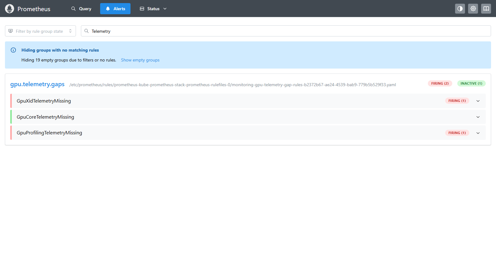
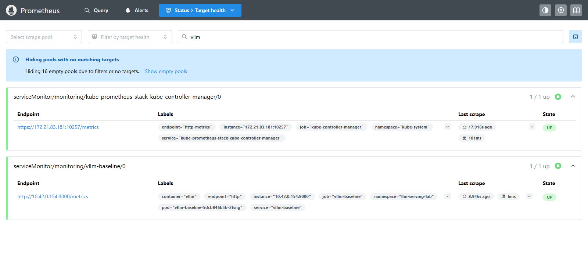
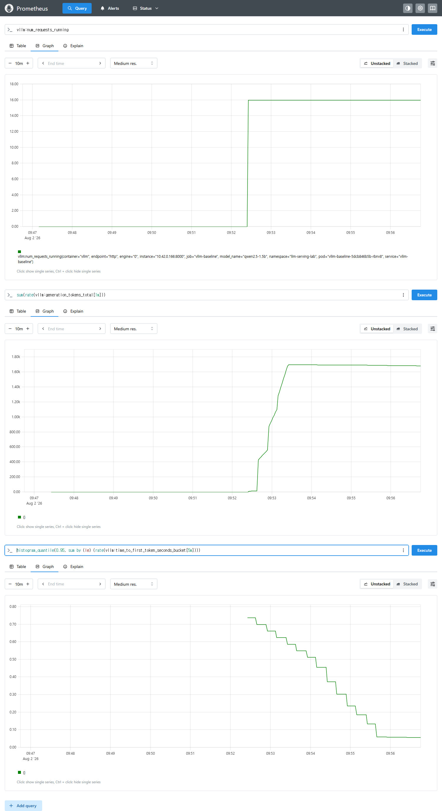
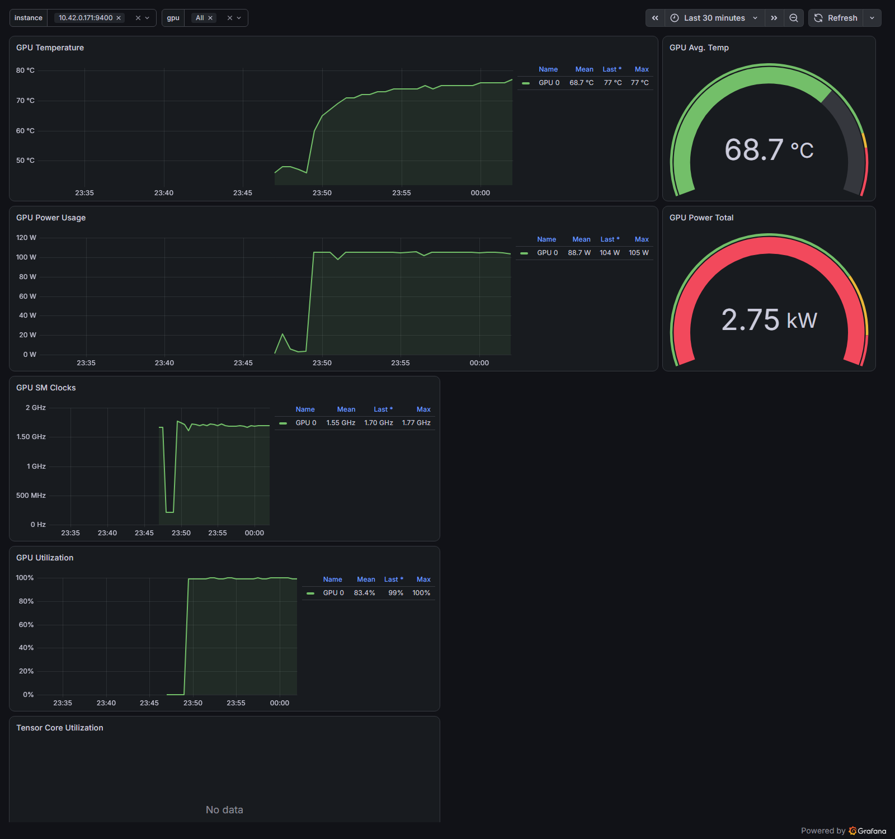
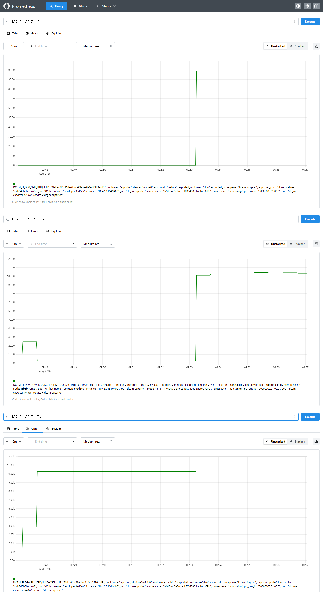
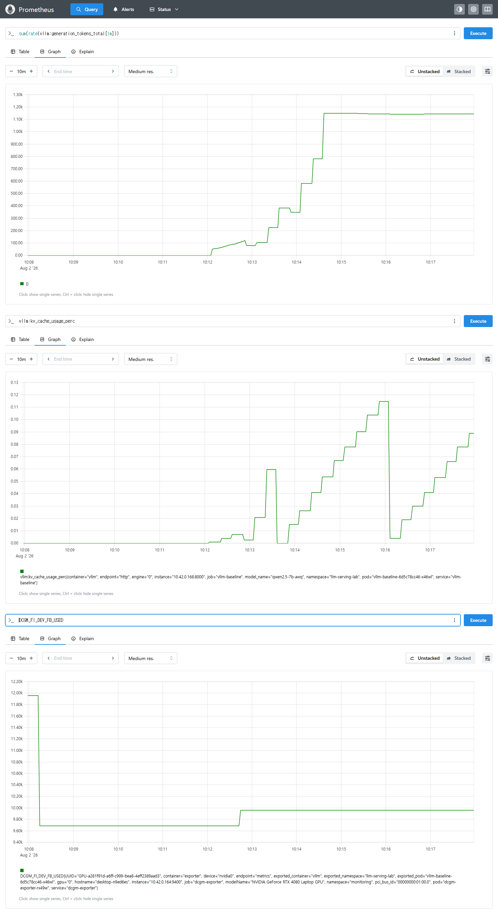

# WSL2·K3s vLLM GPU 서빙 기준선 런북

> **상태:** **측정 완료** (2026-08-02, RTX 4080 Laptop) — 결과는 아래 [7. 측정 결과](#7-측정-결과)<br>
> **대상 환경:** Windows 11 + WSL2 + NVIDIA GPU + K3s<br>
> **실행 자산:** [`labs/wsl2-vllm-baseline/`](../../labs/wsl2-vllm-baseline/)<br>
> **선행 기록:** [`WSL2 GPU 인프라 실측 보고서`](../../articles/gpu-setup-docker-k8s-lab-report-wsl2.md)

이 문서는 GPU 인프라를 다시 설명하지 않습니다. 앞선 실습에서 확인한 K3s GPU 환경에 실제 vLLM 서버를 올리고, **TTFT·E2E 지연·출력 처리량·goodput**을 같은 조건으로 반복 측정하기 위한 실행 기록지입니다.

첫 목표는 최고 성능이 아닙니다. `Qwen2.5-1.5B-Instruct`와 고정된 설정으로 기준선을 하나 만든 뒤, 7B AWQ·동시성·캐싱·EKS 결과를 같은 표에서 비교할 수 있게 만드는 것이 핵심입니다.

## 한눈에 보는 실행 순서

| 순서 | 할 일 | 완료 조건 | 2026-08-02 실행 |
|---|---|---|---|
| 1 | GPU·RuntimeClass·Prometheus 사전 점검 | GPU allocatable 값이 `1`, Prometheus Pod가 `Running` | ✅ |
| 2 | vLLM 1.5B 배포 | Deployment rollout 완료, `/health` 응답 성공 | ✅ |
| 3 | 스모크 테스트 | 모든 요청 성공, JSON 결과 생성 | ✅ (측정값 오염 발견 → §8.1) |
| 4 | 기준선 측정 | 동시성 `1,4,8,16` 결과와 GPU 메트릭 확보 | ✅ 120/120 성공 |
| 5 | 관측성 공백 확인 | 핵심·XID·프로파일링 메트릭의 유무를 명시 | ✅ 경보 2종 발화 |
| 6 | 7B AWQ 비교 | 동일 조건의 별도 JSON 생성 또는 실패 조건 기록 | ✅ |
| 7 | 결과 정리 | 아래 결과표와 결론 작성 | ✅ §7 |

**한 줄 요약:** 12GB 랩탑 GPU에서 Qwen2.5-1.5B는 **동시성 16까지 goodput 100%를 유지**했고(TTFT p95 0.066초, 1691 tok/s), 병목은 메모리가 아니라 **TGP 105W 전력 상한**이었습니다.

<details>
<summary><strong>0. 실험 원칙과 측정 기준</strong></summary>

	### 무엇을 측정하나

	| 지표 | 이 실험에서의 의미 |
	|---|---|
	| TTFT | 요청 시작부터 스트리밍 첫 내용 토큰이 도착할 때까지의 시간 |
	| E2E | 요청 시작부터 스트림 종료까지 걸린 전체 시간 |
	| Output tok/s | 한 동시성 구간에서 성공한 출력 토큰 수를 실제 벽시계 시간으로 나눈 값 |
	| Goodput | TTFT 2초와 E2E 30초를 모두 만족한 요청의 비율 |

	`short`는 기본 호출 지연, `prefill`은 긴 입력이 TTFT에 주는 영향, `decode`는 긴 출력의 처리량을 봅니다. 각 시나리오를 동시성 `1,4,8,16`에서 반복합니다.

	### 비교할 때 고정할 것

	- 모델 ID와 양자화 방식
	- vLLM 이미지 버전
	- `max-model-len`, `gpu-memory-utilization`, `max-num-seqs`
	- 요청 시나리오와 동시성
	- 전원 모드, GPU 전력 상한, 실험 당시 온도

	이 중 하나라도 바뀌면 같은 기준선으로 취급하지 않고 별도 결과로 남깁니다.

</details>

<details>
<summary><strong>1. 실행 전 점검</strong></summary>

	### 저장소 루트와 환경 확인

	다음 명령은 저장소 루트에서 실행합니다.

	```bash
	pwd
	nvidia-smi
	kubectl get node -o wide
	kubectl get runtimeclass nvidia
	kubectl get node \
	  -o jsonpath='{.items[0].status.allocatable.nvidia\.com/gpu}{"\n"}'
	kubectl get pods -n monitoring
	```

	마지막에서 두 번째 명령이 `1`을 반환하지 않으면 배포를 진행하지 않습니다. 먼저 [`WSL2 GPU 실행 가이드`](./gpu-setup-windows-wsl2.md)의 K3s·Device Plugin 구간을 복구합니다.

	### 실험 시작값 기록

	```bash
	nvidia-smi --query-gpu=name,driver_version,memory.total,power.limit,temperature.gpu \
	  --format=csv
	kubectl version
	```

	드라이버, GPU 메모리, 전력 상한은 결과 해석에 영향을 주므로 출력값을 결과표에 옮겨 적습니다.

</details>

<details>
<summary><strong>2. vLLM 배포와 준비 확인</strong></summary>

	### 1.5B 기준 모델 배포

	```bash
	kubectl apply \
	  -f labs/wsl2-vllm-baseline/k8s/vllm-baseline.yaml
	kubectl rollout status deployment/vllm-baseline \
	  -n llm-serving-lab --timeout=20m
	```

	기본 모델은 `Qwen/Qwen2.5-1.5B-Instruct`, vLLM 이미지는 `v0.23.0`입니다. 최초 실행은 이미지와 모델을 내려받기 때문에 시간이 더 걸릴 수 있습니다.

	### 준비가 끝나지 않을 때

	```bash
	kubectl get pods -n llm-serving-lab -o wide
	kubectl describe pod -n llm-serving-lab -l app=vllm-baseline
	kubectl logs -n llm-serving-lab deployment/vllm-baseline --tail=200
	```

	`Pending`이면 GPU 할당과 PVC를, `CrashLoopBackOff`이면 OOM·모델 로딩·CUDA 오류를 먼저 확인합니다.

	### 로컬 포트 열기

	별도 터미널에서 다음 명령을 계속 실행해 둡니다.

	```bash
	kubectl port-forward -n llm-serving-lab svc/vllm-baseline 8000:8000
	```

	```bash
	curl -fsS http://localhost:8000/health
	curl -fsS http://localhost:8000/v1/models
	```

</details>

<details>
<summary><strong>3. 스모크 테스트</strong></summary>

	기준선 전체를 돌리기 전에 요청 수를 줄여 API·스트리밍·결과 저장만 확인합니다.

	```bash
	python3 labs/wsl2-vllm-baseline/benchmark.py \
	  --concurrency 1,4 \
	  --requests-per-level 2 \
	  --output labs/wsl2-vllm-baseline/results/smoke.json
	```

	완료 조건은 다음 세 가지입니다.

	- 모든 구간에서 `fail`이 `0`
	- TTFT와 E2E가 `-`가 아닌 숫자로 출력
	- `labs/wsl2-vllm-baseline/results/smoke.json` 생성

	실패 요청은 JSON의 `requests[].error`에 남습니다. 스모크 테스트가 실패하면 기준선 측정으로 넘어가지 않습니다.

</details>

<details>
<summary><strong>4. 1.5B 기준선 측정</strong></summary>

	```bash
	python3 labs/wsl2-vllm-baseline/benchmark.py \
	  --concurrency 1,4,8,16 \
	  --requests-per-level 8 \
	  --ttft-slo 2 \
	  --e2e-slo 30 \
	  --output labs/wsl2-vllm-baseline/results/baseline-1.5b.json
	```

	동시성 16에서는 요청 수도 최소 16개로 자동 조정됩니다. 결과 JSON에는 집계값과 요청별 원시값이 함께 저장됩니다.

	### 측정 중 함께 볼 메트릭

	```promql
	DCGM_FI_DEV_GPU_UTIL
	DCGM_FI_DEV_FB_USED
	DCGM_FI_DEV_POWER_USAGE
	rate(vllm:request_success_total[1m])
	histogram_quantile(0.95, sum by (le) (rate(vllm:time_to_first_token_seconds_bucket[5m])))
	```

	동시성이 올라갈수록 출력 처리량이 늘더라도 TTFT p95와 goodput이 급격히 나빠질 수 있습니다. 가장 높은 tok/s 하나보다 **goodput을 유지하는 최대 동시성**을 먼저 찾습니다.

</details>

<details>
<summary><strong>5. GPU 관측성 공백 확인</strong></summary>

	```bash
	kubectl apply \
	  -f labs/wsl2-vllm-baseline/k8s/gpu-telemetry-gap-rule.yaml
	kubectl get prometheusrule gpu-telemetry-gap-rules -n monitoring
	```

	이 규칙은 GPU 고장 자체가 아니라 **필요한 시계열이 없는 상태**를 구분합니다.

	| 경보 | 해석 |
	|---|---|
	| `GpuCoreTelemetryMissing` | 온도 등 기본 DCGM 수집 경로부터 끊김. 먼저 복구 필요 |
	| `GpuXidTelemetryMissing` | 기본 메트릭은 있지만 XID 오류 시계열 없음 |
	| `GpuProfilingTelemetryMissing` | 기본 메트릭은 있지만 Tensor Core 프로파일링 시계열 없음 |

	WSL2에서 뒤의 두 경보는 환경 한계의 기록이 될 수 있습니다. 경보를 억지로 없애기보다 “어떤 메트릭까지 관측할 수 있었는가”를 결과에 명시합니다.

	### 실측 결과 — 예상과 정확히 일치

	```
	GROUP gpu.telemetry.gaps
	  GpuCoreTelemetryMissing        state=inactive
	  GpuXidTelemetryMissing         state=firing
	  GpuProfilingTelemetryMissing   state=firing

	GROUP gpu.rules  (선행 실습에서 만든 기존 규칙)
	  HighGpuTemperature             state=inactive
	  GpuXidError                    state=inactive   ← 참조 메트릭이 없어 발화 불가
	  HighGpuMemoryUsage             state=inactive
	```

	

	> 그림 5-1. (실습 인증) `gpu.telemetry.gaps` 그룹이 `FIRING (2)` / `INACTIVE (1)`. `GpuCoreTelemetryMissing`만 초록(정상 = 기본 DCGM 수집은 살아 있음)이고, `GpuXidTelemetryMissing`과 `GpuProfilingTelemetryMissing`이 발화 중입니다.

	이 세 줄이 선행 보고서에서 지적한 **"조용한 실패"를 소리 나는 실패로 바꾼 결과**입니다. 기존 `GpuXidError`는 `DCGM_FI_DEV_XID_ERRORS`가 아예 없어서 `inactive`로만 보이지만, 그것이 "XID 오류가 없다"는 뜻인지 "관측 자체를 못 한다"는 뜻인지 구분되지 않습니다. 새 규칙은 후자를 명시적으로 발화시킵니다.

	DCGM이 실제로 노출한 메트릭은 **`DCGM_FI_DEV_*` 계열 17종**이며, 없는 것은 `DCGM_FI_DEV_XID_ERRORS`와 `DCGM_FI_PROF_*` 프로파일링 계열입니다(선행 보고서 §5와 동일).

</details>

<details>
<summary><strong>6. 7B AWQ 비교 실험</strong></summary>

	1.5B 기준선이 완성된 뒤에만 진행합니다.

	```bash
	kubectl set env deployment/vllm-baseline -n llm-serving-lab \
	  MODEL_ID=Qwen/Qwen2.5-7B-Instruct-AWQ \
	  SERVED_MODEL_NAME=qwen2.5-7b-awq
	kubectl rollout status deployment/vllm-baseline \
	  -n llm-serving-lab --timeout=20m
	```

	```bash
	python3 labs/wsl2-vllm-baseline/benchmark.py \
	  --concurrency 1,4,8,16 \
	  --requests-per-level 8 \
	  --ttft-slo 2 \
	  --e2e-slo 30 \
	  --output labs/wsl2-vllm-baseline/results/baseline-7b-awq.json
	```

	12GB VRAM에서 OOM이 나면 그 자체가 결과입니다. 실패한 모델·컨텍스트 길이·동시성·오류 메시지를 먼저 기록한 뒤 `max-model-len`과 `max-num-seqs`를 낮춥니다. 설정을 바꾼 결과는 기존 JSON에 덮어쓰지 않습니다.

</details>

## 7. 측정 결과

2026-08-02 실행. 아래 수치는 모두 본인 환경 실측이며, 원본은 [`results/baseline.json`](../../labs/wsl2-vllm-baseline/results/baseline.json)에 있습니다.

### 실행 환경

| 항목 | 기록 |
|---|---|
| 측정 일시 | 2026-08-02 (UTC 04:42 기준선 / 09:52 지속 부하) |
| GPU / VRAM | GeForce RTX 4080 Laptop GPU / 12282 MiB |
| 드라이버 / CUDA | 581.57 (Windows) / CUDA 13.0 |
| GPU 전력 상한 | `nvidia-smi` 보고값 `[N/A]`, 실측 상한 약 **105 W** |
| K3s / Kubernetes | v1.36.2+k3s1 |
| vLLM 이미지 | `vllm/vllm-openai:v0.23.0` |
| 모델 | `Qwen/Qwen2.5-1.5B-Instruct` (`qwen2.5-1.5b`) |
| `max-model-len` / `max-num-seqs` | `4096` / `16` |

### 핵심 결과 — 1.5B

120요청 전부 성공, 전부 서버가 준 정확한 usage 토큰 수 사용(`exact_usage 120/120`).

| 시나리오 | 동시성 | 성공 | TTFT p50 | TTFT p95 | E2E p95 | Output tok/s | Goodput |
|---|---:|---:|---:|---:|---:|---:|---:|
| short | 1 | 8/8 | 0.032 | 0.041 | 0.371 | 105.6 | 100% |
| short | 4 | 8/8 | 0.029 | 0.033 | 0.340 | 424.8 | 100% |
| short | 8 | 8/8 | 0.039 | 0.039 | 0.348 | 823.9 | 100% |
| short | 16 | 16/16 | 0.059 | 0.061 | 0.377 | **1507.6** | 100% |
| prefill | 1 | 8/8 | 0.039 | 0.047 | 0.593 | 109.6 | 100% |
| prefill | 4 | 8/8 | 0.038 | 0.044 | 0.629 | 408.0 | 100% |
| prefill | 8 | 8/8 | 0.055 | 0.057 | 0.659 | 775.1 | 100% |
| prefill | 16 | 16/16 | 0.115 | 0.118 | 0.774 | **1317.4** | 100% |
| decode | 1 | 8/8 | 0.025 | 0.040 | 4.430 | 116.1 | 100% |
| decode | 4 | 8/8 | 0.034 | 0.049 | 4.545 | 450.7 | 100% |
| decode | 8 | 8/8 | 0.041 | 0.045 | 4.622 | 885.5 | 100% |
| decode | 16 | 16/16 | 0.062 | 0.066 | 4.841 | **1691.3** | 100% |

동시성 1 대비 배율로 보면 배칭 이득이 선명합니다.

| 시나리오 | c=4 | c=8 | c=16 | c=16의 TTFT p95 배율 |
|---|---:|---:|---:|---:|
| short | ×4.02 | ×7.80 | ×14.28 | ×1.49 |
| prefill | ×3.72 | ×7.07 | ×12.02 | **×2.50** |
| decode | ×3.88 | ×7.63 | ×14.57 | ×1.64 |

**동시성 16까지 goodput 100%가 유지됐고, 이 환경의 한계점은 발견되지 않았습니다.** `--max-num-seqs 16`이 상한이라 그 이상은 이 설정으로 측정할 수 없습니다. 즉 여기서 얻은 것은 "무너지는 지점"이 아니라 **"16까지는 안 무너진다"** 는 하한선입니다.

### 지속 부하 — 서버 지표와의 교차 검증

decode·동시성 16으로 900요청을 연속 실행(약 4분)한 결과입니다.

```
decode  16  900/900  ttft_p50 0.044  ttft_p95 0.069  e2e_p95 4.879  1668.1 tok/s  goodput 100.0%
```

클라이언트 측정값과 vLLM `/metrics`가 서로 맞습니다.

| 지표 | 클라이언트 측정 | 서버 메트릭 |
|---|---|---|
| 동시 실행 요청 | 16 | `vllm:num_requests_running` = **16** 플래토 |
| 출력 처리량 | 1668 tok/s | `rate(vllm:generation_tokens_total[1m])` ≈ **1.69k** |
| TTFT p95 | 0.069 s | `histogram_quantile(0.95, ...)` ≈ **0.06 s** 수렴 |
| KV cache 사용률 | — | `vllm:kv_cache_usage_perc` ≈ **2%** |

KV cache가 2%만 쓰였다는 것은 **12GB에서 1.5B·4096 컨텍스트·16 동시성은 메모리가 전혀 병목이 아니라는 뜻**입니다. 병목은 연산 쪽이며, 이는 아래 GPU 지표와 일치합니다.

동시 수집한 `nvidia-smi` 샘플(2초 간격, 부하 구간 172개):

| 항목 | 값 |
|---|---|
| GPU util | 99~100% |
| SM clock | 1245~2145 MHz (평균 2073) |
| 전력 | 21.9~105.9 W (평균 **103.5**) |
| 온도 | 53~74 ℃ |
| 메모리 | 10432~11939 MiB |

선행 보고서 §7.4와 같은 결론입니다 — **발열이 아니라 TGP 상한(약 105W)에 먼저 걸립니다.** 온도는 74℃까지만 올랐고 알림 임계값 85℃에 닿지 않았습니다.

### 실습 인증



> 그림 7-1. (실습 인증) `serviceMonitor/monitoring/vllm-baseline/0`이 `1/1 up`. 엔드포인트 `http://10.42.0.154:8000/metrics`, `namespace="llm-serving-lab"`, 스크레이프 6ms. 매니페스트의 `ServiceMonitor`가 실제 수집으로 이어진 것을 확인.



> 그림 7-2. (실습 인증) 위에서부터 `vllm:num_requests_running`, `sum(rate(vllm:generation_tokens_total[1m]))`, TTFT p95. 09:52에 부하를 건 직후 실행 요청이 **0 → 16**으로 올라 평평하게 유지되고(= `--max-num-seqs 16`이 그대로 관측됨), 생성 처리량이 **1.69k tok/s** 플래토를 만듭니다. TTFT p95가 0.73에서 0.06으로 내려가는 것은 `rate(...[5m])` 창이 채워지며 초기 구간이 빠지는 것으로, 정상 상태값은 **0.06초**입니다.



> 그림 7-3. (실습 인증) Grafana 대시보드 **12239**(NVIDIA DCGM Exporter Dashboard)를 7B AWQ 지속 부하 구간에서 본 화면. 23:49에 부하가 걸린 시점이 모든 패널에서 동시에 꺾입니다.
>
> | 패널 | 값 |
> |---|---|
> | GPU Temperature | 45℃ → **77℃** (Mean 68.7) |
> | GPU Power Usage | 20W대 → **104~105W 플래토** (Max 105W) |
> | GPU SM Clocks | Mean **1.55GHz** / Max 1.77GHz |
> | GPU Utilization | 0% → **100%** (Mean 83.4%, Last 99%) |
> | **Tensor Core Utilization** | **No data** |
>
> **마지막 줄이 이 캡처의 핵심입니다.** 선행 보고서 그림 5-5에서 합성 부하(행렬곱)로 확인했던 `Tensor Core Utilization` 빈 패널이, **실제 LLM 서빙 부하에서도 똑같이 비어 있습니다.** 온도·전력·클럭·사용률은 전부 정상으로 그려지므로 대시보드는 "잘 동작하는 것처럼" 보이지만, 참조 메트릭 `DCGM_FI_PROF_PIPE_TENSOR_ACTIVE`가 없어 데이터만 없습니다. §5의 `GpuProfilingTelemetryMissing` 경보가 바로 이 상태를 발화로 바꾼 것입니다.
>
> ※ `GPU Power Total 2.75 kW`는 대시보드가 구간 전력을 합산해 표시하는 값이며 순간 전력이 아닙니다(실제 상한 105W). 선행 보고서 그림 5-4와 같은 주의사항입니다.



> 그림 7-4. (실습 인증) `DCGM_FI_DEV_GPU_UTIL`·`POWER_USAGE`·`FB_USED`. 세 시계열 모두 라벨에 `exported_pod="vllm-baseline-..."`, `exported_container="vllm"`, `exported_namespace="llm-serving-lab"`가 붙어 **GPU 사용량이 vLLM 파드에 귀속**됩니다. 주목할 점은 `FB_USED`로, 09:47~48 **모델 로딩 시점에 이미 10.2GB로 뛰고 부하 중에도 변하지 않습니다** — `--gpu-memory-utilization 0.85`(12282 × 0.85 ≈ 10440MiB)로 KV cache를 미리 선점하기 때문입니다. "요청이 늘면 GPU 메모리가 늘 것"이라는 직관과 반대이며, vLLM 메모리 사용량을 `nvidia-smi`로 판단하면 안 되는 이유입니다.

### 결론에 답할 질문

1. **goodput을 유지한 최대 동시성** — 측정 범위(1~16) 전체에서 100%. `max-num-seqs 16`이 상한이라 한계점은 관측되지 않음.
2. **긴 입력이 TTFT를 얼마나 늘렸나** — 동시성 1에서는 0.041 → 0.047초로 차이가 거의 없지만, 동시성 16에서는 0.061 → 0.118초로 **약 2배**. prefill 부담은 단독 요청이 아니라 **동시 요청이 겹칠 때** 드러납니다.
3. **긴 출력에서 사용률과 처리량이 함께 올랐나** — 예. decode·c=16이 1691 tok/s로 최고였고 그 구간의 GPU util은 99~100%였습니다.
4. **7B AWQ 비교** — 아래 참조. 파라미터가 4.7배인데 처리량은 **약 30%만** 떨어졌습니다.
5. **WSL2에서 빠진 메트릭** — `DCGM_FI_DEV_XID_ERRORS`, `DCGM_FI_PROF_*`. §5 참조.

### 7B AWQ 결과

`Qwen/Qwen2.5-7B-Instruct-AWQ`로 모델만 바꾸고 나머지 설정(`max-model-len 4096`, `max-num-seqs 16`, `gpu-memory-utilization 0.85`)은 그대로 두었습니다. 원본은 [`results/baseline-7b-awq.json`](../../labs/wsl2-vllm-baseline/results/baseline-7b-awq.json)입니다.

**12GB에서 OOM 없이 떴고, 120요청 전부 성공했습니다.** 기동 로그의 메모리 배분이 그 이유를 보여줍니다.

```
Available KV cache memory: 3.71 GiB
GPU KV cache size: 69,488 tokens
Estimated CUDA graph memory: 0.08 GiB total
```

`max-model-len 4096` × `max-num-seqs 16` = 최대 65,536 토큰이므로 **69,488 토큰은 최악의 경우도 감당하는 값**입니다. 즉 이 설정에서 7B AWQ는 12GB에 "겨우" 들어간 게 아니라 여유가 있었습니다.

| 시나리오 | 동시성 | 1.5B tok/s | 7B AWQ tok/s | 비율 | 1.5B TTFT p95 | 7B TTFT p95 | 1.5B E2E p95 | 7B E2E p95 |
|---|---:|---:|---:|---:|---:|---:|---:|---:|
| short | 1 | 105.6 | 77.0 | ×0.73 | 0.041 | 0.044 | 0.371 | 0.497 |
| short | 4 | 424.8 | 281.0 | ×0.66 | 0.033 | 0.108 | 0.340 | 0.547 |
| short | 8 | 823.9 | 585.6 | ×0.71 | 0.039 | 0.051 | 0.348 | 0.504 |
| short | 16 | 1507.6 | 1058.2 | ×0.70 | 0.061 | 0.082 | 0.377 | 0.554 |
| prefill | 1 | 109.6 | 76.3 | ×0.70 | 0.047 | 0.051 | 0.593 | 0.496 |
| prefill | 4 | 408.0 | 274.9 | ×0.67 | 0.044 | 0.073 | 0.629 | 0.539 |
| prefill | 8 | 775.1 | 505.2 | ×0.65 | 0.057 | 0.090 | 0.659 | 0.583 |
| prefill | 16 | 1317.4 | 841.5 | ×0.64 | 0.118 | 0.138 | 0.774 | 0.701 |
| decode | 1 | 116.1 | 82.1 | ×0.71 | 0.040 | 0.047 | 4.430 | 6.250 |
| decode | 4 | 450.7 | 321.2 | ×0.71 | 0.049 | 0.057 | 4.545 | 6.382 |
| decode | 8 | 885.5 | 626.2 | ×0.71 | 0.045 | 0.068 | 4.622 | 6.536 |
| decode | 16 | 1691.3 | 1150.3 | **×0.68** | 0.066 | 0.100 | 4.841 | 7.119 |

**이 표에서 읽어야 할 것은 "7B가 느리다"가 아니라 비율이 얼마나 일정한가입니다.** 파라미터가 4.7배(1.5B → 7B)인데 처리량은 어느 시나리오·동시성에서도 **×0.64~0.73** 범위에 머뭅니다. AWQ 4bit 양자화와 Marlin 커널이 파라미터 증가분을 대부분 흡수한 결과이며, **모델 크기와 처리량이 선형으로 반비례하지 않는다**는 것이 이 실험의 핵심 관찰입니다.

7B도 동시성 16까지 goodput 100%를 유지했습니다. 다만 `prefill` 시나리오만 비율이 ×0.64로 가장 낮은데, 긴 입력의 연산량 증가는 양자화로 덜 상쇄되기 때문입니다.

`decode`·동시성 16으로 700요청을 연속 실행한 결과도 기준선과 일치했습니다.

```
decode  16  700/700  ttft_p50 0.076  ttft_p95 0.106  e2e_p95 7.174  1139.6 tok/s  goodput 100.0%
```

더 길게 **2400요청**(약 19분)을 돌린 실행에서는 goodput이 **99.2%** 로 떨어졌습니다. 요청은 2400건 전부 성공했고 탈락 18건은 **딱 한 wave에 몰린 일시적 정지**로, 정황상 같은 PC에서 동시에 돌린 Grafana 화면 캡처와 CPU를 다툰 결과로 보입니다 — 서빙 스택의 한계가 아닙니다. 근거와 한계는 [§8.4](#8-트러블슈팅-기록)에 정리했습니다.

같은 구간의 GPU 지표(부하 샘플 173개):

| 항목 | 1.5B | 7B AWQ |
|---|---|---|
| 전력 | 평균 103.5 W | 평균 **103.8 W** |
| 온도 | 53~74 ℃ | 44~75 ℃ |
| SM clock | 평균 2073 MHz | 평균 **1788 MHz** |
| GPU 메모리 | 10432~11939 MiB | 9694~9964 MiB |
| KV cache 사용률 | 약 2% | 최대 **11.5%** |

전력은 두 모델 모두 약 104W로 같고 **SM 클럭만 2073 → 1788MHz로 내려갔습니다.** 같은 전력 예산 안에서 7B가 연산당 더 무거워 클럭을 낮춰 균형을 맞춘 것으로, 병목이 여전히 TGP 상한이라는 §7의 결론과 일치합니다.



> 그림 7-5. (실습 인증) 7B AWQ 구간. 첫 패널의 **계단 모양이 기준선 측정의 동시성 스윕(1 → 4 → 8 → 16)** 이고, 10:14 이후 지속 부하에서 **1.15k tok/s 플래토**를 만듭니다(측정값 1150.3 tok/s와 일치). 두 번째 패널 `vllm:kv_cache_usage_perc`는 `model_name="qwen2.5-7b-awq"` 라벨을 달고 최대 **11.5%** 까지 오릅니다 — 1.5B의 2%와 대비되며, KV cache가 3.71GiB로 줄어든 결과입니다. 세 번째 `DCGM_FI_DEV_FB_USED`는 모델 로딩 순간 11.95GB까지 치솟았다가 9.65GB로 안정됩니다.

---

## 8. 트러블슈팅 기록

실행을 막았거나 측정값을 왜곡한 문제들입니다.

<details>
<summary><strong>8.1 ⚠️ Windows에서 <code>localhost</code>를 쓰면 TTFT가 2초로 나온다 (측정값 오염)</strong></summary>

	이 런북의 기본 `--base-url`은 `http://localhost:8000`입니다. **Windows에서 그대로 실행하면 모든 측정값에 약 2.07초가 더해집니다.**

	처음 스모크 테스트 결과가 이랬습니다. 시나리오·동시성과 무관하게 TTFT가 전부 2.09~2.15초로 고정됐습니다.

	```
	short    1  2/2   ttft_p50 2.092   goodput 0.0%
	short    4  4/4   ttft_p50 2.102   goodput 0.0%
	decode   1  2/2   ttft_p50 2.094   goodput 0.0%
	```

	1.5B 모델에 RTX 4080이면 수십 ms여야 하므로 서버를 직접 재보면 정상입니다.

	```bash
	$ curl -s -N -o /dev/null -w "ttfb=%{time_starttransfer}\n" ... /v1/chat/completions
	ttfb=0.216356
	```

	원인은 측정기가 아니라 **이름 해석**입니다. 같은 요청을 호스트명만 바꿔 보냈습니다.

	```
	localhost   urlopen=2.105  first_content=2.340
	127.0.0.1   urlopen=0.030  first_content=0.045
	```

	Windows에서 `localhost`는 `::1`(IPv6)로 먼저 해석되는데, `kubectl port-forward --address 0.0.0.0`은 IPv4에만 바인딩합니다. IPv6 시도가 실패하고 IPv4로 넘어가기까지의 대기가 **연결 단계에서 약 2.07초** 붙습니다. 서버가 아니라 소켓 연결 시간이므로 TTFT·E2E·goodput이 한꺼번에 오염됩니다.

	**대응: 이 환경에서는 항상 `127.0.0.1`을 씁니다.**

	```bash
	python3 labs/wsl2-vllm-baseline/benchmark.py \
	  --base-url http://127.0.0.1:8000 ...
	```

	선행 보고서 §7.7의 NodePort 문제와 뿌리가 같습니다 — **WSL2에서는 "포트가 열렸는가"와 "어떤 주소로 열렸는가"가 다른 문제입니다.** 상수처럼 고정된 지연이 보이면 서버 성능이 아니라 연결 경로를 먼저 의심합니다.

</details>

<details>
<summary><strong>8.2 WSL 세션이 끊기면 파드가 통째로 사라진다</strong></summary>

	선행 보고서 §7.5와 같은 문제가 이번에도 재현됐습니다. 측정 중 WSL 세션을 붙잡아 둔 프로세스가 종료되자 port-forward가 이렇게 끊겼습니다.

	```
	error: error upgrading connection: unable to upgrade connection:
	  pod not found ("vllm-baseline-5dcb846b5b-2tsng_llm-serving-lab")
	```

	파드가 재생성되면서 vLLM 카운터가 초기화돼 **그 전까지 쌓인 서버 지표 그래프가 못 쓰게 됩니다.** 측정 전에 세션을 먼저 확보하세요.

	```bash
	wsl -d Ubuntu -u root -- sleep infinity   # 측정 내내 유지
	```

	재기동 후에는 파드 이름이 바뀌므로 `port-forward`도 다시 걸어야 하고, 이전 부하 구간과는 다른 시계열이 됩니다. **지속 부하와 화면 캡처는 한 세션 안에서 연속으로 끝내는 편이 안전합니다.**

</details>

<details>
<summary><strong>8.3 <code>rollout status</code>가 먼저 포기한다 (파드는 정상)</strong></summary>

	```
	error: deployment "vllm-baseline" exceeded its progress deadline
	```

	9.19GB짜리 `vllm/vllm-openai:v0.23.0` 이미지를 처음 받는 동안 Deployment 기본 `progressDeadlineSeconds`(600초)가 먼저 소진돼 나옵니다. **명령이 실패했을 뿐 배포는 계속 진행 중**이므로 파드를 직접 확인하면 됩니다.

	```bash
	kubectl get pod -n llm-serving-lab      # 1/1 Running 이면 정상
	k3s crictl images | grep vllm           # 이미지 수신 여부
	```

</details>

<details>
<summary><strong>8.4 ⚠️ 측정 중 화면 캡처를 같은 PC에서 돌리면 goodput이 깎인다</strong></summary>

	7B AWQ로 **2400요청**(decode·동시성 16, 약 19분)을 돌린 마지막 실행에서 처음으로 goodput이 100%를 밑돌았습니다. 원본은 [`results/sustained-7b-awq-2400.json`](../../labs/wsl2-vllm-baseline/results/sustained-7b-awq-2400.json)입니다.

	```
	decode  16  2400/2400  ttft_p50 0.070  ttft_p95 0.101  e2e_p95 7.233  1088.3 tok/s  goodput 99.2%
	```

	**요청은 2400건 전부 성공했습니다.** 실패가 아니라 SLO 초과 18건이며, 분포가 이상합니다.

	| 지표 | 값 |
	|---|---|
	| TTFT p50 / p95 / p99 | 0.070 / 0.101 / 0.133 |
	| TTFT p99.9 / 최대 | **0.766 / 5.988** |
	| E2E p95 / 최대 | 7.233 / **38.535** |
	| SLO 탈락 사유 | E2E 30초 초과 16건, TTFT 2초 초과 2건 |

	p95까지는 SLO에 한참 못 미치는데 꼬리만 튀었고, **탈락한 요청 번호가 연속입니다.**

	```
	탈락 id: 1808~1823 (= wave 113, 동시 요청 16개 전부) + 1825, 1826
	해당 요청들: ttft 0.05~0.08초 (정상) / e2e 32~38초 (평소 7초)
	```

	TTFT는 정상인데 E2E만 5배로 늘었다는 것은 **스트림이 정상적으로 시작된 뒤 생성 도중 한 번 멈췄다**는 뜻입니다. 150개 wave 중 딱 한 wave에서만 발생했습니다.

	시각을 맞춰 보면 원인이 보입니다.

	| 시각 (UTC) | 사건 |
	|---|---|
	| 14:48:52 | 2400요청 부하 시작 |
	| 15:01:12 | Grafana 대시보드 목록 헤드리스 캡처 |
	| **15:02:02** | **Grafana DCGM 대시보드 캡처 완료** (1600×1500, 패널 다수) |
	| **15:03:02** | **wave 113 추정 시점** |
	| 15:07:41 | 부하 종료 |

	이 PC는 WSL에 **8 vCPU**만 할당돼 있고, 그 위에서 vLLM 서버 · 벤치마크 클라이언트 · 헤드리스 Chrome 렌더링이 동시에 돌았습니다. 무거운 대시보드 렌더가 CPU를 가져가면서 클라이언트의 스트림 수신이 밀린 것으로 보입니다.

	> **단정하지는 않습니다.** wave 시각은 균등 분포를 가정한 추정치라 오차가 있고, 요청별 절대 타임스탬프가 없어 인과를 증명할 수는 없습니다. 확인하려면 캡처 없이 같은 2400요청을 다시 돌려 goodput이 100%로 돌아오는지 보면 됩니다.

	**교훈: 측정과 화면 캡처를 같은 머신에서 겹치지 마세요.** 앞선 §7의 기준선 수치(120요청)와 900·700요청 지속 부하는 캡처와 겹치지 않은 구간이라 goodput 100%였습니다. 반대로 이 사례는 **"goodput은 서빙 스택만의 성질이 아니라 측정 환경 전체의 성질"** 이라는 것을 보여줍니다 — 클라이언트가 밀려도 사용자 입장의 지연은 똑같이 늘어나므로, 원인을 서버에서만 찾으면 영영 못 찾습니다.

</details>

<details>
<summary><strong>8.5 vLLM이 WSL을 감지해 pinned memory를 끈다</strong></summary>

	7B 기동 로그에 나온 경고입니다.

	```
	WARNING [interface.py:757] Using 'pin_memory=False' as WSL is detected.
	  This may slow down the performance.
	```

	vLLM이 WSL 환경을 스스로 감지해 pinned(page-locked) 호스트 메모리를 비활성화합니다. 호스트↔디바이스 전송이 느려질 수 있다는 뜻이며, **이 환경의 절대 수치를 베어메탈과 직접 비교하면 안 되는 근거**가 하나 더 생긴 셈입니다. 선행 보고서에서 확인한 GPU-PV 구조가 상위 프레임워크의 동작까지 바꾸는 지점입니다.

</details>

<details>
<summary><strong>9. 종료와 재실행</strong></summary>

	### 모델 캐시를 남길 때

	```bash
	kubectl delete deployment vllm-baseline -n llm-serving-lab
	```

	### 모델 캐시까지 모두 지울 때

	```bash
	kubectl delete \
	  -f labs/wsl2-vllm-baseline/k8s/gpu-telemetry-gap-rule.yaml
	kubectl delete namespace llm-serving-lab
	```

	namespace를 지우면 PVC의 Hugging Face 모델 캐시도 함께 삭제됩니다. 재측정할 계획이면 Deployment만 삭제합니다.

</details>

---

## 이번 실행의 완료 기준

- [x] `smoke.json`, `baseline.json` 생성
- [x] 모든 실패 요청의 원인 기록 — **실패 요청 0건**(1.5B 기준선 120/120, 지속 부하 900/900)
- [x] TTFT p95·출력 tok/s·goodput과 GPU 사용률을 함께 비교 → §7
- [x] DCGM 핵심·XID·프로파일링 메트릭의 수집 여부 기록 → §5
- [x] 결과표를 채우고 “goodput을 유지한 최대 동시성” 한 줄 결론 작성 → **측정 범위(≤16) 전체에서 goodput 100%, 한계점 미도달**
- [x] 7B AWQ 결과를 별도 JSON으로 확보 → [7B AWQ 결과](#7b-awq-결과)

완성한 로컬 기준선은 [`Gemma 4 Cloud Run GPU 실습`](../../articles/Run%20inference%20of%20Gemma%204%20model%20on%20Cloud%20Run.md)의 A1~A4와 비교합니다. 모델 크기와 GPU가 다르므로 절대 수치의 승패보다 **동시성 증가에 따른 곡선과 병목이 나타나는 지점**을 비교합니다.

## 참고

- [vLLM 공식 Docker 가이드](https://docs.vllm.ai/en/latest/deployment/docker/)
- [vLLM 공식 Kubernetes 가이드](https://docs.vllm.ai/en/latest/deployment/k8s/)
- [vLLM 메트릭 문서](https://docs.vllm.ai/en/stable/design/metrics/)
- [Qwen2.5-1.5B-Instruct 모델 카드](https://huggingface.co/Qwen/Qwen2.5-1.5B-Instruct)
- [Qwen2.5-7B-Instruct-AWQ 모델 카드](https://huggingface.co/Qwen/Qwen2.5-7B-Instruct-AWQ)
- [Prometheus `absent_over_time`](https://prometheus.io/docs/prometheus/latest/querying/functions/#absent_over_time)
